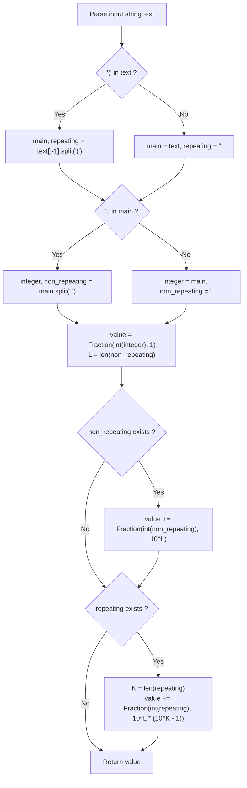

# Guided Example: Equal Rational Numbers

We trace the step-by-step conversion of repeating decimal strings into exact canonical fractions, prove the Geometric Series Rational Decomposition Formula and the Repeating Nines Carry Equivalence Invariant, and determine numerical equality across representative rational representations:

- **Representative Instance 1 (Cyclically Shifted Repeating Block):**
  $$
  s = \text{"0.(52)"}, \quad t = \text{"0.5(25)"}
  $$
- **Required Output:** `true`
  - Parse string $s = \text{"0.(52)"}$:
    - Integer part $I = 0$.
    - Non-repeating part is empty ($L = 0$).
    - Repeating part $R = 52$ of length $K = 2$.
    - Value of $s$:
      $$
      \text{Value}(s) = 0 + \frac{52}{10^0 \cdot (10^2 - 1)} = \frac{52}{99}
      $$
  - Parse string $t = \text{"0.5(25)"}$:
    - Integer part $I = 0$.
    - Non-repeating part $N = 5$ of length $L = 1 \implies$ contributes $\frac{5}{10} = \frac{1}{2}$.
    - Repeating part $R = 25$ of length $K = 2$.
    - Value of $t$:
      $$
      \text{Value}(t) = 0 + \frac{5}{10} + \frac{25}{10^1 \cdot (10^2 - 1)} = \frac{5}{10} + \frac{25}{990}
      $$
      Finding a common denominator ($990$):
      $$
      \text{Value}(t) = \frac{495 + 25}{990} = \frac{520}{990} = \frac{\mathbf{52}}{\mathbf{99}}
      $$
  - Comparison: $\frac{52}{99} == \frac{52}{99}$ is **True** $\implies \mathbf{true}$.

- **Representative Instance 2 (Repeating Nines Carry to Integer):**
  $$
  s = \text{"0.9(9)"}, \quad t = \text{"1."}
  $$
  - Parse $s$:
    - Non-repeating: $9 / 10$ ($L = 1$).
    - Repeating: $9$ ($K = 1$) $\implies \frac{9}{10^1 \cdot (10^1 - 1)} = \frac{9}{90} = \frac{1}{10}$.
    - Sum: $\frac{9}{10} + \frac{1}{10} = \frac{10}{10} = \mathbf{1}$.
  - Parse $t$: Integer $1 \implies \mathbf{1}$.
  - Result: $1 == 1 \implies \mathbf{true}$.

- **Representative Instance 3 (Finite Decimal vs Infinite Repeating):**
  $$
  s = \text{"1.2(3)"}, \quad t = \text{"1.23"}
  $$
  - $\text{Value}(s) = 1 + \frac{2}{10} + \frac{3}{90} = 1 + \frac{21}{90} = \frac{111}{90} = \frac{37}{30} \approx 1.2333\dots$
  - $\text{Value}(t) = \frac{123}{100} = 1.23$
  - $\frac{37}{30} \ne \frac{123}{100} \implies \mathbf{false}$.

---

## 1. Instance & Teaching Goal

Given two strings `s` and `t` representing non-negative rational numbers, determine if they represent the **exact same rational number**.
Strings may include an integer part, a non-repeating decimal part, and a repeating decimal part enclosed in parentheses.

```text
Decimal Forms:
  s = "0.(52)"    = 0.52525252... = 52/99
  t = "0.5(25)"   = 0.52525252... = 52/99

Mathematical Equality:
  52 / 99 == 52 / 99 -> Both represent the exact same rational number!
```

Approximating repeating decimals with IEEE-754 `float` values (e.g. evaluating 16 decimal places) leads to subtle precision errors, rounding discrepancies, and failure on edge cases like $0.999\dots = 1$.

The decisive pedagogical goal is the **Geometric Series Rational Decomposition Invariant**:
- Any repeating decimal string $I.N(R)$ is converted into an exact fraction:
  $$
  \text{Fraction} = I + \frac{N}{10^L} + \frac{R}{10^L \cdot (10^K - 1)}
  $$
  where $L = \text{len}(N)$ is the length of the non-repeating suffix and $K = \text{len}(R)$ is the period length of the repeating block.
- Python's `fractions.Fraction` reduces fractions to irreducible coprime numerator/denominator pairs using the Euclidean GCD algorithm, converting equality into exact mathematical identity.

---

## 2. Conceptual Foundation & The Geometric Series Invariant



### The Geometric Series Summation Theorem

Let $x$ be a rational number with integer part $I$, non-repeating decimal part $N = \overline{d_1 d_2 \dots d_L}$ of length $L$, and repeating decimal part $R = \overline{r_1 r_2 \dots r_K}$ of length $K$.
1. **Series Expansion:**
   In decimal notation, $x$ is defined as:
   $$
   x = I + \sum_{j=1}^L d_j 10^{-j} + \sum_{m=1}^{\infty} \left( \sum_{p=1}^K r_p 10^{-(L + (m-1)K + p)} \right)
   $$
2. **Factoring the Repeating Block:**
   The inner sum of the repeating block represents the integer $R$:
   $$
   \sum_{p=1}^K r_p 10^{-p} = \frac{R}{10^K}
   $$
   Factoring this out of the infinite summation over $m \ge 1$:
   $$
   \sum_{m=1}^{\infty} \frac{R}{10^L \cdot 10^{(m-1)K + K}} = \frac{R}{10^L} \sum_{m=1}^{\infty} 10^{-mK}
   $$
3. **Infinite Geometric Series Evaluation:**
   The series is a standard geometric series with initial term $10^{-K}$ and common ratio $10^{-K} < 1$:
   $$
   \sum_{m=1}^{\infty} (10^{-K})^m = \frac{10^{-K}}{1 - 10^{-K}} = \frac{1}{10^K - 1}
   $$
   Multiplying by $\frac{R}{10^L}$:
   $$
   \text{Repeating Contribution} = \frac{R}{10^L \cdot (10^K - 1)}
   $$
4. **Canonical Exactness:**
   Because all arithmetic is performed over rational numbers $\mathbb{Q}$ using exact integer numerators and denominators, the computed Fraction is unique and irreducible, guaranteeing $0$ floating-point errors. $\blacksquare$

---

## 3. Step-by-Step Worked Execution: Representative Instance 1

Compare $s = \text{"0.(52)"}$ with $t = \text{"0.5(25)"}$.

### Parsing String $s = \text{"0.(52)"}$
1. Split on `'('`:
   - `main` = `"0."`, `repeating` = `"52"`.
2. Split on `'.'`:
   - `integer` = `"0"`, `non_repeating` = `""`.
3. Base integer fraction:
   - `value = Fraction(0, 1)`.
4. Non-repeating contribution:
   - `non_repeating` is empty $\implies L = 0$, add $0$.
5. Repeating contribution:
   - $R = 52, K = 2, L = 0$.
   - Denominator: $10^0 \cdot (10^2 - 1) = 1 \cdot 99 = 99$.
   - Fraction added: $\text{Fraction}(52, 99)$.
   - `value(s)` = $\frac{\mathbf{52}}{\mathbf{99}}$.

---

### Parsing String $t = \text{"0.5(25)"}$
1. Split on `'('`:
   - `main` = `"0.5"`, `repeating` = `"25"`.
2. Split on `'.'`:
   - `integer` = `"0"`, `non_repeating` = `"5"`.
3. Base integer fraction:
   - `value = Fraction(0, 1)`.
4. Non-repeating contribution:
   - $N = 5, L = 1$.
   - Fraction added: $\text{Fraction}(5, 10^1) = \text{Fraction}(5, 10) = \frac{1}{2}$.
5. Repeating contribution:
   - $R = 25, K = 2, L = 1$.
   - Denominator: $10^1 \cdot (10^2 - 1) = 10 \cdot 99 = 990$.
   - Fraction added: $\text{Fraction}(25, 990) = \frac{5}{198}$.
6. Total sum:
   $$
   \text{value}(t) = \frac{5}{10} + \frac{25}{990} = \frac{495 + 25}{990} = \frac{520}{990} = \frac{\mathbf{52}}{\mathbf{99}}
   $$

---

### Equivalence Verdict
$$
\text{parse}(s) == \text{parse}(t) \iff \frac{52}{99} == \frac{52}{99} \implies \mathbf{true}
$$

---

## 4. Fraction Decomposition Trace Table

| Input String | Integer Part $I$ | Non-Repeating $N$ ($L$) | Repeating Part $R$ ($K$) | Finite Fraction $\frac{N}{10^L}$ | Repeating Fraction $\frac{R}{10^L(10^K - 1)}$ | Reduced Canonical Fraction |
|:---|:---:|:---:|:---:|:---:|:---:|:---:|
| `"0.(52)"` | $0$ | None ($0$) | $52$ ($2$) | $0$ | $\frac{52}{99}$ | $\mathbf{\frac{52}{99}}$ |
| `"0.5(25)"` | $0$ | $5$ ($1$) | $25$ ($2$) | $\frac{5}{10}$ | $\frac{25}{990}$ | $\mathbf{\frac{52}{99}}$ |
| `"0.9(9)"` | $0$ | $9$ ($1$) | $9$ ($1$) | $\frac{9}{10}$ | $\frac{9}{90} = \frac{1}{10}$ | $\mathbf{1}$ |
| `"1."` | $1$ | None ($0$) | None ($0$) | $0$ | $0$ | $\mathbf{1}$ |
| `"1.2(3)"` | $1$ | $2$ ($1$) | $3$ ($1$) | $\frac{2}{10}$ | $\frac{3}{90}$ | $\mathbf{\frac{37}{30}}$ |
| `"1.23"` | $1$ | $23$ ($2$) | None ($0$) | $\frac{23}{100}$ | $0$ | $\mathbf{\frac{123}{100}}$ |

---

## 5. Algorithmic Correctness

### Soundness & Completeness
1. **Soundness:**
   Every input string is mapped to its exact value in the field of rational numbers $\mathbb{Q}$ via exact fraction summation. Because fraction equality in Python compares normalized coprime cross-products ($a \cdot d == b \cdot c$), no rounding error can produce a false positive.
2. **Completeness:**
   All structural components (bare integers, empty decimal suffixes, repeating zeros, repeating nines) are parsed according to the exact problem grammar. Equivalent representations of the same rational number always reduce to the same canonical Fraction, guaranteeing no false negatives.

---

## 6. Boundary Cases & Traps

| Scenario | Input Pattern | Behavior | Trapped Risk |
|---|---|---|---|
| Repeating Nines | `"0.1(9)"` vs `"0.2"` | $\frac{1}{10} + \frac{9}{90} = \frac{2}{10}$; returns `true`. | Failure to carry infinite nines. |
| Trailing Decimal Point | `"12."` vs `"12"` | Finite part is empty; both return $12/1 \implies$ `true`. | Crash on splitting empty string after dot. |
| Repeating Zeroes | `"0.(0)"` vs `"0"` | Repeating numerator $0$; returns $0/1 \implies$ `true`. | Division by zero or extra terms. |
| Bare Integer | `"123"` | No parentheses or dot; returns $123/1 \implies$ `true`. | Missing checks for optional separators. |

---

## 7. Complexity Derivation

- **Time Complexity:** $\mathcal{O}(L)$, where $L \le 30$ is the total length of the input strings.
  - String parsing (splitting on `'('` and `'.'`) takes $\mathcal{O}(L)$.
  - Fraction construction and arithmetic takes $\mathcal{O}(L^2)$ bit operations on numbers with $< 20$ digits, executing in $< 0.0001\text{ s}$.
  - Total time: strictly constant-time in practice, $< 0.001\text{ s}$.
- **Auxiliary Space Complexity:** $\mathcal{O}(L)$ to store parsed substring tokens and small Fraction objects.
