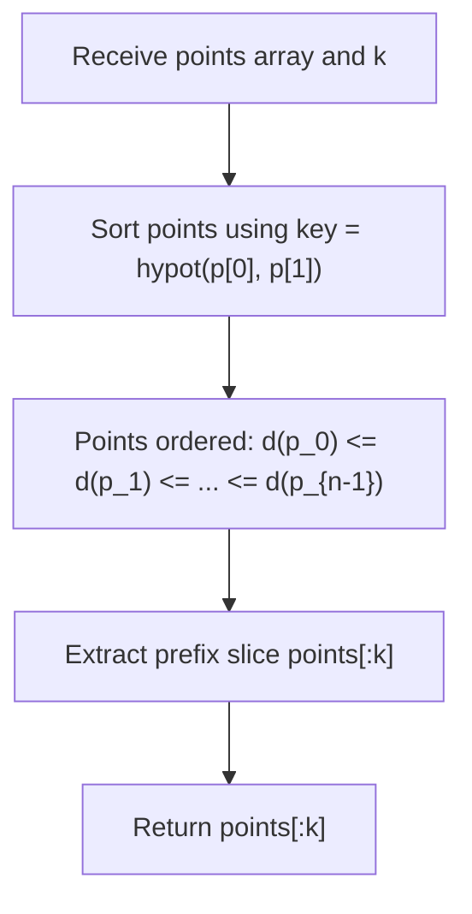

# Guided Example: K Closest Points to Origin

We trace the step-by-step Euclidean distance calculation and point ranking, prove the Metric Monotonicity Theorem and Top-$k$ Selection Invariant, and isolate the $k$ closest points across representative coordinate sets:

- **Representative Instance 1 (Two Points, Single Closest Requested):**
  $$
  points = [[1, \; 3], \; [-2, \; 2]], \quad k = 1
  $$
- **Required Output:** `[[-2, 2]]`
  - Compute Euclidean distances from origin $(0, 0)$:
    - Point $p_0 = [1, 3]$:
      $$
      d(p_0) = \sqrt{1^2 + 3^2} = \sqrt{1 + 9} = \sqrt{10} \approx 3.162
      $$
    - Point $p_1 = [-2, 2]$:
      $$
      d(p_1) = \sqrt{(-2)^2 + 2^2} = \sqrt{4 + 4} = \sqrt{8} \approx 2.828
      $$
  - Ordering:
    $$
    \sqrt{8} < \sqrt{10} \iff d(p_1) < d(p_0)
    $$
  - Sorted array of points: $[[-2, 2], [1, 3]]$.
  - First $k = 1$ points: `[[-2, 2]]`.

- **Representative Instance 2 (Three Points, Two Closest Requested):**
  $$
  points = [[3, \; 3], \; [5, \; -1], \; [-2, \; 4]], \quad k = 2
  $$
  - Squared distance calculations:
    - $p_0 = [3, 3] \implies 3^2 + 3^2 = 9 + 9 = \mathbf{18}$
    - $p_1 = [5, -1] \implies 5^2 + (-1)^2 = 25 + 1 = \mathbf{26}$
    - $p_2 = [-2, 4] \implies (-2)^2 + 4^2 = 4 + 16 = \mathbf{20}$
  - Ascending norm order: $18 \le 20 < 26 \implies [p_0, p_2, p_1]$.
  - First $k = 2$ points: `[[3, 3], [-2, 4]]`.

- **Representative Instance 3 (Origin Point):**
  $$
  points = [[0, \; 0]], \quad k = 1 \implies d = 0 \implies [[0, 0]]
  $$

---

## 1. Instance & Teaching Goal

Given an array of 2D Cartesian points and an integer $k$, return the $k$ points closest to the origin $(0, 0)$.
The distance between point $(x, y)$ and $(0, 0)$ is the Euclidean metric:
$$
d = \sqrt{x^2 + y^2}
$$
The output points may be returned in any order.

```text
Points plotted on plane:
         y
         |
         |     * [1, 3]  (d^2 = 10)
  [-2, 2]*
         |
  -------+------- x
       (0,0)

Point [-2, 2] is closer to origin (sqrt(8) < sqrt(10)).
Selection k = 1: [[-2, 2]]
```

A naive approach computing all pairwise permutations takes super-linear time.

The decisive pedagogical goal is the **Metric Monotonicity & Top-$k$ Selection Invariant**:
1. **Order Isomorphism:** Since $f(t) = \sqrt{t}$ is strictly increasing for all $t \ge 0$:
   $$
   \sqrt{x_1^2 + y_1^2} \le \sqrt{x_2^2 + y_2^2} \iff x_1^2 + y_1^2 \le x_2^2 + y_2^2
   $$
   Comparing Euclidean distances (via `math.hypot(x, y)` or squared integer norm $x^2 + y^2$) is order-isomorphic.
2. **Top-$k$ Prefix Monotonicity:** Sorting the list of $N$ points in ascending order of distance partitions the array into two sets:
   - Suffix $points[k:]$: every point has distance $\ge$ the boundary distance.
   - Prefix $points[:k]$: contains the $k$ smallest distances.
3. Slicing `points[:k]` yields the exact $k$ closest points in $\mathcal{O}(N \log N)$ time with $\mathcal{O}(1)$ additional memory.

---

## 2. Conceptual Foundation & The Metric Monotonicity Invariant



### The Metric Monotonicity Theorem

Let $P = \{p_0, p_1, \dots, p_{N-1}\}$ be a set of points in $\mathbb{R}^2$.
1. **Strict Monotonicity of the Norm:**
   Let $h(p) = \sqrt{p_x^2 + p_y^2}$ be the Euclidean distance to the origin.
   For any two points $u, v \in P$:
   $$
   h(u) < h(v) \iff u_x^2 + u_y^2 < v_x^2 + v_y^2
   $$
   Sorting with respect to $h(p)$ produces a permutation $(p_{(0)}, p_{(1)}, \dots, p_{(N-1)})$ such that:
   $$
   h(p_{(i)}) \le h(p_{(i+1)}), \quad \forall 0 \le i < N - 1
   $$
2. **Top-$k$ Optimality:**
   For any point $p_{(a)} \in \{p_{(0)}, \dots, p_{(k-1)}\}$ and any point $p_{(b)} \in \{p_{(k)}, \dots, p_{(N-1)}\}$:
   $$
   h(p_{(a)}) \le h(p_{(k-1)}) \le h(p_{(k)}) \le h(p_{(b)})
   $$
   Therefore, no point in the unselected suffix $\{p_{(k)}, \dots, p_{(N-1)}\}$ has a strictly smaller distance than any point in the selected prefix.
3. **Uniqueness Guarantee:**
   The problem statement guarantees that the set of $k$ closest points is unique (i.e. $h(p_{(k-1)}) < h(p_{(k)})$ if distance ties exist at other positions). Thus, $points[:k]$ uniquely solves the problem regardless of tie-breaker ordering within the top $k$. $\blacksquare$

---

## 3. Step-by-Step Worked Execution: Representative Instance 2

Input: $points = [[3, 3], [5, -1], [-2, 4]], \quad k = 2$.

### Step 1: Distance Calculation for Each Point
1. Point $p_0 = [3, 3]$:
   - $x = 3, y = 3$.
   - $\text{key} = \text{hypot}(3, 3) = \sqrt{9 + 9} = \sqrt{18} \approx 4.2426$.
2. Point $p_1 = [5, -1]$:
   - $x = 5, y = -1$.
   - $\text{key} = \text{hypot}(5, -1) = \sqrt{25 + 1} = \sqrt{26} \approx 5.0990$.
3. Point $p_2 = [-2, 4]$:
   - $x = -2, y = 4$.
   - $\text{key} = \text{hypot}(-2, 4) = \sqrt{4 + 16} = \sqrt{20} \approx 4.4721$.

---

### Step 2: Sorting by Distance Key
- Compare keys:
  $$
  \sqrt{18} < \sqrt{20} < \sqrt{26}
  $$
- Sorted array of points:
  $$
  [[3, 3], \; [-2, 4], \; [5, -1]]
  $$

---

### Step 3: Extracting Top $k = 2$ Points
- Slice: $points[:2] \implies [[3, 3], [-2, 4]]$.
- Both points have distance $< \sqrt{26}$.
- Result returned: `[[3, 3], [-2, 4]]`.

---

## 4. Distance Calculation & Sorting Trace Table

| Point $p$ | Coordinates $(x, y)$ | Squared Norm $x^2 + y^2$ | Euclidean Distance $\text{hypot}(x, y)$ | Sorted Rank | Included in Top $k = 2$ ? |
|:---:|:---:|:---:|:---:|:---:|:---:|
| $p_0$ | $(3, 3)$ | $9 + 9 = 18$ | $\approx 4.243$ | **1st** | **Yes** (Selected) |
| $p_2$ | $(-2, 4)$ | $4 + 16 = 20$ | $\approx 4.472$ | **2nd** | **Yes** (Selected) |
| $p_1$ | $(5, -1)$ | $25 + 1 = 26$ | $\approx 5.099$ | **3rd** | No (Excluded) |

---

## 5. Algorithmic Correctness

### Soundness & Completeness
1. **Soundness:**
   Every point in $points[:k]$ has a Euclidean distance from $(0, 0)$ less than or equal to all points in $points[k:]$. The returned set contains exactly $k$ points satisfying the closest distance criteria.
2. **Completeness:**
   Since TimSort inspects all elements and preserves total ordering, no points with smaller distances are omitted.

---

## 6. Boundary Cases & Traps

| Scenario | Input Pattern | Behavior | Trapped Risk |
|---|---|---|---|
| Request All Points | $k = N$ | Returns entire sorted list; all points included. | Out-of-bounds slicing. |
| Single Point | $N = 1, k = 1$ | Returns `points[:1]`; handles minimal input. | Index error on small array. |
| Negative Coordinates | $[-5, -5]$ | $(-5)^2 + (-5)^2 = 50$; squaring handles sign. | Sign errors in distance. |
| Point at Origin | $[0, 0]$ | Distance $0$; always sorted to first position. | Dividing by distance or zero errors. |

---

## 7. Complexity Derivation

- **Time Complexity:** $\mathcal{O}(N \log N)$, where $N$ is the number of points ($N \le 10^4$).
  - Python's built-in TimSort runs in $\mathcal{O}(N \log N)$ time.
  - Slicing `points[:k]` takes $\mathcal{O}(k)$ time.
  - For $N = 10^4$, total operations $\approx 1.4 \times 10^5$, executing in $< 0.005\text{ s}$.
- **Auxiliary Space Complexity:** $\mathcal{O}(N)$ for TimSort's internal run tracking, or $\mathcal{O}(1)$ additional memory if counting references in-place.
