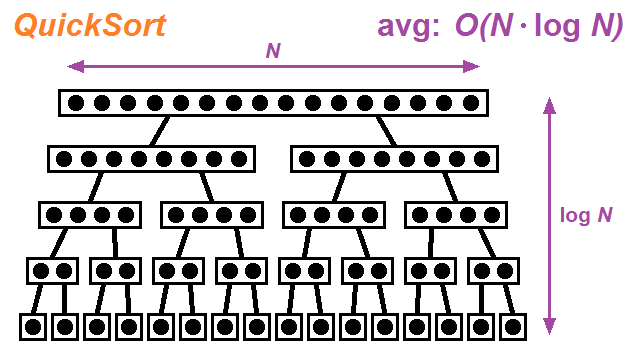
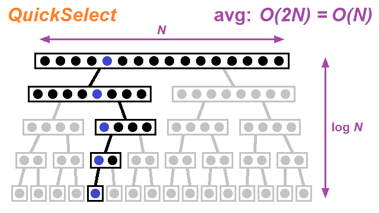

[TOC]

## Solution

---

### Overview

Finding the $k$ closest points to the origin will require us to first be able to calculate the distance of a given point to the origin before we can start to evaluate the relative closeness of any two points.

In order to evaluate the distance from the origin to a given point, we must use the **Euclidean distance** equation. This equation starts with the **Pythagorean theorem**, ( $a^2 + b^2 = c^2$ ) which calculates the distance of the hypotenuse ( $c$ ) of a right triangle when the length of the other two sides ( $a$, $b$ ) is known.

Given two Euclidean points, we can determine the values for $a$ and $b$ by taking the difference of the two $x$ coordinates ( $a = x_1 - x_2$ ) and the two $y$ coordinates ( $b = y_1 - y_2$ ). Plugging these values into the Pythagorean theorem and solving for the length of $c$, we get the Euclidean distance equation ( $dist = \sqrt{(x_1 - x_2)^2 + (y_1 - y_2)^2}$ ).

In this problem, with one of the two Euclidean coordinates being the origin ( $0, 0$ ), this simplifies the Euclidean distance equation back to the original Pythagorean theorem ( $dist = \sqrt{(x - 0)^2 + (y - 0)^2} = \sqrt{x^2 + y^2}$ ).

We can also simplify the process of comparing two points by using the squared Euclidean distance instead of the precise Euclidean distance, as both will yield the same result. This allows us to remove the square root from each side of the equation ( $\sqrt{{x_1}^2 + {y_1}^2} < \sqrt{{x_2} ^2 + {y_2}^2}$ ) $=$ ( ${x_1}^2 + {y_1}^2 < {x_2}^2 + {y_2}^2$ ) which will significantly reduce the overall computational time for each comparison made.

</br>

---

### Approach 1: Sort with Custom Comparator

**Intuition**

We can reframe the problem as finding $k$ points with the smallest **squared Euclidean distance** from the origin. When seeking the smallest elements in a list, an intuitive first step is to sort the list, as this will bring the smallest elements to the front.

Therefore, in this problem, we can sort the entire `points` array using a **custom comparator** function that applies the squared Euclidean distance equation. After the sorting process is completed, we just return the first $k$ elements of the sorted array.

This solution is trivial, and while it gets the job done, it should not be considered an ideal candidate for an interview response. As we will see, there are more efficient options from which to choose.

**Algorithm**

1. Sort the array with a **custom comparator** function.
   - The custom comparator function will use the **squared Euclidean distance** equation to compare two points.
2. Return the first $k$ elements of the array.

```python
class Solution:
    def kClosest(self, points: List[List[int]], k: int) -> List[List[int]]:
        # Sort the list with a custom comparator function
        points.sort(key=self.squared_distance)

        # Return the first k elements of the sorted list
        return points[:k]

    def squared_distance(self, point: List[int]) -> int:
        """Calculate and return the squared Euclidean distance."""
        return point[0] ** 2 + point[1] ** 2
```

**Complexity Analysis**

Here $N$ refers to the length of the given array `points`.

* Time complexity: $O(N \cdot \log N)$ for the sorting of `points`.

  While sorting methods vary between different languages, [most have a worst-case or average time complexity of $O(N \cdot \log N)$](https://en.wikipedia.org/wiki/Sorting_algorithm#Comparison_of_algorithms).

* Space complexity: $O(\log N)$ to $O(N)$ for the extra space required by the sorting process.

  As with the time complexity, the space complexity of the sorting method used can vary from language to language. C++'s STL, for example, uses QuickSort most of the time but will switch to either HeapSort or InsertionSort depending on the nature of the data. Java uses a variant of QuickSort with dual pivots when dealing with arrays of primitive values. The implementation of both C++'s and Java's sort methods will require an average of $O(\log N)$ extra space. Python, on the other hand, uses TimSort, which is a hybrid of MergeSort and InsertionSort and requires $O(N)$ extra space. Unlike most other languages, Javascript's sort method will actually vary from browser to browser. Since the adoption of ECMAScript 2019, however, the sort method is required to be stable, which generally means MergeSort or TimSort and a space complexity of $O(N)$.

<br/>

---

### Approach 2: Max Heap or Max Priority Queue

**Intuition**

While we must iterate over all elements in the `points` array, we only need to keep track of the $k$ closest points encountered so far. We could therefore choose to store them in a separate data structure. In order to keep this data structure capped at $k$ elements, we will need to keep track of the point that is farthest away from the origin and thus the next point to be removed when a closer point is found.

The ideal data structure for this purpose is a [**max heap** or **max priority queue**](https://leetcode.com/explore/featured/card/heap/). These data structures allow access to the max value in constant time and perform replacements in logarithmic time.

> _**Note**: We can simulate max heap functionality in a min heap data structure by inserting $-dist$ instead of $dist$, if necessary._

At the start of our iteration through `points`, we will insert the first $k$ elements into our heap. Once the heap is "full", we can then compare each new point to the farthest point stored in the heap. If the new point is closer, then we should remove the farthest point from the heap and insert the new point.

After the entire `points` array has been processed, we can create an array from the points stored in the heap and then return the answer.

**Algorithm**

1. Use a **max heap** (or **max priority queue**) to store points by distance.
   - Store the first $k$ elements in the heap.
   - Then only add new elements that are closer than the top point in the heap while removing the top point to keep the heap at $k$ elements.
2. Return an array of the $k$ points stored in the heap.

```python
class Solution:
    def kClosest(self, points: List[List[int]], k: int) -> List[List[int]]:
        # Since heap is sorted in increasing order,
        # negate the distance to simulate max heap
        # and fill the heap with the first k elements of points
        heap = [(-self.squared_distance(points[i]), i) for i in range(k)]
        heapq.heapify(heap)
        for i in range(k, len(points)):
            dist = -self.squared_distance(points[i])
            if dist > heap[0][0]:
                # If this point is closer than the kth farthest,
                # discard the farthest point and add this one
                heapq.heappushpop(heap, (dist, i))

        # Return all points stored in the max heap
        return [points[i] for (_, i) in heap]

    def squared_distance(self, point: List[int]) -> int:
        """Calculate and return the squared Euclidean distance."""
        return point[0] ** 2 + point[1] ** 2
```

**Complexity Analysis**

Here $N$ refers to the length of the given array `points`.

* Time complexity: $O(N \cdot \log k)$

  Adding to/removing from the heap (or priority queue) only takes $O(\log k)$ time when the size of the heap is capped at $k$ elements.

* Space complexity: $O(k)$

  The heap (or priority queue) will contain at most $k$ elements.

<br/>

---

### Approach 3: Binary Search

**Intuition**

Since this problem is asking us to identify the first $k$ sorted points, another approach that may come to mind is a [**binary search**](https://leetcode.com/explore/learn/card/binary-search/). In a standard binary search approach, we would have a sorted array of data, a defined target condition, and a set range of values to attempt. The binary search process involves picking a midpoint of the range and then figuring out on which side of the midpoint the target lies in $O(1)$ time. By repeating this process, we can isolate the target condition in only $O(\log N)$ time.

Without a sorted `points` array, applying a binary search technique to the current problem would require us to modify the standard method. For this modified approach we would first choose a target distance, then we would iterate through every point during each binary search loop to check if our target distance contains exactly $k$ points. If it contains less than $k$ points, we will increase our target distance, and vice versa, until we find a target distance that contains exactly $k$ points. This would result in an average time complexity of $O(N \cdot \log N)$, which is no better than the standard sorting method.

In this case, however, we can improve upon the time complexity of this modified binary search by eliminating one set of points at the end of each iteration. If the target distance yields fewer than $k$ closer points, then we know that each of those points belongs in our answer and can then be ignored in later iterations. If the target distance yields more than $k$ closer points, on the other hand, we know that we can discard the points that fell outside the target distance.

By roughly halving the remaining points in each iteration of the binary search, we reduce the total number of processes to $N + \frac{N}{2} + \frac{N}{4} + \frac{N}{8} + ... + \frac{N}{N} = 2N$. This results in an average time complexity of $O(N)$.

Since we're going to be using the midpoint of the range of distances for each iteration of our binary search, we should calculate the actual Euclidean distance for each point, rather than using the squared distance as in the other approaches. An even distribution of the points in the input array will yield an even distribution of distances, but an uneven distribution of squared distances.

As the efficiency of this solution relies on averaging as close to a middle split of the points as possible on each iteration of the binary search, the use of Euclidean distances will be more efficient than the use of squared Euclidean distances. We can precompute these distances in a separate array prior to performing the binary search, however, to lessen the overall processing required. This will also allow us to use an array of reference indices in our binary search, rather than having to create and modify more complex arrays during each iteration.

During each iteration of the binary search, we will split the points into two arrays, `closer`, which contains all of the points that are closer than or equal to the current target distance, and `farther`, which contains all of the points that are farther than the target distance. If the `closer` array contains fewer than $k$ points, we can add those points to our answer array (`closest`) and adjust $k$ to reflect the number of points still left to be found. Then we can focus on the remaining points in the `farther` array for the next round. If the `closer` array contains more than $k$ points, we can discard the `farther` array. In either case, we will need to update our range to match the array we keep.

Once the answer array is complete, we can build and return an array of the $k$ closest points.

**Algorithm**

1. Precompute the Euclidean distances of each point.
2. Define the initial binary search range by identifying the farthest computed distance.
3. Perform a binary search from low to high using the reference distances.
   - Calculate the midpoint of the remaining range as the target distance.
   - Split the remaining points into those closer and those farther than the target distance.
   - If the `closer` array has fewer than $k$ points, add them to the `closest` array and adjust the value of $k$.
   - Keep only the appropriate remaining array for the next iteration and update the binary search range.
4. Once $k$ elements have been added to the `closest` array, return the $k$ closest points.

```python
class Solution:
    def kClosest(self, points: List[List[int]], k: int) -> List[List[int]]:
        # Precompute the Euclidean distance for each point
        distances = [self.euclidean_distance(point) for point in points]
        # Create a reference list of point indices
        remaining = [i for i in range(len(points))]
        # Define the initial binary search range
        low, high = 0, max(distances)

        # Perform a binary search of the distances
        # to find the k closest points
        closest = []
        while k:
            mid = (low + high) / 2
            closer, farther = self.split_distances(remaining, distances, mid)
            if len(closer) > k:
                # If more than k points are in the closer distances
                # then discard the farther points and continue
                remaining = closer
                high = mid
            else:
                # Add the closer points to the answer array and keep
                # searching the farther distances for the remaining points
                k -= len(closer)
                closest.extend(closer)
                remaining = farther
                low = mid

        # Return the k closest points using the reference indices
        return [points[i] for i in closest]

    def split_distances(self, remaining: List[int], distances: List[float],
                        mid: int) -> List[List[int]]:
        """Split the distances around the midpoint
        and return them in separate lists."""
        closer, farther = [], []
        for index in remaining:
            if distances[index] <= mid:
                closer.append(index)
            else:
                farther.append(index)
        return [closer, farther]

    def euclidean_distance(self, point: List[int]) -> float:
        """Calculate and return the squared Euclidean distance."""
        return point[0] ** 2 + point[1] ** 2
```

**Complexity Analysis**

Here $N$ refers to the length of the given array `points`.

* Time complexity: $O(N)$

  While this binary search variant has a worst-case time complexity of $O(N^2)$, it has an average time complexity of $O(N)$. It achieves this by halving (on average) the remaining elements needing to be processed at each iteration, which results in $N + \frac{N}{2} + \frac{N}{4} + \frac{N}{8} + ... + \frac{N}{N} = 2N$ total processes. This yields an average time complexity of $O(N)$.

* Space complexity: $O(N)$

  An extra $O(N)$ space is required for the arrays containing distances and reference indices.

<br/>

---

### Approach 4: QuickSelect

**Intuition**

While the previous approach was successful in reducing the time complexity to only $O(N)$, it did so at the expense of pushing the space complexity to $O(N)$. But what if we could use an in-place approach and modify the `points` array directly? Bringing the $k$ closest points forward to the beginning of the array would effectively result in a partial sort of `points`. This method is called the **QuickSelect algorithm**.

In fact, anytime we are tasked with finding the $k$ (or $k^{th}$) [smallest/largest/etc.] element(s), we should always consider whether the QuickSelect algorithm can be applied. To understand why this is the case, we will briefly introduce the QuickSelect algorithm before diving into how it can be applied to this problem.

The QuickSelect algorithm is essentially a partial application of one of the most common sorting methods: the **QuickSort algorithm**. Both the QuickSort algorithm and its derivate, the QuickSelect algorithm, were invented by Tony Hoare between 1959 and 1961. In order to more easily understand the QuickSelect algorithm, we should first examine how the QuickSort algorithm works.

The QuickSort algorithm operates by **recursively** performing a partial sort of a given range of values. First, a **pivot** value is chosen from the values in the range. Then the QuickSort function uses two pointers, which start from opposite ends of the range and move inward, to swap values in the range. These values are swapped as necessary to ensure that all values lower than the pivot are on one side, and the remaining higher values are on the other. Once the values are thus partitioned, the QuickSort function can be recursively called on each **partition** with progressively smaller ranges until the array is completely sorted.

Since the partition size roughly halves with each recursion, the total recursion stack averages a depth of $\log N$, and as each layer of recursion includes all $N$ values in total, this leads to an overall time complexity for the QuickSort algorithm of $O(N \cdot \log N)$. Due to the **recursion stack** necessary for the QuickSort process, it also requires $O(\log N)$ extra space.

<br>



<br>

But if we don't care about fully sorting the array of values and instead only want to make sure that we select the first $k$ values, we can simplify this process. At each recursive branching of the QuickSort function, we can ignore the partition which does _not_ include the $k^{th}$ value. This is the basis for the QuickSelect algorithm.

An immediate benefit of being able to ignore one of the two resulting partitions at each step is that we no longer need to use recursion to branch the process. We can instead convert the function to a more space-friendly iterative solution that uses only a constant amount of space.

A typical QuickSelect function (`quickSelect()`) starts with two pointers (`left`, `right`) that define the entire range of indices in the given array. The function will iteratively apply a partitioning helper function (`partition()`) which will return the index of the borderline between the two subsequent partitions.

Inside the partition helper function, the first step is to find a suitable pivot value. For this, we can call on another helper function (`choosePivot()`). The efficiency of the QuickSelect algorithm relies heavily upon picking a good pivot candidate; the closer the pivot is to the median value, the more likely each successive partitioning is to suitably narrow the range of values.

Common methods for selecting a pivot candidate include picking the first, last, or middle index of the range, or picking the median value between those three elements. Other, more complex methods for selecting a pivot value exist, but their suitability depends upon the nature of the array in question.

If the range is already sorted or nearly sorted, for example, picking the first or last index can potentially lead to the worst-case time complexity of $O(N^2)$ for the QuickSelect process. With no information about the nature of the order of the elements in `points`, we'll simply choose the element at the middle index of the range for this solution, using the simple median formula ($a + floor((b - a) / 2)$).

> _**Note**: Since we're choosing a pivot distance from among the remaining points, we should use the squared Euclidean distance rather than the actual Euclidean distance to save processing time. Unlike the binary search solution, where we used the midpoint of the range of distances, using the distance of a random choice of the remaining points as our pivot distance will not result in an unbalanced split, on average._

After choosing a pivot value, the partition function will swap the values of the elements in the range until it is partitioned into two sides with values less than the pivot value on one side and the remaining values on the other. Like finding the pivot, there are multiple methods available to accomplish this, but we'll use a basic version in which we start with pointers at either end of its range (`left`, `right`) and move inward, swapping elements with values larger than the pivot value to the right side.

Once the two pointers meet, we'll need to make sure the left pointer has completely moved past the end of the left side partition, then we can return it back to the QuickSelect function as the `pivotIndex` representing the left-most edge of the right partition.

If `pivotIndex` is equal to $k$, then we know that the first $k$ values in the array will be the ones we want to select. Since the order of the elements in the output array does not matter, an array containing those $k$ values can immediately be returned as the solution. Otherwise, the QuickSelect function should adjust its range pointers appropriately, keeping only the partition which includes the $k^{th}$ value. This process will continue to narrow the range until a match is found and the solution is returned.

<div>
    <div class="video-container">
        <iframe src="https://player.vimeo.com/video/614034863?h=d451ff9686" width="640" height="360" frameborder="0" allow="autoplay; fullscreen; picture-in-picture" allowfullscreen></iframe>
    </div>
</div>

<br>

Unlike the QuickSort algorithm, the QuickSelect algorithm roughly halves the remaining elements needed to process at each iteration, so the total number of processes will average at $N + \frac{N}{2} + \frac{N}{4} + \frac{N}{8} + ... + \frac{N}{N} = 2N$, which results in an average time complexity of $O(N)$, down from the $O(N \cdot \log N)$ of the QuickSort algorithm.

<br>



<br>

**Algorithm**

1. Return the result of a **QuickSelect algorithm** on the `points` array to $k$ elements.
2. In the QuickSelect function:
   - Repeatedly **partition** a range of elements in the given array while homing in on the $k^{th}$ element.
3. In the partition function:
   - Choose a **pivot** element. The pivot value will be squared Euclidean distance from the origin to the pivot element and will be compared to the squared Euclidean distance of all other points in the partition.
   - Start with pointers at the left and right ends of the partition, then while the two pointers have not yet met:
     - If the value of the element at the left pointer is smaller than the pivot value, increment the left pointer.
     - Otherwise, swap the elements at the two pointers and decrement the right pointer.
   - Make sure the left pointer is past the last element whose value is lower than the pivot value.
   - Return the value of the left pointer as the new pivot index.
4. Return the first $k$ elements of the array.

```python
class Solution:
    def kClosest(self, points: List[List[int]], k: int) -> List[List[int]]:
        return self.quick_select(points, k)

    def quick_select(self, points: List[List[int]], k: int) -> List[List[int]]:
        """Perform the QuickSelect algorithm on the list"""
        left, right = 0, len(points) - 1
        pivot_index = len(points)
        while pivot_index != k:
            # Repeatedly partition the list
            # while narrowing in on the kth element
            pivot_index = self.partition(points, left, right)
            if pivot_index < k:
                left = pivot_index
            else:
                right = pivot_index - 1

        # Return the first k elements of the partially sorted list
        return points[:k]

    def partition(self, points: List[List[int]], left: int, right: int) -> int:
        """Partition the list around the pivot value"""
        pivot = self.choose_pivot(points, left, right)
        pivot_dist = self.squared_distance(pivot)
        while left < right:
            # Iterate through the range and swap elements to make sure
            # that all points closer than the pivot are to the left
            if self.squared_distance(points[left]) >= pivot_dist:
                points[left], points[right] = points[right], points[left]
                right -= 1
            else:
                left += 1

        # Ensure the left pointer is just past the end of
        # the left range then return it as the new pivotIndex
        if self.squared_distance(points[left]) < pivot_dist:
            left += 1
        return left

    def choose_pivot(self, points: List[List[int]], left: int, right: int) -> List[int]:
        """Choose a pivot element of the list"""
        return points[left + (right - left) // 2]

    def squared_distance(self, point: List[int]) -> int:
        """Calculate and return the squared Euclidean distance."""
        return point[0] ** 2 + point[1] ** 2
```

**Complexity Analysis**

Here $N$ refers to the length of the given array `points`.

* Time complexity: $O(N)$.

  Similar to the earlier binary search solution, the QuickSelect solution has a worst-case time complexity of $O(N^2)$ if the worst pivot is chosen each time. On average, however, it has a time complexity of $O(N)$ because it halves (roughly) the remaining elements needing to be processed at each iteration. This results in $N + \frac{N}{2} + \frac{N}{4} + \frac{N}{8} + ... + \frac{N}{N} = 2N$ total processes, yielding an average time complexity of $O(N)$.

* Space complexity: $O(1)$.

  The QuickSelect algorithm conducts the partial sort of `points` in place with no recursion, so only constant extra space is required.

<br/>

---