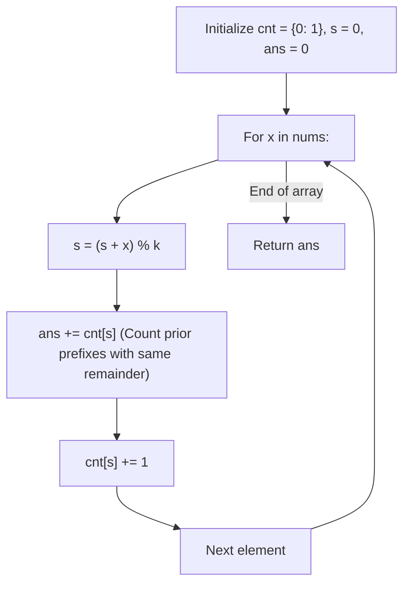

# Guided Example: Subarray Sums Divisible by K

We trace the step-by-step prefix sum remainder tracking, prove the Modulo Congruence Equivalence Lemma and the Base Prefix Invariant, and calculate the number of divisible subarrays across representative arrays:

- **Representative Instance 1 (Mixed Positive and Negative Values):**
  $$
  nums = [4, \; 5, \; 0, \; -2, \; -3, \; 1], \quad k = 5
  $$
- **Required Output:** `7`
  - Initialize frequency counter: $cnt = \{0: 1\}$ (accounting for empty prefix $P[-1] = 0$).
  - Running remainder $s = 0$, cumulative answers $ans = 0$.
  - Step-by-step stream:
    1. $x = 4$:
       - Remainder: $s = (0 + 4) \bmod 5 = 4$.
       - Prior prefixes with remainder $4$: $cnt[4] = 0$.
       - Subarrays found: $ans += 0 \implies ans = 0$.
       - Update counter: $cnt[4] \leftarrow 1$.
    2. $x = 5$:
       - Remainder: $s = (4 + 5) \bmod 5 = 4$.
       - Prior prefixes with remainder $4$: $cnt[4] = 1$.
       - Valid subarray: $nums[1 \dots 1] = [5]$ (sum $5$, divisible by $5$).
       - Subarrays found: $ans += 1 \implies ans = 1$.
       - Update counter: $cnt[4] \leftarrow 2$.
    3. $x = 0$:
       - Remainder: $s = (4 + 0) \bmod 5 = 4$.
       - Prior prefixes with remainder $4$: $cnt[4] = 2$.
       - Valid subarrays: $[5, 0]$ (sum $5$) and $[0]$ (sum $0$).
       - Subarrays found: $ans += 2 \implies ans = 3$.
       - Update counter: $cnt[4] \leftarrow 3$.
    4. $x = -2$:
       - Remainder: $s = (4 - 2) \bmod 5 = 2$.
       - Prior prefixes with remainder $2$: $cnt[2] = 0$.
       - Subarrays found: $ans += 0 \implies ans = 3$.
       - Update counter: $cnt[2] \leftarrow 1$.
    5. $x = -3$:
       - Remainder: $s = (2 - 3) \bmod 5 = -1 \equiv 4 \pmod 5$.
       - Prior prefixes with remainder $4$: $cnt[4] = 3$.
       - Valid subarrays ending at index 4: $[5, 0, -2, -3]$, $[0, -2, -3]$, and $[-2, -3]$ (all sums divisible by $5$).
       - Subarrays found: $ans += 3 \implies ans = 6$.
       - Update counter: $cnt[4] \leftarrow 4$.
    6. $x = 1$:
       - Remainder: $s = (4 + 1) \bmod 5 = 0$.
       - Prior prefixes with remainder $0$: $cnt[0] = 1$ (matches the empty prefix!).
       - Valid subarray: entire prefix $[4, 5, 0, -2, -3, 1]$ (sum $5$, divisible by $5$).
       - Subarrays found: $ans += 1 \implies ans = \mathbf{7}$.
       - Update counter: $cnt[0] \leftarrow 2$.
  - Total qualifying subarrays: $\mathbf{7}$.

- **Representative Instance 2 (No Divisible Subarray):**
  $$
  nums = [5], \quad k = 9 \implies s = 5 \bmod 9 = 5 \implies cnt[5] = 0 \implies ans = \mathbf{0}
  $$

- **Representative Instance 3 (All Zeros, Combinatorial Pairs):**
  $$
  nums = [0, \; 0, \; 0], \quad k = 2 \implies \text{all } P[j] \equiv 0 \implies \binom{4}{2} = \mathbf{6} \text{ subarrays}
  $$

---

## 1. Instance & Teaching Goal

Given an integer array `nums` and an integer `k`, return the number of non-empty **subarrays** whose sum is divisible by `k`.
A subarray is a contiguous block of elements.

```text
Prefix Sum Remainders (k = 5):
Index:       -1   0   1   2   3   4   5
nums[i]:          4   5   0  -2  -3   1
Prefix Rem:   0   4   4   4   2   4   0
                  ^   ^   ^       ^
                  All these prefixes have remainder 4!
                  Any pair of them produces a subarray whose sum is divisible by 5.
```

Checking all $\mathcal{O}(N^2)$ subarrays takes quadratic time, causing timeouts for $N = 30{,}000$.

The decisive pedagogical goal is the **Prefix Sum Modulo Congruence Invariant**:
- A subarray sum from index $i$ to $j$ is the difference of two prefix sums:
  $$
  \sum_{m=i}^j nums[m] = P[j] - P[i-1]
  $$
- The sum is divisible by $k$ if and only if:
  $$
  (P[j] - P[i-1]) \equiv 0 \pmod k \iff P[j] \equiv P[i-1] \pmod k
  $$
- Tracking the frequency of observed prefix remainders in a hash map converts subarray counting into single-pass $\mathcal{O}(N)$ stream accumulation.

---

## 2. Conceptual Foundation & The Congruence Invariant



### The Modulo Congruence Equivalence Theorem

Let $P[m] = \sum_{t=0}^m nums[t]$ denote the prefix sum through index $m$, with $P[-1] = 0$.
1. **Subarray Representation:**
   For any non-empty subarray $nums[i \dots j]$ ($0 \le i \le j < n$):
   $$
   \sum_{t=i}^j nums[t] = P[j] - P[i-1]
   $$
2. **Divisibility Condition:**
   $$
   k \mid (P[j] - P[i-1]) \iff P[j] \equiv P[i-1] \pmod k
   $$
   Therefore, the subarray sum is divisible by $k$ if and only if $P[j]$ and $P[i-1]$ yield the identical remainder upon Euclidean division by $k$.
3. **The Base Case Offset ($P[-1] = 0$):**
   If a subarray starts at index $0$ ($i = 0$), its sum is $P[j] - P[-1] = P[j]$.
   For this sum to be divisible by $k$, we must have $P[j] \equiv P[-1] \equiv 0 \pmod k$.
   Initializing the frequency table with $cnt[0] = 1$ accounts for this virtual empty prefix, ensuring subarrays starting at index $0$ are counted.
4. **Non-Empty Subarray Invariant:**
   By querying $ans += cnt[s]$ **before** incrementing $cnt[s] \leftarrow cnt[s] + 1$, the algorithm only matches the current prefix $j$ with strictly earlier prefixes $i - 1 < j$, preventing empty subarrays from being counted. $\blacksquare$

---

## 3. Step-by-Step Worked Execution: Representative Instance 1

$nums = [4, 5, 0, -2, -3, 1], \; k = 5$.
Initialize: $cnt = \{0: 1\}, \; s = 0, \; ans = 0$.

### Iteration 1: $x = 4$
- $s = (0 + 4) \bmod 5 = 4$.
- Query: $cnt[4] = 0 \implies ans += 0$.
- Update: $cnt[4] \leftarrow 1$.

---

### Iteration 2: $x = 5$
- $s = (4 + 5) \bmod 5 = 4$.
- Query: $cnt[4] = 1 \implies ans += 1 \implies ans = 1$.
  *(Matches prefix at index 0 $\implies$ subarray $nums[1 \dots 1] = [5]$).*
- Update: $cnt[4] \leftarrow 2$.

---

### Iteration 3: $x = 0$
- $s = (4 + 0) \bmod 5 = 4$.
- Query: $cnt[4] = 2 \implies ans += 2 \implies ans = 3$.
  *(Matches prefixes at index 0 and 1 $\implies$ subarrays $[5, 0]$ and $[0]$).*
- Update: $cnt[4] \leftarrow 3$.

---

### Iteration 4: $x = -2$
- $s = (4 - 2) \bmod 5 = 2$.
- Query: $cnt[2] = 0 \implies ans += 0$.
- Update: $cnt[2] \leftarrow 1$.

---

### Iteration 5: $x = -3$
- $s = (2 - 3) \bmod 5 = -1 \equiv 4 \pmod 5$.
- Query: $cnt[4] = 3 \implies ans += 3 \implies ans = 6$.
  *(Matches prefixes at index 0, 1, 2 $\implies$ subarrays $[5, 0, -2, -3]$, $[0, -2, -3]$, $[-2, -3]$).*
- Update: $cnt[4] \leftarrow 4$.

---

### Iteration 6: $x = 1$
- $s = (4 + 1) \bmod 5 = 0$.
- Query: $cnt[0] = 1 \implies ans += 1 \implies ans = \mathbf{7}$.
  *(Matches the base empty prefix $\implies$ entire subarray $[4, 5, 0, -2, -3, 1]$).*
- Update: $cnt[0] \leftarrow 2$.

---

### Final Result
$$
ans = \mathbf{7}
$$

---

## 4. Prefix Congruence State Evolution Trace Table

| Index $j$ | Element $x$ | Prefix Remainder $s = (s + x) \pmod k$ | Prior Matches $cnt[s]$ | Incremental Valid Subarrays | Cumulative Answer `ans` | Updated $cnt[s]$ |
|:---:|:---:|:---:|:---:|:---|:---:|:---:|
| **Init** | — | $0$ | — | — | $0$ | $cnt[0] = 1$ |
| **$0$** | $4$ | $4$ | $0$ | None | $0$ | $cnt[4] = 1$ |
| **$1$** | $5$ | $4$ | $1$ | $[5]$ | $1$ | $cnt[4] = 2$ |
| **$2$** | $0$ | $4$ | $2$ | $[5, 0], [0]$ | $3$ | $cnt[4] = 3$ |
| **$3$** | $-2$ | $2$ | $0$ | None | $3$ | $cnt[2] = 1$ |
| **$4$** | $-3$ | $4$ | $3$ | $[5 \dots 4], [0 \dots 4], [-2 \dots 4]$ | $6$ | $cnt[4] = 4$ |
| **$5$** | $1$ | $0$ | $1$ | $[4, 5, 0, -2, -3, 1]$ | **$7$** | $cnt[0] = 2$ |

---

## 5. Algorithmic Correctness

### Soundness & Completeness
1. **Soundness:**
   Every increment of `ans` corresponds to a unique pair of indices $(i, j)$ with $i \le j$ such that $P[j] \equiv P[i-1] \pmod k$, which algebraically guarantees that the sum of elements from $i$ to $j$ is a multiple of $k$.
2. **Completeness:**
   All possible prefix sums are scanned left-to-right. Since every valid subarray $nums[i \dots j]$ has a unique ending index $j$ and uniquely matches the remainder of prefix $i-1$, every valid subarray is counted exactly once.

---

## 6. Boundary Cases & Traps

| Scenario | Input Pattern | Behavior | Trapped Risk |
|---|---|---|---|
| Entire Prefix Divisible | $P[j] \equiv 0 \pmod k$ | $cnt[0] \ge 1$ catches subarray starting at index 0. | Missing subarrays starting at beginning. |
| Negative Remainders | $x = -2, k = 5$ | Python `%` computes $-2 \pmod 5 = 3 \in [0, k-1]$. | Negative remainder dictionary keys. |
| All Zeros | `[0, 0, 0], k = 2` | Same remainder $0$ repeated; counts $\binom{4}{2} = 6$. | Off-by-one undercounting on zeros. |
| Divisor Larger than Sums | $k = 100$ | Remainders rarely match; returns correct count. | Integer overflow or modulo zero. |

---

## 7. Complexity Derivation

- **Time Complexity:** $\mathcal{O}(N)$, where $N$ is the length of `nums` ($N \le 30{,}000$).
  - A single linear pass processes each of the $N$ numbers.
  - At each step, arithmetic modulo and hash table lookups execute in $\mathcal{O}(1)$ time.
  - Total time: $< 0.005\text{ s}$ for $N = 30{,}000$.
- **Auxiliary Space Complexity:** $\mathcal{O}(\min(N, k))$ to store the frequency table of remainders in $cnt$ (at most $k$ distinct keys in $[0, k-1]$).
