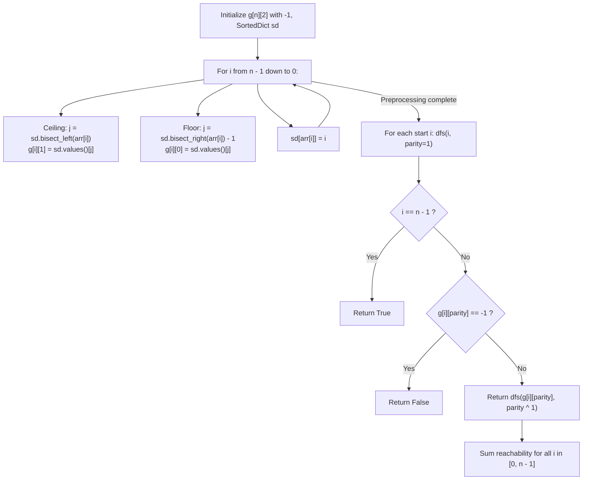

# Guided Example: Odd Even Jump

We trace the step-by-step determinization of odd and even jump destinations via ordered map lookups, prove the Directed Acyclic State Transition Theorem and the Alternating Parity Reachability Invariant, and determine all good starting indices across representative arrays:

- **Representative Instance 1 (Five Elements with Diverging Trajectories):**
  $$
  arr = [10, \; 13, \; 12, \; 14, \; 15], \quad n = 5
  $$
- **Required Output:** `2`
  - Jump rules from index $i$:
    - **Odd jump (Jump 1, 3, 5, ...):** Jump to smallest $arr[j] \ge arr[i]$ with $j > i$. Ties broken by smallest index $j$.
    - **Even jump (Jump 2, 4, 6, ...):** Jump to largest $arr[j] \le arr[i]$ with $j > i$. Ties broken by smallest index $j$.
  - Compute jump destinations $g[i][\text{parity}]$ ($1 = \text{odd}, 0 = \text{even}$) via reverse scan:
    - Index $4$ ($15$): Destination is the target $n - 1 = 4$. (Always good!)
    - Index $3$ ($14$):
      - Odd jump: smallest $\ge 14$ is $15$ at index $4 \implies g[3][1] = 4$.
      - Even jump: largest $\le 14$ is none $\implies g[3][0] = -1$.
    - Index $2$ ($12$):
      - Odd jump: smallest $\ge 12$ is $14$ at index $3 \implies g[2][1] = 3$.
      - Even jump: largest $\le 12$ is none $\implies g[2][0] = -1$.
    - Index $1$ ($13$):
      - Odd jump: smallest $\ge 13$ is $14$ at index $3 \implies g[1][1] = 3$.
      - Even jump: largest $\le 13$ is $12$ at index $2 \implies g[1][0] = 2$.
    - Index $0$ ($10$):
      - Odd jump: smallest $\ge 10$ is $12$ at index $2 \implies g[0][1] = 2$.
      - Even jump: none $\implies g[0][0] = -1$.
  - Simulate paths starting with an **odd jump** ($k = 1$):
    - **Start at index 4:** Already at index $4 \implies$ **Good!** (Count: 1)
    - **Start at index 3:** Odd jump $\to 4$ (Target reached) $\implies$ **Good!** (Count: 2)
    - **Start at index 2:** Odd jump $\to 3$, next is even jump from $3$. But $g[3][0] = -1$ (Blocked!) $\implies$ Bad.
    - **Start at index 1:** Odd jump $\to 3$, next is even jump from $3 \to -1$ (Blocked!) $\implies$ Bad.
    - **Start at index 0:** Odd jump $\to 2$, next is even jump from $2 \to -1$ (Blocked!) $\implies$ Bad.
  - Good starting indices: $\{3, 4\} \implies \mathbf{2}$.

- **Representative Instance 2 (Duplicate Value Ties):**
  $$
  arr = [2, \; 3, \; 1, \; 1, \; 4] \implies \text{good starts at indices } \{1, 3, 4\} \implies \mathbf{3}
  $$

- **Representative Instance 3 (Single Element Array):**
  $$
  arr = [7] \implies \text{index } 0 \text{ is already at end } \implies \mathbf{1}
  $$

---

## 1. Instance & Teaching Goal

Given an integer array `arr`, determine the number of **good starting indices**.
From a start index $i$, we perform alternating jumps starting with Jump 1 (an odd jump):
- **Odd Jump:** Jump to index $j > i$ minimizing $arr[j]$ subject to $arr[j] \ge arr[i]$. If tied, pick minimal $j$.
- **Even Jump:** Jump to index $j > i$ maximizing $arr[j]$ subject to $arr[j] \le arr[i]$. If tied, pick minimal $j$.
A starting index $i$ is good if, following this deterministic alternating path, we eventually reach index $n - 1$.

```text
Jump Graph from arr = [10, 13, 12, 14, 15]:
  Index 0 (10) --[odd]--> Index 2 (12) --[even]--> BLOCKED (-1)
  Index 1 (13) --[odd]--> Index 3 (14) --[even]--> BLOCKED (-1)
  Index 2 (12) --[odd]--> Index 3 (14) --[even]--> BLOCKED (-1)
  Index 3 (14) --[odd]--> Index 4 (15) [TARGET REACHED!]
  Index 4 (15) [TARGET REACHED AT START!]

Good starting indices: {3, 4} -> Total: 2
```

A brute-force forward simulation for each of the $N$ start indices takes $\mathcal{O}(N^2)$ time, failing on $N = 50{,}000$.

The decisive pedagogical goal is the **Monotone Next-Jump Determinism & DAG Reachability Invariant**:
1. **Jump Determinism:** From any index $i$, the odd-jump destination and even-jump destination are uniquely determined by future elements $j > i$.
2. **Reverse Ordered Map Lookups:** Scanning from right to left ($n - 1 \to 0$) while maintaining a `SortedDict` allows binary-searching the ceiling (`bisect_left`) and floor (`bisect_right - 1`) in $\mathcal{O}(\log N)$ time per index.
3. **Cycle-Free DAG Property:** Since every jump strictly advances forward ($j > i$), the state graph of pairs $(i, \text{parity})$ is a Directed Acyclic Graph (DAG), enabling linear $\mathcal{O}(N)$ dynamic programming or memoized depth-first search.

---

## 2. Conceptual Foundation & The Alternating Reachability Invariant



### The Alternating DAG Reachability Theorem

Let $V = \{0, 1, \dots, n-1\} \times \{0, 1\}$ be the set of state pairs $(i, k)$, where $i$ is the current index and $k \in \{0, 1\}$ indicates the parity of the upcoming jump ($1 = \text{odd}, 0 = \text{even}$).
1. **Uniqueness of Jumps:**
   For any state $(i, k)$:
   - If $k = 1$: $j = \arg\min \{j > i : arr[j] \ge arr[i], \text{ minimizing } arr[j], \text{ then } j\}$.
   - If $k = 0$: $j = \arg\min \{j > i : arr[j] \le arr[i], \text{ maximizing } arr[j], \text{ then } j\}$.
   Both selection criteria yield a uniquely defined successor index $j$ or indicate no valid jump exists.
2. **Acyclic Structure:**
   Because every valid jump requires $j > i$, every directed edge $((i, k), (j, k \oplus 1))$ satisfies $j > i$.
   Topological ordering is strictly guaranteed by index value $i$, preventing cycles.
3. **Reachability Recurrence:**
   Let $R(i, k) \in \{\text{True}, \text{False}\}$ denote whether the target $n - 1$ is reachable from $(i, k)$:
   $$
   R(i, k) = \begin{cases}
   \text{True} & \text{if } i = n - 1 \\
   \text{False} & \text{if } g[i][k] = -1 \\
   R(g[i][k], k \oplus 1) & \text{otherwise}
   \end{cases}
   $$
4. **Good Index Counting:**
   A starting index $i$ is good if and only if $R(i, 1) = \text{True}$.
   Total good indices equals $\sum_{i=0}^{n-1} R(i, 1)$. $\blacksquare$

---

## 3. Step-by-Step Worked Execution: Representative Instance 1

$arr = [10, 13, 12, 14, 15], \; n = 5$.

### Phase 1: Reverse Preprocessing of Jump Destinations
1. **$i = 4$ ($arr[4] = 15$):**
   - $sd = \{\}$. Destinations: $g[4][1] = -1, g[4][0] = -1$.
   - Insert: $sd[15] = 4$.
2. **$i = 3$ ($arr[3] = 14$):**
   - $sd = \{15: 4\}$.
   - Ceiling $\ge 14$: key $15 \implies g[3][1] = 4$.
   - Floor $\le 14$: None $\implies g[3][0] = -1$.
   - Insert: $sd[14] = 3 \implies sd = \{14: 3, 15: 4\}$.
3. **$i = 2$ ($arr[2] = 12$):**
   - $sd = \{14: 3, 15: 4\}$.
   - Ceiling $\ge 12$: smallest is $14 \implies g[2][1] = 3$.
   - Floor $\le 12$: None $\implies g[2][0] = -1$.
   - Insert: $sd[12] = 2$.
4. **$i = 1$ ($arr[1] = 13$):**
   - $sd = \{12: 2, 14: 3, 15: 4\}$.
   - Ceiling $\ge 13$: smallest is $14 \implies g[1][1] = 3$.
   - Floor $\le 13$: largest is $12 \implies g[1][0] = 2$.
   - Insert: $sd[13] = 1$.
5. **$i = 0$ ($arr[0] = 10$):**
   - $sd = \{12: 2, 13: 1, 14: 3, 15: 4\}$.
   - Ceiling $\ge 10$: smallest is $12 \implies g[0][1] = 2$.
   - Floor $\le 10$: None $\implies g[0][0] = -1$.

---

### Phase 2: Evaluating Reachability $dfs(i, 1)$
- **$i = 4$:** $i == n - 1 \implies \mathbf{True}$.
- **$i = 3$:** $dfs(3, 1) \to dfs(g[3][1], 0) = dfs(4, 0) \implies \mathbf{True}$.
- **$i = 2$:** $dfs(2, 1) \to dfs(g[2][1], 0) = dfs(3, 0)$. But $g[3][0] = -1 \implies \mathbf{False}$.
- **$i = 1$:** $dfs(1, 1) \to dfs(3, 0) \implies \mathbf{False}$.
- **$i = 0$:** $dfs(0, 1) \to dfs(2, 0)$. But $g[2][0] = -1 \implies \mathbf{False}$.

Total good start indices: $\mathbf{True} + \mathbf{True} = \mathbf{2}$.

---

## 4. State & Reachability Trace Table

| Index $i$ | Value $arr[i]$ | Next Odd Jump $g[i][1]$ | Next Even Jump $g[i][0]$ | $R(i, 1)$ (Odd Start) | $R(i, 0)$ (Even Start) | Good Start? |
|:---:|:---:|:---:|:---:|:---:|:---:|:---:|
| **$4$** | $15$ | — | — | **True** (Base) | **True** (Base) | **Yes** |
| **$3$** | $14$ | $4$ | $-1$ (Blocked) | **True** (via 4) | **False** | **Yes** |
| **$2$** | $12$ | $3$ | $-1$ (Blocked) | **False** (via $R(3, 0)$) | **False** | No |
| **$1$** | $13$ | $3$ | $2$ | **False** (via $R(3, 0)$) | **False** (via $R(2, 1)$) | No |
| **$0$** | $10$ | $2$ | $-1$ (Blocked) | **False** (via $R(2, 0)$) | **False** | No |

---

## 5. Algorithmic Correctness

### Soundness & Completeness
1. **Soundness:**
   Every transition follows the exact rules for odd and even jumps, respecting value bounds and index tie-breaking via `SortedDict`. A start index is marked good only if a complete, alternating path reaches the target index $n - 1$.
2. **Completeness:**
   Because the state graph is a DAG, memoized DFS or backward DP visits every reachable $(i, k)$ state exactly once. No valid path can be missed, and no infinite loops can occur.

---

## 6. Boundary Cases & Traps

| Scenario | Input Pattern | Behavior | Trapped Risk |
|---|---|---|---|
| Single Element | `arr = [7]` | Base condition $i == n - 1$ returns `True`; returns $1$. | Accessing out-of-bounds destinations. |
| Strictly Decreasing | `[4, 3, 2, 1]` | No valid odd jump exists except at end; returns $1$. | Infinite loop on blocked jumps. |
| Strictly Increasing | `[1, 2, 3, 4]` | Odd jump always steps right, but even jump steps back or blocks; returns $2$. | Confusing parity states. |
| Duplicate Values | `[2, 2, 2, 2]` | Ties resolve to smallest future index; returns $n = 4$. | Violating minimal index tie-breaking. |

---

## 7. Complexity Derivation

- **Time Complexity:** $\mathcal{O}(N \log N)$, where $N = \text{len}(arr) \le 50{,}000$.
  - Reverse scan performs $2N$ binary searches in `SortedDict`, taking $\mathcal{O}(N \log N)$.
  - Reachability DFS visits at most $2N$ states with $\mathcal{O}(1)$ work per state $\implies \mathcal{O}(N)$.
  - Total time: $< 0.1\text{ s}$ for $N = 50{,}000$.
- **Auxiliary Space Complexity:** $\mathcal{O}(N)$ to store graph table $g$, `SortedDict`, and memoization cache.
