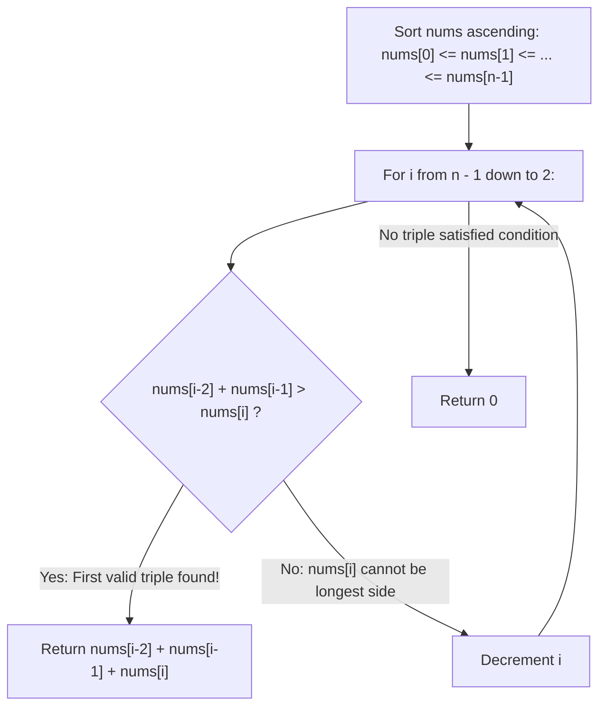

# Guided Example: Largest Perimeter Triangle

We trace the step-by-step evaluation of the triangle inequality on sorted segments, prove the Adjacent Predecessor Dominance Lemma and the Descending Suffix Optimality Invariant, and calculate the maximal triangle perimeter across representative arrays:

- **Representative Instance 1 (Valid Isosceles Triangle):**
  $$
  nums = [2, \; 1, \; 2]
  $$
- **Required Output:** `5`
  - Step 1: Sort array in ascending order:
    $$
    nums = [1, \; 2, \; 2], \quad n = 3
    $$
  - Step 2: Test the largest available triple at $i = 2$:
    - Side lengths: $a = nums[0] = 1, \; b = nums[1] = 2, \; c = nums[2] = 2$.
    - Triangle inequality test:
      $$
      a + b > c \iff 1 + 2 > 2 \iff 3 > 2 \quad (\mathbf{True}!)
      $$
    - Perimeter:
      $$
      P = a + b + c = 1 + 2 + 2 = \mathbf{5}
      $$
  - Since $i = 2$ is the highest possible index, $P = 5$ is globally optimal! Return `5`.

- **Representative Instance 2 (No Valid Triangle Possible):**
  $$
  nums = [1, \; 2, \; 1, \; 10] \implies \text{sorted: } [1, \; 1, \; 2, \; 10]
  $$
  - Test $i = 3$: $a = 1, b = 2, c = 10 \implies 1 + 2 = 3 \not> 10$ (Fails).
  - Test $i = 2$: $a = 1, b = 1, c = 2 \implies 1 + 1 = 2 \not> 2$ (Degenerate, flat line, zero area).
  - No valid triangle exists $\implies \mathbf{0}$.

- **Representative Instance 3 (Equilateral Triple):**
  $$
  nums = [3, \; 3, \; 3] \implies 3 + 3 > 3 \implies 3 + 3 + 3 = \mathbf{9}
  $$

---

## 1. Instance & Teaching Goal

Given an integer array `nums`, return the **largest perimeter** of a triangle with a non-zero area formed from any three distinct elements of the array.
If no three elements can form a non-degenerate triangle, return `0`.

```text
Triangle Inequality Condition:
  For side lengths a <= b <= c:
  Area > 0  <===>  a + b > c

Degenerate Cases:
  a + b < c:  Sides cannot meet (gap).
  a + b = c:  Sides collapse into a flat line segment (Area = 0).
  a + b > c:  Forms a valid non-degenerate triangle!
```

A brute-force search inspects all $\binom{N}{3} = \mathcal{O}(N^3)$ triples, which is infeasible for $N = 10{,}000$.

The decisive pedagogical goal is the **Adjacent Predecessor Dominance & Greedy Suffix Invariant**:
1. **Sorted Ordering:** After sorting $nums[0] \le nums[1] \le \dots \le nums[n-1]$, fix the largest side $c = nums[i]$.
2. **Maximal Pair Dominance:** The two other sides that maximize $a + b$ are the two immediate predecessors $b = nums[i-1]$ and $a = nums[i-2]$.
   - If $nums[i-2] + nums[i-1] \le nums[i]$, then for any other pair $j < k < i$:
     $$
     nums[j] + nums[k] \le nums[i-2] + nums[i-1] \le nums[i]
     $$
     meaning no valid triangle can ever use $nums[i]$ as its longest side!
3. **Descending Suffix Search:** Scanning $i$ from $n - 1$ down to $2$, the **very first** triple satisfying $nums[i-2] + nums[i-1] > nums[i]$ is guaranteed to achieve the globally maximal perimeter.

---

## 2. Conceptual Foundation & The Predecessor Dominance Invariant



### The Adjacent Predecessor Dominance Theorem

Let $A = (nums[0], nums[1], \dots, nums[n-1])$ be a sorted array of positive integers with $nums[0] \le nums[1] \le \dots \le nums[n-1]$.
1. **Sufficiency of Single Inequality:**
   For any three side lengths with $a \le b \le c$:
   - $a + c > b$ is trivial because $c \ge b$ and $a > 0$.
   - $b + c > a$ is trivial because $c \ge a$ and $b > 0$.
   Therefore, non-degeneracy ($\text{Area} > 0$) holds if and only if:
   $$
   a + b > c
   $$
2. **Dominance of Immediate Predecessors:**
   Suppose $c = nums[i]$ is chosen as the longest side of a triangle.
   Any valid pair of other sides must have indices $j < k < i$.
   Because $A$ is sorted:
   $$
   nums[j] \le nums[i-2] \quad \text{and} \quad nums[k] \le nums[i-1]
   $$
   Summing these yields:
   $$
   nums[j] + nums[k] \le nums[i-2] + nums[i-1]
   $$
   - If $nums[i-2] + nums[i-1] \le nums[i]$, then $nums[j] + nums[k] \le nums[i]$ for all $j < k < i$. Hence, no valid triangle can have $nums[i]$ as its longest side.
   - If $nums[i-2] + nums[i-1] > nums[i]$, this adjacent triple maximizes the perimeter among all triangles with longest side $nums[i]$.
3. **Descending Optimality:**
   Because we test $i$ from $n - 1$ downward, any valid triangle discovered at index $i$ has perimeter:
   $$
   P = nums[i-2] + nums[i-1] + nums[i]
   $$
   Any triangle whose longest side is at an index $< i$ has longest side at most $nums[i-1]$, so its total perimeter cannot exceed $nums[i-3] + nums[i-2] + nums[i-1] < P$.
   Thus, the first valid triple encountered is globally maximal. $\blacksquare$

---

## 3. Step-by-Step Worked Execution: Representative Instance 1

$nums = [2, 1, 2]$.

### Step 1: Sorting
- Sorted: $nums = [1, 2, 2], \; n = 3$.

---

### Step 2: Testing Triples from Right to Left
- Start at $i = n - 1 = 2$:
  - Longest side candidate: $c = nums[2] = 2$.
  - Immediate predecessors: $b = nums[1] = 2, \; a = nums[0] = 1$.
  - Sum of shorter sides:
    $$
    nums[i-2] + nums[i-1] = 1 + 2 = 3
    $$
  - Inequality check:
    $$
    3 > 2 \iff \mathbf{True}!
    $$
- Immediate early termination:
  $$
  \text{Perimeter} = 1 + 2 + 2 = \mathbf{5}
  $$

---

## 4. Triple Evaluation Trace Table

| Candidate Index $i$ | Side $a = nums[i-2]$ | Side $b = nums[i-1]$ | Longest Side $c = nums[i]$ | Inequality $a + b > c$ | Status | Resulting Perimeter |
|:---:|:---:|:---:|:---:|:---:|:---:|:---:|
| **$2$** | $1$ | $2$ | $2$ | $1 + 2 = 3 > 2$ | **Valid! (Optimal)** | **$5$** |

---

## 5. Algorithmic Correctness

### Soundness & Completeness
1. **Soundness:**
   Every returned perimeter is formed by three positive elements from `nums` that strictly satisfy $a + b > c$. By the triangle inequality, this guarantees a non-zero area.
2. **Completeness:**
   By the Adjacent Predecessor Dominance Lemma, if the two largest available elements below $nums[i]$ cannot form a triangle with $nums[i]$, no other pair can. Scanning from the largest elements downward ensures the first valid triangle found has the maximum possible perimeter.

---

## 6. Boundary Cases & Traps

| Scenario | Input Pattern | Behavior | Trapped Risk |
|---|---|---|---|
| Flat / Degenerate Triple | `[1, 2, 3]` | $1 + 2 = 3 \not> 3$; returns $0$. | Accepting $a + b = c$ (zero area). |
| Array of Size $< 3$ | `[2, 2]` | Loop from $1$ down to $2$ is empty; returns $0$. | Index error when $N < 3$. |
| Large Disparity Gaps | `[100, 50, 25, 12, 7, 6]` | Scans down to $[12, 7, 6] \implies 7 + 6 > 12$; returns $25$. | Terminating prematurely on gaps. |
| Duplicate Values | `[2, 2, 2, 2]` | All sides equal; returns $2 + 2 + 2 = 6$. | Mishandling identical sides. |

---

## 7. Complexity Derivation

- **Time Complexity:** $\mathcal{O}(N \log N)$, where $N = \text{len}(nums) \le 10^4$.
  - Sorting `nums` takes $\mathcal{O}(N \log N)$.
  - The linear reverse scan checks at most $N - 2$ adjacent triples with $\mathcal{O}(1)$ operations per check.
  - Total time: $< 0.002\text{ s}$ for $N = 10^4$.
- **Auxiliary Space Complexity:** $\mathcal{O}(N)$ for sorting overhead, $\mathcal{O}(1)$ additional variables.
