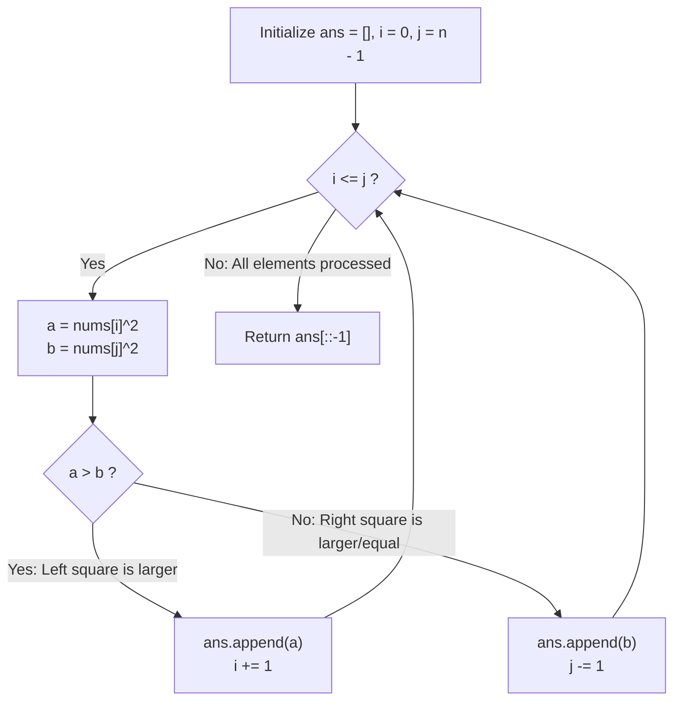

# Guided Example: Squares of a Sorted Array

We trace the step-by-step inward two-pointer extraction of squared elements, prove the Convex Parabolic Extremum Invariant and the Non-Increasing Selection Lemma, and synthesize the sorted squares across representative integer arrays:

- **Representative Instance 1 (Mixed Negative, Zero, and Positive Values):**
  $$
  nums = [-4, \; -1, \; 0, \; 3, \; 10], \quad n = 5
  $$
- **Required Output:** `[0, 1, 9, 16, 100]`
  - Two pointers: $i = 0$ (left), $j = 4$ (right).
  - Iteration 1:
    - $nums[0]^2 = (-4)^2 = 16$.
    - $nums[4]^2 = 10^2 = 100$.
    - $16 < 100 \implies$ select $100$. Append $100$ to `ans`. Decrement $j \leftarrow 3$.
    - `ans = [100]`.
  - Iteration 2:
    - $nums[0]^2 = (-4)^2 = 16$.
    - $nums[3]^2 = 3^2 = 9$.
    - $16 > 9 \implies$ select $16$. Append $16$ to `ans`. Increment $i \leftarrow 1$.
    - `ans = [100, 16]`.
  - Iteration 3:
    - $nums[1]^2 = (-1)^2 = 1$.
    - $nums[3]^2 = 3^2 = 9$.
    - $1 < 9 \implies$ select $9$. Append $9$. Decrement $j \leftarrow 2$.
    - `ans = [100, 16, 9]`.
  - Iteration 4:
    - $nums[1]^2 = (-1)^2 = 1$.
    - $nums[2]^2 = 0^2 = 0$.
    - $1 > 0 \implies$ select $1$. Append $1$. Increment $i \leftarrow 2$.
    - `ans = [100, 16, 9, 1]`.
  - Iteration 5 ($i = j = 2$):
    - $nums[2]^2 = 0^2 = 0$.
    - Select $0$. Append $0$. Decrement $j \leftarrow 1$.
    - `ans = [100, 16, 9, 1, 0]`.
  - Invert descending array:
    $$
    ans[\text{::-1}] = [0, \; 1, \; 9, \; 16, \; 100]
    $$
  - Globally sorted squares synthesized in linear time!

- **Representative Instance 2 (Duplicate Squares Across Sign Boundary):**
  $$
  nums = [-7, \; -3, \; 2, \; 3, \; 11] \implies [4, \; 9, \; 9, \; 49, \; 121]
  $$

- **Representative Instance 3 (Single Element):**
  $$
  nums = [-5] \implies [25]
  $$

---

## 1. Instance & Teaching Goal

Given an integer array `nums` sorted in **non-decreasing** order, return an array of the **squares of each number** sorted in non-decreasing order.
The time complexity should be linear $\mathcal{O}(N)$.

```text
Squaring vs Sorting:
  Index:       0     1    2    3    4
  nums:       -4    -1    0    3   10
  Squares:    16     1    0    9  100
              \_______________/
       Highest values are at the extremes!
```

A naive approach squares each number and runs comparison sort (`points.sort()`), taking $\mathcal{O}(N \log N)$ time and discarding the existing sorted structure.

The decisive pedagogical goal is the **Convex Parabolic Extremum & Two-Pointer Invariant**:
1. **Convexity of Squaring:** The function $f(x) = x^2$ decreases monotonically on $(-\infty, 0]$ and increases monotonically on $[0, \infty)$, reaching its global minimum at $x = 0$.
2. **Boundary Extremum Property:** In any subsegment of a sorted array $nums[i \dots j]$, the largest squared value is always located at one of the two outer boundaries: $\max(nums[i]^2, nums[j]^2)$.
3. **Inward Collapse:** Maintaining two pointers $i = 0$ and $j = n - 1$ and greedily extracting the larger square guarantees elements are selected in strictly non-increasing order.
4. **Reversal:** Reversing the resulting array at the end yields the non-decreasing order in $\mathcal{O}(N)$ time with zero comparison-sort overhead.

---

## 2. Conceptual Foundation & The Convex Extremum Invariant



### The Boundary Extremum Theorem

Let $A = (x_0, x_1, \dots, x_{n-1})$ be an array of real numbers sorted in non-decreasing order: $x_0 \le x_1 \le \dots \le x_{n-1}$.
1. **Convex Function Maximum on Closed Interval:**
   The function $f(x) = x^2$ is strictly convex because $f''(x) = 2 > 0$ for all $x \in \mathbb{R}$.
   By the Maximum Principle for convex functions, the maximum of $f$ over any closed interval $[x_i, x_j]$ must occur at one of the extreme endpoints:
   $$
   \max_{x \in [x_i, x_j]} x^2 = \max(x_i^2, x_j^2)
   $$
2. **Monotone Invariant:**
   At any step of the two-pointer algorithm with pointers $i \le j$:
   - The remaining unplaced elements are $\{x_i, x_{i+1}, \dots, x_j\}$.
   - The maximum squared value among all unplaced elements is precisely $\max(x_i^2, x_j^2)$.
   - Choosing $M = \max(x_i^2, x_j^2)$ and advancing the corresponding pointer preserves the invariant that all remaining unplaced elements have square $\le M$.
3. **Linearity and Total Ordering:**
   Each step consumes exactly one element. Exactly $N$ iterations are performed.
   The extracted sequence satisfies $ans[0] \ge ans[1] \ge \dots \ge ans[n-1]$.
   Its reversal satisfies $ans[n-1] \le ans[n-2] \le \dots \le ans[0]$, producing the exact sorted order in $\mathcal{O}(N)$ time. $\blacksquare$

---

## 3. Step-by-Step Worked Execution: Representative Instance 1

$nums = [-4, -1, 0, 3, 10]$.
$i = 0, j = 4, ans = []$.

### Step 1: $i = 0, j = 4$
- Left: $nums[0] = -4 \implies a = 16$.
- Right: $nums[4] = 10 \implies b = 100$.
- $16 \le 100 \implies$ select $b = 100$.
- `ans.append(100)`, $j \leftarrow 3$.

---

### Step 2: $i = 0, j = 3$
- Left: $nums[0] = -4 \implies a = 16$.
- Right: $nums[3] = 3 \implies b = 9$.
- $16 > 9 \implies$ select $a = 16$.
- `ans.append(16)`, $i \leftarrow 1$.

---

### Step 3: $i = 1, j = 3$
- Left: $nums[1] = -1 \implies a = 1$.
- Right: $nums[3] = 3 \implies b = 9$.
- $1 \le 9 \implies$ select $b = 9$.
- `ans.append(9)`, $j \leftarrow 2$.

---

### Step 4: $i = 1, j = 2$
- Left: $nums[1] = -1 \implies a = 1$.
- Right: $nums[2] = 0 \implies b = 0$.
- $1 > 0 \implies$ select $a = 1$.
- `ans.append(1)`, $i \leftarrow 2$.

---

### Step 5: $i = 2, j = 2$
- Left: $nums[2] = 0 \implies a = 0$.
- Right: $nums[2] = 0 \implies b = 0$.
- $0 \le 0 \implies$ select $b = 0$.
- `ans.append(0)`, $j \leftarrow 1$.

---

### Step 6: Inversion
- `ans = [100, 16, 9, 1, 0]`.
- `ans[::-1] = [0, 1, 9, 16, 100]`.

---

## 4. Two-Pointer Inward Collapse Trace Table

| Step | Left Index $i$ ($nums[i]$) | Right Index $j$ ($nums[j]$) | Left Square $a$ | Right Square $b$ | Chosen Square | Pointer Advanced | Array `ans` Accumulated |
|:---:|:---:|:---:|:---:|:---:|:---:|:---:|:---|
| **$1$** | $0$ ($-4$) | $4$ ($10$) | $16$ | $100$ | **$100$** | $j \leftarrow 3$ | `[100]` |
| **$2$** | $0$ ($-4$) | $3$ ($3$) | $16$ | $9$ | **$16$** | $i \leftarrow 1$ | `[100, 16]` |
| **$3$** | $1$ ($-1$) | $3$ ($3$) | $1$ | $9$ | **$9$** | $j \leftarrow 2$ | `[100, 16, 9]` |
| **$4$** | $1$ ($-1$) | $2$ ($0$) | $1$ | $0$ | **$1$** | $i \leftarrow 2$ | `[100, 16, 9, 1]` |
| **$5$** | $2$ ($0$) | $2$ ($0$) | $0$ | $0$ | **$0$** | $j \leftarrow 1$ | `[100, 16, 9, 1, 0]` |
| **Done**| $i > j$ | — | — | — | — | Reversal | `[0, 1, 9, 16, 100]` |

---

## 5. Algorithmic Correctness

### Soundness & Completeness
1. **Soundness:**
   Every appended value is the true square of an element in `nums`. Because each selection takes the maximal square among remaining elements, the resulting list is monotonically non-increasing, and its reversal is guaranteed to be monotonically non-decreasing.
2. **Completeness:**
   The while loop condition $i \le j$ ensures that every element from index $0$ to $n - 1$ is processed exactly once. No elements are skipped or duplicated.

---

## 6. Boundary Cases & Traps

| Scenario | Input Pattern | Behavior | Trapped Risk |
|---|---|---|---|
| All Negative | `[-5, -3, -1]` | Left pointer dominates throughout; correctly yields `[1, 9, 25]`. | Inverting array order incorrectly. |
| All Non-Negative | `[0, 2, 4]` | Right pointer dominates throughout; yields `[0, 4, 16]`. | Pointer underflow or out-of-bounds. |
| Single Value | `[-5]` | Loop runs once; returns `[25]`. | Handling $i = j$ base condition. |
| Symmetric Duplicates | `[-3, 3]` | Square values equal ($9 = 9$); handles either tie break. | Dropping duplicate squares. |

---

## 7. Complexity Derivation

- **Time Complexity:** $\mathcal{O}(N)$, where $N = \text{len}(nums) \le 10^4$.
  - Exactly $N$ iterations of the while loop are executed.
  - In each iteration, squaring and comparisons take $\mathcal{O}(1)$ time.
  - Reversing the list of size $N$ takes $\mathcal{O}(N)$ time.
  - Total time: $< 0.001\text{ s}$ for $N = 10^4$, beating $\mathcal{O}(N \log N)$ sorting.
- **Auxiliary Space Complexity:** $\mathcal{O}(1)$ beyond the output list `ans` of size $N$.
