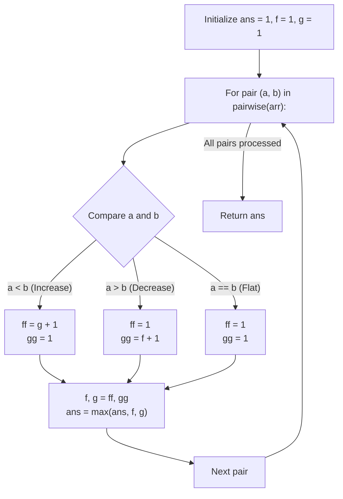

# Guided Example: Longest Turbulent Subarray

We trace the step-by-step dual-state dynamic programming tracking of alternating differences, prove the Sign Inversion Extension Theorem and the Equality Reset Invariant, and determine the maximal turbulent subarray length across representative arrays:

- **Representative Instance 1 (Mixed Fluctuations with Duplicate Break):**
  $$
  arr = [9, \; 4, \; 2, \; 10, \; 7, \; 8, \; 8, \; 1, \; 9], \quad n = 9
  $$
- **Required Output:** `5`
  - Dual-state tracking ending at index $k$:
    - $f$: Length of longest turbulent subarray ending with an **increase** ($arr[k-1] < arr[k]$).
    - $g$: Length of longest turbulent subarray ending with a **decrease** ($arr[k-1] > arr[k]$).
  - Base: For any single element, length is $1$ ($ans = 1, f = 1, g = 1$).
  - Pairwise transitions for $(arr[k-1], arr[k])$:
    1. $(9, 4)$: $9 > 4$ (Decrease)
       - $gg = f + 1 = 1 + 1 = 2$, $ff = 1$.
       - States: $f = 1, g = 2, ans = \max(1, 1, 2) = \mathbf{2}$.
    2. $(4, 2)$: $4 > 2$ (Decrease again, consecutive decreases break turbulence!)
       - $gg = f + 1 = 1 + 1 = 2$, $ff = 1$.
       - States: $f = 1, g = 2, ans = \mathbf{2}$.
    3. $(2, 10)$: $2 < 10$ (Increase, alternates after decrease!)
       - $ff = g + 1 = 2 + 1 = 3$, $gg = 1$.
       - States: $f = 3, g = 1, ans = \max(2, 3, 1) = \mathbf{3}$.
    4. $(10, 7)$: $10 > 7$ (Decrease, alternates after increase!)
       - $gg = f + 1 = 3 + 1 = 4$, $ff = 1$.
       - States: $f = 1, g = 4, ans = \max(3, 1, 4) = \mathbf{4}$.
    5. $(7, 8)$: $7 < 8$ (Increase, alternates after decrease!)
       - $ff = g + 1 = 4 + 1 = \mathbf{5}$, $gg = 1$.
       - Subarray: $[2, 10, 7, 8]$ (indices $2$ to $5$, length $5$).
       - States: $f = 5, g = 1, ans = \max(4, 5, 1) = \mathbf{5}$.
    6. $(8, 8)$: $8 == 8$ (Flat plateau, both strictly positive and negative conditions fail!)
       - $ff = 1, gg = 1$. (Turbulence reset!).
       - States: $f = 1, g = 1, ans = \mathbf{5}$.
    7. $(8, 1)$: $8 > 1$ (Decrease)
       - $gg = f + 1 = 1 + 1 = 2, ff = 1$.
       - States: $f = 1, g = 2, ans = \mathbf{5}$.
    8. $(1, 9)$: $1 < 9$ (Increase)
       - $ff = g + 1 = 2 + 1 = 3, gg = 1$.
       - States: $f = 3, g = 1, ans = \mathbf{5}$.
  - Maximal turbulent length: $\mathbf{5}$.

- **Representative Instance 2 (Monotonically Increasing Array):**
  $$
  arr = [4, \; 8, \; 12, \; 16] \implies \text{consecutive increases reset } g \implies \max(2, 2, 2) = \mathbf{2}
  $$

- **Representative Instance 3 (Single Element Array):**
  $$
  arr = [100] \implies \text{zero pairs to evaluate} \implies ans = \mathbf{1}
  $$

---

## 1. Instance & Teaching Goal

Given an integer array `arr`, return the maximum length of a **turbulent subarray**.
A subarray $arr[i \dots j]$ is turbulent if the comparison signs between adjacent elements strictly alternate:
$$
arr[k] < arr[k+1] > arr[k+2] < arr[k+3] \dots \quad \text{or} \quad arr[k] > arr[k+1] < arr[k+2] > arr[k+3] \dots
$$
Any two consecutive identical elements ($arr[k] == arr[k+1]$) or two consecutive inequalities in the same direction ($<, <$ or $>, >$) terminate the current alternating sequence.

```text
Visualizing Turbulence:
Values:    2 ------> 10 ------> 7 ------> 8
Signs:          <          >         <
Direction:     UP        DOWN       UP    (Alternating! Length = 4)

Broken Turbulence:
Values:    4 ------> 8 ------> 12
Signs:          <          <              (Same direction! Resets to length 2)
```

A brute-force search over all pairs $(i, j)$ tests $\mathcal{O}(N^2)$ candidate intervals.

The decisive pedagogical goal is the **Dual-State Dynamic Programming Invariant**:
- Maintain two running state variables across the stream:
  - $f$: maximum turbulent length ending with an **increase** ($arr[k-1] < arr[k]$).
  - $g$: maximum turbulent length ending with a **decrease** ($arr[k-1] > arr[k]$).
- If $arr[k-1] < arr[k]$: $f$ extends the previous decrease $g + 1$, while $g$ resets to $1$.
- If $arr[k-1] > arr[k]$: $g$ extends the previous increase $f + 1$, while $f$ resets to $1$.
- If $arr[k-1] == arr[k]$: both $f$ and $g$ reset to $1$.
- Tracks the global maximum in $\mathcal{O}(N)$ time and $\mathcal{O}(1)$ auxiliary memory.

---

## 2. Conceptual Foundation & The Dual-State Transition Invariant



### The Dual-State Alternation Theorem

Let $A = (x_0, x_1, \dots, x_{n-1})$ be an array of length $n$.
1. **Definition of Valid Extension:**
   A turbulent subarray ending at $k - 1$ with a downward step ($x_{k-2} > x_{k-1}$) can be extended by $x_k$ if and only if $x_{k-1} < x_k$.
   The resulting subarray has length $g_{k-1} + 1$, and ends with an upward step.
2. **Exclusivity and Reset:**
   - If $x_{k-1} < x_k$, it cannot extend an upward step ($x_{k-2} < x_{k-1}$). Any subarray ending with a downward step at $k$ is empty, meaning the longest turbulent subarray ending at $k$ with a decrease consists only of the single element $x_k$ (length $1$).
   - If $x_{k-1} = x_k$, no comparison sign alternates. Neither upward nor downward extension is legal, so both states collapse to length $1$.
3. **Optimality and Completeness:**
   At each step $k$, $f_k$ and $g_k$ store the strictly optimal lengths of turbulent subarrays ending at index $k$ under the respective terminal direction.
   Taking $\max_{k} \{f_k, g_k\}$ over the full array exhaustively evaluates all maximal valid subarrays in $\mathcal{O}(N)$ time. $\blacksquare$

---

## 3. Step-by-Step Worked Execution: Representative Instance 1

$arr = [9, 4, 2, 10, 7, 8, 8, 1, 9]$.
Initialize: $ans = 1, f = 1, g = 1$.

### Pairwise DP Transitions
1. **$(9, 4)$:** $9 > 4$
   - $ff = 1$, $gg = f + 1 = 1 + 1 = 2$.
   - $f = 1, g = 2, ans = \max(1, 1, 2) = \mathbf{2}$.
2. **$(4, 2)$:** $4 > 2$
   - $ff = 1$, $gg = f + 1 = 1 + 1 = 2$.
   - $f = 1, g = 2, ans = \mathbf{2}$.
3. **$(2, 10)$:** $2 < 10$
   - $ff = g + 1 = 2 + 1 = 3$, $gg = 1$.
   - $f = 3, g = 1, ans = \max(2, 3, 1) = \mathbf{3}$.
4. **$(10, 7)$:** $10 > 7$
   - $ff = 1$, $gg = f + 1 = 3 + 1 = 4$.
   - $f = 1, g = 4, ans = \max(3, 1, 4) = \mathbf{4}$.
5. **$(7, 8)$:** $7 < 8$
   - $ff = g + 1 = 4 + 1 = 5$, $gg = 1$.
   - $f = 5, g = 1, ans = \max(4, 5, 1) = \mathbf{5}$.
6. **$(8, 8)$:** $8 == 8$
   - $ff = 1, gg = 1$.
   - $f = 1, g = 1, ans = \mathbf{5}$.
7. **$(8, 1)$:** $8 > 1$
   - $ff = 1, gg = f + 1 = 1 + 1 = 2$.
   - $f = 1, g = 2, ans = \mathbf{5}$.
8. **$(1, 9)$:** $1 < 9$
   - $ff = g + 1 = 2 + 1 = 3$, $gg = 1$.
   - $f = 3, g = 1, ans = \mathbf{5}$.

Final answer: $\mathbf{5}$.

---

## 4. Dual-State Evolution Trace Table

| Transition Step | Pair $(a, b)$ | Relation | Next $f$ (Increase) | Next $g$ (Decrease) | Active Window State | Cumulative Max `ans` |
|:---:|:---:|:---:|:---:|:---:|:---|:---:|
| **Init** | — | — | $1$ | $1$ | Single element | $1$ |
| **$1$** | $(9, 4)$ | $9 > 4$ | $1$ | $1 + 1 = 2$ | $[9, 4]$ (Down) | $2$ |
| **$2$** | $(4, 2)$ | $4 > 2$ | $1$ | $1 + 1 = 2$ | $[4, 2]$ (Down) | $2$ |
| **$3$** | $(2, 10)$| $2 < 10$| $2 + 1 = 3$ | $1$ | $[4, 2, 10]$ (Down, Up) | $3$ |
| **$4$** | $(10, 7)$| $10 > 7$| $1$ | $3 + 1 = 4$ | $[2, 10, 7]$ (Up, Down) | $4$ |
| **$5$** | $(7, 8)$ | $7 < 8$ | $4 + 1 = \mathbf{5}$ | $1$ | $[2, 10, 7, 8]$ (Up, Down, Up) | **$5$** |
| **$6$** | $(8, 8)$ | $8 == 8$| $1$ | $1$ | Flat (Reset) | $5$ |
| **$7$** | $(8, 1)$ | $8 > 1$ | $1$ | $1 + 1 = 2$ | $[8, 1]$ (Down) | $5$ |
| **$8$** | $(1, 9)$ | $1 < 9$ | $2 + 1 = 3$ | $1$ | $[8, 1, 9]$ (Down, Up) | $5$ |

---

## 5. Algorithmic Correctness

### Soundness & Completeness
1. **Soundness:**
   Every length reported by $f$ or $g$ corresponds to a contiguous subsegment with strictly alternating signs. When equal adjacent elements occur, both states collapse to $1$, preventing non-turbulent flat segments from inflating the score.
2. **Completeness:**
   Since every possible ending position $k$ and terminal sign orientation is maintained and evaluated against `ans`, the maximal turbulent subarray across the entire array cannot be overlooked.

---

## 6. Boundary Cases & Traps

| Scenario | Input Pattern | Behavior | Trapped Risk |
|---|---|---|---|
| Single Element | `[100]` | Loop does not execute; returns $ans = 1$. | Out-of-bounds indexing on length 1. |
| All Equal Elements | `[4, 4, 4]` | $a == b$ forces $f = 1, g = 1$ throughout; returns $1$. | Returning $2$ on flat pairs. |
| Strictly Increasing | `[1, 2, 3, 4]` | $g$ never extends; $f$ stays at $2$; returns $2$. | Allowing non-alternating runs. |
| Strictly Decreasing | `[9, 7, 5, 3]` | $f$ never extends; $g$ stays at $2$; returns $2$. | Allowing consecutive downward slopes. |

---

## 7. Complexity Derivation

- **Time Complexity:** $\mathcal{O}(N)$, where $N = \text{len}(arr) \le 40{,}000$.
  - Single forward pass across $N - 1$ adjacent pairs.
  - Constant-time arithmetic and max comparisons per pair.
  - Total time: $< 0.003\text{ s}$ for $N = 40{,}000$.
- **Auxiliary Space Complexity:** $\mathcal{O}(1)$ auxiliary memory; only state variables `ans, f, g` are stored.
