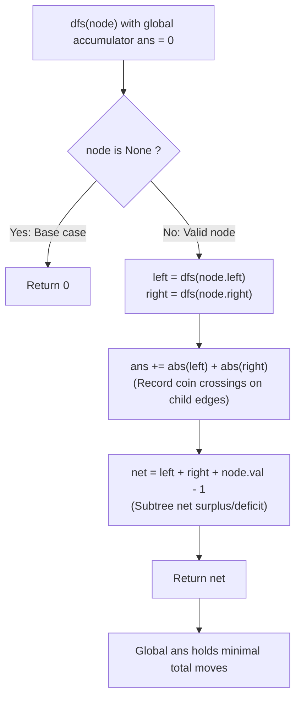

# Guided Example: Distribute Coins in Binary Tree

We trace the step-by-step post-order calculation of subtree net coin balances, prove the Tree Bridge Flow Conservation Lemma and the Absolute Flow Accumulation Invariant, and determine the minimal coin movements across representative trees:

- **Representative Instance 1 (Root Distributes to Both Children):**
  $$
  root = [3, \; 0, \; 0]
  $$
- **Required Output:** `2`
  - Tree topology:
    ```text
            (3) Root
           /   \
      (0) L     (0) R
    ```
  - Subtree net balance definition:
    $$
    \text{balance}(u) = \text{balance}(u.left) + \text{balance}(u.right) + (u.val - 1)
    $$
  - Post-order evaluation:
    1. Left child $L$ ($val = 0$):
       - Both children are null (balance 0).
       - $\text{balance}(L) = 0 + 0 + (0 - 1) = \mathbf{-1}$.
       - Deficit of $1$ coin: $1$ coin must cross edge $(L, \text{Root})$ from Root to $L$.
       - Moves added: $|-1| = \mathbf{1}$.
    2. Right child $R$ ($val = 0$):
       - $\text{balance}(R) = 0 + 0 + (0 - 1) = \mathbf{-1}$.
       - Moves added: $|-1| = \mathbf{1}$.
    3. Root ($val = 3$):
       - Receives left balance $-1$ and right balance $-1$.
       - $\text{balance}(\text{Root}) = -1 + -1 + (3 - 1) = 0$.
       - Net tree balance is $0$ (conserved!).
  - Total coin moves: $1 + 1 = \mathbf{2}$.

- **Representative Instance 2 (Left Child Transits to Sibling via Root):**
  $$
  root = [0, \; 3, \; 0]
  $$
  - Left child has $3$ coins $\implies \text{balance}(L) = 3 - 1 = \mathbf{+2}$.
    - Surplus of $2$ coins must cross $(L, \text{Root})$ upward: $|+2| = 2$ moves.
  - Right child has $0$ coins $\implies \text{balance}(R) = 0 - 1 = \mathbf{-1}$.
    - Deficit of $1$ coin must cross $(\text{Root}, R)$ downward: $|-1| = 1$ move.
  - Root balance: $+2 + (-1) + (0 - 1) = 0$.
  - Total moves: $2 + 1 = \mathbf{3}$.

- **Representative Instance 3 (Single Balanced Node):**
  $$
  root = [1] \implies \text{balance} = 0 \implies \mathbf{0} \text{ moves}
  $$

---

## 1. Instance & Teaching Goal

Given the `root` of a binary tree with $n$ nodes, where each node contains `node.val` coins and the sum of coins across all nodes is exactly $n$, return the **minimum number of moves** to make every node have exactly $1$ coin.
In one move, a single coin is transferred between two adjacent nodes connected by an edge.

```text
Coin Flow Conservation:
      [Parent]
         ^
         |  Flow = |balance(u)| moves
         |
        (u)   Subtree T_u has C coins and N nodes
       /   \  Net balance = C - N
      L     R
```

Attempting to track the exact path of individual coins greedily or globally creates a complex combinatorial matching problem.

The decisive pedagogical goal is the **Subtree Net Balance & Unique Tree Bridge Invariant**:
1. **Unique Edge Cut:** In any tree, removing the edge $(u, p(u))$ divides the tree into two disjoint components: the subtree $T_u$ and the rest of the tree.
2. **Net Flow Conservation:** Subtree $T_u$ contains $C(T_u) = \sum_{v \in T_u} v.val$ coins and $|T_u|$ nodes.
   Because each of its nodes must ultimately hold $1$ coin, the net balance is:
   $$
   \text{balance}(u) = C(T_u) - |T_u|
   $$
   - If $\text{balance}(u) > 0$, exactly that many surplus coins **must** exit $T_u$ through edge $(u, p(u))$.
   - If $\text{balance}(u) < 0$, exactly that many deficit coins **must** enter $T_u$ through edge $(u, p(u))$.
3. **Absolute Summation:** The minimum moves required across edge $(u, p(u))$ is precisely $|\text{balance}(u)|$. Summing $|\text{balance}(v)|$ over all non-root nodes gives the globally minimal move count in a single $\mathcal{O}(N)$ post-order pass.

---

## 2. Conceptual Foundation & The Flow Conservation Invariant



### The Tree Flow Conservation Theorem

Let $T = (V, E)$ be a binary tree where $|V| = n$, with coin assignments $\text{val}: V \to \mathbb{Z}_{\ge 0}$ such that $\sum_{v \in V} \text{val}(v) = n$.
1. **Edge Cut Disconnection:**
   For any non-root node $u$, the single edge $e_u = (u, p(u))$ is a cut-edge whose removal creates two disconnected components: $T_u$ and $V \setminus T_u$.
2. **Mandatory Net Flow:**
   In any sequence of valid moves that results in each node having exactly $1$ coin, the net coin flux across $e_u$ from $T_u$ to $p(u)$ must equal the net coin surplus of $T_u$:
   $$
   \text{flux}(e_u) = \sum_{v \in T_u} (\text{val}(v) - 1) = \text{balance}(u)
   $$
3. **Minimality of Absolute Flow:**
   Because each move transfers $1$ coin across $1$ edge in $1$ direction, the total number of coin crossings over $e_u$ is lower-bounded by $|\text{flux}(e_u)| = |\text{balance}(u)|$:
   $$
   \text{moves}(e_u) \ge |\text{balance}(u)|
   $$
4. **Global Exact Bound:**
   Because a tree is bipartite and acyclic, there is zero cancellation of flow across distinct edges. Total moves is exactly:
   $$
   \text{Total Moves} = \sum_{u \ne \text{root}} |\text{balance}(u)|
   $$
   Post-order traversal computes $\text{balance}(u) = \text{balance}(u.left) + \text{balance}(u.right) + \text{val}(u) - 1$ and accumulates $|\text{balance}(u.left)| + |\text{balance}(u.right)|$, achieving this exact theoretical minimum. $\blacksquare$

---

## 3. Step-by-Step Worked Execution: Representative Instance 1

Tree: $root = [3, 0, 0]$.
Nodes: $N_0$ (root, val 3), $N_1$ (left child, val 0), $N_2$ (right child, val 0).
Initialize: $ans = 0$.

### Post-Order Recursion
1. **Visit Leaf $N_1$ (Left Child):**
   - Children are null $\implies left = 0, right = 0$.
   - Flow from child edges: $|0| + |0| = 0 \implies ans += 0$.
   - Net balance: $0 + 0 + (0 - 1) = \mathbf{-1}$.
   - Return $-1$ to parent $N_0$.
2. **Visit Leaf $N_2$ (Right Child):**
   - Children are null $\implies left = 0, right = 0$.
   - Flow from child edges: $|0| + |0| = 0 \implies ans += 0$.
   - Net balance: $0 + 0 + (0 - 1) = \mathbf{-1}$.
   - Return $-1$ to parent $N_0$.
3. **Visit Root $N_0$:**
   - Left subtree balance: $left = -1$.
   - Right subtree balance: $right = -1$.
   - Accumulate edge flows:
     $$
     ans += |-1| + |-1| = 1 + 1 = \mathbf{2}
     $$
   - Net root balance: $-1 + -1 + (3 - 1) = -2 + 2 = 0$.
   - Return $0$.

### Final Result
$$
ans = \mathbf{2}
$$

---

## 4. Subtree Coin Balance Trace Table

| Node Visited | Node Coins `val` | Left Subtree Balance | Right Subtree Balance | Absolute Flow Added | Net Balance Emitted | Subtree Meaning |
|:---:|:---:|:---:|:---:|:---:|:---:|:---|
| **$N_1$ (Left)** | $0$ | $0$ | $0$ | $0$ | $\mathbf{-1}$ | Needs 1 coin from parent |
| **$N_2$ (Right)**| $0$ | $0$ | $0$ | $0$ | $\mathbf{-1}$ | Needs 1 coin from parent |
| **$N_0$ (Root)** | $3$ | $-1$ | $-1$ | $\lvert -1 \rvert + \lvert -1 \rvert = \mathbf{2}$ | $\mathbf{0}$ | Conserves global coin count |

---

## 5. Algorithmic Correctness

### Soundness & Completeness
1. **Soundness:**
   Every unit of flow counted in `ans` represents an unavoidable coin transfer across an edge connecting a component with non-zero net balance to the rest of the tree. No invalid or redundant moves are generated.
2. **Completeness:**
   Since a tree has no cycles, any valid coin redistribution must satisfy flow conservation across every cut edge. The post-order accumulation sums the exact minimum required transfers across all $N - 1$ edges, ensuring the global minimum is achieved.

---

## 6. Boundary Cases & Traps

| Scenario | Input Pattern | Behavior | Trapped Risk |
|---|---|---|---|
| Single Node | `root = [1]` | Children are null; $0 + (1 - 1) = 0 \implies ans = 0$. | Unnecessary move counting. |
| Surplus at Deep Leaf | `[0, 0, null, 4]` | Surplus propagates up the branch; each step adds $\lvert +3 \rvert = 3$. | Forgetting multi-hop transfer costs. |
| Already Balanced Tree | `[1, 1, 1]` | All net balances are $0 \implies ans = 0$. | Spurious non-zero moves. |
| Skewed Chain | Vertical line | Balances propagate linearly along chain; correctly sums absolute flows. | Stack overflow or missing parent edge. |

---

## 7. Complexity Derivation

- **Time Complexity:** $\mathcal{O}(N)$, where $N$ is the number of nodes in the tree ($N \le 100$).
  - Post-order traversal visits each node exactly once.
  - At each node, computing the net balance and updating `ans` takes $\mathcal{O}(1)$ arithmetic operations.
  - Total time: $< 0.001\text{ s}$.
- **Auxiliary Space Complexity:** $\mathcal{O}(H)$, where $H$ is the height of the tree ($H \le N$), representing call stack depth.
