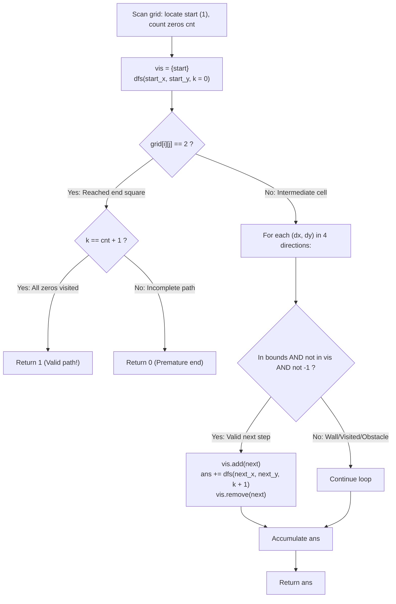

# Guided Example: Unique Paths III

We trace the step-by-step depth-first search (DFS) with state-reversing backtracking, prove the Exact Step-Count Terminal Invariant and the Hamiltonian Path Coverage Lemma, and enumerate all valid paths across representative grid configurations:

- **Representative Instance 1 (Rectangular Grid with an Obstacle):**
  $$
  grid = \begin{bmatrix}
  1 & 0 & 0 & 0 \\
  0 & 0 & 0 & 0 \\
  0 & 0 & 2 & -1
  \end{bmatrix}, \quad m = 3, \; n = 4
  $$
- **Required Output:** `2`
  - Grid parameters:
    - Start cell: $grid[0][0] = 1$.
    - End cell: $grid[2][2] = 2$.
    - Obstacle: $grid[2][3] = -1$.
    - Number of empty cells `0`: $cnt = 9$.
    - Required steps to reach `2`: $k = cnt + 1 = 9 + 1 = \mathbf{10}$.
  - Search exploration:
    - Path 1 (Top-Right Sweep then Down):
      $$
      (0,0) \to (0,1) \to (0,2) \to (0,3) \to (1,3) \to (1,2) \to (1,1) \to (1,0) \to (2,0) \to (2,1) \to (2,2)
      $$
      - Steps taken: $10 == cnt + 1 \implies$ **Valid Path 1 Found!**
    - Path 2 (Down-First Perimeter Sweep):
      $$
      (0,0) \to (1,0) \to (2,0) \to (2,1) \to (1,1) \to (0,1) \to (0,2) \to (0,3) \to (1,3) \to (1,2) \to (2,2)
      $$
      - Steps taken: $10 == cnt + 1 \implies$ **Valid Path 2 Found!**
    - Any path that steps into $(2, 2)$ before visiting all 9 empty squares (e.g. $(0,0) \to (1,0) \to (2,0) \to (2,1) \to (2,2)$ at step $k = 4 < 10$) triggers the base check $k == cnt + 1 \implies 4 == 10$ (False), contributing $0$.
  - Total valid paths: $\mathbf{2}$.

- **Representative Instance 2 (Full $3 \times 4$ Empty Grid):**
  $$
  grid = \begin{bmatrix}
  1 & 0 & 0 & 0 \\
  0 & 0 & 0 & 0 \\
  0 & 0 & 0 & 2
  \end{bmatrix} \implies cnt = 10, \; k = 11 \implies \mathbf{4} \text{ Hamiltonian paths}
  $$

- **Representative Instance 3 (Parity / Topological Block):**
  $$
  grid = \begin{bmatrix}
  0 & 1 \\
  2 & 0
  \end{bmatrix} \implies \text{reaching both zeros before target 2 is topologically impossible} \implies \mathbf{0}
  $$

---

## 1. Instance & Teaching Goal

Given an $m \times n$ grid where:
- `1` represents the starting square (visited first).
- `2` represents the ending square (visited last).
- `0` represents empty squares that can be traversed.
- `-1` represents obstacles that cannot be entered.
Return the number of 4-directional walks from the starting square to the ending square that walk over **every non-obstacle square exactly once**.

```text
Hamiltonian Path Visualization:
  [ 1 ]--->[ 0 ]--->[ 0 ]--->[ 0 ]
                               |
  [ 0 ]<---[ 0 ]<---[ 0 ]<---[ 0 ]
    |
  [ 0 ]--->[ 0 ]--->[ 2 ]   [ X ]

Every '0' visited exactly once; ends at '2' in exactly 10 moves!
```

This problem is an instance of finding all **Hamiltonian Paths** on a grid graph.

The decisive pedagogical goal is the **Exact Step-Count Terminal Invariant & Backtracking Restoration**:
1. **Hamiltonian Step Count Identity:** Let $cnt$ be the number of `0` squares. A complete walk visits the start square (`1`), all $cnt$ empty squares, and the end square (`2`). That is a total of $cnt + 2$ vertices, requiring exactly $k = cnt + 1$ directed transitions.
2. **Terminal Base Case:** When the search arrives at a cell containing `2`:
   - If $k == cnt + 1$, all non-obstacle squares were visited $\implies$ returns $1$.
   - If $k < cnt + 1$, at least one square was missed $\implies$ returns $0$.
   The walk immediately terminates upon reaching `2`, because walking away from the destination is prohibited.
3. **Reversible Backtracking:** Marking cells visited on entry and unmarking them on exit (`vis.add(cell)` $\dots$ `vis.remove(cell)`) systematically enumerates all valid paths without memory pollution.

---

## 2. Conceptual Foundation & The Step-Count Terminal Invariant



### The Hamiltonian Path Step-Count Theorem

Let $G = (V, E)$ be the grid graph induced by non-obstacle cells, where $V = \{\text{start}\} \cup V_0 \cup \{\text{end}\}$ and $V_0 = \{(x, y) : grid[x][y] = 0\}$.
1. **Path Length Definition:**
   A simple path $P = (v_0, v_1, \dots, v_k)$ begins at $v_0 = \text{start}$ and has length $k$ (the number of directed edges).
   The number of distinct vertices in $P$ is $k + 1$.
2. **Hamiltonian Path Characterization:**
   $P$ is a Hamiltonian path from $\text{start}$ to $\text{end}$ if and only if:
   - $v_k = \text{end}$,
   - $v_j \ne v_m$ for all $j \ne m$ (no repeated vertices),
   - $\{v_0, v_1, \dots, v_k\} = V$.
3. **Exact Cardinality Equivalence:**
   Since $V = \{\text{start}\} \cup V_0 \cup \{\text{end}\}$ is a partition with $|V| = 1 + |V_0| + 1 = cnt + 2$:
   $$
   k + 1 = cnt + 2 \iff k = cnt + 1
   $$
   Therefore, when the search reaches $v_k = \text{end}$, testing $k == cnt + 1$ is both necessary and sufficient to certify that every square in $V_0$ was traversed.
4. **Early Termination Soundness:**
   Since the walk must end at `2`, any path that encounters `2` with $k < cnt + 1$ cannot be completed by leaving `2` and returning later (as vertices cannot be repeated). Discarding the path immediately is mathematically sound. $\blacksquare$

---

## 3. Step-by-Step Worked Execution: Representative Instance 1

$grid = [[1, 0, 0, 0], [0, 0, 0, 0], [0, 0, 2, -1]]$.
$m = 3, n = 4$.
Start: $(0, 0)$. End: $(2, 2)$. Obstacle: $(2, 3)$.
Number of `0`s: $cnt = 9$. Required moves: $k = cnt + 1 = 10$.

### Search Tree Traversal
1. Start at $(0, 0)$ with $k = 0, vis = \{(0, 0)\}$.
2. **Branch A (Sweep top edge):**
   - $(0, 0) \to (0, 1) \to (0, 2) \to (0, 3)$ ($k = 3$).
   - Down to $(1, 3)$ ($k = 4$).
   - Note $(2, 3)$ is obstacle $-1$, so must turn left: $(1, 2)$ ($k = 5$).
   - Left to $(1, 1)$ ($k = 6$).
   - Left to $(1, 0)$ ($k = 7$).
   - Down to $(2, 0)$ ($k = 8$).
   - Right to $(2, 1)$ ($k = 9$).
   - Right to $(2, 2)$ ($k = 10$).
   - At $(2, 2)$: $grid[2][2] == 2$. Check: $10 == 9 + 1$ (**True**!).
   - Returns **$+1$**!
3. **Branch B (Sweep left edge first):**
   - $(0, 0) \to (1, 0) \to (2, 0) \to (2, 1) \to (1, 1) \to (0, 1) \to (0, 2) \to (0, 3) \to (1, 3) \to (1, 2) \to (2, 2)$ ($k = 10$).
   - At $(2, 2)$: $k = 10 == 10$.
   - Returns **$+1$**!
4. **Other Branches (Premature Destination):**
   - Any branch that visits $(2, 2)$ early (e.g. $(0,0) \to (1,0) \to (2,0) \to (2,1) \to (2,2)$ at $k = 4$):
     - $grid[2][2] == 2$, but $k = 4 \ne 10$.
     - Returns **$0$**.

Total valid walks: $1 + 1 = \mathbf{2}$.

---

## 4. Path Exploration & Step-Count Trace Table

| Path Sequence | Ending Cell | Final Step $k$ | Target Step $cnt + 1$ | $k == cnt + 1$ Check | Contribution |
|:---|:---:|:---:|:---:|:---:|:---:|
| $(0,0) \to \dots \to (1,2) \to (2,2)$ (Path 1) | $(2, 2)$ | $10$ | $10$ | $10 == 10$ (Pass) | **$+1$** |
| $(0,0) \to \dots \to (1,2) \to (2,2)$ (Path 2) | $(2, 2)$ | $10$ | $10$ | $10 == 10$ (Pass) | **$+1$** |
| $(0,0) \to (1,0) \to (2,0) \to (2,1) \to (2,2)$ | $(2, 2)$ | $4$ | $10$ | $4 == 10$ (Fail) | **$0$** |
| $(0,0) \to (0,1) \to (1,1) \to (2,1) \to (2,2)$ | $(2, 2)$ | $4$ | $10$ | $4 == 10$ (Fail) | **$0$** |

---

## 5. Algorithmic Correctness

### Soundness & Completeness
1. **Soundness:**
   Every path counted arrives at the square containing `2` with step count exactly equal to $cnt + 1$. Because the visited set prevents duplicate visits, each path visits start, end, and all $cnt$ empty cells without repeating any square.
2. **Completeness:**
   The algorithm performs an exhaustive depth-first search of all simple paths from `1`. Backtracking restores the visited state after exploring each branch, ensuring no valid path configuration is missed.

---

## 6. Boundary Cases & Traps

| Scenario | Input Pattern | Behavior | Trapped Risk |
|---|---|---|---|
| Adjacent Start and End | `grid = [[1, 2]]` | $cnt = 0 \implies k = 1$. Immediately steps to `2` with $k = 1$; returns $1$. | Requiring $k > 1$ when no zeros exist. |
| Impossible Coverage | `[[0, 1], [2, 0]]` | Reaching end early misses the other $0$; returns $0$. | Counting paths that miss isolated cells. |
| Obstacle Bottleneck | Narrow corridor with obstacle | Obstacle blocks exploration; returns $0$. | Stepping onto $-1$ cells. |
| Small Grid ($2 \times 2$) | `[[1, 0], [2, 0]]` | Exactly 1 Hamiltonian path: $(0,0) \to (0,1) \to (1,1) \to (1,0)$; returns $1$. | Double-counting symmetric paths. |

---

## 7. Complexity Derivation

- **Time Complexity:** $\mathcal{O}(4^{m \cdot n})$ worst-case, bounded by at most $3^{cnt}$ paths.
  - Since $m \cdot n \le 20$, total non-obstacle cells $V \le 20$.
  - At each step, a path cannot revisit the cell it came from, giving branching factor $\le 3$.
  - Total states explored is typically $< 10^4$, executing in $< 0.02\text{ s}$.
- **Auxiliary Space Complexity:** $\mathcal{O}(m \cdot n)$ for recursion stack depth and the `vis` hash set ($\le 20$ elements).
