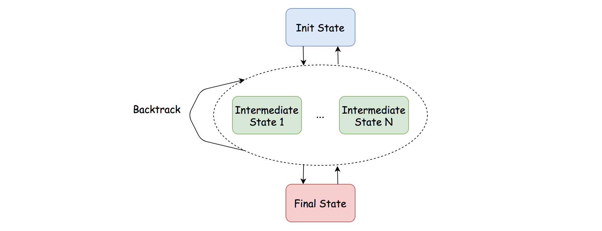

## Solution

---
### Overview

Whenever we see the context of grid traversal, the technique of backtracking or DFS (Depth-First Search) should ring a bell.

In terms of this problem, it fits the bill perfectly, with a _canonical_ setting, unlike another similar problem called [robot room cleaner](https://leetcode.com/problems/robot-room-cleaner/) which has certain twists.

>As a reminder, [backtracking](https://en.wikipedia.org/wiki/Backtracking) is a _general_ algorithm for finding all (or some) solutions to some problems with constraints.
It incrementally builds candidates to the solutions, and abandons a candidate as soon as it determines that the candidate cannot possibly lead to a solution.

In this article, we will showcase how to apply the backtracking algorithm to solve this problem.

---
### Approach 1: Backtracking

**Intuition**

We can consider backtracking as a state machine, where we start off from an initial state, each action we take will move the state from one to another, and there should be some final state where we reach our goal.

As a result, let us first clarify the initial and the final states of the problem.

- **Initial State**

- There are different types of squares/cells in a grid.

- There are an origin and a destination cell, which are not given explicitly.

- Initially, all the cells are not **_visited_**.

- **Final State**

- We reach the destination cell, _i.e._ cell filled with the value `2`.

- We have visited all the non-obstacle cells, including the empty cells (_i.e._ filled with `0`) and the initial cell (_i.e._ `1`).

>With the above definition, we can then translate the problem as finding all paths that can lead us from the initial state to the final state.



More specifically, we could summarise the steps to implement the backtracking algorithm for this problem in the following pseudo code.

```python

    def backtrack(cell):
1. if we arrive at the final state:
             path_count ++
             return

2. mark the current cell as visited

3. for next_cell in 4 directions:
             if next_cell is not visited and non-obstacle:
                 backtrack(next_cell)

4. unmark the current cell
```


**Algorithm**

As one can see, backtracking is more of a methodology to solve a specific type of problems.
For a backtracking problem, it would not be exaggerating to say that there are a thousand backtracking implementations in a thousand people's eyes, as one would find out in the implementation later.

Here we would simply show one example of implementation, following the pseudo code shown in the intuition section.

```python
class Solution:
    def uniquePathsIII(self, grid: List[List[int]]) -> int:
        rows, cols = len(grid), len(grid[0])

        # step 1). initialize the conditions for backtracking
        #   i.e. initial state and final state
        non_obstacles = 0
        start_row, start_col = 0, 0
        for row in range(0, rows):
            for col in range(0, cols):
                cell = grid[row][col]
                if  cell >= 0:
                    non_obstacles += 1
                if cell == 1:
                    start_row, start_col = row, col

        # count of paths as the final result
        path_count = 0

        # step 2). backtrack on the grid
        def backtrack(row, col, remain):
            # we need to modify this external variable
            nonlocal path_count

            # base case for the termination of backtracking
            if grid[row][col] == 2 and remain == 1:
                # reach the destination
                path_count += 1
                return

            # mark the square as visited. case: 0, 1, 2
            temp = grid[row][col]
            grid[row][col] = -4
            remain -= 1   # we now have one less square to visit

            # explore the 4 potential directions around
            for ro, co in [(0, 1), (0, -1), (1, 0), (-1, 0)]:
                next_row, next_col = row + ro, col + co

                if not (0 <= next_row < rows and 0 <= next_col < cols):
                    # invalid coordinate
                    continue
                if grid[next_row][next_col] < 0:
                    # either obstacle or visited square
                    continue

                backtrack(next_row, next_col, remain)

            # unmark the square after the visit
            grid[row][col] = temp

        backtrack(start_row, start_col, non_obstacles)

        return path_count
```

Here we would like to highlight some important design decisions we took in the above implementation.
As one can imagine, with different decisions, one would have variations of backtracking implementations.

- **In-place Modification**

- This is an important technique that allows us to save some space in the algorithm.

- In order to mark the cell as **_visited_**, often the case we use some matrix or hashtable with boolean values to keep track of the state of each cell, _i.e._ whether it is visited or not.

- With the in-place technique, we simply assign a _specific_ value to the cell in the grid, rather than creating an additional matrix or hashtable.

- **Boundary Check**

- There are several boundary conditions that we could check during the backtracking, namely whether the coordinate of a cell is _valid_ or not and whether the current cell is _visited_ or not.

- We could do the checking right before we make the recursive call, or at the beginning of the `backtrack` function.

- We decided to go with the former one, which could save us some recursive calls when the boundary check does not pass.

**Complexity Analysis**

Let $N$ be the total number of cells in the input grid.

- Time Complexity: $\mathcal{O}(3^N)$

- Although technically we have 4 directions to explore at each step, we have *at most* 3 directions to try at any moment except the first step.
    The last direction is the direction where we came from, therefore we don't need to explore it, since we have been there before.

- In the worst case where none of the cells is an obstacle, we have to explore each cell.
    Hence, the time complexity of the algorithm is $\mathcal{O}(4 * 3 ^{(N-1)}) = \mathcal{O}(3^N)$.

- Space Complexity: $\mathcal{O}(N)$

- Thanks to the in-place technique, we did not use any additional memory to keep track of the state.

- On the other hand, we apply recursion in the algorithm, which could incur $\mathcal{O}(N)$ space in the function call stack.

- Hence, the overall space complexity of the algorithm is $\mathcal{O}(N)$.

---