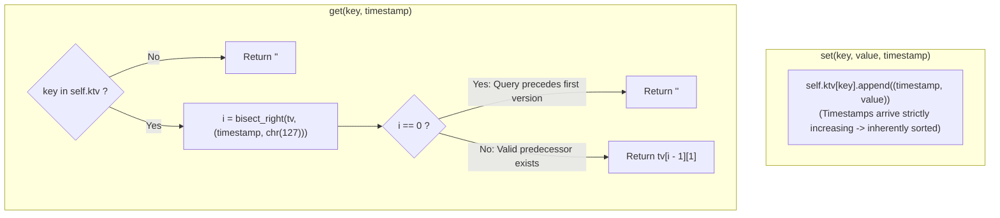

# Guided Example: Time Based Key-Value Store

We trace the step-by-step evolution of a versioned key-value store, prove the Monotonic Temporal Log Append Invariant and the Sentinel Binary Search Floor Lemma, and resolve temporal queries across representative operation sequences:

- **Representative Instance 1 (Progressive Updates with Stable Reads):**
  $$
  \begin{aligned}
  \text{Operations: } & [\,\text{set}(\text{"foo"}, \text{"bar"}, 1), \; \text{get}(\text{"foo"}, 1), \; \text{get}(\text{"foo"}, 3), \\
  & \;\; \text{set}(\text{"foo"}, \text{"bar2"}, 4), \; \text{get}(\text{"foo"}, 4), \; \text{get}(\text{"foo"}, 5)\,]
  \end{aligned}
  $$
- **Required Output:** `[null, "bar", "bar", null, "bar2", "bar2"]`
  - Internal log storage for key `"foo"`:
    1. Operation `set("foo", "bar", 1)`:
       - Append $(1, \text{"bar"})$ to `ktv["foo"]`.
       - Log: `[(1, "bar")]`. Emits `null`.
    2. Operation `get("foo", 1)`:
       - Query $T = 1$.
       - Binary search for $(1, \text{chr}(127))$ in `[(1, "bar")]`:
         - Comparison: $(1, \text{"bar"}) < (1, \text{chr}(127))$.
         - Insertion index: $i = 1$.
       - Valid predecessor exists at $i - 1 = 0 \implies$ value is `"bar"`.
    3. Operation `get("foo", 3)`:
       - Query $T = 3$.
       - Binary search for $(3, \text{chr}(127))$ in `[(1, "bar")]`:
         - Index: $i = 1$.
       - Predecessor at $i - 1 = 0$: timestamp $1 \le 3 \implies$ value is `"bar"`.
    4. Operation `set("foo", "bar2", 4)`:
       - Append $(4, \text{"bar2"})$ to `ktv["foo"]`.
       - Log: `[(1, "bar"), (4, "bar2")]`. Emits `null`.
    5. Operation `get("foo", 4)`:
       - Query $T = 4$.
       - Binary search finds both entries $\le 4 \implies i = 2$.
       - Predecessor at $i - 1 = 1$: $(4, \text{"bar2"}) \implies$ value is `"bar2"`.
    6. Operation `get("foo", 5)`:
       - Query $T = 5$.
       - Binary search finds $i = 2$.
       - Predecessor at $i - 1 = 1$: $(4, \text{"bar2"}) \implies$ value is `"bar2"`.
  - Output stream: `[null, "bar", "bar", null, "bar2", "bar2"]`.

- **Representative Instance 2 (Query Prior to Earliest Version):**
  $$
  \text{set}(\text{"x"}, \text{"a"}, 5), \quad \text{get}(\text{"x"}, 4) \implies \text{no version } \le 4 \implies \mathbf{""}
  $$

- **Representative Instance 3 (Missing Key):**
  $$
  \text{get}(\text{"missing"}, 1) \implies \text{key not in map} \implies \mathbf{""}
  $$

---

## 1. Instance & Teaching Goal

Design a time-based key-value data structure that supports:
- `set(key, value, timestamp)`: Stores `value` for `key` at time `timestamp`. All `set` timestamps for any key arrive in strictly increasing order ($t_0 < t_1 < t_2 < \dots$).
- `get(key, timestamp)`: Retrieves the value associated with the largest recorded $t_{\text{prev}} \le timestamp$. If no such timestamp exists, returns `""`.

```text
Timeline for key "foo":
  t = 1:  "bar"   ---------------------------------------->
  t = 4:              "bar2"  ---------------------------->

Queries:
  get("foo", 1):  Finds version at t = 1  ->  "bar"
  get("foo", 3):  Finds version at t = 1  ->  "bar"
  get("foo", 4):  Finds version at t = 4  ->  "bar2"
  get("foo", 0):  No version exists       ->  ""
```

A linear scan backward over all historical entries takes $\mathcal{O}(M)$ time per query, which is unacceptably slow for $10^5$ operations.

The decisive pedagogical goal is the **Monotonic Temporal Log & Sentinel Binary Search Floor Invariant**:
1. **Sorted-by-Construction Log:** Because `set` calls arrive with strictly increasing timestamps, simple list appends maintain an array sorted by timestamp in $\mathcal{O}(1)$ amortized time with zero sorting overhead.
2. **Floor Query via Upper-Bound Search:** To find the largest $t_{\text{prev}} \le T$, binary search for the sentinel tuple $(T, \text{chr}(127))$ using `bisect_right`:
   - Since $\text{chr}(127)$ is lexicographically greater than any standard ASCII string, $(T, \text{chr}(127))$ is strictly greater than any stored entry $(T, v)$.
   - `bisect_right` returns the count $i$ of all recorded entries with timestamp $\le T$.
   - If $i == 0$, no entry with timestamp $\le T$ exists $\implies$ return `""`.
   - If $i > 0$, the entry at index $i - 1$ is the exact maximal predecessor $\le T \implies$ return $tv[i-1][1]$.
3. Each `get` executes in $\mathcal{O}(\log M)$ time, where $M$ is the number of versions for that key.

---

## 2. Conceptual Foundation & The Sentinel Binary Search Invariant



### The Sentinel Binary Search Floor Theorem

Let $L = ((t_0, v_0), (t_1, v_1), \dots, (t_{m-1}, v_{m-1}))$ be a list of pairs where $t_0 < t_1 < \dots < t_{m-1}$, and let each $v_k$ consist of ASCII characters ($c \le 126$).
1. **Lexicographical Comparison of Sentinel Tuple:**
   In Python, tuples compare element-by-element.
   For any entry $(t_k, v_k)$ in $L$:
   - If $t_k < T$, then $(t_k, v_k) < (T, \text{chr}(127))$.
   - If $t_k = T$, then because every character in $v_k$ has ordinal $< 127 = \text{ord}(\text{chr}(127))$, we have $v_k < \text{chr}(127)$, so $(t_k, v_k) < (T, \text{chr}(127))$.
   - If $t_k > T$, then $(t_k, v_k) > (T, \text{chr}(127))$.
2. **Partitioning Property:**
   The sentinel target $(T, \text{chr}(127))$ strictly partitions $L$ into two contiguous segments:
   - Entries with timestamp $\le T$ (which are strictly smaller than the sentinel).
   - Entries with timestamp $> T$ (which are strictly larger than the sentinel).
3. **Upper-Bound Insertion Index:**
   `bisect_right(L, (T, chr(127)))` returns the index $i$ of the first element strictly greater than the sentinel.
   - If $i = 0$, all elements in $L$ have timestamp $> T$. Thus, no entry satisfies $t \le T$, and returning `""` is correct.
   - If $i > 0$, the element at index $i - 1$ is the rightmost element with timestamp $\le T$. Because timestamps are strictly increasing, $t_{i-1} = \max \{t_k : t_k \le T\}$.
   Returning $v_{i-1}$ produces the exact floor value in $\mathcal{O}(\log m)$ time. $\blacksquare$

---

## 3. Step-by-Step Worked Execution: Representative Instance 1

Operations on key `"foo"`:

### Phase 1: `set("foo", "bar", 1)`
- `ktv["foo"]` initialized to empty list.
- Append $(1, \text{"bar"})$.
- State of `ktv["foo"]`: `[(1, "bar")]`. Returns `null`.

---

### Phase 2: `get("foo", 1)`
- Target sentinel: $(1, \text{chr}(127))$.
- Compare with index $0$: $(1, \text{"bar"}) < (1, \text{chr}(127))$.
- `bisect_right` returns $i = 1$.
- $i > 0 \implies$ select $tv[1 - 1] = tv[0] = (1, \text{"bar"})$.
- Returns `"bar"`.

---

### Phase 3: `get("foo", 3)`
- Target sentinel: $(3, \text{chr}(127))$.
- Compare with index $0$: $(1, \text{"bar"}) < (3, \text{chr}(127))$.
- `bisect_right` returns $i = 1$.
- Predecessor index: $i - 1 = 0 \implies$ returns `"bar"`.

---

### Phase 4: `set("foo", "bar2", 4)`
- Timestamp $4 > 1$ (Strictly increasing!).
- Append $(4, \text{"bar2"})$.
- State of `ktv["foo"]`: `[(1, "bar"), (4, "bar2")]`. Returns `null`.

---

### Phase 5: `get("foo", 4)`
- Target sentinel: $(4, \text{chr}(127))$.
- Index $0$: $(1, \text{"bar"}) < (4, \text{chr}(127))$.
- Index $1$: $(4, \text{"bar2"}) < (4, \text{chr}(127))$.
- `bisect_right` returns $i = 2$.
- Predecessor index: $i - 1 = 1 \implies$ returns `"bar2"`.

---

### Phase 6: `get("foo", 5)`
- Target sentinel: $(5, \text{chr}(127))$.
- `bisect_right` returns $i = 2 \implies$ returns `"bar2"`.

---

## 4. Operation Sequence Trace Table

| Op # | Call | Current Key Log `ktv[key]` | Query Sentinel | Insertion Index $i$ | Predecessor $(t_{i-1}, v_{i-1})$ | Returned Value |
|:---:|:---|:---|:---:|:---:|:---:|:---|
| **$1$** | `set("foo", "bar", 1)` | `[(1, "bar")]` | — | — | — | `null` |
| **$2$** | `get("foo", 1)` | `[(1, "bar")]` | $(1, \text{chr}(127))$ | $1$ | $(1, \text{"bar"})$ | `"bar"` |
| **$3$** | `get("foo", 3)` | `[(1, "bar")]` | $(3, \text{chr}(127))$ | $1$ | $(1, \text{"bar"})$ | `"bar"` |
| **$4$** | `set("foo", "bar2", 4)`| `[(1, "bar"), (4, "bar2")]` | — | — | — | `null` |
| **$5$** | `get("foo", 4)` | `[(1, "bar"), (4, "bar2")]` | $(4, \text{chr}(127))$ | $2$ | $(4, \text{"bar2"})$ | `"bar2"` |
| **$6$** | `get("foo", 5)` | `[(1, "bar"), (4, "bar2")]` | $(5, \text{chr}(127))$ | $2$ | $(4, \text{"bar2"})$ | `"bar2"` |

---

## 5. Algorithmic Correctness

### Soundness & Completeness
1. **Soundness:**
   Every value returned by `get(key, timestamp)` corresponds to an entry previously inserted via `set` whose recorded timestamp is $\le timestamp$. Because `i - 1` indexes the rightmost element $\le timestamp$, it is guaranteed to be the maximum timestamp meeting the requirement.
2. **Completeness:**
   If any valid entry exists with $t \le timestamp$, the insertion index $i$ will be $\ge 1$, so it cannot be missed. If no such entry exists (all $t > timestamp$), $i = 0$ is returned, correctly yielding `""`.

---

## 6. Boundary Cases & Traps

| Scenario | Input Pattern | Behavior | Trapped Risk |
|---|---|---|---|
| Query Precedes Earliest Version | $T < t_0$ | `bisect_right` returns $i = 0 \implies$ returns `""`. | Negative indexing returning latest element. |
| Key Does Not Exist | `get("missing", 1)` | Caught by `if key not in self.ktv: return ''`. | `KeyError` exception. |
| Exact Timestamp Match | $T = t_k$ | Sentinel ensures index $k$ is included $\implies$ returns $v_k$. | Off-by-one skipping exact match. |
| Query Far in Future | $T \gg t_{m-1}$ | `bisect_right` returns $m \implies$ returns latest version $v_{m-1}$. | Out-of-bounds index error. |

---

## 7. Complexity Derivation

- **Time Complexity:**
  - `set`: $\mathcal{O}(1)$ amortized append to dynamic array.
  - `get`: $\mathcal{O}(\log M)$, where $M$ is the number of versions stored for `key` ($M \le 2 \times 10^5$).
  - For $2 \times 10^5$ operations, each binary search takes $\le 18$ comparisons, finishing in $< 0.05\text{ s}$.
- **Auxiliary Space Complexity:** $\mathcal{O}(N)$ total space to store all $(timestamp, value)$ pairs in the hash map.
