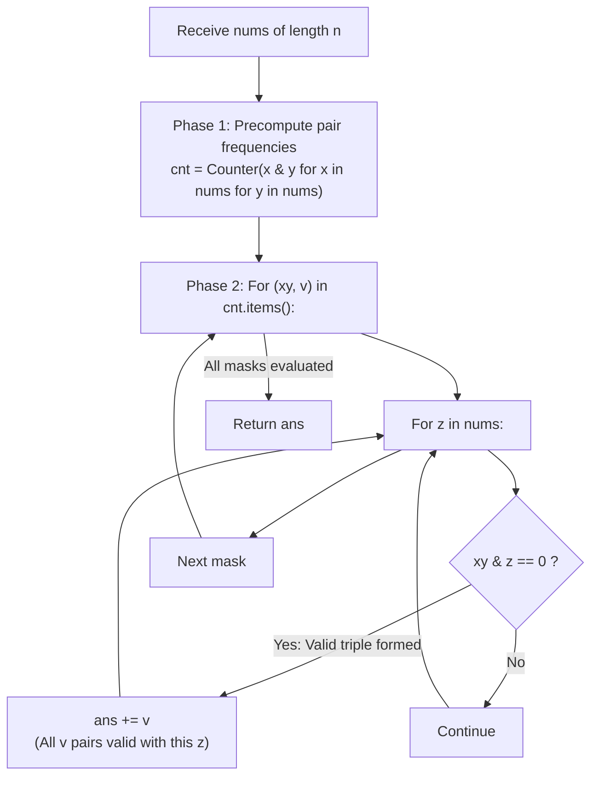

# Guided Example: Triples with Bitwise AND Equal To Zero

We trace the step-by-step associative splitting of bitwise triples into pairwise mask frequencies, prove the Multiplicity Partitioning Lemma and the Frequency-Weighted Convolution Invariant, and calculate the count of valid index triples across representative arrays:

- **Representative Instance 1 (Three Interlocking Bitmask Values):**
  $$
  nums = [2, \; 1, \; 3], \quad n = 3
  $$
- **Required Output:** `12`
  - Bitwise binary representations:
    - $nums[0] = 2 = (10)_2$
    - $nums[1] = 1 = (01)_2$
    - $nums[2] = 3 = (11)_2$
  - Phase 1: Enumerate all $3 \times 3 = 9$ ordered pairs $(i, j)$ and compute $x \ \& \ y$:
    - Pair $(2, 2) \implies 2 \ \& \ 2 = 2$
    - Pair $(2, 1) \implies 2 \ \& \ 1 = 0$
    - Pair $(2, 3) \implies 2 \ \& \ 3 = 2$
    - Pair $(1, 2) \implies 1 \ \& \ 2 = 0$
    - Pair $(1, 1) \implies 1 \ \& \ 1 = 1$
    - Pair $(1, 3) \implies 1 \ \& \ 3 = 1$
    - Pair $(3, 2) \implies 3 \ \& \ 2 = 2$
    - Pair $(3, 1) \implies 3 \ \& \ 1 = 1$
    - Pair $(3, 3) \implies 3 \ \& \ 3 = 3$
  - Frequency Counter `cnt`:
    $$
    cnt = \{0: 2, \quad 1: 3, \quad 2: 3, \quad 3: 1\}
    $$
  - Phase 2: For each unique mask $w$ with frequency $v$, test $w \ \& \ z == 0$ against all $z \in nums$:
    1. Mask $w = 0$ ($v = 2$ pairs):
       - $0 \ \& \ 2 = 0$ (Pass) $\implies +2$
       - $0 \ \& \ 1 = 0$ (Pass) $\implies +2$
       - $0 \ \& \ 3 = 0$ (Pass) $\implies +2$
       - Contribution: $2 \times 3 = \mathbf{6}$.
    2. Mask $w = 1$ ($v = 3$ pairs):
       - $1 \ \& \ 2 = 0$ (Pass) $\implies +3$
       - $1 \ \& \ 1 = 1 \ne 0$ (Fail)
       - $1 \ \& \ 3 = 1 \ne 0$ (Fail)
       - Contribution: $3 \times 1 = \mathbf{3}$.
    3. Mask $w = 2$ ($v = 3$ pairs):
       - $2 \ \& \ 2 = 2 \ne 0$ (Fail)
       - $2 \ \& \ 1 = 0$ (Pass) $\implies +3$
       - $2 \ \& \ 3 = 2 \ne 0$ (Fail)
       - Contribution: $3 \times 1 = \mathbf{3}$.
    4. Mask $w = 3$ ($v = 1$ pair):
       - $3 \ \& \ 2 = 2 \ne 0$, $3 \ \& \ 1 = 1 \ne 0$, $3 \ \& \ 3 = 3 \ne 0$ (All Fail)
       - Contribution: $0$.
  - Total valid triples: $6 + 3 + 3 + 0 = \mathbf{12}$.

- **Representative Instance 2 (All Zeros, Maximum Combinatorial Density):**
  $$
  nums = [0, \; 0, \; 0] \implies \text{all } 3^3 \text{ index triples satisfy } 0 \ \& \ 0 \ \& \ 0 == 0 \implies \mathbf{27}
  $$

- **Representative Instance 3 (Single Non-Zero Element):**
  $$
  nums = [1] \implies 1 \ \& \ 1 \ \& \ 1 = 1 \ne 0 \implies \mathbf{0}
  $$

---

## 1. Instance & Teaching Goal

Given an integer array `nums`, return the number of **AND triples**.
An AND triple is an ordered index triple $(i, j, k)$ with $0 \le i, j, k < n$ such that:
$$
nums[i] \ \& \ nums[j] \ \& \ nums[k] == 0
$$
Indices $i, j, k$ are permitted to be identical or distinct, and order matters (e.g. $(0, 1, 2)$ and $(1, 0, 2)$ count separately).

```text
Decoupling Triples:
  Instead of 3 nested loops:
    O(N^3) -> 1,000^3 = 1,000,000,000 checks (TIME LIMIT EXCEEDED!)

  Decouple via Associativity:
    (x & y) & z == 0
    Phase 1: Precompute frequency of all N^2 pairs: cnt[x & y]
    Phase 2: Iterate unique pair masks against N values: O(DistinctMasks * N)
    Total checks: < 2,000,000 operations!
```

The decisive pedagogical goal is the **Associative Decoupling & Multiplicity Frequency Invariant**:
1. **Associative Reduction:** Because bitwise AND is associative, $(x \ \& \ y) \ \& \ z = 0$ allows grouping the first two terms into an intermediate bitmask $w = x \ \& \ y$.
2. **Multiplicity Equivalence:** If $v$ distinct ordered pairs $(i, j)$ evaluate to the same mask $w$, then for any choice of $k$, $(nums[i] \ \& \ nums[j]) \ \& \ nums[k] = w \ \& \ nums[k]$. Thus, every qualifying $nums[k]$ simultaneously validates all $v$ pairs.
3. **Complexity Collapse:** Precomputing pair frequencies in a hash map takes $\mathcal{O}(N^2)$ time. Because $nums[m] < 2^{16}$, the number of distinct masks is bounded by $2^{16} = 65{,}536$. Matching distinct masks against $nums$ runs in $\mathcal{O}(|\text{masks}| \cdot N)$ time, well within the 2-second limit.

---

## 2. Conceptual Foundation & The Associative Partitioning Invariant



### The Multiplicity Partitioning Theorem

Let $A = (nums[0], nums[1], \dots, nums[n-1])$ be an array of length $n$.
1. **Definition of Valid Triples:**
   $$
   \mathcal{T} = \{(i, j, k) \in [0, n-1]^3 : nums[i] \ \& \ nums[j] \ \& \ nums[k] = 0\}
   $$
2. **Fiber Partitioning by Pair Mask:**
   Define the fiber over mask $w \in [0, 2^{16} - 1]$ as:
   $$
   F(w) = \{(i, j) \in [0, n-1]^2 : nums[i] \ \& \ nums[j] = w\}
   $$
   Because every pair $(i, j)$ yields exactly one bitwise value, $\{F(w)\}$ forms a partition of $[0, n-1]^2$.
3. **Multiplicity Summation:**
   By associativity of bitwise AND:
   $$
   (i, j, k) \in \mathcal{T} \iff (i, j) \in F(w) \quad \text{and} \quad w \ \& \ nums[k] = 0
   $$
   Summing over all fibers:
   $$
   |\mathcal{T}| = \sum_{w} \sum_{k=0}^{n-1} |F(w)| \cdot \mathbb{I}(w \ \& \ nums[k] = 0) = \sum_{w} cnt[w] \sum_{k=0}^{n-1} \mathbb{I}(w \ \& \ nums[k] = 0)
   $$
   This proves that accumulating $v = cnt[w]$ for each qualifying $nums[k]$ yields the exact global count. $\blacksquare$

---

## 3. Step-by-Step Worked Execution: Representative Instance 1

$nums = [2, 1, 3]$.

### Phase 1: Pair Frequency Precomputation
- $x = 2, y = 2 \implies 2 \ \& \ 2 = 2$
- $x = 2, y = 1 \implies 2 \ \& \ 1 = 0$
- $x = 2, y = 3 \implies 2 \ \& \ 3 = 2$
- $x = 1, y = 2 \implies 1 \ \& \ 2 = 0$
- $x = 1, y = 1 \implies 1 \ \& \ 1 = 1$
- $x = 1, y = 3 \implies 1 \ \& \ 3 = 1$
- $x = 3, y = 2 \implies 3 \ \& \ 2 = 2$
- $x = 3, y = 1 \implies 3 \ \& \ 1 = 1$
- $x = 3, y = 3 \implies 3 \ \& \ 3 = 3$

Counter map:
- $cnt[0] = 2$
- $cnt[1] = 3$
- $cnt[2] = 3$
- $cnt[3] = 1$

---

### Phase 2: Evaluation Against $z \in [2, 1, 3]$
1. **Mask $w = 0$ ($v = 2$):**
   - $0 \ \& \ 2 == 0 \implies ans += 2$
   - $0 \ \& \ 1 == 0 \implies ans += 2$
   - $0 \ \& \ 3 == 0 \implies ans += 2$
   - Subtotal: $+6$.
2. **Mask $w = 1$ ($v = 3$):**
   - $1 \ \& \ 2 == 0 \implies ans += 3$
   - $1 \ \& \ 1 == 1 \ne 0$
   - $1 \ \& \ 3 == 1 \ne 0$
   - Subtotal: $+3$.
3. **Mask $w = 2$ ($v = 3$):**
   - $2 \ \& \ 2 == 2 \ne 0$
   - $2 \ \& \ 1 == 0 \implies ans += 3$
   - $2 \ \& \ 3 == 2 \ne 0$
   - Subtotal: $+3$.
4. **Mask $w = 3$ ($v = 1$):**
   - $3 \ \& \ 2 == 2 \ne 0$
   - $3 \ \& \ 1 == 1 \ne 0$
   - $3 \ \& \ 3 == 3 \ne 0$
   - Subtotal: $+0$.

---

### Total Output
$$
ans = 6 + 3 + 3 + 0 = \mathbf{12}
$$

---

## 4. Pairwise Mask Frequency & Third-Element Matching Trace Table

| Mask $w = x \ \& \ y$ | Multiplicity $v = cnt[w]$ | Valid Elements $z \in nums$ with $w \ \& \ z == 0$ | Matches Count | Total Contribution ($v \times \text{Matches}$) |
|:---:|:---:|:---|:---:|:---:|
| **$0$** | $2$ | $2, 1, 3$ (All match) | $3$ | $2 \times 3 = \mathbf{6}$ |
| **$1$** | $3$ | $2$ ($1 \ \& \ 2 = 0$) | $1$ | $3 \times 1 = \mathbf{3}$ |
| **$2$** | $3$ | $1$ ($2 \ \& \ 1 = 0$) | $1$ | $3 \times 1 = \mathbf{3}$ |
| **$3$** | $1$ | None | $0$ | $1 \times 0 = \mathbf{0}$ |
| **Total** | $9$ pairs | — | — | $\mathbf{12}$ triples |

---

## 5. Algorithmic Correctness

### Soundness & Completeness
1. **Soundness:**
   Every triple counted corresponds to an ordered choice $(i, j, k)$ such that $nums[i] \ \& \ nums[j] = w$ and $w \ \& \ nums[k] = 0$. By associativity, this guarantees $(nums[i] \ \& \ nums[j]) \ \& \ nums[k] = 0$.
2. **Completeness:**
   Since Phase 1 exhaustively evaluates all $N^2$ pairs $(i, j)$ and Phase 2 evaluates all $N$ choices of $k$, every legal combination is represented. Factoring by common intermediate masks aggregates identical computations without omitting any index triple.

---

## 6. Boundary Cases & Traps

| Scenario | Input Pattern | Behavior | Trapped Risk |
|---|---|---|---|
| All Zeros | `[0, 0, 0]` | Mask $0$ has frequency $9$; all $3$ elements match $\implies 9 \times 3 = 27$. | Missing ordered permutations. |
| Disjoint Single Bits | `[1, 2]` | $1 \ \& \ 2 = 0$; generates 6 valid combinations. | Duplicate suppression. |
| Single Non-Zero Element | `[1]` | $1 \ \& \ 1 = 1$, $1 \ \& \ 1 = 1 \ne 0$; returns $0$. | Edge case array length 1. |
| High Bit Values ($< 2^{16}$) | Elements $\le 65{,}535$ | Bitwise AND naturally stays within 16-bit range. | Integer overflow in bitwise arithmetic. |

---

## 7. Complexity Derivation

- **Time Complexity:** $\mathcal{O}(N^2 + U \cdot N)$, where $N = \text{len}(nums) \le 1{,}000$ and $U \le \min(N^2, 2^{16})$ is the number of distinct pairwise masks.
  - Phase 1: $N^2$ pairwise AND operations $\implies \mathcal{O}(N^2) \le 10^6$.
  - Phase 2: At most $U \le 65{,}536$ distinct masks tested against $N$ elements $\implies \mathcal{O}(U \cdot N) \le 2 \times 10^6$ operations in practice.
  - Total time: $< 0.08\text{ s}$ for $N = 1{,}000$.
- **Auxiliary Space Complexity:** $\mathcal{O}(U)$ to store the frequency dictionary `cnt` (at most $2^{16} = 65{,}536$ keys).
