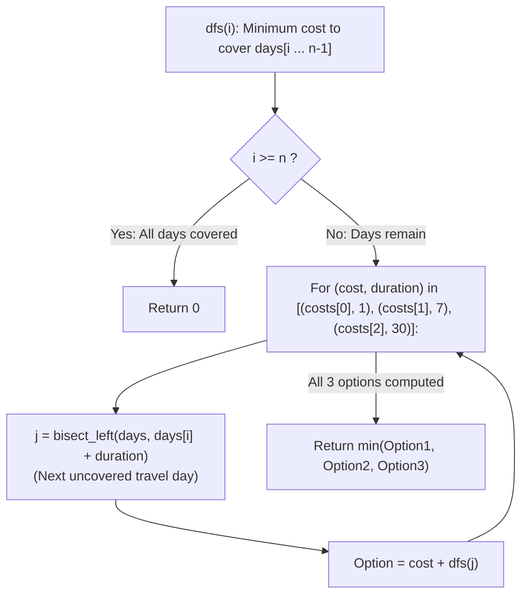

# Guided Example: Minimum Cost For Tickets

We trace the step-by-step dynamic programming evaluation of travel pass coverage intervals, prove the Pass Window Alignment Lemma and the Binary Search Jump Invariant, and determine the minimal ticket expenditures across representative travel calendars:

- **Representative Instance 1 (Mixed Clustered and Isolated Travel Days):**
  $$
  days = [1, \; 4, \; 6, \; 7, \; 8, \; 20], \quad costs = [2, \; 7, \; 15] \quad (\text{Pass durations: } 1, \; 7, \; 30 \text{ days})
  $$
- **Required Output:** `11`
  - Recurrence formulation:
    $$
    dfs(i) = \min_{(c, v)} \{c + dfs(\text{bisect\_left}(days, days[i] + v))\}
    $$
  - Base case: $i \ge 6 \implies dfs(i) = 0$.
  - Post-order / reverse evaluation:
    1. **$i = 5$ ($days[5] = 20$):**
       - 1-day pass: $2 + dfs(6) = 2 + 0 = \mathbf{2}$.
       - 7-day pass: $7 + dfs(6) = 7 + 0 = 7$.
       - 30-day pass: $15 + dfs(6) = 15 + 0 = 15$.
       - $dfs(5) = \min(2, 7, 15) = \mathbf{2}$.
    2. **$i = 4$ ($days[4] = 8$):**
       - 1-day pass ($8+1=9$): next is $days[5]=20 \implies 2 + dfs(5) = 2 + 2 = \mathbf{4}$.
       - 7-day pass ($8+7=15$): next is $days[5]=20 \implies 7 + dfs(5) = 7 + 2 = 9$.
       - 30-day pass ($8+30=38$): covers to end $\implies 15 + 0 = 15$.
       - $dfs(4) = \min(4, 9, 15) = \mathbf{4}$.
    3. **$i = 3$ ($days[3] = 7$):**
       - 1-day ($7+1=8$): next is $days[4]=8 \implies 2 + dfs(4) = 2 + 4 = 6$.
       - 7-day ($7+7=14$): next is $days[5]=20 \implies 7 + dfs(5) = 7 + 2 = 9$.
       - $dfs(3) = \min(6, 9, 15) = \mathbf{6}$.
    4. **$i = 2$ ($days[2] = 6$):**
       - 1-day: $2 + dfs(3) = 2 + 6 = 8$.
       - 7-day ($6+7=13$): next is $days[5]=20 \implies 7 + dfs(5) = 7 + 2 = 9$.
       - $dfs(2) = \min(8, 9, 15) = \mathbf{8}$.
    5. **$i = 1$ ($days[1] = 4$):**
       - 1-day: $2 + dfs(2) = 2 + 8 = 10$.
       - 7-day ($4+7=11$): next is $days[5]=20 \implies 7 + dfs(5) = 7 + 2 = 9$.
       - $dfs(1) = \min(10, 9, 15) = \mathbf{9}$.
    6. **$i = 0$ ($days[0] = 1$):**
       - 1-day pass ($1+1=2$): next is $days[1]=4 \implies 2 + dfs(1) = 2 + 9 = 11$.
       - 7-day pass ($1+7=8$): next is $days[4]=8 \implies 7 + dfs(4) = 7 + 4 = \mathbf{11}$.
       - 30-day pass ($1+30=31$): covers to end $\implies 15 + 0 = 15$.
       - $dfs(0) = \min(11, 11, 15) = \mathbf{11}$.
  - Minimal expenditure: $\mathbf{11}$ (e.g. 7-day pass on days $1 \dots 7$, plus 1-day pass on day 8, plus 1-day pass on day 20 $\implies 7 + 2 + 2 = 11$).

- **Representative Instance 2 (Monthly Pass Dominance):**
  $$
  days = [1, 2, 3, 4, 5, 6, 7, 8, 9, 10, 30, 31], \quad costs = [2, 7, 15]
  $$
  - 30-day pass covers days $1 \dots 30$ ($cost = 15$), followed by 1-day pass for day 31 ($cost = 2$) $\implies 15 + 2 = \mathbf{17}$.

- **Representative Instance 3 (Cheaper Long Pass Pricing Inversion):**
  $$
  days = [100], \quad costs = [3, 2, 1] \implies \min(3, 2, 1) = \mathbf{1}
  $$

---

## 1. Instance & Teaching Goal

Given a sorted list of travel days `days` in a 365-day year and ticket pricing `costs = [cost_1, cost_7, cost_30]`:
- 1-day pass covers $1$ day for `costs[0]`.
- 7-day pass covers $7$ consecutive days for `costs[1]`.
- 30-day pass covers $30$ consecutive days for `costs[2]`.
Return the **minimum total cost** to travel on all scheduled days.

```text
Travel Schedule: [1, 4, 6, 7, 8, 20]
Pass Option from Day 1:
  [1-Day Pass: $2]  -> Covers Day 1 only. Next uncovered: Day 4.
  [7-Day Pass: $7]  -> Covers Days 1 through 7. Next uncovered: Day 8!
  [30-Day Pass: $15]-> Covers Days 1 through 30. All days covered!

Greedy choice fails: 1-day pass seems cheaper ($2 < $7), but covering
Days 1, 4, 6, 7 with individual passes costs 4 * $2 = $8 > $7!
```

Greedy day-by-day choices fail because buying a multi-day pass upfront can bundle future travel days at significant savings.

The decisive pedagogical goal is the **Pass Window Alignment & Binary Search Jump Invariant**:
1. **Pass Window Alignment:** It is never optimal to purchase a pass that begins earlier than the first uncovered travel day $days[i]$. Therefore, any pass bought to cover $days[i]$ covers the half-open interval $[days[i], days[i] + v)$.
2. **Next Uncovered Index:** The next travel day requiring a ticket is the first element in `days` strictly $\ge days[i] + v$. Using `bisect_left(days, days[i] + v)` finds this transition index $j$ in $\mathcal{O}(\log N)$ time.
3. **Memoized Subproblem Overlap:** The optimal cost to cover $days[i \dots n-1]$ depends only on $i$, giving exactly $N \le 365$ subproblems.

---

## 2. Conceptual Foundation & The Pass Window Invariant



### The Pass Window Alignment Theorem

Let $D = (d_0, d_1, \dots, d_{n-1})$ be a strictly increasing sequence of positive integers representing travel days.
1. **No-Waste Start Lemma:**
   Suppose an optimal pass schedule purchases a pass of duration $v$ starting on calendar day $t$.
   If no travel day falls in $[t, d_i - 1]$, shifting the pass start day forward to $d_i$ preserves coverage of all days in $[t, t + v)$ while extending coverage to $d_i + v > t + v$.
   Therefore, an optimal pass schedule exists where every purchased pass begins on some $d_i \in D$.
2. **Optimal Substructure:**
   If a pass with cost $c$ and duration $v$ is activated on day $d_i$, all travel days $d_k$ satisfying $d_i \le d_k < d_i + v$ are covered.
   The remaining subproblem is to cover travel days starting from the smallest index $j$ such that $d_j \ge d_i + v$.
   Because `days` is sorted, $j = \text{bisect\_left}(D, d_i + v)$ is uniquely determined.
3. **Recurrence Completeness:**
   $$
   dfs(i) = \min_{(c, v) \in \mathcal{P}} \{ c + dfs(\text{bisect\_left}(D, d_i + v)) \}
   $$
   Because subproblems depend only on index $i \in [0, n]$, memoization guarantees optimal sub-answers are computed once, achieving global optimality. $\blacksquare$

---

## 3. Step-by-Step Worked Execution: Representative Instance 1

$days = [1, 4, 6, 7, 8, 20], \; costs = [2, 7, 15]$.

### Subproblem Evaluations
- **`dfs(5)` ($days[5] = 20$):**
  - Pass 1 ($v=1$): $2 + dfs(6) = 2 + 0 = 2$.
  - Pass 7 ($v=7$): $7 + dfs(6) = 7$.
  - Pass 30 ($v=30$): $15 + dfs(6) = 15$.
  - $dfs(5) = \mathbf{2}$.
- **`dfs(4)` ($days[4] = 8$):**
  - Pass 1 ($8+1=9 \implies j=5$): $2 + dfs(5) = 2 + 2 = \mathbf{4}$.
  - Pass 7 ($8+7=15 \implies j=5$): $7 + dfs(5) = 7 + 2 = 9$.
  - Pass 30 ($8+30=38 \implies j=6$): $15 + dfs(6) = 15$.
  - $dfs(4) = \min(4, 9, 15) = \mathbf{4}$.
- **`dfs(3)` ($days[3] = 7$):**
  - Pass 1 ($7+1=8 \implies j=4$): $2 + dfs(4) = 2 + 4 = \mathbf{6}$.
  - Pass 7 ($7+7=14 \implies j=5$): $7 + dfs(5) = 7 + 2 = 9$.
  - $dfs(3) = \mathbf{6}$.
- **`dfs(2)` ($days[2] = 6$):**
  - Pass 1 ($6+1=7 \implies j=3$): $2 + dfs(3) = 2 + 6 = \mathbf{8}$.
  - Pass 7 ($6+7=13 \implies j=5$): $7 + dfs(5) = 7 + 2 = 9$.
  - $dfs(2) = \mathbf{8}$.
- **`dfs(1)` ($days[1] = 4$):**
  - Pass 1 ($4+1=5 \implies j=2$): $2 + dfs(2) = 2 + 8 = 10$.
  - Pass 7 ($4+7=11 \implies j=5$): $7 + dfs(5) = 7 + 2 = \mathbf{9}$.
  - $dfs(1) = \mathbf{9}$.
- **`dfs(0)` ($days[0] = 1$):**
  - Pass 1 ($1+1=2 \implies j=1$): $2 + dfs(1) = 2 + 9 = \mathbf{11}$.
  - Pass 7 ($1+7=8 \implies j=4$): $7 + dfs(4) = 7 + 4 = \mathbf{11}$.
  - Pass 30 ($1+30=31 \implies j=6$): $15 + dfs(6) = 15$.
  - $dfs(0) = \min(11, 11, 15) = \mathbf{11}$.

---

## 4. DP State Transition Trace Table

| Index $i$ | Travel Day $days[i]$ | Option 1-Day: $2 + dfs(j_1)$ | Option 7-Day: $7 + dfs(j_7)$ | Option 30-Day: $15 + dfs(j_{30})$ | Optimal Cost $dfs(i)$ |
|:---:|:---:|:---:|:---:|:---:|:---:|
| **$5$** | $20$ | $2 + 0 = \mathbf{2}$ ($j=6$) | $7 + 0 = 7$ ($j=6$) | $15 + 0 = 15$ ($j=6$) | **$2$** |
| **$4$** | $8$ | $2 + 2 = \mathbf{4}$ ($j=5$) | $7 + 2 = 9$ ($j=5$) | $15 + 0 = 15$ ($j=6$) | **$4$** |
| **$3$** | $7$ | $2 + 4 = \mathbf{6}$ ($j=4$) | $7 + 2 = 9$ ($j=5$) | $15 + 0 = 15$ ($j=6$) | **$6$** |
| **$2$** | $6$ | $2 + 6 = \mathbf{8}$ ($j=3$) | $7 + 2 = 9$ ($j=5$) | $15 + 0 = 15$ ($j=6$) | **$8$** |
| **$1$** | $4$ | $2 + 8 = 10$ ($j=2$) | $7 + 2 = \mathbf{9}$ ($j=5$) | $15 + 0 = 15$ ($j=6$) | **$9$** |
| **$0$** | $1$ | $2 + 9 = \mathbf{11}$ ($j=1$) | $7 + 4 = \mathbf{11}$ ($j=4$) | $15 + 0 = 15$ ($j=6$) | **$11$** |

---

## 5. Algorithmic Correctness

### Soundness & Completeness
1. **Soundness:**
   Every pass purchased strictly covers all travel days up to $days[i] + v - 1$. The subproblem jump index $j$ obtained via `bisect_left` identifies the exact first uncovered day, guaranteeing no travel day is left without a ticket.
2. **Completeness:**
   Since the three pass choices form an exhaustive set of purchasing options at each uncovered day, and memoization covers all $N$ subproblem states, no globally cheaper pass schedule can be missed.

---

## 6. Boundary Cases & Traps

| Scenario | Input Pattern | Behavior | Trapped Risk |
|---|---|---|---|
| Single Travel Day | `days = [100]` | $j = 1$ for all options; returns $\min(costs)$. | Off-by-one boundary index. |
| Inverted Pass Costs | $costs = [10, 5, 1]$ | 30-day pass is cheapest; selected naturally by $\min$. | Hardcoding pass hierarchy. |
| Consecutive 30 Days | `days = [1..30]` | 30-day pass beats $30 \times 2 = 60$; returns $15$. | Excess accumulation of daily passes. |
| Wide Sparse Gaps | `days = [1, 365]` | Evaluates independent 1-day passes; returns $2 \times costs[0]$. | Forcing long pass coverage across idle gaps. |

---

## 7. Complexity Derivation

- **Time Complexity:** $\mathcal{O}(N \log N)$, where $N = \text{len}(days) \le 365$.
  - Exactly $N$ states $dfs(i)$ are evaluated.
  - At each state, 3 binary searches take $\mathcal{O}(\log N)$ comparisons.
  - For $N = 365$, total operations $\le 365 \times 3 \times 9 \approx 10^4$, executing in $< 0.002\text{ s}$.
- **Auxiliary Space Complexity:** $\mathcal{O}(N)$ for the recursion call stack and `@cache` memoization table.