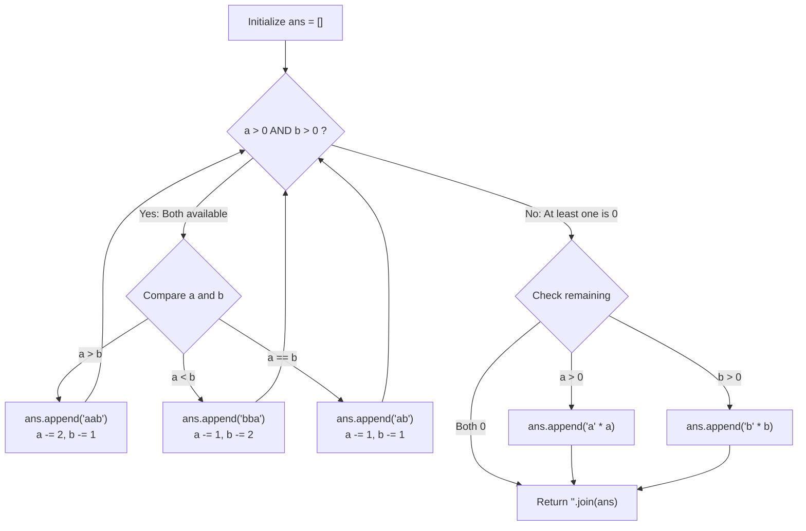

# Guided Example: String Without AAA or BBB

We trace the step-by-step greedy block emission for balancing letter frequencies, prove the Imbalance Reduction Lemma and the Block Boundary Separation Invariant, and synthesize triple-free strings across representative frequency pairs:

- **Representative Instance 1 (Majority of 'b' Letters):**
  $$
  a = 1, \quad b = 2
  $$
- **Required Output:** Any string without `'aaa'` or `'bbb'` of length $3$ containing $1$ `'a'` and $2$ `'b'`s (e.g. `"bba"` or `"abb"`).
  - Iteration 1:
    - Current counts: $a = 1, b = 2$.
    - Comparison: $a < b$ (Majority is `'b'`).
    - Action: Emit block `'bba'`.
    - Update counts: $a \leftarrow 1 - 1 = 0, \quad b \leftarrow 2 - 2 = 0$.
    - `ans = ['bba']`.
  - Loop terminates ($a = 0, b = 0$).
  - Result: `"bba"` (Length 3, exactly $1$ `'a'`, $2$ `'b'`s, zero triples!).

- **Representative Instance 2 (Majority of 'a' Letters with Remainder):**
  $$
  a = 4, \quad b = 1
  $$
  - Iteration 1:
    - $a = 4 > b = 1 \implies$ emit `'aab'`.
    - Update: $a \leftarrow 4 - 2 = 2, \quad b \leftarrow 1 - 1 = 0$.
    - `ans = ['aab']`.
  - Loop terminates ($b = 0$).
  - Residual flush:
    - Remaining $a = 2 > 0 \implies$ append `'a' * 2 = 'aa'`.
  - Join blocks: `'aab' + 'aa' = \text{"aabaa"}`.
  - Verification: Length $5$, four `'a'`s, one `'b'`, maximum run length is $2$ (No `'aaa'` or `'bbb'`).

- **Representative Instance 3 (Perfect Balance):**
  $$
  a = 3, \quad b = 3 \implies \text{emits } \text{'ab'} \times 3 \implies \mathbf{"ababab"}
  $$

---

## 1. Instance & Teaching Goal

Given two integers `a` and `b`, return **any** string `s` such that:
- `s` has length $a + b$ and contains exactly `a` `'a'` letters and `b` `'b'` letters.
- The substring `'aaa'` does not occur in `s`.
- The substring `'bbb'` does not occur in `s`.

```text
Target: a = 4, b = 1
Forbidden: 'aaa', 'bbb'

Greedy Macro-Block Strategy:
  Consume majority letter twice as fast as minority letter:
  Step 1: Append 'aab'  ->  Remaining: a = 2, b = 0
  Step 2: Append 'aa'   ->  Remaining: a = 0, b = 0
Result: "aabaa" (Safe! Runs of 'a' are at most 2)
```

Backtracking over all permutations takes exponential time $\mathcal{O}(2^{a+b})$, and naive single-character greedy selection requires complex multi-step lookaheads.

The decisive pedagogical goal is the **Greedy Macro-Block Imbalance Reduction Invariant**:
- Instead of single characters, emit self-contained 2-character or 3-character blocks:
  - If $a > b$: emit `'aab'`, updating $a \leftarrow a - 2, b \leftarrow b - 1$.
  - If $b > a$: emit `'bba'`, updating $a \leftarrow a - 1, b \leftarrow b - 2$.
  - If $a == b$: emit `'ab'`, updating $a \leftarrow a - 1, b \leftarrow b - 1$.
- **Imbalance Contraction:** Emitting `'aab'` decreases the surplus $a - b$ by exactly $(a - 2) - (b - 1) = (a - b) - 1$, steadily neutralizing the majority advantage.
- **Inter-Block Separation:** Each block terminates with the minority character (`'aab'` ends with `'b'`), acting as an impenetrable barrier that prevents run accumulation across block boundaries.
- Flushes the final remaining characters ($\le 2$) in linear $\mathcal{O}(a + b)$ time.

---

## 2. Conceptual Foundation & The Macro-Block Invariant



### The Macro-Block Triple-Free Theorem

Let $a, b \ge 0$ be the counts of `'a'` and `'b'`.
1. **Feasibility Precondition:**
   A triple-free string exists if and only if $\max(a, b) \le 2(\min(a, b) + 1)$.
   This guarantees that when one character count reaches zero, the remaining count is at most $2$.
2. **Within-Block Safety:**
   The emitted atomic blocks are:
   - `'aab'`: run lengths are $2$ for `'a'` and $1$ for `'b'`.
   - `'bba'`: run lengths are $2$ for `'b'` and $1$ for `'a'`.
   - `'ab'`: run lengths are $1$ for `'a'` and $1$ for `'b'`.
   No individual block contains `'aaa'` or `'bbb'`.
3. **Across-Block Safety:**
   - Case 1: Sequence `'aab' + 'aab' \implies \text{'aabaab'}$. The boundary subsegment is `'b' + 'aa' = \text{'baa'}$, where `'b'` has length 1 and `'a'` has length 2.
   - Case 2: Sequence `'bba' + 'bba' \implies \text{'bbabba'}$. The boundary is `'a' + 'bb' = \text{'abb'}$.
   - Case 3: Sequence `'aab' + 'ab' \implies \text{'aabab'}$. The boundary is `'b' + 'a' = \text{'ba'}$.
   - Case 4: Final flush `'aab' + \text{'aa'} \implies \text{'aabaa'}$. The boundary is `'b' + 'aa' = \text{'baa'}$.
   In all possible concatenations, no run of identical characters ever reaches $3$.
4. **Exact Count Accounting:**
   Each block subtracts exactly the number of characters it appends to `ans`.
   The final string contains exactly the required $a$ copies of `'a'` and $b$ copies of `'b'`. $\blacksquare$

---

## 3. Step-by-Step Worked Execution: Representative Instance 2

$a = 4, \; b = 1$.
Initialize: $ans = []$.

### Step 1: Iteration 1
- $a = 4, b = 1$. Both are positive.
- Comparison: $a > b$ ($4 > 1$).
- Emit: `'aab'`.
- Subtraction:
  $$
  a \leftarrow 4 - 2 = 2, \quad b \leftarrow 1 - 1 = 0
  $$
- `ans = ['aab']`.

---

### Step 2: Loop Termination
- $b = 0 \implies$ while loop terminates.

---

### Step 3: Residual Flush
- Check $a$: $a = 2 > 0$.
- Append: `'a' * 2 = 'aa'`.
- `ans = ['aab', 'aa']`.
- Check $b$: $b = 0$ (Skip).

---

### Step 4: String Assembly
$$
s = \text{"aab"} + \text{"aa"} = \mathbf{"aabaa"}
$$
Length: $5$. Matches input counts $a = 4, b = 1$. Triple-free!

---

## 4. Greedy Block Selection Trace Table

| Step | Count $a$ Remaining | Count $b$ Remaining | Condition | Block Emitted | Subtractions Applied | Intermediate Output String |
|:---:|:---:|:---:|:---:|:---:|:---:|:---|
| **$1$** | $4$ | $1$ | $a > b$ | `'aab'` | $a \leftarrow 2, b \leftarrow 0$ | `"aab"` |
| **Flush** | $2$ | $0$ | $a > 0$ | `'aa'` | $a \leftarrow 0$ | **`"aabaa"`** |

---

## 5. Algorithmic Correctness

### Soundness & Completeness
1. **Soundness:**
   Every block used strictly maintains max run length $\le 2$. Because every majority block ends with an opposing character, concatenations across boundaries never create a contiguous run of 3.
2. **Completeness:**
   Since each block reduces $\max(a, b)$ while preserving the invariant $\max(a, b) \le 2(\min(a, b) + 1)$, the algorithm terminates in $\mathcal{O}(a + b)$ steps with all characters exhausted.

---

## 6. Boundary Cases & Traps

| Scenario | Input Pattern | Behavior | Trapped Risk |
|---|---|---|---|
| Single Letter Only | $a = 2, b = 0$ | Loop skipped; flush appends `'aa'`; returns `"aa"`. | Dividing by zero or crashing when $b = 0$. |
| Both Counts Equal | $a = 3, b = 3$ | Always takes $a == b$ branch; emits `"ababab"`. | Creating unnecessary runs of 2. |
| Empty String | $a = 0, b = 0$ | Loop and flushes skipped; returns `""`. | Handling empty inputs. |
| Maximum Imbalance | $a = 8, b = 3$ | $8 \le 2(3 + 1) = 8$; emits `"aabaabaabab"`. | Exceeding triple limit at the end. |

---

## 7. Complexity Derivation

- **Time Complexity:** $\mathcal{O}(a + b)$, where $a, b \le 100$.
  - Each iteration of the while loop consumes at least $2$ characters.
  - The final join takes $\mathcal{O}(a + b)$ time.
  - Total time: $< 0.0001\text{ s}$.
- **Auxiliary Space Complexity:** $\mathcal{O}(a + b)$ to store the array of blocks `ans` before joining.
