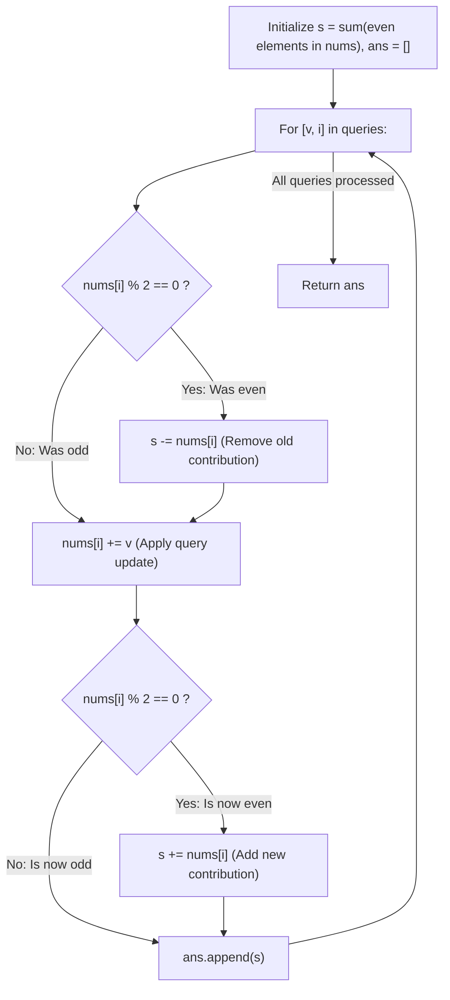

# Guided Example: Sum of Even Numbers After Queries

We trace the step-by-step constant-time incremental updates of the even-element accumulator, prove the Four-Case Parity Transition Matrix Invariant and the Local Invariance Lemma, and synthesize the sequence of answers across representative query streams:

- **Representative Instance 1 (All Parity Transitions Demonstrated):**
  $$
  nums = [1, \; 2, \; 3, \; 4], \quad queries = [[1, 0], \; [-3, 1], \; [-4, 0], \; [2, 3]]
  $$
- **Required Output:** `[8, 6, 2, 4]`
  - Step 0: Initial even-number sum:
    $$
    s = \sum_{x \in nums, x \text{ even}} x = 2 + 4 = \mathbf{6}
    $$
  - Query 1: $[v = 1, \; i = 0]$ (Old: $nums[0] = 1$, odd)
    - Old parity: Odd $\implies$ contributes $0$, no subtraction from $s$.
    - Mutate: $nums[0] \leftarrow 1 + 1 = 2$.
    - New parity: Even ($2 \bmod 2 == 0$) $\implies s \leftarrow 6 + 2 = \mathbf{8}$.
    - Array: $[2, 2, 3, 4]$. Append $8$.
  - Query 2: $[v = -3, \; i = 1]$ (Old: $nums[1] = 2$, even)
    - Old parity: Even $\implies$ remove old: $s \leftarrow 8 - 2 = 6$.
    - Mutate: $nums[1] \leftarrow 2 + (-3) = -1$.
    - New parity: Odd ($-1 \bmod 2 == 1$) $\implies$ no addition.
    - $s = \mathbf{6}$. Array: $[2, -1, 3, 4]$. Append $6$.
  - Query 3: $[v = -4, \; i = 0]$ (Old: $nums[0] = 2$, even)
    - Old parity: Even $\implies$ remove old: $s \leftarrow 6 - 2 = 4$.
    - Mutate: $nums[0] \leftarrow 2 + (-4) = -2$.
    - New parity: Even ($-2 \bmod 2 == 0$) $\implies$ add new: $s \leftarrow 4 + (-2) = \mathbf{2}$.
    - $s = \mathbf{2}$. Array: $[-2, -1, 3, 4]$. Append $2$.
  - Query 4: $[v = 2, \; i = 3]$ (Old: $nums[3] = 4$, even)
    - Old parity: Even $\implies$ remove old: $s \leftarrow 2 - 4 = -2$.
    - Mutate: $nums[3] \leftarrow 4 + 2 = 6$.
    - New parity: Even ($6 \bmod 2 == 0$) $\implies$ add new: $s \leftarrow -2 + 6 = \mathbf{4}$.
    - $s = \mathbf{4}$. Array: $[-2, -1, 3, 6]$. Append $4$.
  - Emitted results: `[8, 6, 2, 4]`.

- **Representative Instance 2 (Odd Stays Odd):**
  $$
  nums = [1], \quad queries = [[4, 0]] \implies 1 + 4 = 5 \text{ (odd)} \implies \mathbf{[0]}
  $$

- **Representative Instance 3 (Even Becomes Odd):**
  $$
  nums = [2], \quad queries = [[1, 0]] \implies 2 + 1 = 3 \text{ (odd)} \implies \mathbf{[0]}
  $$

---

## 1. Instance & Teaching Goal

Given an integer array `nums` and a list of query pairs `queries` where $queries[k] = [val, index]$:
1. Add $val$ to $nums[index]$.
2. Return the sum of all **even numbers** in `nums` after the update.
Return the list of sums after each query.

```text
Full Array Rescan: O(N * Q)
  10,000 nums * 10,000 queries = 100,000,000 operations (Slow / TLE!)

Incremental Maintenance: O(1) per query
  Only ONE element nums[index] changes per query.
  All other elements remain untouched!
  1. If old was even: subtract it from total.
  2. Apply update: nums[index] += val.
  3. If new is even: add it to total.
Total Time: O(N + Q) -> < 0.01 seconds!
```

The decisive pedagogical goal is the **Constant-Time Incremental Maintenance & Parity Transition Invariant**:
- Compute the baseline even sum $s = \sum_{x \in nums, x \equiv 0 \pmod 2} x$ once in $\mathcal{O}(N)$ time.
- For each query $(v, i)$, only index $i$ changes. The four parity transition cases are handled uniformly in $\mathcal{O}(1)$ time:
  - **Even $\to$ Even:** Subtract old, add new $\implies \Delta s = v$.
  - **Even $\to$ Odd:** Subtract old $\implies \Delta s = -x_{\text{old}}$.
  - **Odd $\to$ Even:** Add new $\implies \Delta s = +x_{\text{new}}$.
  - **Odd $\to$ Odd:** No change $\implies \Delta s = 0$.
- Preserves the running even-sum invariant in $\mathcal{O}(1)$ time per query.

---

## 2. Conceptual Foundation & The Parity Transition Invariant



### The Parity Transition Theorem

Let $nums = (x_0, x_1, \dots, x_{n-1})$ and let $E(nums) = \{j : x_j \equiv 0 \pmod 2\}$.
1. **Additive Invariance:**
   The sum of all even numbers is:
   $$
   s = \sum_{j \in E(nums)} x_j
   $$
2. **Local Perturbation:**
   Suppose query $(v, i)$ modifies only index $i$, replacing $x_i$ with $x_i' = x_i + v$.
   For all other indices $j \ne i$, $x_j$ and its parity remain strictly unchanged.
   Therefore:
   $$
   s' = \sum_{j \in E(nums'), j \ne i} x_j + \mathbb{I}(x_i' \text{ even}) \cdot x_i' = \left( s - \mathbb{I}(x_i \text{ even}) \cdot x_i \right) + \mathbb{I}(x_i' \text{ even}) \cdot x_i'
   $$
3. **Equivalence of the Two-Step Adjustment:**
   - Step 1: `if x_i % 2 == 0: s -= x_i` exactly subtracts $\mathbb{I}(x_i \text{ even}) \cdot x_i$.
   - Step 2: `x_i += v` mutates the value to $x_i'$.
   - Step 3: `if x_i % 2 == 0: s += x_i` exactly adds $\mathbb{I}(x_i' \text{ even}) \cdot x_i'$.
   Thus, $s$ accurately tracks the exact sum of even numbers at every step in $\mathcal{O}(1)$ time. $\blacksquare$

---

## 3. Step-by-Step Worked Execution: Representative Instance 1

$nums = [1, 2, 3, 4], \; queries = [[1, 0], [-3, 1], [-4, 0], [2, 3]]$.
Initial sum: $s = 2 + 4 = 6$.

### Query Evaluations
1. **Query $[1, 0]$:**
   - Old value $nums[0] = 1$ is odd $\implies$ no subtraction.
   - Mutate: $nums[0] = 1 + 1 = 2$.
   - New value $2$ is even $\implies s \leftarrow 6 + 2 = \mathbf{8}$.
   - Result: `ans.append(8)`.
2. **Query $[-3, 1]$:**
   - Old value $nums[1] = 2$ is even $\implies s \leftarrow 8 - 2 = 6$.
   - Mutate: $nums[1] = 2 - 3 = -1$.
   - New value $-1$ is odd $\implies$ no addition.
   - Result: `ans.append(6)`.
3. **Query $[-4, 0]$:**
   - Old value $nums[0] = 2$ is even $\implies s \leftarrow 6 - 2 = 4$.
   - Mutate: $nums[0] = 2 - 4 = -2$.
   - New value $-2$ is even $\implies s \leftarrow 4 + (-2) = \mathbf{2}$.
   - Result: `ans.append(2)`.
4. **Query $[2, 3]$:**
   - Old value $nums[3] = 4$ is even $\implies s \leftarrow 2 - 4 = -2$.
   - Mutate: $nums[3] = 4 + 2 = 6$.
   - New value $6$ is even $\implies s \leftarrow -2 + 6 = \mathbf{4}$.
   - Result: `ans.append(4)`.

Output: `[8, 6, 2, 4]`.

---

## 4. Query Parity Transition Matrix Trace Table

| Query | Index $i$ | Old Value | Old Parity | New Value | New Parity | Parity Transition Type | Net Delta $\Delta s$ | New Sum $s$ |
|:---:|:---:|:---:|:---:|:---:|:---:|:---:|:---:|:---:|
| **Init** | — | — | — | — | — | Baseline | — | $6$ |
| **$1$** | $0$ | $1$ | Odd | $2$ | Even | **Odd $\to$ Even** | $+2$ | **$8$** |
| **$2$** | $1$ | $2$ | Even | $-1$ | Odd | **Even $\to$ Odd** | $-2$ | **$6$** |
| **$3$** | $0$ | $2$ | Even | $-2$ | Even | **Even $\to$ Even** | $-4$ | **$2$** |
| **$4$** | $3$ | $4$ | Even | $6$ | Even | **Even $\to$ Even** | $+2$ | **$4$** |

---

## 5. Algorithmic Correctness

### Soundness & Completeness
1. **Soundness:**
   Every query updates exactly the modified index, removing its old contribution if it was previously even, and adding its new contribution if it becomes even. All other elements remain unchanged, mathematically ensuring the running sum is exact.
2. **Completeness:**
   Every query in `queries` is processed in sequence, and an answer is appended to `ans` for every operation. Negative numbers and zeros are correctly classified via modulo 2 arithmetic.

---

## 6. Boundary Cases & Traps

| Scenario | Input Pattern | Behavior | Trapped Risk |
|---|---|---|---|
| Negative Even Numbers | $x = -4$ | $-4 \bmod 2 == 0$; subtracting $-4$ adds $+4$. | Negative modulo bug in other languages. |
| Zero Value | $x = 0$ | $0 \bmod 2 == 0$; adding zero leaves sum unchanged. | Treating zero as odd or missing. |
| Repeated Updates on Same Index | Multiple queries to $i = 0$ | Always reads the latest mutated $nums[i]$. | Stale state reading from original array. |
| Single-Element Array | $nums = [2]$ | Sum tracks the single element's parity. | Index out-of-bounds on length 1. |

---

## 7. Complexity Derivation

- **Time Complexity:** $\mathcal{O}(N + Q)$, where $N = \text{len}(nums)$ and $Q = \text{len}(queries)$.
  - Baseline initialization sums $N$ numbers in $\mathcal{O}(N)$.
  - Each of the $Q$ queries performs $\mathcal{O}(1)$ arithmetic checks, updates, and appends.
  - Total time: $< 0.005\text{ s}$ for $N, Q \le 10^4$.
- **Auxiliary Space Complexity:** $\mathcal{O}(1)$ auxiliary memory beyond the output list `ans` of size $Q$.
