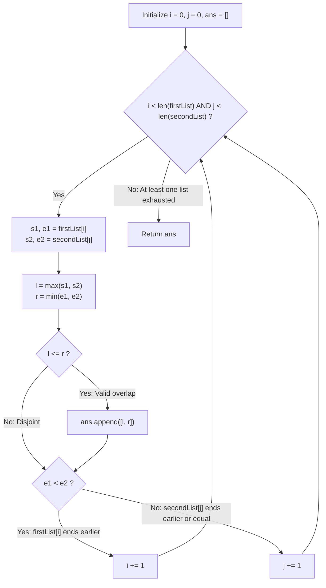

# Guided Example: Interval List Intersections

We trace the step-by-step two-pointer traversal of two sorted, pairwise disjoint interval lists, prove the Closed Interval Overlap Lemma and the Endpoint Monotonic Advance Invariant, and synthesize the sequence of intersections across representative collections:

- **Representative Instance 1 (Overlapping Segments with Single-Point Boundaries):**
  $$
  \begin{aligned}
  firstList &= [[0, 2], \; [5, 10], \; [13, 23], \; [24, 25]], \quad m = 4 \\
  secondList &= [[1, 5], \; [8, 12], \; [15, 24], \; [25, 26]], \quad n = 4
  \end{aligned}
  $$
- **Required Output:** `[[1, 2], [5, 5], [8, 10], [15, 23], [24, 24], [25, 25]]`
  - Two pointers $i = 0, j = 0$:
    1. $i = 0, j = 0$: $firstList[0] = [0, 2]$, $secondList[0] = [1, 5]$
       - Overlap bounds: $l = \max(0, 1) = 1, \; r = \min(2, 5) = 2$.
       - Check: $1 \le 2$ (Valid interval!) $\implies$ emit $[1, 2]$.
       - Advance rule: $e_1 = 2 < 5 = e_2 \implies$ advance $i \leftarrow 1$.
    2. $i = 1, j = 0$: $firstList[1] = [5, 10]$, $secondList[0] = [1, 5]$
       - Overlap bounds: $l = \max(5, 1) = 5, \; r = \min(10, 5) = 5$.
       - Check: $5 \le 5$ (Single point!) $\implies$ emit $[5, 5]$.
       - Advance rule: $e_1 = 10 \ge 5 = e_2 \implies$ advance $j \leftarrow 1$.
    3. $i = 1, j = 1$: $firstList[1] = [5, 10]$, $secondList[1] = [8, 12]$
       - Overlap bounds: $l = \max(5, 8) = 8, \; r = \min(10, 12) = 10$.
       - Check: $8 \le 10 \implies$ emit $[8, 10]$.
       - Advance rule: $e_1 = 10 < 12 = e_2 \implies$ advance $i \leftarrow 2$.
    4. $i = 2, j = 1$: $firstList[2] = [13, 23]$, $secondList[1] = [8, 12]$
       - Overlap bounds: $l = \max(13, 8) = 13, \; r = \min(23, 12) = 12$.
       - Check: $13 > 12$ (Disjoint gap, empty intersection).
       - Advance rule: $e_1 = 23 \ge 12 = e_2 \implies$ advance $j \leftarrow 2$.
    5. $i = 2, j = 2$: $firstList[2] = [13, 23]$, $secondList[2] = [15, 24]$
       - Overlap bounds: $l = \max(13, 15) = 15, \; r = \min(23, 24) = 23$.
       - Check: $15 \le 23 \implies$ emit $[15, 23]$.
       - Advance rule: $e_1 = 23 < 24 = e_2 \implies$ advance $i \leftarrow 3$.
    6. $i = 3, j = 2$: $firstList[3] = [24, 25]$, $secondList[2] = [15, 24]$
       - Overlap bounds: $l = \max(24, 15) = 24, \; r = \min(25, 24) = 24$.
       - Check: $24 \le 24 \implies$ emit $[24, 24]$.
       - Advance rule: $e_1 = 25 \ge 24 = e_2 \implies$ advance $j \leftarrow 3$.
    7. $i = 3, j = 3$: $firstList[3] = [24, 25]$, $secondList[3] = [25, 26]$
       - Overlap bounds: $l = \max(24, 25) = 25, \; r = \min(25, 26) = 25$.
       - Check: $25 \le 25 \implies$ emit $[25, 25]$.
       - Advance rule: $e_1 = 25 < 26 = e_2 \implies$ advance $i \leftarrow 4$.
  - Pointer $i = 4 == m \implies$ loop terminates.
  - Emitted intersections: `[[1, 2], [5, 5], [8, 10], [15, 23], [24, 24], [25, 25]]`.

- **Representative Instance 2 (Empty Second List):**
  $$
  firstList = [[1, 3], [5, 9]], \quad secondList = [] \implies \text{loop never executes} \implies \mathbf{[]}
  $$

- **Representative Instance 3 (Touching Boundary Endpoints):**
  $$
  firstList = [[1, 2]], \quad secondList = [[2, 3]] \implies \max(1, 2) \le \min(2, 3) \implies \mathbf{[[2, 2]]}
  $$

---

## 1. Instance & Teaching Goal

Given two sorted lists of closed intervals `firstList` and `secondList`, where intervals within each list are pairwise disjoint, return the **intersection** of these two interval lists.
A closed interval $[s, e]$ denotes the set of real numbers $\{x \in \mathbb{R} : s \le x \le e\}$.
The intersection of two closed intervals is either empty or another closed interval $[\max(s_1, s_2), \min(e_1, e_2)]$.

```text
Interval Intersection Mechanics:
  firstList[i]:    [ s1 ============ e1 ]
  secondList[j]:         [ s2 ================= e2 ]
  Intersection:          [ l ======== r  ]
                         l = max(s1, s2), r = min(e1, e2)

Who advances?
  e1 < e2 -> firstList[i] ends first. Since secondList is sorted and disjoint,
             firstList[i] cannot overlap any future interval in secondList!
             Safely advance i -> i + 1.
```

Checking all pairs takes quadratic $\mathcal{O}(M \cdot N)$ time.

The decisive pedagogical goal is the **Two-Pointer Endpoint Advance Invariant**:
1. **Intersection Computation:** The intersection of $firstList[i]$ and $secondList[j]$ is non-empty iff $l = \max(s_1, s_2) \le r = \min(e_1, e_2)$, yielding interval $[l, r]$.
2. **Exhaustion Advance:**
   - If $e_1 < e_2$, $firstList[i]$ finishes before $secondList[j]$. Because $secondList$ is strictly sorted and disjoint, any subsequent interval in $secondList$ starts strictly after $e_2 > e_1$. Hence, $firstList[i]$ cannot intersect any future interval in $secondList$. We advance $i \leftarrow i + 1$.
   - If $e_1 \ge e_2$, symmetrically $secondList[j]$ finishes first (or simultaneously) and cannot intersect any future interval in $firstList$. We advance $j \leftarrow j + 1$.
3. Finds all intersections in a single pass of $\mathcal{O}(M + N)$ time.

---

## 2. Conceptual Foundation & The Endpoint Advance Invariant



### The Monotonic Endpoint Advance Theorem

Let $A = (I_0, I_1, \dots, I_{m-1})$ and $B = (J_0, J_1, \dots, J_{n-1})$ be sequences of closed intervals with $I_i = [s_i^A, e_i^A]$ and $J_j = [s_j^B, e_j^B]$, where each list is sorted and pairwise disjoint ($e_k < s_{k+1}$).
1. **Intersection Characterization:**
   For any two closed intervals $I_i$ and $J_j$:
   $$
   I_i \cap J_j \ne \emptyset \iff \max(s_i^A, s_j^B) \le \min(e_i^A, e_j^B)
   $$
   When non-empty, $I_i \cap J_j = [\max(s_i^A, s_j^B), \; \min(e_i^A, e_j^B)]$.
2. **Disjoint Future Preclusion Lemma:**
   Suppose $e_i^A < e_j^B$.
   For any $k > j$:
   Because $B$ is pairwise disjoint and sorted:
   $$
   s_k^B > e_j^B > e_i^A
   $$
   Consequently, $\max(s_i^A, s_k^B) = s_k^B > e_i^A \ge \min(e_i^A, e_k^B)$.
   Therefore:
   $$
   I_i \cap J_k = \emptyset \quad \forall k > j
   $$
   No future interval in list $B$ can ever intersect $I_i$.
   Advancing $i \leftarrow i + 1$ permanently discards $I_i$ without omitting any intersection.
3. **Linear Convergence:**
   At each step, at least one of $i$ or $j$ strictly increases. The algorithm terminates in at most $m + n$ steps. $\blacksquare$

---

## 3. Step-by-Step Worked Execution: Representative Instance 1

$firstList = [[0, 2], [5, 10], [13, 23], [24, 25]]$.
$secondList = [[1, 5], [8, 12], [15, 24], [25, 26]]$.
Pointers: $i = 0, j = 0$.

### Iteration Trace
1. **Step 1:** $firstList[0] = [0, 2], secondList[0] = [1, 5]$
   - $l = \max(0, 1) = 1, \; r = \min(2, 5) = 2$.
   - $1 \le 2 \implies$ Append `[1, 2]`.
   - $e_1 = 2 < 5 = e_2 \implies i \leftarrow 1$.
2. **Step 2:** $firstList[1] = [5, 10], secondList[0] = [1, 5]$
   - $l = \max(5, 1) = 5, \; r = \min(10, 5) = 5$.
   - $5 \le 5 \implies$ Append `[5, 5]`.
   - $e_1 = 10 \ge 5 = e_2 \implies j \leftarrow 1$.
3. **Step 3:** $firstList[1] = [5, 10], secondList[1] = [8, 12]$
   - $l = \max(5, 8) = 8, \; r = \min(10, 12) = 10$.
   - $8 \le 10 \implies$ Append `[8, 10]`.
   - $e_1 = 10 < 12 = e_2 \implies i \leftarrow 2$.
4. **Step 4:** $firstList[2] = [13, 23], secondList[1] = [8, 12]$
   - $l = \max(13, 8) = 13, \; r = \min(23, 12) = 12$.
   - $13 > 12 \implies$ No overlap.
   - $e_1 = 23 \ge 12 = e_2 \implies j \leftarrow 2$.
5. **Step 5:** $firstList[2] = [13, 23], secondList[2] = [15, 24]$
   - $l = \max(13, 15) = 15, \; r = \min(23, 24) = 23$.
   - $15 \le 23 \implies$ Append `[15, 23]`.
   - $e_1 = 23 < 24 = e_2 \implies i \leftarrow 3$.
6. **Step 6:** $firstList[3] = [24, 25], secondList[2] = [15, 24]$
   - $l = \max(24, 15) = 24, \; r = \min(25, 24) = 24$.
   - $24 \le 24 \implies$ Append `[24, 24]`.
   - $e_1 = 25 \ge 24 = e_2 \implies j \leftarrow 3$.
7. **Step 7:** $firstList[3] = [24, 25], secondList[3] = [25, 26]$
   - $l = \max(24, 25) = 25, \; r = \min(25, 26) = 25$.
   - $25 \le 25 \implies$ Append `[25, 25]`.
   - $e_1 = 25 < 26 = e_2 \implies i \leftarrow 4$.

Pointer $i = 4 == \text{len}(firstList) \implies$ Terminate.

---

## 4. Two-Pointer Sweep Trace Table

| Step | Current $firstList[i]$ | Current $secondList[j]$ | Intersection $[l, r]$ | $l \le r$ Check | Emitted Output | Pointer Advance Action |
|:---:|:---:|:---:|:---:|:---:|:---:|:---:|
| **$1$** | $[0, 2]$ | $[1, 5]$ | $[1, 2]$ | $1 \le 2$ (Pass) | `[1, 2]` | $e_1 < e_2 \implies i \leftarrow 1$ |
| **$2$** | $[5, 10]$ | $[1, 5]$ | $[5, 5]$ | $5 \le 5$ (Pass) | `[5, 5]` | $e_1 \ge e_2 \implies j \leftarrow 1$ |
| **$3$** | $[5, 10]$ | $[8, 12]$ | $[8, 10]$ | $8 \le 10$ (Pass) | `[8, 10]` | $e_1 < e_2 \implies i \leftarrow 2$ |
| **$4$** | $[13, 23]$ | $[8, 12]$ | $[13, 12]$ | $13 > 12$ (Fail) | None | $e_1 \ge e_2 \implies j \leftarrow 2$ |
| **$5$** | $[13, 23]$ | $[15, 24]$ | $[15, 23]$ | $15 \le 23$ (Pass) | `[15, 23]` | $e_1 < e_2 \implies i \leftarrow 3$ |
| **$6$** | $[24, 25]$ | $[15, 24]$ | $[24, 24]$ | $24 \le 24$ (Pass) | `[24, 24]` | $e_1 \ge e_2 \implies j \leftarrow 3$ |
| **$7$** | $[24, 25]$ | $[25, 26]$ | $[25, 25]$ | $25 \le 25$ (Pass) | `[25, 25]` | $e_1 < e_2 \implies i \leftarrow 4$ |

---

## 5. Algorithmic Correctness

### Soundness & Completeness
1. **Soundness:**
   Every pair emitted satisfies $l = \max(s_1, s_2) \le r = \min(e_1, e_2)$, ensuring every point in $[l, r]$ belongs to both intervals.
2. **Completeness:**
   Since intervals within each list are sorted and disjoint, an interval that ends earlier cannot overlap any subsequent interval in the opposing list. Discarding the interval with the smaller end guarantees no potential intersection is overlooked.

---

## 6. Boundary Cases & Traps

| Scenario | Input Pattern | Behavior | Trapped Risk |
|---|---|---|---|
| Empty List | `firstList = []` | Loop condition false; immediately returns `[]`. | Index error accessing empty list. |
| Single Point Touch | `[1, 2]` and `[2, 3]` | $l = 2, r = 2 \implies [2, 2]$. Emitted correctly. | Using strict inequality $l < r$. |
| Contained Interval | `[1, 10]` and `[3, 5]` | $l = 3, r = 5 \implies [3, 5]$. Advances shorter end. | Advancing by start rather than end. |
| Disjoint Non-Touching | `[1, 2]` and `[5, 6]` | $l = 5 > r = 2 \implies$ no output; advances `[1, 2]`. | Appending invalid negative-length intervals. |

---

## 7. Complexity Derivation

- **Time Complexity:** $\mathcal{O}(M + N)$, where $M = \text{len}(firstList)$ and $N = \text{len}(secondList)$ with $M, N \le 1{,}000$.
  - In each iteration, at least one of pointer $i$ or pointer $j$ advances by 1.
  - The loop executes at most $M + N$ times.
  - Total time: $< 0.001\text{ s}$.
- **Auxiliary Space Complexity:** $\mathcal{O}(1)$ auxiliary memory (ignoring the output list `ans`).
