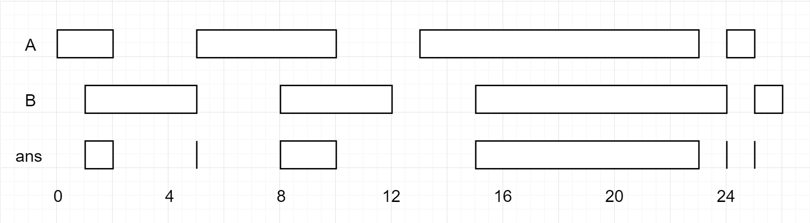

### 1. Description

You are given two lists of closed intervals, `firstList` and `secondList`, where $\text{firstList}[i] = [\text{start}_{i}, \text{end}_{i}]$ and $\text{secondList}[j] = [\text{start}_{j}, \text{end}_{j}]$. Each list of intervals is pairwise **disjoint** and in **sorted order**.

Return *the intersection of these two interval lists*.

A **closed interval** `[a, b]` (with $a \le b$) denotes the set of real numbers `x` with $a \le x \le b$.

The **intersection** of two closed intervals is a set of real numbers that are either empty or represented as a closed interval. For example, the intersection of `[1, 3]` and `[2, 4]` is `[2, 3]`.

### 2. Function Contract

- `n`: Input parameter.
- Returns expected result.

### 3. Examples

#### Example 1

- **Input:** $firstList = [[0,2],[5,10],[13,23],[24,25]], secondList = [[1,5],[8,12],[15,24],[25,26]]$
- **Output:** `[[1,2],[5,5],[8,10],[15,23],[24,24],[25,25]]`
#### Example 2

- **Input:** $firstList = [[1,3],[5,9]], secondList = []$
- **Output:** `[]`

### 4. Constraints

- $0 \le \text{firstList.length}, \text{secondList.length} \le 1000$

- $\text{firstList.length} + \text{secondList.length} \ge 1$

- $0 \le \text{start}_{i} < \text{end}_{i} \le 10^{9}$

- $\text{end}_{i} < \text{start}_{i}+1$

- $0 \le \text{start}_{j} < \text{end}_{j} \le 10^{9}$

- $\text{end}_{j} < \text{start}_{j}+1$