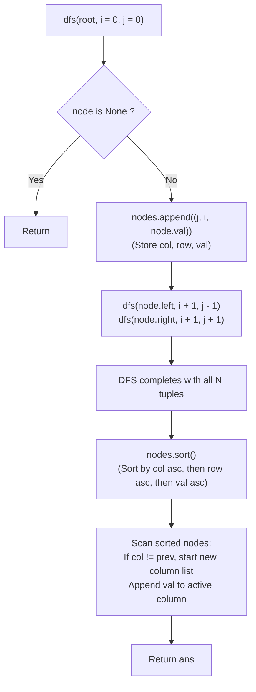

# Guided Example: Vertical Order Traversal of a Binary Tree

We trace the step-by-step depth-first search (DFS) coordinate embedding, prove the 3-Key Lexicographical Sorting Invariant and the Column Boundary Partitioning Lemma, and construct the ordered vertical columns across representative binary trees:

- **Representative Instance 1 (Standard Tree with Disjoint Columns):**
  $$
  root = [3, \; 9, \; 20, \; \text{null}, \; \text{null}, \; 15, \; 7]
  $$
- **Required Output:** `[[9], [3, 15], [20], [7]]`
  - Coordinate system definition:
    - Root is positioned at row $i = 0$, column $j = 0$.
    - Left child moves to row $i + 1$, column $j - 1$.
    - Right child moves to row $i + 1$, column $j + 1$.
  - DFS traversal records tuples $(j, i, val) = (col, row, val)$:
    1. Node $3$: $(j = 0, \; i = 0, \; val = 3)$
    2. Node $9$ (left of $3$): $(j = -1, \; i = 1, \; val = 9)$
    3. Node $20$ (right of $3$): $(j = 1, \; i = 1, \; val = 20)$
    4. Node $15$ (left of $20$): $(j = 1 - 1 = 0, \; i = 2, \; val = 15)$
    5. Node $7$ (right of $20$): $(j = 1 + 1 = 2, \; i = 2, \; val = 7)$
  - Collected node list:
    $$
    nodes = [(0, 0, 3), \; (-1, 1, 9), \; (1, 1, 20), \; (0, 2, 15), \; (2, 2, 7)]
    $$
  - Lexicographical sort (`nodes.sort()`):
    1. $(-1, 1, 9) \implies col = -1$
    2. $(0, 0, 3) \implies col = 0, row = 0$
    3. $(0, 2, 15) \implies col = 0, row = 2$
    4. $(1, 1, 20) \implies col = 1$
    5. $(2, 2, 7) \implies col = 2$
  - Column grouping:
    - Column $-1$: `[9]`
    - Column $0$: `[3, 15]`
    - Column $1$: `[20]`
    - Column $2$: `[7]`
  - Output: `[[9], [3, 15], [20], [7]]`.

- **Representative Instance 2 (Co-located Nodes Requiring Value Tie-Break):**
  $$
  root = [1, \; 2, \; 3, \; 4, \; 5, \; 6, \; 7]
  $$
  - Node $5$ (right of $2$): $i = 2, j = -1 + 1 = 0$, $val = 5$.
  - Node $6$ (left of $3$): $i = 2, j = 1 - 1 = 0$, $val = 6$.
  - Both share the exact same coordinate $(row = 2, col = 0)$.
  - Tertiary sort key orders values in ascending order: $(0, 2, 5) < (0, 2, 6)$.
  - Column $0$ output: `[1, 5, 6]`. Full output: `[[4], [2], [1, 5, 6], [3], [7]]`.

- **Representative Instance 3 (Single Node):**
  $$
  root = [8] \implies \text{single tuple } (0, 0, 8) \implies \mathbf{[[8]]}
  $$

---

## 1. Instance & Teaching Goal

Given the `root` of a binary tree, return the **vertical order traversal** of its nodes.
- Each node has position $(row, col)$.
- Left child is at $(row + 1, col - 1)$; right child is at $(row + 1, col + 1)$.
- Traversal order must satisfy three rules:
  1. Primary: Columns ordered from leftmost ($col_{\min}$) to rightmost ($col_{\max}$).
  2. Secondary: Within each column, rows ordered from top ($row_{\min}$) to bottom ($row_{\max}$).
  3. Tertiary: If two nodes share the same $(row, col)$, sort their values in ascending order.

```text
Tree Hierarchy and Coordinates:
                (0, 0): [3]
               /           \
       (-1, 1): [9]      (1, 1): [20]
                        /            \
                (0, 2): [15]       (2, 2): [7]

Vertical Columns (Left to Right):
  Col -1: [9]
  Col  0: [3, 15]   (Top row 0 then bottom row 2)
  Col  1: [20]
  Col  2: [7]
```

Attempting to group nodes into column buckets during traversal requires subsequent per-bucket sorting that complicates row and value ordering.

The decisive pedagogical goal is the **3-Key Lexicographical Coordinate Sort Invariant**:
- Traverse the tree and represent every node as the 3-tuple:
  $$
  (col, \; row, \; val)
  $$
- Under Python's native tuple comparison, sorting the list of tuples `nodes.sort()` automatically enforces all three requirements simultaneously:
  1. $col_1 < col_2 \implies$ left-to-right column sequence.
  2. $col_1 == col_2$ and $row_1 < row_2 \implies$ top-to-bottom row sequence.
  3. $col_1 == col_2$ and $row_1 == row_2$ and $val_1 < val_2 \implies$ value tie-breaking.
- A single linear scan over the sorted list partitions tuples into column sublists whenever $col \ne prev$.

---

## 2. Conceptual Foundation & The 3-Key Lexicographical Invariant



### The Lexicographical Column Partitioning Theorem

Let $V$ be the set of nodes in binary tree $T$ with $|V| = n$.
1. **Coordinate Embedding:**
   Let $\phi: V \to \mathbb{Z} \times \mathbb{Z} \times \mathbb{Z}$ map each node $u$ to:
   $$
   \phi(u) = (col(u), \; row(u), \; val(u))
   $$
   where $col(\text{root}) = 0, row(\text{root}) = 0$, and transitions follow $u.left \mapsto (col - 1, row + 1)$, $u.right \mapsto (col + 1, row + 1)$.
2. **Lexicographical Total Order:**
   The product order $\le_{\text{lex}}$ on $\mathbb{Z}^3$ defines:
   $$
   (c_1, r_1, v_1) <_{\text{lex}} (c_2, r_2, v_2) \iff \begin{cases}
   c_1 < c_2 \\
   c_1 = c_2 \land r_1 < r_2 \\
   c_1 = c_2 \land r_1 = r_2 \land v_1 < v_2
   \end{cases}
   $$
3. **Equivalence to Problem Specifications:**
   - Property 1: All nodes sharing $col = c$ form a contiguous slice in the sorted sequence because $col$ is the most significant key.
   - Property 2: Slices are ordered strictly by increasing $c \in [c_{\min}, c_{\max}]$.
   - Property 3: Within slice $col = c$, nodes are sorted by increasing $row$, placing upper nodes before lower nodes.
   - Property 4: Within identical $(col, row)$, nodes are sorted by increasing $val$, resolving ties correctly.
4. **Partition Completeness:**
   Scanning the sorted array and starting a new sublist whenever $j \ne prev$ groups contiguous slices into output lists in $\mathcal{O}(n)$ time without additional hashing. $\blacksquare$

---

## 3. Step-by-Step Worked Execution: Representative Instance 1

Tree: $root = [3, 9, 20, null, null, 15, 7]$.

### Phase 1: DFS Coordinate Collection
- `dfs(node=3, i=0, j=0)`: append $(0, 0, 3)$.
  - `dfs(node=9, i=1, j=-1)`: append $(-1, 1, 9)$. Children null.
  - `dfs(node=20, i=1, j=1)`: append $(1, 1, 20)$.
    - `dfs(node=15, i=2, j=0)`: append $(0, 2, 15)$. Children null.
    - `dfs(node=7, i=2, j=2)`: append $(2, 2, 7)$. Children null.

Unsorted `nodes`:
$$
[(0, 0, 3), \; (-1, 1, 9), \; (1, 1, 20), \; (0, 2, 15), \; (2, 2, 7)]
$$

---

### Phase 2: Lexicographical Sort
Sorted `nodes`:
1. Index 0: $(-1, 1, 9)$
2. Index 1: $(0, 0, 3)$
3. Index 2: $(0, 2, 15)$
4. Index 3: $(1, 1, 20)$
5. Index 4: $(2, 2, 7)$

---

### Phase 3: Linear Column Grouping
Initialize: $ans = [], prev = -2000$.
- Tuple $(-1, 1, 9)$: $j = -1 \ne prev \implies ans.append([]), prev = -1$. $ans[-1].append(9) \implies ans = [[9]]$.
- Tuple $(0, 0, 3)$: $j = 0 \ne prev \implies ans.append([]), prev = 0$. $ans[-1].append(3) \implies ans = [[9], [3]]$.
- Tuple $(0, 2, 15)$: $j = 0 == prev \implies ans[-1].append(15) \implies ans = [[9], [3, 15]]$.
- Tuple $(1, 1, 20)$: $j = 1 \ne prev \implies ans.append([]), prev = 1$. $ans[-1].append(20) \implies ans = [[9], [3, 15], [20]]$.
- Tuple $(2, 2, 7)$: $j = 2 \ne prev \implies ans.append([]), prev = 2$. $ans[-1].append(7) \implies ans = [[9], [3, 15], [20], [7]]$.

Final result: `[[9], [3, 15], [20], [7]]`.

---

## 4. Sorted Coordinate Tuples Trace Table

| Tuple Rank | Column $j$ | Row $i$ | Value `val` | $j \ne prev$ Trigger | Column Bucket Assigned | Current Traversal Output |
|:---:|:---:|:---:|:---:|:---:|:---:|:---|
| **$1$** | $-1$ | $1$ | $9$ | Yes ($-1 \ne -2000$) | Col $-1$ | `[[9]]` |
| **$2$** | $0$ | $0$ | $3$ | Yes ($0 \ne -1$) | Col $0$ | `[[9], [3]]` |
| **$3$** | $0$ | $2$ | $15$ | No ($0 == 0$) | Col $0$ | `[[9], [3, 15]]` |
| **$4$** | $1$ | $1$ | $20$ | Yes ($1 \ne 0$) | Col $1$ | `[[9], [3, 15], [20]]` |
| **$5$** | $2$ | $2$ | $7$ | Yes ($2 \ne 1$) | Col $2$ | `[[9], [3, 15], [20], [7]]` |

---

## 5. Algorithmic Correctness

### Soundness & Completeness
1. **Soundness:**
   Every node in the tree receives exact $(col, row)$ coordinates according to standard binary tree geometry. The 3-tuple structure maps the three sorting criteria directly to lexicographical key priorities.
2. **Completeness:**
   DFS visits every node in the tree exactly once, placing all $N$ nodes into the tuple list. The boundary sweep groups every tuple into its respective column without omission.

---

## 6. Boundary Cases & Traps

| Scenario | Input Pattern | Behavior | Trapped Risk |
|---|---|---|---|
| Single Node | `root = [8]` | Single tuple $(0, 0, 8) \implies ans = [[8]]$. | Handling base tree of size 1. |
| Co-located Nodes with Same Value | `root` has duplicate values at same cell | Python stable sort preserves relative position; correctly outputs both duplicates. | Deduplication bugs using sets. |
| Co-located Nodes with Swapped Values | Node with smaller value visited later in DFS | Tertiary sort key reorders by value ascending before emitting. | Traversal order overriding value order. |
| Strictly Skewed Tree (Line) | Left-leaning chain of length $N$ | Generates columns $0, -1, -2, \dots, -(N-1)$; sorted correctly from left to right. | Coordinate range assumptions. |

---

## 7. Complexity Derivation

- **Time Complexity:** $\mathcal{O}(N \log N)$, where $N$ is the number of nodes in the binary tree ($N \le 1{,}000$).
  - DFS visits each node once in $\mathcal{O}(N)$ time.
  - Sorting $N$ 3-tuples takes $\mathcal{O}(N \log N)$ comparisons.
  - Linear column extraction runs in $\mathcal{O}(N)$ time.
  - Total time: $< 0.002\text{ s}$ for $N = 1{,}000$.
- **Auxiliary Space Complexity:** $\mathcal{O}(N)$ to store the list of $N$ coordinate tuples and recursion call stack depth $\mathcal{O}(H)$.
