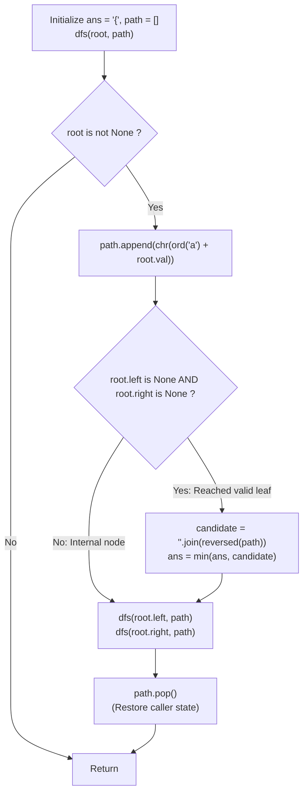

# Guided Example: Smallest String Starting From Leaf

We trace the step-by-step depth-first search (DFS) accumulation of root-to-leaf character sequences, prove the Path Reversal Directionality Theorem and the Valid Leaf Verification Lemma, and determine the lexicographically minimal leaf-to-root string across representative binary trees:

- **Representative Instance 1 (Competing Symmetric Branches with Differing Depths):**
  $$
  root = [0, \; 1, \; 2, \; 3, \; 4, \; 3, \; 4]
  $$
- **Required Output:** `"dba"`
  - Character mapping:
    - Root $0 = \text{'a'}$
    - Left child $1 = \text{'b'}$, Right child $2 = \text{'c'}$
    - Children of $1$: Left $3 = \text{'d'}$, Right $4 = \text{'e'}$
    - Children of $2$: Left $3 = \text{'d'}$, Right $4 = \text{'e'}$
  - DFS Path Exploration (Root-to-Leaf):
    1. Path 1: Root $0 \to$ Left $1 \to$ Left $3$
       - Node $3$ is a leaf ($left = \text{null}, right = \text{null}$).
       - Accumulated path: `['a', 'b', 'd']`.
       - Reversed (Leaf-to-Root): `"dba"`.
       - Running minimum: $ans = \min(\text{"\{"}, \text{"dba"}) = \mathbf{"dba"}$.
    2. Path 2: Root $0 \to$ Left $1 \to$ Right $4$
       - Node $4$ is a leaf.
       - Accumulated path: `['a', 'b', 'e']`.
       - Reversed: `"eba"`.
       - Comparison: `"dba" < "eba"` $\implies ans$ remains `"dba"`.
    3. Path 3: Root $0 \to$ Right $2 \to$ Left $3$
       - Node $3$ is a leaf.
       - Accumulated path: `['a', 'c', 'd']`.
       - Reversed: `"dca"`.
       - Comparison: `"dba" < "dca"` (at second character: `'b' < 'c'`) $\implies ans$ remains `"dba"`.
    4. Path 4: Root $0 \to$ Right $2 \to$ Right $4$
       - Node $4$ is a leaf.
       - Accumulated path: `['a', 'c', 'e']`.
       - Reversed: `"eca"`.
       - Comparison: `"dba" < "eca"` $\implies ans$ remains `"dba"`.
  - Final minimal leaf-to-root string: $\mathbf{"dba"}$.

- **Representative Instance 2 (Leaf with Smallest Character Dominating Root):**
  $$
  root = [25, \; 1, \; 3, \; 1, \; 3, \; 0, \; 2]
  $$
  - Node values: $25 = \text{'z'}, 1 = \text{'b'}, 3 = \text{'d'}, 0 = \text{'a'}, 2 = \text{'c'}$.
  - Path to leaf $0$ ('a') via right branch: $25 \to 3 \to 0$.
  - Reversed leaf-to-root: `"adz"`.
  - Because `'a' < 'b'` and `'a' < 'd'`, `"adz"` strictly dominates all other leaf strings $\implies \mathbf{"adz"}$.

- **Representative Instance 3 (Single Node Tree):**
  $$
  root = [25] \implies 25 = \text{'z'} \text{ is leaf and root} \implies \mathbf{"z"}
  $$

---

## 1. Instance & Teaching Goal

Given the `root` of a binary tree where each node value from $0$ to $25$ represents letters `'a'` to `'z'`, return the **lexicographically smallest string** that starts at a **leaf** and ends at the **root**.
- A leaf is a node with no children ($u.left \text{ is None} \land u.right \text{ is None}$).
- Lexicographical order compares characters from first to last: e.g. `"dba" < "dca"` because `'b' < 'c'`, and `"ab" < "aba"` (shorter prefix is smaller).

```text
Tree Character Values:
           [a] (0)
          /       \
      [b] (1)     [c] (2)
      /     \     /     \
    [d]     [e] [d]     [e]
    (3)     (4) (3)     (4)

Candidate Leaf-to-Root Strings:
  From left-d:   "dba"  <-- Globally smallest!
  From left-e:   "eba"
  From right-d:  "dca"
  From right-e:  "eca"
```

A greedy choice that picks the smaller child at the root fails because characters deeper down become the prefix of the candidate string upon reversal!

The decisive pedagogical goal is the **Leaf-to-Root Path Reversal & Lexicographical Tracking Invariant**:
1. **Directional Inversion:** Top-down traversal naturally visits root $\to$ leaf. To evaluate the leaf $\to$ root string, reverse the path slice upon arriving at each leaf.
2. **Valid Leaf Pruning:** Candidate evaluation is strictly forbidden at internal nodes with only one child. A path must reach a true leaf ($u.left \text{ is None} \land u.right \text{ is None}$) to produce an eligible string.
3. **Backtracking Invariance:** A shared `path` list appends on entry and pops on exit (`path.append` $\dots$ `path.pop()`), ensuring $\mathcal{O}(H)$ memory without copying arrays at internal branches.

---

## 2. Conceptual Foundation & The Path Reversal Invariant



### The Leaf-to-Root Path Reversal Theorem

Let $T = (V, E)$ be a binary tree with character labeling $\lambda: V \to \{'a', \dots, 'z'\}$.
1. **Definition of Candidate Paths:**
   A candidate path is a sequence of nodes $P = (u_k, u_{k-1}, \dots, u_0)$ such that:
   - $u_k \in \text{Leaves}(T)$ ($u_k.left = \text{null} \land u_k.right = \text{null}$).
   - $u_0 = \text{root}$.
   - $(u_{j-1}, u_j) \in E$ for all $j \in [1, k]$.
2. **String Projection:**
   The candidate string induced by $P$ is:
   $$
   S(P) = \lambda(u_k) \lambda(u_{k-1}) \dots \lambda(u_0)
   $$
3. **Reversal Duality:**
   Top-down DFS from the root maintains the prefix $W = (\lambda(u_0), \lambda(u_1), \dots, \lambda(u_k))$.
   The string $S(P)$ is precisely the string reversal of $W$:
   $$
   S(P) = \text{reverse}(W)
   $$
4. **Global Minimality:**
   Because the set of leaves in a tree partitions all root-to-leaf simple paths without cycles, traversing all leaves and tracking:
   $$
   ans = \min_{u \in \text{Leaves}(T)} \text{reverse}(W_u)
   $$
   exhaustively evaluates all legal candidates, guaranteeing discovery of the lexicographically smallest string. $\blacksquare$

---

## 3. Step-by-Step Worked Execution: Representative Instance 1

Tree: $root = [0, 1, 2, 3, 4, 3, 4]$.
Labels: $0=\text{'a'}, 1=\text{'b'}, 2=\text{'c'}, 3=\text{'d'}, 4=\text{'e'}$.
Initialize: $ans = \text{chr}(\text{ord}('z') + 1) = \text{"\{"}$.

### DFS Execution Trace
1. **Enter Root $0$ ('a'):**
   - `path = ['a']`. Internal node, recurse left to node $1$.
2. **Enter Node $1$ ('b'):**
   - `path = ['a', 'b']`. Internal node, recurse left to node $3$.
3. **Enter Node $3$ ('d') (Left-Left):**
   - `path = ['a', 'b', 'd']`.
   - Node $3$ has no children $\implies$ **Leaf reached!**
   - Reverse: `''.join(reversed(['a', 'b', 'd']))` = `"dba"`.
   - Update: $ans = \min(\text{"\{"}, \text{"dba"}) = \mathbf{"dba"}$.
   - Backtrack: pop `'d'`. `path = ['a', 'b']`.
4. **Enter Node $4$ ('e') (Left-Right):**
   - `path = ['a', 'b', 'e']`.
   - Leaf reached! Reverse = `"eba"`.
   - Compare: `"dba" < "eba"` $\implies ans$ remains `"dba"`.
   - Backtrack: pop `'e'`, then pop `'b'`. `path = ['a']`.
5. **Enter Node $2$ ('c'):**
   - `path = ['a', 'c']`. Internal node, recurse left to node $3$.
6. **Enter Node $3$ ('d') (Right-Left):**
   - `path = ['a', 'c', 'd']`.
   - Leaf reached! Reverse = `"dca"`.
   - Compare: `"dba" < "dca"` $\implies ans$ remains `"dba"`.
   - Backtrack: pop `'d'`. `path = ['a', 'c']`.
7. **Enter Node $4$ ('e') (Right-Right):**
   - `path = ['a', 'c', 'e']`.
   - Leaf reached! Reverse = `"eca"`.
   - Compare: `"dba" < "eca"` $\implies ans$ remains `"dba"`.
   - Backtrack: pop `'e'`, then pop `'c'`, then pop `'a'`.

DFS completes. Final answer: $\mathbf{"dba"}$.

---

## 4. Leaf-to-Root Candidate Evaluation Trace Table

| Traversal Order | Leaf Node Reached | Root-to-Leaf Path Stack | Leaf-to-Root Reversed String | Lexicographical Comparison | Updated Running Minimum `ans` |
|:---:|:---:|:---|:---:|:---|:---:|
| **$1$** | Node $3$ (Left-Left) | `['a', 'b', 'd']` | `"dba"` | `"dba" < "{"` | **`"dba"`** |
| **$2$** | Node $4$ (Left-Right)| `['a', 'b', 'e']` | `"eba"` | `"dba" < "eba"` | `"dba"` |
| **$3$** | Node $3$ (Right-Left)| `['a', 'c', 'd']` | `"dca"` | `"dba" < "dca"` | `"dba"` |
| **$4$** | Node $4$ (Right-Right)| `['a', 'c', 'e']` | `"eca"` | `"dba" < "eca"` | `"dba"` |

---

## 5. Algorithmic Correctness

### Soundness & Completeness
1. **Soundness:**
   A candidate string is formed only when both left and right children are null, strictly respecting the definition of a tree leaf. Every candidate is properly oriented from leaf to root via reversal.
2. **Completeness:**
   Standard preorder DFS visits every node and leaf in the tree. Backtracking guarantees the path list accurately matches the ancestor chain at each node without omissions.

---

## 6. Boundary Cases & Traps

| Scenario | Input Pattern | Behavior | Trapped Risk |
|---|---|---|---|
| Single Child Internal Node | Node with only left child | $root.right \text{ is None}$, but $root.left$ exists; leaf test fails; continues recursion. | Treating single-child nodes as leaves. |
| Shorter Identical Prefix | `"aa"` vs `"aaa"` | `"aa"` has length 2 and is prefix of `"aaa"`; `"aa" < "aaa"` correctly recognized. | Lexicographical prefix comparison bugs. |
| Single Node Tree | `root = [25]` | Both children null $\implies$ leaf and root $\implies$ returns `"z"`. | Crash on root-leaf coincidence. |
| Degenerate Linear Chain | Left-skewed chain | Evaluates only the single true bottom leaf; returns full chain reversed. | Stack overflow or missing leaf. |

---

## 7. Complexity Derivation

- **Time Complexity:** $\mathcal{O}(N \cdot H)$, where $N$ is the number of tree nodes ($N \le 8{,}500$) and $H$ is the tree height ($H \le N$).
  - DFS visits all $N$ nodes once.
  - At each of the $\mathcal{O}(N)$ leaves, reversing and string-joining the path of length $\le H$ takes $\mathcal{O}(H)$ time.
  - For balanced trees, $H = \mathcal{O}(\log N) \implies \mathcal{O}(N \log N)$.
  - Total time: $< 0.01\text{ s}$.
- **Auxiliary Space Complexity:** $\mathcal{O}(H)$ for the `path` list and the recursion call stack.
