## Solution

---

### Overview

We are given the root of a binary tree, where each node has a value in the range `[0, 25]` representing the letters `'a'` to `'z'`. The task is to find the lexicographically smallest string that starts at a leaf node and ends at the root of the binary tree.

**Key Observations:**
1. The string should start from a leaf node and end at the root node.
2. The string should be the smallest lexicographically, where a shorter prefix is considered smaller than a longer prefix of equal lexicographical size.
3. The input values are numbers and represent characters from `'a'` to `'z'`, and the output needs to be returned as a string of characters.

This article includes tree traversal. If you're not familiar with tree traversal, check out our [tree traversal explore card](https://leetcode.com/explore/learn/card/data-structure-tree/134/traverse-a-tree/).

---

### Approach 1: Depth First Search (DFS)

#### Intuition

A common approach to solving this problem is to use a depth-first search (DFS), exploring the tree from the leaf nodes to the root and keeping track of the current string. The idea is to recursively explore all possible paths while maintaining the lexicographically smallest string encountered along the way.

During traversal, we ensure that we visit all nodes to avoid missing any potential lexicographically smallest string. To achieve this, we maintain track of the current values traversed to construct the current string.

As we explore different paths, we check if the current string is lexicographically smaller than the previously encountered smallest string. If the current string is lexicographically smaller, we update it; otherwise, we continue our exploration.

The following is an illustration demonstrating the depth first search approach:

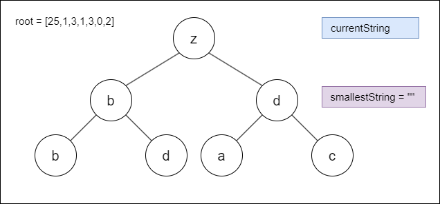

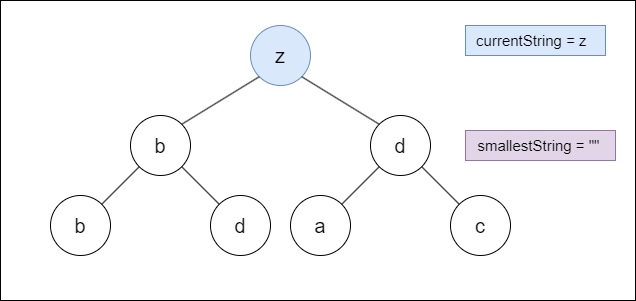

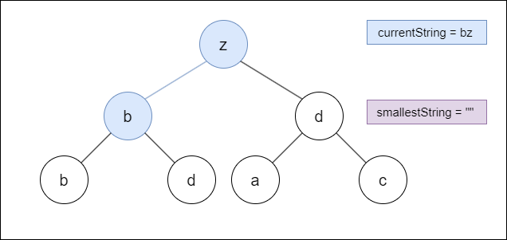

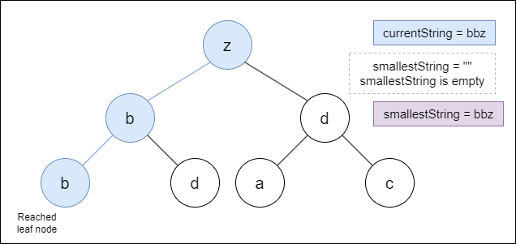

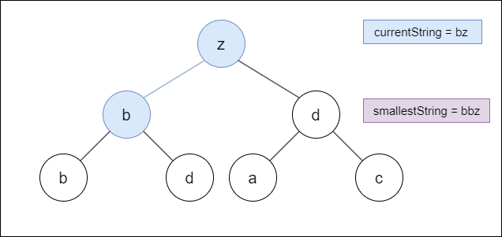

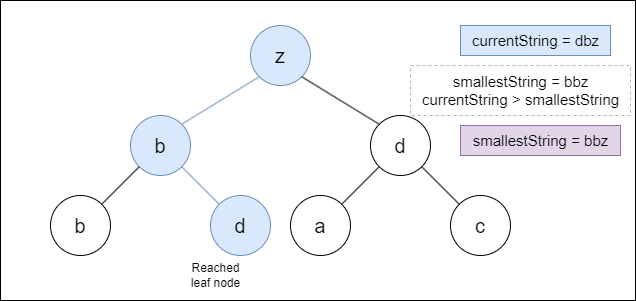

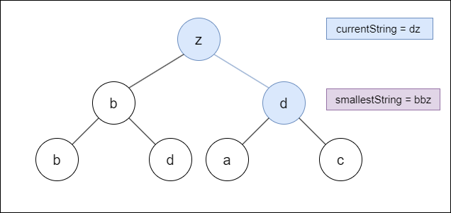

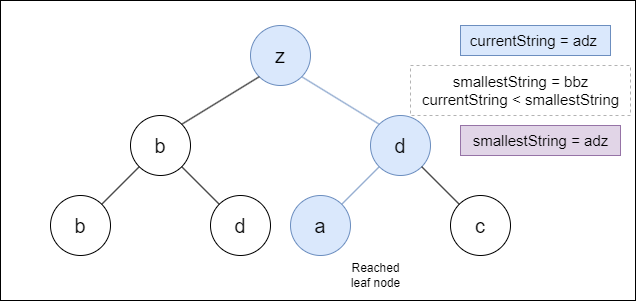

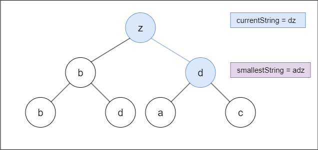

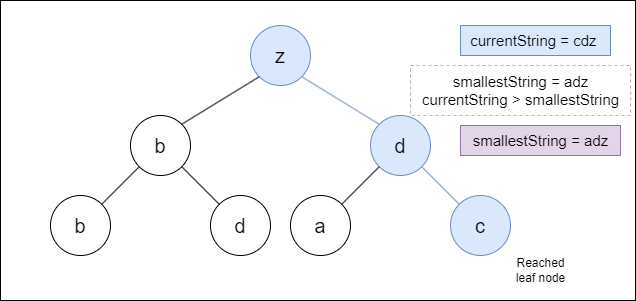

> **Note:** You may wonder whether a greedy algorithm that assumes that each local optimal step will eventually lead to a globally optimal solution could solve this problem. Consider the test case [4,0,1,1]. In this scenario, a greedy approach would fail to produce the correct result. Similarly, in the case of [25,1,null,0,0,1,null,null,null,0], the expected answer is "ababz", but the greedy solution would result in "abz".

#### Algorithm

- Initialize an empty string `smallestString` to store the lexicographically smallest string.

- Call the helper function `dfs(root, "")`.
   - The `dfs` function takes the current node `root` and the current string `currentString` as parameters.

- Inside the `dfs` function:
   - If the current node `root` is NULL, return (base case).
   - Construct the `currentString` by appending the character corresponding to the current node's value to the beginning of the `currentString`.
   - If the current node `root` is a leaf node:
- If `smallestString` is empty or if the `currentString` is lexicographically smaller than `smallestString`:
              - Update `smallestString` to be the `currentString`.
   - Recursively call `dfs` on the left child of the current node (if it exists).
   - Recursively call `dfs` on the right child of the current node (if it exists).

- After the `dfs` function call, return the `smallestString`.

> **Note:** Characters are represented as integers using ASCII values. For lowercase letters, the ASCII values start from 97 for `'a'`, 98 for `'b'`, and so on.
> - Now, consider the expression $char(root->val + 'a')$. Here, `root->val` represents some integer value. Adding it to 'a' (which is 97) essentially shifts it to the corresponding position in the alphabet. For example, if `root->val` is 0, then $root->val + 'a'$ becomes 97 ('a' in ASCII), resulting in the character 'a'. Similarly, if `root->val` is 1, then $root->val + 'a'$ becomes 98 ('b' in ASCII), resulting in the character 'b', and so on. So, the expression $char(root->val + 'a')$ converts the integer value `root->val` into its corresponding lowercase alphabetical character.

#### Implementation

```python
class Solution:
    def smallestFromLeaf(self, root: Optional[TreeNode]) -> str:
        self.smallest_string = ""
        self.dfs(root, "")
        return self.smallest_string

    # Helper function to find the lexicographically smallest string
    def dfs(self, root, current_string):
        # If the current node is NULL, return
        if not root:
            return

        # Construct the current string by appending
        # the character corresponding to the node's value
        current_string = chr(root.val + ord('a')) + current_string

        # If the current node is a leaf node
        if not root.left and not root.right:
            # If the current string is smaller than the result
            # or if the result is empty
            if not self.smallest_string or self.smallest_string > current_string:
                self.smallest_string = current_string

        # Recursively traverse the left subtree
        if root.left:
            self.dfs(root.left, current_string)

        # Recursively traverse the right subtree
        if root.right:
            self.dfs(root.right, current_string)
```

#### Complexity Analysis

Let $n$ be the number of nodes in the binary tree.

- Time complexity: $O(n \cdot n)$

    During each node visit in DFS, a new string is constructed by concatenating characters. Since string concatenation takes $O(n)$ time, where `n` is the length of the resulting string, and the length of the string grows with each recursive call, the time complexity of constructing and comparing each string in the worst case(skewed tree) is $O(n)$. Additionally, each node in the tree is visited once.

    Thus, the overall time complexity of the algorithm is $O(n \cdot n)$.

- Space complexity: $O(n \cdot n)$

    This space is utilized for the recursive function calls on the call stack during the DFS traversal, which is equal to the height of the tree. In the worst-case scenario, when the tree is completely unbalanced (skewed), the height of the tree can be equal to the number of nodes, resulting in $O(n)$ space complexity.

    In addition to the recursive call stack, the algorithm creates and stores a string for each node. In the worst-case scenario, where the tree is completely unbalanced and each node visit results in a new string, the total space required to store these strings becomes $O(n \cdot n)$.

    Thus, the overall space complexity of the algorithm is $O(n \cdot n)$.

---

### Approach 2: Breadth First Search (BFS) Approach

#### Intuition

Apart from DFS, we can also utilize the BFS approach to achieve the same outcome. In BFS, we implement a level-order traversal method, where we traverse the nodes level by level. Initially, we initialize an empty string to store the smallest path found so far and a queue to facilitate BFS traversal.

Given that the tree contains integer values that need to be returned as characters, we append nodes to the queue during traversal. Each node is accompanied by its value, converted to characters.

During each iteration, if the current node has a left child, we append it to the queue. Additionally, we concatenate the current string with the character representation of its value and include it in the queue. Likewise, if the current node has a right child, we follow the same procedure.

Within each iteration, we pop the node from the front of the queue along with its corresponding string. If the node is a leaf node (i.e., it lacks both left and right children), we compare its corresponding string with the current smallest string found. If it's lexicographically smaller, we update the smallest string accordingly.

Once the queue becomes empty, which signifies the completion of traversal for all paths from the root to the leaf nodes, the smallest string found represents the lexicographically smallest path from the root to a leaf node in the binary tree.

The following is an illustration demonstrating the breadth first search approach:

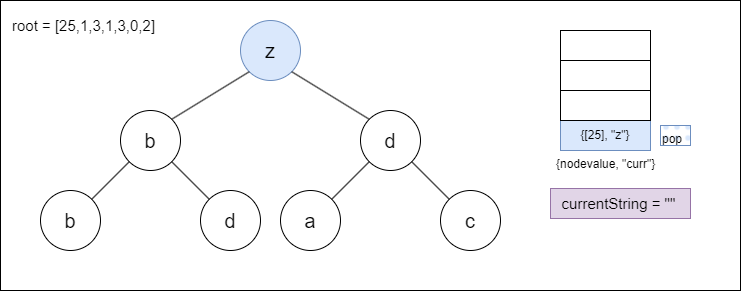

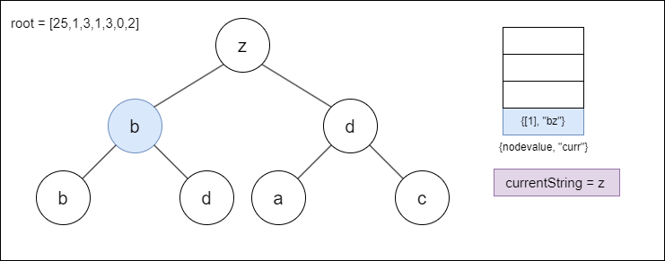

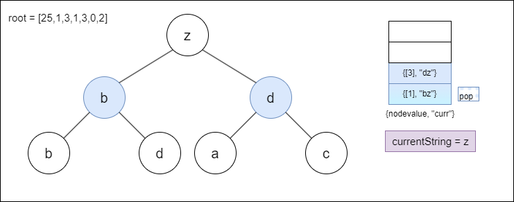

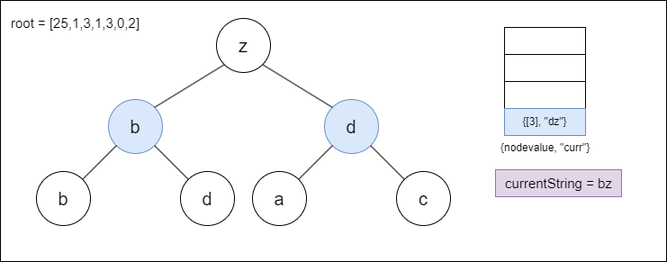

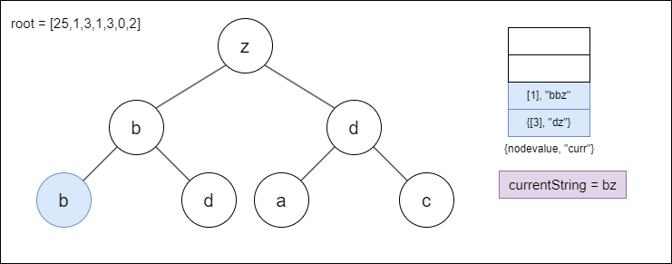

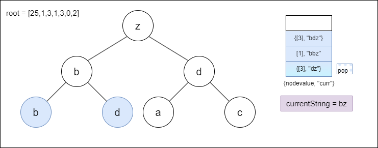

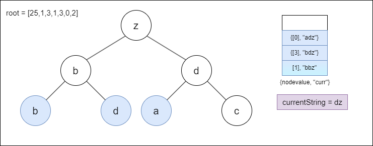

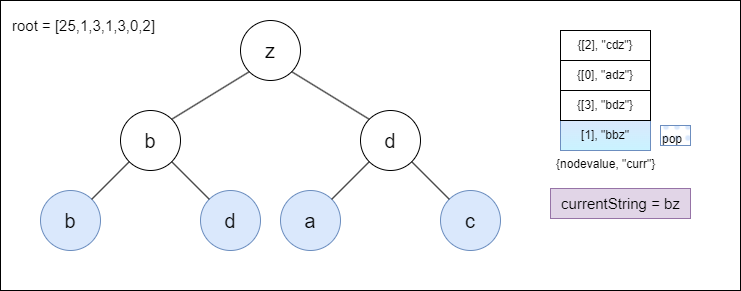

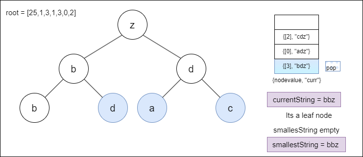

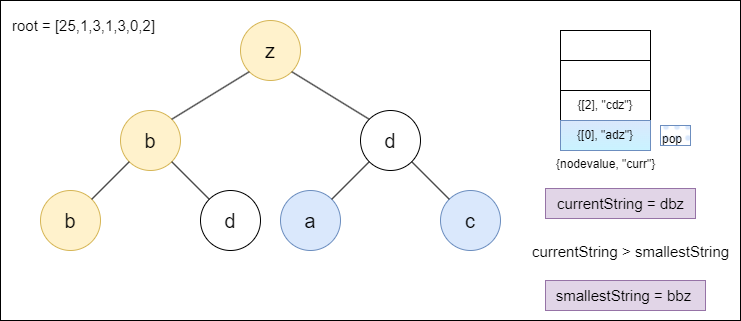

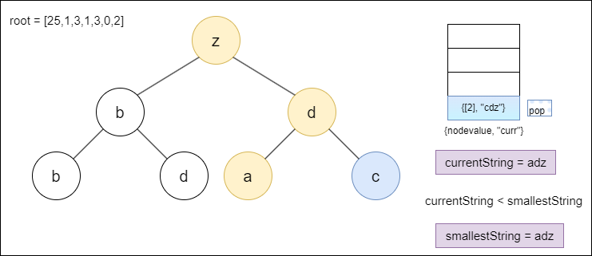

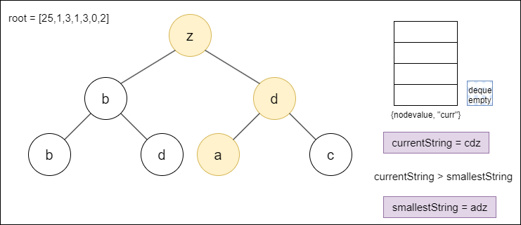

> **Note:** One advantage of DFS over BFS is its ability to avoid the need to create new string versions for each state. Instead, it allows for continuous appending and removal from a single string as child nodes are traversed. This eliminates the need to maintain multiple string states within the queue, simplifying the process compared to the BFS approach.

#### Algorithm

- Initialize an empty string, `smallestString`, to store the lexicographically smallest string.
- Initialize an empty queue, `nodeQueue`, for storing node-value pairs.
- Add the root node and its value, converted to a character, to the back of the `nodeQueue`.
- While the `nodeQueue` is not empty:
  - Pop the front node and its corresponding string from the `nodeQueue`.
  - If the current node is a leaf node and if `smallestString` is empty or the current string `currentString` is lexicographically smaller than `smallestString`, update `smallestString` to be the current string `currentString`.
  - If the current node has a left child:
- Add the left child and the string obtained by prepending the left child's value to `currentString` to the back of the `nodeQueue`.
  - If the current node has a right child:
- Add the right child and the string obtained by prepending the right child's value to `currentString` to the back of the `nodeQueue`.
- Return the string `smallestString`.

#### Implementation

```python
class Solution:
    def smallestFromLeaf(self, root: Optional[TreeNode]) -> str:
        smallest_string = ""
        node_queue = deque()

        # Add root node to deque along with its value converted to a character
        node_queue.append([root, chr(root.val + ord('a'))])

        # Perform BFS traversal until deque is empty
        while node_queue:
            # Pop the leftmost node and its corresponding string from deque
            node, current_string = node_queue.popleft()

            # If current node is a leaf node
            if not node.left and not node.right:
                # Update smallest_string if it's empty or current string is smaller
                smallest_string = min(smallest_string, current_string) if smallest_string else current_string

            # If current node has a left child, append it to deque
            if node.left:
                node_queue.append([node.left, chr(node.left.val + ord('a')) + current_string])

            # If current node has a right child, append it to deque
            if node.right:
                node_queue.append([node.right, chr(node.right.val + ord('a')) + current_string])

        return smallest_string
```

#### Complexity Analysis

Let $n$ be the number of nodes in the binary tree.

* Time complexity: $O(n \cdot n)$

    In each iteration of the BFS traversal, a new string is created by concatenating characters. As string concatenation takes $O(n)$ time, where n is the length of the resulting string, the time complexity of constructing and comparing each string in worst case(skewed tree) will take $O(n)$. Additionally, each node in the tree is visited once.

    Therefore, the overall time complexity of the BFS traversal becomes $O(n \cdot n)$.

* Space complexity: $O(n \cdot n)$

    At any given time during the BFS traversal, the deque could contain up to the maximum number of nodes at any level of the tree, which can be at most the number of nodes in the last level of the tree.

    Additionally, the size of each string stored in the deque can be up to $O(n)$.

    Therefore, the space complexity in the worst-case scenario (where the tree is completely unbalanced) would be $O(n \cdot n)$, considering the space required to store both nodes and strings.

---