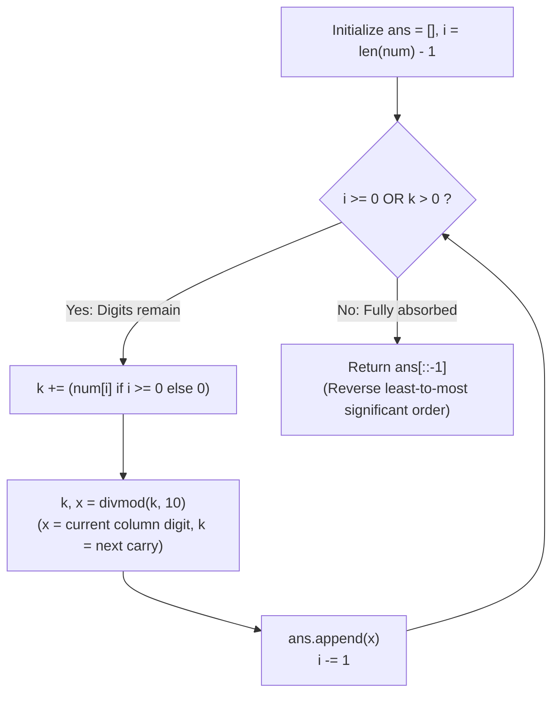

# Guided Example: Add to Array-Form of Integer

We trace the step-by-step column-by-column decimal addition, prove the Unified Addend-Carry Decomposition Lemma and the Least-to-Most Significant Digit Absorption Invariant, and synthesize the resulting array-form representation across representative inputs:

- **Representative Instance 1 (Direct Addition into Trailing Zeros):**
  $$
  num = [1, \; 2, \; 0, \; 0], \quad k = 34
  $$
- **Required Output:** `[1, 2, 3, 4]`
  - Start at least significant column index $i = 3$, initial carry addend $k = 34$, digits accumulated $ans = []$:
    1. **Column $0$ ($i = 3, num[3] = 0$):**
       - Add array digit: $k \leftarrow 34 + 0 = 34$.
       - Split: $(k, x) = \text{divmod}(34, 10) \implies k = 3, \; x = 4$.
       - Append $4$ to $ans \implies ans = [4]$. Decrement $i \leftarrow 2$.
    2. **Column $1$ ($i = 2, num[2] = 0$):**
       - Add array digit: $k \leftarrow 3 + 0 = 3$.
       - Split: $(k, x) = \text{divmod}(3, 10) \implies k = 0, \; x = 3$.
       - Append $3$ to $ans \implies ans = [4, 3]$. Decrement $i \leftarrow 1$.
    3. **Column $2$ ($i = 1, num[1] = 2$):**
       - Add array digit: $k \leftarrow 0 + 2 = 2$.
       - Split: $(k, x) = \text{divmod}(2, 10) \implies k = 0, \; x = 2$.
       - Append $2$ to $ans \implies ans = [4, 3, 2]$. Decrement $i \leftarrow 0$.
    4. **Column $3$ ($i = 0, num[0] = 1$):**
       - Add array digit: $k \leftarrow 0 + 1 = 1$.
       - Split: $(k, x) = \text{divmod}(1, 10) \implies k = 0, \; x = 1$.
       - Append $1$ to $ans \implies ans = [4, 3, 2, 1]$. Decrement $i \leftarrow -1$.
  - Loop condition ($i \ge 0 \lor k > 0$) is now false ($i = -1, k = 0$).
  - Reversal: $ans[::-1] = \mathbf{[1, 2, 3, 4]}$.

- **Representative Instance 2 (Multi-Digit Internal Carries):**
  $$
  num = [2, \; 7, \; 4], \quad k = 181
  $$
  - Column $0$: $4 + 181 = 185 \implies x = 5, k = 18 \implies ans = [5]$.
  - Column $1$: $7 + 18 = 25 \implies x = 5, k = 2 \implies ans = [5, 5]$.
  - Column $2$: $2 + 2 = 4 \implies x = 4, k = 0 \implies ans = [5, 5, 4]$.
  - Reversal: $\mathbf{[4, 5, 5]}$.

- **Representative Instance 3 (New Leading Digit Overflow):**
  $$
  num = [2, \; 1, \; 5], \quad k = 806 \implies \text{sum is } 1021 \implies \mathbf{[1, 0, 2, 1]}
  $$

---

## 1. Instance & Teaching Goal

The **array-form** of an integer is the list of its decimal digits from left to right.
Given an array `num` representing an integer and an integer `k`, return the array-form of `num + k`.

```text
Decimal Column Alignment:
        1   2   0   0   (num)
  +             3   4   (k)
  -------------------
        1   2   3   4

Unified Carry Concept:
  Treat k as both the remaining addend AND the running carry!
  No need to convert num to a giant integer (avoids bignum overhead)
  No need to split k into a separate list upfront.
```

Converting `num` directly to an integer via `int("".join(map(str, num)))` relies on arbitrary-precision integer implementations and allocates unnecessary intermediate strings.

The decisive pedagogical goal is the **Unified Addend-Carry Propagation Invariant**:
- Treat $k$ as the consolidated value of all remaining addends and accumulated carries.
- At each column $i$ (from $n - 1$ down to $0$):
  - Add $num[i]$ directly to $k$: $k \leftarrow k + num[i]$.
  - Use `divmod(k, 10)` to simultaneously extract the column's unit digit $x = k \bmod 10$ and propagate the quotient $k \leftarrow \lfloor k / 10 \rfloor$ into the next decimal place.
- If $k > 0$ after exhausting all digits of `num` ($i < 0$), continue the `divmod` loop to generate any newly created leading digits.
- Emits digits in $\mathcal{O}(1)$ amortized time per digit, reversing at the end to achieve $\mathcal{O}(\max(N, \log_{10} k))$ time.

---

## 2. Conceptual Foundation & The Addend-Carry Invariant



### The Unified Addend-Carry Decomposition Theorem

Let $N = \sum_{j=0}^{m-1} num[m-1-j] \cdot 10^j$ be the integer represented by `num`, and let $k_0 = k \in \mathbb{Z}_{\ge 0}$.
1. **Inductive Step at Column $j$:**
   At decimal position $j \ge 0$, define $d_j = num[m-1-j]$ if $j < m$, and $d_j = 0$ if $j \ge m$.
   The value carried into position $j$ is $k_j$.
   Euclidean division by $10$ yields:
   $$
   k_j + d_j = 10 \cdot k_{j+1} + x_j, \quad \text{where } x_j \in \{0, 1, \dots, 9\}
   $$
2. **Conservation of Total Value:**
   Multiplying by $10^j$:
   $$
   (k_j + d_j) \cdot 10^j = x_j \cdot 10^j + k_{j+1} \cdot 10^{j+1}
   $$
   Summing over all columns $j = 0, 1, \dots, L - 1$ until $k_L = 0$ telescopically collapses:
   $$
   \sum_{j=0}^{L-1} d_j \cdot 10^j + k_0 = \sum_{j=0}^{L-1} x_j \cdot 10^j
   $$
   The left-hand side is identically $N + k$. The right-hand side is the standard base-10 positional expansion of $N + k$ with unique digits $x_j \in [0, 9]$.
3. **Reversal Soundness:**
   Since digits $x_0, x_1, \dots, x_{L-1}$ are appended from $j = 0$ (units) to $j = L - 1$ (highest power), reversing the collected sequence yields the exact array-form of $N + k$. $\blacksquare$

---

## 3. Step-by-Step Worked Execution: Representative Instance 3

$num = [2, 1, 5], \; k = 806$.
Total length $m = 3$. Initialize: $ans = [], i = 2$.

### Column Evaluations
1. **Step 1 ($i = 2, num[2] = 5$):**
   - $k \leftarrow 806 + 5 = 811$.
   - $(k, x) = \text{divmod}(811, 10) \implies k = 81, \; x = 1$.
   - Append: $ans = [1]$.
   - $i \leftarrow 2 - 1 = 1$.
2. **Step 2 ($i = 1, num[1] = 1$):**
   - $k \leftarrow 81 + 1 = 82$.
   - $(k, x) = \text{divmod}(82, 10) \implies k = 8, \; x = 2$.
   - Append: $ans = [1, 2]$.
   - $i \leftarrow 1 - 1 = 0$.
3. **Step 3 ($i = 0, num[0] = 2$):**
   - $k \leftarrow 8 + 2 = 10$.
   - $(k, x) = \text{divmod}(10, 10) \implies k = 1, \; x = 0$.
   - Append: $ans = [1, 2, 0]$.
   - $i \leftarrow 0 - 1 = -1$.
4. **Step 4 ($i = -1, k = 1$):**
   - Array exhausted ($i < 0$), add $0$: $k \leftarrow 1 + 0 = 1$.
   - $(k, x) = \text{divmod}(1, 10) \implies k = 0, \; x = 1$.
   - Append: $ans = [1, 2, 0, 1]$.
   - $i \leftarrow -2$.
5. **Termination:**
   - $i = -2 < 0$ and $k = 0 \implies$ loop terminates.

Reverse: $ans[::-1] = \mathbf{[1, 0, 2, 1]}$.

---

## 4. Column Addition & Carry State Trace Table

| Column $j$ | Array Index $i$ | Array Digit $num[i]$ | Input Carry $k$ | Combined $k + num[i]$ | Quotient $k_{\text{next}}$ | Remainder Digit $x$ | Accumulator `ans` |
|:---:|:---:|:---:|:---:|:---:|:---:|:---:|:---|
| **$0$** | $2$ | $5$ | $806$ | $811$ | $81$ | $1$ | `[1]` |
| **$1$** | $1$ | $1$ | $81$ | $82$ | $8$ | $2$ | `[1, 2]` |
| **$2$** | $0$ | $2$ | $8$ | $10$ | $1$ | $0$ | `[1, 2, 0]` |
| **$3$** | $-1$ | $0$ | $1$ | $1$ | $0$ | $1$ | `[1, 2, 0, 1]` |
| **Final** | — | — | $0$ | — | — | — | **`[1, 0, 2, 1]`** |

---

## 5. Algorithmic Correctness

### Soundness & Completeness
1. **Soundness:**
   Every digit produced is the mathematical remainder of division by 10, ensuring $0 \le x \le 9$. The quotient is propagated to higher powers of 10, strictly preserving standard decimal arithmetic.
2. **Completeness:**
   The while loop condition `i >= 0 or k` guarantees that the process continues until both all digits of `num` are processed and all carries in $k$ are fully flushed, ensuring no leading digits are truncated.

---

## 6. Boundary Cases & Traps

| Scenario | Input Pattern | Behavior | Trapped Risk |
|---|---|---|---|
| Single Zero Input | `num = [0], k = 23` | Processes $0 + 23 \implies x = 3, k = 2$; then $x = 2$; returns `[2, 3]`. | Zero edge-case handling. |
| Cascading Carries Across All Digits | `num = [9, 9, 9], k = 1` | Propagates carries to produce `[1, 0, 0, 0]`. | Missing final carry overflow. |
| Large $k$ Exceeding Array Length | `num = [1], k = 10000` | Continues loop while $k > 0$; produces `[1, 0, 0, 0, 1]`. | Terminating when $i < 0$. |
| No Carries | `num = [4, 0], k = 2` | Simple digit replacement; returns `[4, 2]`. | Unnecessary carry creation. |

---

## 7. Complexity Derivation

- **Time Complexity:** $\mathcal{O}(\max(N, \log_{10} k))$, where $N = \text{len}(num) \le 10{,}000$ and $k \le 10{,}000$.
  - Loop executes at most $\max(N, \lfloor \log_{10} k \rfloor + 1) + 1$ times.
  - Each step performs constant-time arithmetic (`divmod`) and append.
  - Final reversal takes $\mathcal{O}(\max(N, \log_{10} k))$ time.
  - Total time: $< 0.002\text{ s}$ for $N = 10{,}000$.
- **Auxiliary Space Complexity:** $\mathcal{O}(1)$ auxiliary memory beyond the output array `ans`.
