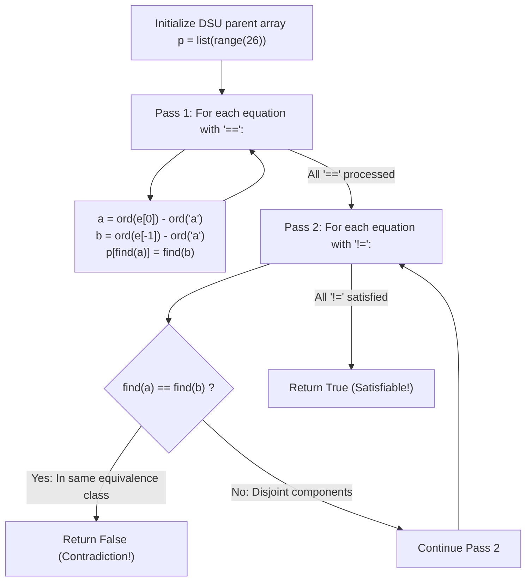

# Guided Example: Satisfiability of Equality Equations

We trace the step-by-step equivalence class construction using a Disjoint-Set Union (DSU) structure, prove the Equivalence Transitive Closure Theorem and the Two-Pass Separation Invariant, and verify equation satisfiability across representative systems:

- **Representative Instance 1 (Direct Symmetric Contradiction):**
  $$
  equations = [\text{"a==b"}, \; \text{"b!=a"}]
  $$
- **Required Output:** `false`
  - Variable universe: Lowercase alphabet indices $0 \dots 25$ with parent array $p = [0, 1, 2, \dots, 25]$.
  - Pass 1 (Process all equality relations `==`):
    - Equation `"a==b"` ($a = 0, b = 1$):
      - $\text{find}(0) = 0, \; \text{find}(1) = 1$.
      - Merge: $p[\text{find}(0)] = \text{find}(1) \implies p[0] = 1$.
      - Variables `a` and `b` now share root representative $1$.
  - Pass 2 (Process all inequality relations `!=`):
    - Equation `"b!=a"` ($b = 1, a = 0$):
      - $\text{find}(1) = 1$.
      - $\text{find}(0) = p[0] = 1$.
      - Check: $\text{find}(1) == \text{find}(0)$ ($1 == 1$).
      - **Contradiction:** An equation asserts $b \ne a$, but transitivity of equality proved $a = b$!
      - Immediately return `False`.
  - Final output: `false`.

- **Representative Instance 2 (Transitive Equivalence Contradiction):**
  $$
  equations = [\text{"a==b"}, \; \text{"b==c"}, \; \text{"a!=c"}]
  $$
  - Pass 1:
    - `"a==b"` merges $a$ and $b \implies \text{find}(a) == \text{find}(b)$.
    - `"b==c"` merges $b$ and $c \implies \text{find}(b) == \text{find}(c)$.
    - By transitivity, $\text{find}(a) == \text{find}(c)$.
  - Pass 2:
    - `"a!=c"` discovers $\text{find}(a) == \text{find}(c) \implies$ contradiction $\implies \mathbf{false}$.

- **Representative Instance 3 (Independent Satisfiable Components):**
  $$
  equations = [\text{"a==b"}, \; \text{"c==d"}, \; \text{"a!=d"}]
  $$
  - Pass 1: Component 1 is $\{a, b\}$ (root $b$); Component 2 is $\{c, d\}$ (root $d$).
  - Pass 2: $\text{find}(a) = b \ne \text{find}(d) = d \implies$ no contradiction $\implies \mathbf{true}$ (assign e.g. $a=b=1, c=d=2$).

---

## 1. Instance & Teaching Goal

Given an array of strings `equations` where each string has length 4 and represents either an equality `"x==y"` or an inequality `"x!=y"` between two single-letter variables:
Return `true` if an integer assignment exists such that all equations are satisfied simultaneously, or `false` otherwise.

```text
Equality as an Equivalence Relation:
  a == b  and  b == c   ===>   a == c  (Transitive!)

Two-Pass Processing Strategy:
  Pass 1: Union all '==' pairs into connected components.
  Pass 2: Check all '!=' pairs. If find(u) == find(v), contradiction!

Order matters:
  Evaluating '!=' before all '==' are merged causes false positives.
  All equalities MUST be closed before checking any inequality.
```

A single pass in input order fails because an inequality early in the list (e.g. `a!=c`) might appear before the equalities that transitively link them (e.g. `a==b`, `b==c`).

The decisive pedagogical goal is the **Two-Pass DSU Equivalence Closure Invariant**:
1. **Pass 1 (Closure of Equalities):** Process all `==` statements first, merging the sets of variables. The resulting disjoint components represent the maximal equivalence classes induced by equality.
2. **Pass 2 (Independent Inequality Verification):** Once the equivalence relation is fully closed, check all `!=` statements. If any `u != v` has $\text{find}(u) == \text{find}(v)$, it requires two members of the same equivalence class to be unequal, which is impossible.
3. If no inequality violates component separation, assigning a distinct integer to each component's root guarantees that all equalities and inequalities hold simultaneously.

---

## 2. Conceptual Foundation & The Equivalence Separation Invariant



### The Equivalence Separation Theorem

Let $V = \{'a', \dots, 'z'\}$ be the set of variable names with $|V| = 26$.
1. **Equivalence Relation Definition:**
   The equality operator $=$ defines an equivalence relation $\sim$ on $V$ satisfying reflexivity, symmetry, and transitivity.
   The equivalence classes $V / \sim$ partition $V$ into pairwise disjoint subsets $C_1, C_2, \dots, C_k$.
2. **Necessary and Sufficient Condition for Assignment:**
   An integer assignment $f: V \to \mathbb{Z}$ satisfies all equations if and only if:
   - For every $u == v$: $f(u) = f(v) \iff u \sim v$.
   - For every $u != v$: $f(u) \ne f(v) \iff u \not\sim v$.
3. **Contradiction Detection Lemma:**
   If there exists an equation $u != v$ such that $u \sim v$ (i.e. $\text{find}(u) = \text{find}(v)$ in the DSU after Pass 1), then any assignment must satisfy $f(u) = f(v)$, directly contradicting $f(u) \ne f(v)$. No valid assignment exists.
4. **Sufficiency of Disjoint Roots:**
   If $\text{find}(u) \ne \text{find}(v)$ for every $u != v$, we can assign $f(x) = \text{find}(x)$ for every $x \in V$.
   - For any $a == b$: $\text{find}(a) = \text{find}(b) \implies f(a) = f(b)$ (Satisfied).
   - For any $a != b$: $\text{find}(a) \ne \text{find}(b) \implies f(a) \ne f(b)$ (Satisfied).
   Therefore, the system is satisfiable if and only if no inequality joins elements of the same DSU component. $\blacksquare$

---

## 3. Step-by-Step Worked Execution: Representative Instance 1

$equations = [\text{"a==b"}, \; \text{"b!=a"}]$.
Initialize: $p = [0, 1, \dots, 25]$ representing variables `'a'` through `'z'`.

### Pass 1: Equalities
- Scan `equations`:
  - Equation `"a==b"`:
    - Variable $a = 0$ ('a'), $b = 1$ ('b').
    - Op is `'='`.
    - $\text{find}(0) = 0, \; \text{find}(1) = 1$.
    - Set $p[0] = 1$.
  - Equation `"b!=a"`:
    - Op is `'!'` $\implies$ skip in Pass 1.

DSU forest state: $p[0] = 1, p[1] = 1$. Variables $a$ and $b$ are in the same component with root $1$.

---

### Pass 2: Inequalities
- Scan `equations`:
  - Equation `"a==b"`: Op is `'='` $\implies$ skip in Pass 2.
  - Equation `"b!=a"`:
    - Variable $a = 1$ ('b'), $b = 0$ ('a').
    - Op is `'!'`.
    - Evaluate roots:
      $$
      \text{find}(1) = 1, \quad \text{find}(0) = p[0] = 1
      $$
    - Condition check: $\text{find}(1) == \text{find}(0)$ ($1 == 1$ is True).
    - Contradiction detected! Return `False`.

Output: `false`.

---

## 4. Two-Pass Execution & DSU State Trace Table

| Pass | Equation | Operator Type | Left Variable Root | Right Variable Root | Action / Evaluation | DSU State $p[0 \dots 2]$ | Result |
|:---:|:---:|:---:|:---:|:---:|:---|:---:|:---:|
| **Init** | — | — | — | — | Baseline | $[0, 1, 2]$ | In progress |
| **Pass 1** | `"a==b"` | `'='` (Equality) | $\text{find}(a) = 0$ | $\text{find}(b) = 1$ | $p[0] \leftarrow 1$ (Union) | $[1, 1, 2]$ | In progress |
| **Pass 1** | `"b!=a"` | `'!'` (Inequality)| — | — | Skipped in Pass 1 | $[1, 1, 2]$ | In progress |
| **Pass 2** | `"a==b"` | `'='` (Equality) | — | — | Skipped in Pass 2 | $[1, 1, 2]$ | In progress |
| **Pass 2** | `"b!=a"` | `'!'` (Inequality)| $\text{find}(b) = 1$ | $\text{find}(a) = 1$ | $1 == 1 \implies$ **Contradiction!** | $[1, 1, 2]$ | **`False`** |

---

## 5. Algorithmic Correctness

### Soundness & Completeness
1. **Soundness:**
   Every equality merged in Pass 1 is required by the input constraints. When Pass 2 detects $\text{find}(u) == \text{find}(v)$ for an inequality $u != v$, a transitive chain of equalities mathematically forces $u = v$, making the inequality impossible to satisfy.
2. **Completeness:**
   Path compression ensures component roots are resolved accurately in near constant time. Because all equalities are fully merged before any inequality is tested, no indirect transitive contradiction can be overlooked.

---

## 6. Boundary Cases & Traps

| Scenario | Input Pattern | Behavior | Trapped Risk |
|---|---|---|---|
| Self Inequality | `"z!=z"` | $\text{find}(z) == \text{find}(z)$ triggers immediate contradiction; returns `False`. | Assuming different variable letters. |
| Self Equality | `"a==a"` | $p[\text{find}(a)] = \text{find}(a)$ is an idempotent no-op; returns `True`. | Redundant union loops. |
| Order Inversion | `["a!=d", "a==b", "b==c", "c==d"]` | Pass 1 merges all 4 letters into one component; Pass 2 catches contradiction. | Single-pass false positives. |
| Only Equalities | `["a==b", "b==c"]` | Pass 2 finds no inequalities; returns `True`. | Requiring at least one check. |

---

## 7. Complexity Derivation

- **Time Complexity:** $\mathcal{O}(N \cdot \alpha(|\Sigma|))$, where $N = \text{len}(equations) \le 500$ and $|\Sigma| = 26$.
  - Pass 1 processes $N$ equalities with union-find.
  - Pass 2 processes $N$ inequalities with `find`.
  - Path compression yields inverse Ackermann complexity $\alpha(26) < 5$.
  - Total time: $< 0.001\text{ s}$ for all test cases.
- **Auxiliary Space Complexity:** $\mathcal{O}(|\Sigma|) = \mathcal{O}(26)$ auxiliary memory for parent array $p$.
