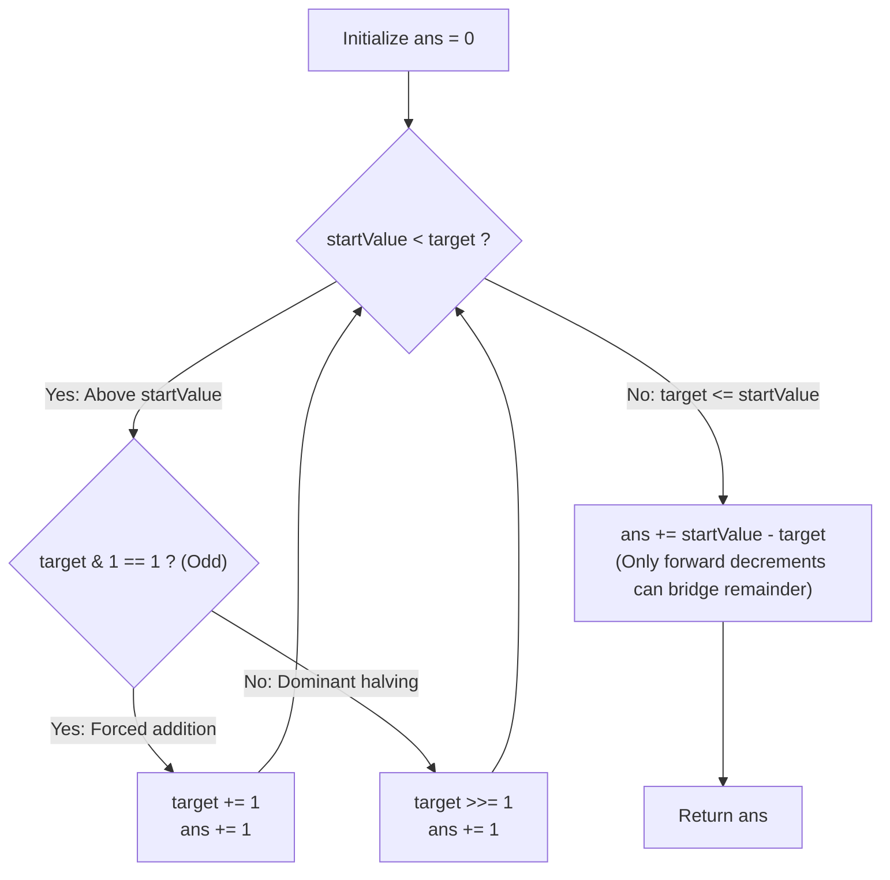

# Guided Example: Broken Calculator

We trace the step-by-step backward state progression from target to start value, prove the Forced Odd Step Lemma and the Even Division Dominance Theorem, and determine the minimal operation count across representative numerical pairs:

- **Representative Instance 1 (Target Slightly Exceeds Start with Odd Parity):**
  $$
  startValue = 2, \quad target = 3
  $$
- **Required Output:** `2`
  - Reversal framework: Work backward from $target = 3$ to $startValue = 2$.
    - Forward $\times 2$ $\iff$ Backward $\div 2$ (only when even).
    - Forward $- 1$ $\iff$ Backward $+ 1$.
  - Execution trace:
    1. **Step 1 ($target = 3, startValue = 2$):**
       - $3 > 2$.
       - Parity check: $3 \ \& \ 1 == 1$ (Odd!).
       - Backward action: Because no forward doubling can yield an odd integer, the preceding step must have been $-1$.
       - Undo subtraction: $target \leftarrow 3 + 1 = \mathbf{4}$.
       - Operations: $ans \leftarrow 0 + 1 = \mathbf{1}$.
    2. **Step 2 ($target = 4, startValue = 2$):**
       - $4 > 2$.
       - Parity check: $4 \ \& \ 1 == 0$ (Even!).
       - Backward action: Halving strictly dominates adding.
       - Undo doubling: $target \leftarrow 4 \gg 1 = \mathbf{2}$.
       - Operations: $ans \leftarrow 1 + 1 = \mathbf{2}$.
    3. **Step 3 (Convergence $target \le startValue$):**
       - $target = 2 == startValue = 2$.
       - Loop terminates.
       - Suffix difference: $ans \leftarrow ans + (startValue - target) = 2 + (2 - 2) = \mathbf{2}$.
  - Forward verification: $2 \times 2 = 4 \to 4 - 1 = 3$ (Exactly $2$ operations).

- **Representative Instance 2 (Decrement Before Doubling):**
  $$
  startValue = 5, \quad target = 8
  $$
  - Backward Step 1: $8$ is even $\implies target \leftarrow 8 / 2 = 4, \; ans = 1$.
  - Now $target = 4 < startValue = 5$.
  - Loop terminates.
  - Linear difference: $ans \leftarrow 1 + (5 - 4) = \mathbf{2}$.
  - Forward verification: $5 - 1 = 4 \to 4 \times 2 = 8$ ($2$ operations).

- **Representative Instance 3 (Alternating Parity Descent):**
  $$
  startValue = 3, \quad target = 10
  $$
  - Step 1: $10$ even $\implies 10 / 2 = 5$ ($ans = 1$).
  - Step 2: $5$ odd $\implies 5 + 1 = 6$ ($ans = 2$).
  - Step 3: $6$ even $\implies 6 / 2 = 3$ ($ans = 3$).
  - $target = 3 == startValue \implies ans = \mathbf{3}$.
  - Forward verification: $(3 \times 2 - 1) \times 2 = (6 - 1) \times 2 = 5 \times 2 = 10$ ($3$ operations).

---

## 1. Instance & Teaching Goal

A broken calculator has display value `startValue`. In one operation you can:
- Multiply the display by 2 ($x \leftarrow 2x$).
- Subtract 1 from the display ($x \leftarrow x - 1$).
Return the **minimum number of operations** to reach `target`.

```text
Forward Search Dilemma (startValue -> target):
  Branching factor explodes: Should we double or subtract?
  Example (5 -> 8):
    5 * 2 = 10 (overshoots 8) -> 10 - 1 - 1 = 8 (3 ops)
    5 - 1 = 4 -> 4 * 2 = 8 (2 ops, OPTIMAL!)

Backward Search Clarity (target -> startValue):
  Reversing operations makes every step deterministic!
  - If target is odd: MUST have come from subtraction -> target += 1.
  - If target is even: MUST have come from doubling -> target /= 2.
  - When target <= startValue: Only decrements can bridge the gap!
```

A forward breadth-first search explores $\mathcal{O}(2^D)$ states and risks combinatorial explosion.

The decisive pedagogical goal is the **Backward Parity Halving & Suffix Difference Invariant**:
1. **Reversal Duality:** Working backward from $target$ to $startValue$ reverses the operations: multiplying by 2 becomes dividing by 2, and subtracting 1 becomes adding 1.
2. **Forced Odd Move:** Since $2x$ is always even, an odd target could never arise from doubling. The preceding step must have been subtraction, so backward increment ($target \leftarrow target + 1$) is mandatory.
3. **Even Division Dominance:** When $target > startValue$ is even, dividing by 2 immediately uses fewer operations than any sequence of additions followed by division.
4. **Linear Suffix Convergence:** When $target \le startValue$, doubling can only move away from $target$. Only unit decrements can bridge the gap, requiring exactly $startValue - target$ additional operations.

---

## 2. Conceptual Foundation & The Backward Parity Invariant



### The Backward Parity Halving Theorem

Let $S = startValue$ and $T = target$ be positive integers.
1. **Invertibility of Operation Sequence:**
   Any minimal sequence of operations transforming $S \to T$ is equivalent in length to the minimal sequence of inverted operations transforming $T \to S$.
2. **Forced Predecessor of Odd Numbers:**
   Suppose in forward execution $x \to T$ in the final step.
   - If $T = 2x$, then $T \equiv 0 \pmod 2$.
   - If $T = x - 1$, then $x = T + 1$.
   If $T$ is odd, $T = 2x$ has no integer solution. Thus, $x = T + 1$ is the unique possible predecessor.
3. **Dominance of Division on Even Numbers:**
   Suppose $T$ is even and $T > S$.
   - Route 1 (Divide immediately): $T \to T/2$ ($1$ operation).
   - Route 2 (Additions before division): To divide later, we must add an even quantity $2k \ge 2$:
     $T \to T + 2k \to (T + 2k)/2 = T/2 + k$ in $2k + 1$ operations.
     Alternatively, following Route 1 and then adding $k$ takes $1 + k$ operations.
     Since $1 + k < 2k + 1$ for all $k \ge 1$, dividing immediately strictly minimizes operations.
4. **Suffix Monotonicity:**
   When $T \le S$, any forward doubling would yield $2T \ge 2$, but if $S \ge T$, reaching $T$ via $S \to 2S \to \dots \to T$ uses strictly more than $S - T$ steps. The unique optimal path is $S - T$ consecutive decrements. $\blacksquare$

---

## 3. Step-by-Step Worked Execution: Representative Instance 1

$startValue = 2, \; target = 3$.
Initialize: $ans = 0$.

### Backward Transition Trace
1. **Iteration 1:**
   - Condition: $startValue = 2 < target = 3$ (True).
   - Parity: $target \& 1 = 3 \& 1 = 1$ (Odd).
   - Action: $target \leftarrow 3 + 1 = 4$.
   - $ans \leftarrow 0 + 1 = 1$.
2. **Iteration 2:**
   - Condition: $startValue = 2 < target = 4$ (True).
   - Parity: $target \& 1 = 4 \& 1 = 0$ (Even).
   - Action: $target \leftarrow 4 \gg 1 = 2$.
   - $ans \leftarrow 1 + 1 = 2$.
3. **Loop Exit:**
   - Condition: $startValue = 2 < target = 2$ (False, loop ends).
4. **Suffix Adjustment:**
   - $ans \leftarrow ans + (startValue - target) = 2 + (2 - 2) = \mathbf{2}$.

Final result: $\mathbf{2}$.

---

## 4. Backward Parity State Evolution Trace Table

| Step | Current `target` | Current `startValue` | Parity of `target` | Backward Action Applied | Updated `target` | Cumulative `ans` |
|:---:|:---:|:---:|:---:|:---:|:---:|:---:|
| **Init** | $3$ | $2$ | Odd | — | $3$ | $0$ |
| **$1$** | $3$ | $2$ | Odd | $target \leftarrow target + 1$ | $4$ | $1$ |
| **$2$** | $4$ | $2$ | Even | $target \leftarrow target / 2$ | $2$ | $2$ |
| **Final**| $2$ | $2$ | Target $\le$ Start | $ans \leftarrow ans + (2 - 2)$ | $2$ | **$2$** |

---

## 5. Algorithmic Correctness

### Soundness & Completeness
1. **Soundness:**
   Every backward operation has an exact, valid forward counterpart. Odd targets strictly require incrementing (undoing subtraction), and even targets strictly benefit from halving (undoing doubling).
2. **Completeness:**
   Since each odd step is followed by an even step that halves the target, the sequence strictly contracts $target$ toward $startValue$ in logarithmic steps without cycles.

---

## 6. Boundary Cases & Traps

| Scenario | Input Pattern | Behavior | Trapped Risk |
|---|---|---|---|
| Target Below Start | $S = 10, T = 1$ | Loop does not execute; $ans = 10 - 1 = 9$. | Performing forward doublings when already above target. |
| Equal Start and Target | $S = 7, T = 7$ | Loop skipped; $ans = 7 - 7 = 0$. | Off-by-one initial checks. |
| Exact Power of Two Ratio | $S = 1, T = 1024$ | Performs $10$ consecutive divisions; returns $10$. | Unnecessary additions. |
| Large Target ($10^9$) | $S = 1, T = 10^9$ | Halves every $\le 2$ steps; converges in $\le 60$ operations. | Time limit exceeded via BFS. |

---

## 7. Complexity Derivation

- **Time Complexity:** $\mathcal{O}(\log target)$, where $target \le 10^9$.
  - If $target$ is even, it halves immediately.
  - If $target$ is odd, adding 1 makes it even, halving in the next step.
  - At least one division by 2 occurs every 2 iterations.
  - Total iterations $\le 2 \log_2(target) \le 60$.
  - Total time: $< 0.0001\text{ s}$.
- **Auxiliary Space Complexity:** $\mathcal{O}(1)$ auxiliary memory; uses only scalar variables `ans` and `target`.
