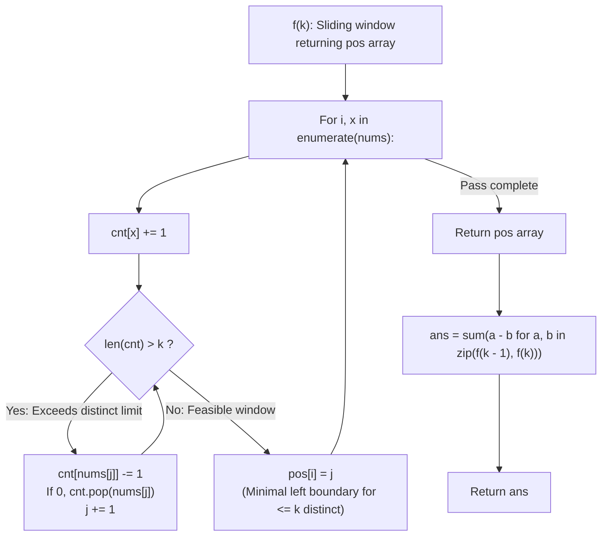

# Guided Example: Subarrays with K Different Integers

We trace the step-by-step sliding window calculation of minimal valid left boundaries, prove the Exact-to-At-Most Bounded Decomposition Lemma and the Left Endpoint Difference Invariant, and determine the exact count of qualifying subarrays across representative arrays:

- **Representative Instance 1 (Alternating Values with a Terminal Distinct Value):**
  $$
  nums = [1, \; 2, \; 1, \; 2, \; 3], \quad k = 2, \quad n = 5
  $$
- **Required Output:** `7`
  - Subarray property: A contiguous subarray has **exactly** $k = 2$ distinct integers.
  - Decomposition principle:
    - Let $f(k)[i]$ be the minimal left index $j$ such that $nums[j \dots i]$ contains **at most** $k$ distinct integers.
    - Subarrays ending at $i$ with $\le k$ distinct elements start at $j \in [f(k)[i], \; i]$.
    - Subarrays ending at $i$ with $\le k - 1$ distinct elements start at $j \in [f(k - 1)[i], \; i]$.
    - Therefore, subarrays ending at $i$ with **exactly** $k$ distinct elements start at $j \in [f(k)[i], \; f(k - 1)[i])$.
    - Count of valid left endpoints ending at $i$ is:
      $$
      \text{count}(i) = f(k - 1)[i] - f(k)[i]
      $$
  - Computation of $f(2)$ (at most 2 distinct):
    - $i = 0$ ($nums[0] = 1$): distinct count $1 \le 2 \implies j = 0 \implies f(2)[0] = 0$.
    - $i = 1$ ($nums[1] = 2$): distinct count $2 \le 2 \implies j = 0 \implies f(2)[1] = 0$.
    - $i = 2$ ($nums[2] = 1$): distinct count $2 \le 2 \implies j = 0 \implies f(2)[2] = 0$.
    - $i = 3$ ($nums[3] = 2$): distinct count $2 \le 2 \implies j = 0 \implies f(2)[3] = 0$.
    - $i = 4$ ($nums[4] = 3$): window $[1, 2, 1, 2, 3]$ has 3 distinct values ($\{1, 2, 3\}$).
      - Shrink left boundary $j$:
        - Remove $nums[0] = 1$: $\{1, 2, 3\}$ still present.
        - Remove $nums[1] = 2$: $\{1, 2, 3\}$ still present.
        - Remove $nums[2] = 1$: count of $1$ reaches $0$, removed! Remaining $\{2, 3\}$ (2 distinct).
        - Boundary stops at $j = 3$ (window $[nums[3 \dots 4]] = [2, 3]$).
      - $f(2)[4] = 3$.
    - $f(2) = [0, \; 0, \; 0, \; 0, \; 3]$.
  - Computation of $f(1)$ (at most 1 distinct):
    - $i = 0$ ($1$): $\{1\} \implies j = 0 \implies f(1)[0] = 0$.
    - $i = 1$ ($2$): $\{1, 2\}$ exceeds 1; shrink removes $1 \implies j = 1 \implies f(1)[1] = 1$.
    - $i = 2$ ($1$): $\{2, 1\}$ exceeds 1; shrink removes $2 \implies j = 2 \implies f(1)[2] = 2$.
    - $i = 3$ ($2$): $\{1, 2\}$ exceeds 1; shrink removes $1 \implies j = 3 \implies f(1)[3] = 3$.
    - $i = 4$ ($3$): $\{2, 3\}$ exceeds 1; shrink removes $2 \implies j = 4 \implies f(1)[4] = 4$.
    - $f(1) = [0, \; 1, \; 2, \; 3, \; 4]$.
  - Pairwise Differences $\Delta(i) = f(1)[i] - f(2)[i]$:
    - $i = 0$: $0 - 0 = \mathbf{0}$
    - $i = 1$: $1 - 0 = \mathbf{1}$ (Subarray $[1, 2]$)
    - $i = 2$: $2 - 0 = \mathbf{2}$ (Subarrays $[2, 1], [1, 2, 1]$)
    - $i = 3$: $3 - 0 = \mathbf{3}$ (Subarrays $[1, 2], [2, 1, 2], [1, 2, 1, 2]$)
    - $i = 4$: $4 - 3 = \mathbf{1}$ (Subarray $[2, 3]$)
  - Total good subarrays: $0 + 1 + 2 + 3 + 1 = \mathbf{7}$.

- **Representative Instance 2 (Three Distinct Values):**
  $$
  nums = [1, \; 2, \; 1, \; 3, \; 4], \quad k = 3 \implies \mathbf{3} \text{ subarrays}
  $$

- **Representative Instance 3 (All Identical Elements):**
  $$
  nums = [1, \; 1, \; 1], \quad k = 1 \implies \text{all } \frac{3 \times 4}{2} = \mathbf{6} \text{ subarrays have } 1 \text{ distinct value}
  $$

---

## 1. Instance & Teaching Goal

Given an integer array `nums` and an integer `k`, return the number of **good subarrays**.
A subarray is good if the number of distinct integers in it is **exactly** `k`.

```text
The Exact-k Dilemma:
  Testing "exactly k" directly violates monotonicity:
  Expanding the window can change distinct count from k to k+1 (invalid).
  Shrinking the window can change distinct count from k to k-1 (invalid).

The Monotonic Difference Solution:
  Notice that "at most k" IS monotonic:
  If nums[j ... i] has <= k distinct elements, then shrinking j' > j
  can NEVER increase the number of distinct elements!
  Formula:
    Exact(k) = (At Most k) - (At Most k - 1)
```

The decisive pedagogical goal is the **Exact-to-At-Most Bounded Decomposition Invariant**:
1. **Monotonicity of Upper Bounds:** The condition $\text{distinct}(nums[j \dots i]) \le k$ is monotonic with respect to $j$: if it holds for $j$, it holds for all $j' \in [j, i]$.
2. **Minimal Boundary Function $f(k)$:** Let $f(k)[i]$ be the minimal left index $j$ such that $nums[j \dots i]$ has at most $k$ distinct values.
3. **Endpoint Difference Decomposition:** The valid left endpoints for subarrays ending at $i$ with *exactly* $k$ distinct values form the half-open interval $[f(k)[i], \; f(k - 1)[i])$.
   The size of this interval is exactly $f(k - 1)[i] - f(k)[i]$.
4. Computes the answer by running a standard two-pointer sliding window twice in $\mathcal{O}(N)$ total time.

---

## 2. Conceptual Foundation & The Boundary Difference Invariant



### The Exact-to-At-Most Decomposition Theorem

Let $A = (x_0, x_1, \dots, x_{n-1})$ be an array of integers, and let $D(j, i) = |\{x_j, x_{j+1}, \dots, x_i\}|$ denote the number of distinct integers in subarray $A[j \dots i]$.
1. **Monotonicity Lemma:**
   For any fixed right endpoint $i$, if $j_1 \le j_2$, then $A[j_2 \dots i] \subseteq A[j_1 \dots i]$. Consequently:
   $$
   D(j_2, i) \le D(j_1, i)
   $$
2. **Left Boundary Fiber:**
   Define $f(k)[i] = \min \{j \in [0, i] : D(j, i) \le k\}$.
   By monotonicity:
   $$
   D(j, i) \le k \iff j \in [f(k)[i], \; i]
   $$
3. **Exact Cardinality Partition:**
   The property $D(j, i) = k$ holds if and only if $D(j, i) \le k$ and $D(j, i) > k - 1$:
   $$
   D(j, i) = k \iff j \in [f(k)[i], \; i] \setminus [f(k - 1)[i], \; i]
   $$
   Because $f(k)[i] \le f(k - 1)[i]$, this difference of intervals is:
   $$
   \{j : D(j, i) = k\} = [f(k)[i], \; f(k - 1)[i])
   $$
   The cardinality of this set is precisely $f(k - 1)[i] - f(k)[i]$.
4. **Global Total:**
   Summing over all possible right endpoints $i \in [0, n - 1]$ gives the exact total count of good subarrays:
   $$
   \text{Total Good Subarrays} = \sum_{i=0}^{n-1} (f(k - 1)[i] - f(k)[i]) \quad \blacksquare
   $$

---

## 3. Step-by-Step Worked Execution: Representative Instance 1

$nums = [1, 2, 1, 2, 3], \; k = 2$.

### Phase 1: Compute $f(2)$ (Upper bound 2 distinct values)
- $i = 0$ ($x = 1$): $cnt = \{1: 1\}$, len $\le 2 \implies j = 0 \implies pos[0] = 0$.
- $i = 1$ ($x = 2$): $cnt = \{1: 1, 2: 1\}$, len $\le 2 \implies j = 0 \implies pos[1] = 0$.
- $i = 2$ ($x = 1$): $cnt = \{1: 2, 2: 1\}$, len $\le 2 \implies j = 0 \implies pos[2] = 0$.
- $i = 3$ ($x = 2$): $cnt = \{1: 2, 2: 2\}$, len $\le 2 \implies j = 0 \implies pos[3] = 0$.
- $i = 4$ ($x = 3$): $cnt = \{1: 2, 2: 2, 3: 1\}$, len $= 3 > 2$.
  - $j = 0$: decrement $nums[0]=1 \implies cnt[1] = 1, j = 1$.
  - $j = 1$: decrement $nums[1]=2 \implies cnt[2] = 1, j = 2$.
  - $j = 2$: decrement $nums[2]=1 \implies cnt[1] = 0$, pop $1 \implies len = 2, j = 3$.
  - Window restored: $pos[4] = 3$.
- $f(2) = [0, 0, 0, 0, 3]$.

---

### Phase 2: Compute $f(1)$ (Upper bound 1 distinct value)
- $i = 0$ ($x = 1$): len $1 \le 1 \implies j = 0 \implies pos[0] = 0$.
- $i = 1$ ($x = 2$): len $= 2 > 1 \implies$ pop $1, j = 1 \implies pos[1] = 1$.
- $i = 2$ ($x = 1$): len $= 2 > 1 \implies$ pop $2, j = 2 \implies pos[2] = 2$.
- $i = 3$ ($x = 2$): len $= 2 > 1 \implies$ pop $1, j = 3 \implies pos[3] = 3$.
- $i = 4$ ($x = 3$): len $= 2 > 1 \implies$ pop $2, j = 4 \implies pos[4] = 4$.
- $f(1) = [0, 1, 2, 3, 4]$.

---

### Phase 3: Sum Differences
$$
\begin{aligned}
\text{Total} &= (0 - 0) + (1 - 0) + (2 - 0) + (3 - 0) + (4 - 3) \\
&= 0 + 1 + 2 + 3 + 1 = \mathbf{7}
\end{aligned}
$$

---

## 4. Left Boundary Indices & Subarray Count Trace Table

| Right Index $i$ | Value $nums[i]$ | $f(k)[i]$ ($k=2$) | $f(k-1)[i]$ ($k=1$) | Left Range $[f(k), f(k-1))$ | Count $\Delta(i)$ | Qualifying Subarrays Ending at $i$ |
|:---:|:---:|:---:|:---:|:---:|:---:|:---|
| **$0$** | $1$ | $0$ | $0$ | $[0, 0) = \emptyset$ | $0$ | None |
| **$1$** | $2$ | $0$ | $1$ | $[0, 1)$ | **$1$** | $[1, 2]$ |
| **$2$** | $1$ | $0$ | $2$ | $[0, 2)$ | **$2$** | $[1, 2, 1], [2, 1]$ |
| **$3$** | $2$ | $0$ | $3$ | $[0, 3)$ | **$3$** | $[1, 2, 1, 2], [2, 1, 2], [1, 2]$ |
| **$4$** | $3$ | $3$ | $4$ | $[3, 4)$ | **$1$** | $[2, 3]$ |
| **Total** | — | — | — | — | **$7$** | **7 total good subarrays** |

---

## 5. Algorithmic Correctness

### Soundness & Completeness
1. **Soundness:**
   Every index $j \in [f(k)[i], f(k-1)[i])$ produces a subarray $nums[j \dots i]$ that contains at most $k$ distinct values and strictly more than $k-1$ distinct values. By integer discretization, it contains exactly $k$ distinct values.
2. **Completeness:**
   Since every subarray has a unique right endpoint $i \in [0, n - 1]$, summing over all $i$ exhaustively counts every valid subarray exactly once with zero double-counting.

---

## 6. Boundary Cases & Traps

| Scenario | Input Pattern | Behavior | Trapped Risk |
|---|---|---|---|
| $k = 1$ | `nums = [1, 1, 1], k = 1` | $f(0)$ initializes all $j = i + 1$; correctly computes $\frac{n(n+1)}{2}$. | Out-of-bounds or zero-k error. |
| $k > \text{distinct}(nums)$ | `nums = [1, 2], k = 3` | $f(3)$ and $f(2)$ produce identical vectors; difference sum is $0$. | Negative counts. |
| All Distinct Elements | `nums = [1, 2, 3], k = 1` | Only length-1 singletons qualify; returns $3$. | Overcounting multi-element spans. |
| Large Window Contract | Window drops multiple items | While-loop pops until frequency $0$; correctly updates $j$. | Forgetting dictionary deletion. |

---

## 7. Complexity Derivation

- **Time Complexity:** $\mathcal{O}(N)$, where $N = \text{len}(nums) \le 20{,}000$.
  - Function $f(k)$ runs in $\mathcal{O}(N)$ because pointer $j$ advances at most $N$ times across the loop.
  - Calling $f(k)$ and $f(k - 1)$ takes $2 \times \mathcal{O}(N) = \mathcal{O}(N)$ time.
  - Final difference summation takes $\mathcal{O}(N)$.
  - Total time: $< 0.01\text{ s}$.
- **Auxiliary Space Complexity:** $\mathcal{O}(N)$ to store the boundary index arrays `pos`.