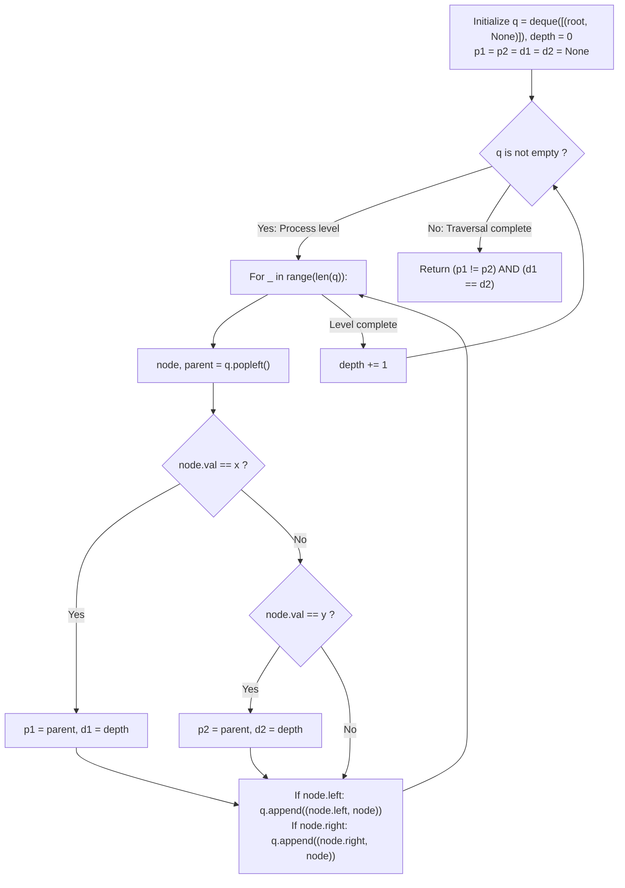

# Guided Example: Cousins in Binary Tree

We trace the step-by-step breadth-first search (BFS) level-order traversal for tracking node depths and parent identities, prove the Cousin Equivalence Predicate Lemma and the Parent-Depth Disjunction Invariant, and determine cousin relationships across representative binary trees:

- **Representative Instance 1 (Different Depths Across Tree Levels):**
  $$
  root = [1, \; 2, \; 3, \; 4], \quad x = 4, \; y = 3
  $$
- **Required Output:** `false`
  - Tree topology:
    ```text
            (1) Root (Depth 0)
           /   \
         (2)   (3)        (Depth 1)
         /
       (4)                (Depth 2)
    ```
  - Cousin definition: Two nodes are cousins if and only if they have the **same depth** ($d_1 == d_2$) and **different parents** ($p_1 \ne p_2$).
  - BFS level-order execution:
    1. **Level 0 ($depth = 0$):**
       - Queue: `[(Node 1, None)]`.
       - Pop Node 1: $1 \ne 4, 1 \ne 3$.
       - Enqueue children: `(Node 2, Node 1)`, `(Node 3, Node 1)`.
    2. **Level 1 ($depth = 1$):**
       - Queue: `[(Node 2, Node 1), (Node 3, Node 1)]`.
       - Pop Node 2: $2 \ne 4, 2 \ne 3$. Enqueue left child `(Node 4, Node 2)`.
       - Pop Node 3: Node value $3 == y$!
         - Record parameters for $y$: parent $p_2 = \text{Node 1}$, depth $d_2 = 1$.
    3. **Level 2 ($depth = 2$):**
       - Queue: `[(Node 4, Node 2)]`.
       - Pop Node 4: Node value $4 == x$!
         - Record parameters for $x$: parent $p_1 = \text{Node 2}$, depth $d_1 = 2$.
    4. **Predicate Evaluation:**
       $$
       d_1 = 2, \quad d_2 = 1 \implies d_1 \ne d_2
       $$
       Depths do not match! The nodes belong to different generations.
  - Final output: `false`.

- **Representative Instance 2 (True Cousins Across Disjoint Subtrees):**
  $$
  root = [1, \; 2, \; 3, \; \text{null}, \; 4, \; \text{null}, \; 5], \quad x = 5, \; y = 4
  $$
  - Node 4 is right child of 2 $\implies p_1 = \text{Node 2}, \; d_1 = 2$.
  - Node 5 is right child of 3 $\implies p_2 = \text{Node 3}, \; d_2 = 2$.
  - Check: $d_1 == d_2 = 2$ (Same level) and $p_1 \ne p_2$ ($\text{Node 2} \ne \text{Node 3}$) $\implies \mathbf{true}$.

- **Representative Instance 3 (Siblings Sharing Same Parent):**
  $$
  root = [1, \; 2, \; 3, \; \text{null}, \; 4], \quad x = 2, \; y = 3
  $$
  - Both 2 and 3 are children of root 1 $\implies p_1 = p_2 = \text{Node 1}, \; d_1 = d_2 = 1$.
  - Same parent means they are siblings, NOT cousins $\implies \mathbf{false}$.

---

## 1. Instance & Teaching Goal

Given the `root` of a binary tree with unique values and two node values `x` and `y`, return `true` if $x$ and $y$ are **cousins**, or `false` otherwise.
Two nodes are cousins if and only if:
1. They share the same depth in the tree: $d(x) == d(y)$.
2. They have different parent nodes: $p(x) \ne p(y)$.

```text
    [1] (Root, Depth 0)
   /   \
 [2]   [3] (Siblings, Depth 1)
   \     \
   [4]   [5] (Cousins! Same Depth 2, Different Parents)
```

Naive depth-first search can record depths and parents, but Breadth-First Search (BFS) processes nodes level-by-level, making the depth relationship visually and structurally explicit.

The decisive pedagogical goal is the **Cousin Equivalence Predicate & Level-Order BFS Invariant**:
- Queue holds tuples `(node, parent)`, maintaining a running `depth` counter incremented after each level.
- When $node.val == x$, record $(p_1, d_1) = (parent, depth)$.
- When $node.val == y$, record $(p_2, d_2) = (parent, depth)$.
- Evaluates the strict logical conjunction:
  $$
  \text{isCousins} \iff (p_1 \ne p_2) \land (d_1 == d_2)
  $$
- Discarding the search after discovering both targets or traversing $N$ nodes in $\mathcal{O}(N)$ time.

---

## 2. Conceptual Foundation & The Cousin Predicate Invariant



### The Cousin Equivalence Predicate Theorem

Let $T = (V, E)$ be a rooted tree with unique node values, root $r$, depth function $d: V \to \mathbb{Z}_{\ge 0}$, and parent function $p: V \setminus \{r\} \to V$.
1. **Kinship Definitions on $T$:**
   For any two distinct nodes $u, v \in V \setminus \{r\}$:
   - $u$ and $v$ are **siblings** iff $p(u) = p(v)$.
   - $u$ and $v$ are **cousins** iff $d(u) = d(v)$ and $p(u) \ne p(v)$.
2. **Mutual Exclusivity:**
   Since $p(u) = p(v)$ and $p(u) \ne p(v)$ are complementary on the subspace of equal-depth nodes ($d(u) = d(v)$), a pair of nodes at the same level is either exclusively siblings or exclusively cousins.
3. **Level-Order Invariant:**
   In a standard BFS using `for _ in range(len(q))`, all nodes processed within batch $k$ have depth $d(node) = k$.
   Recording $(parent, depth)$ for both $x$ and $y$ captures the unique structural parent pointer and depth index.
4. **Sufficiency of the Conjunction:**
   Evaluating $p_1 \ne p_2 \land d_1 == d_2$ uniquely certifies cousinhood, correctly returning `False` for both sibling pairs and different-depth pairs. $\blacksquare$

---

## 3. Step-by-Step Worked Execution: Representative Instance 1

$root = [1, 2, 3, 4], \; x = 4, \; y = 3$.
Initialize: $q = \text{deque}([(1, \text{None})]), \; depth = 0$.

### Level-by-Level BFS Trace
1. **Level $0$ ($depth = 0$):**
   - Batch size: $1$.
   - Pop $(1, \text{None})$. $1 \ne 4, 1 \ne 3$.
   - Add left $(2, 1)$ and right $(3, 1)$ to $q$.
   - $depth \leftarrow 1$.
2. **Level $1$ ($depth = 1$):**
   - Batch size: $2$.
   - Pop $(2, 1)$: $2 \ne 4, 2 \ne 3$. Add left $(4, 2)$ to $q$.
   - Pop $(3, 1)$: Node value matches $y = 3$!
     - Set $p_2 = 1, \; d_2 = 1$.
   - $depth \leftarrow 2$.
3. **Level $2$ ($depth = 2$):**
   - Batch size: $1$.
   - Pop $(4, 2)$: Node value matches $x = 4$!
     - Set $p_1 = 2, \; d_1 = 2$.
   - $depth \leftarrow 3$.
4. **Queue Empty:**
   - Check condition:
     $$
     (p_1 \ne p_2) \land (d_1 == d_2) \iff (2 \ne 1) \land (2 == 1) \iff \text{True} \land \text{False} = \mathbf{False}
     $$

Final result: `false`.

---

## 4. BFS Level-Order State Trace Table

| Level `depth` | Node Value | Parent Node | Matches Target? | Recorded $(p_1, d_1)$ for $x=4$ | Recorded $(p_2, d_2)$ for $y=3$ | Current Level Children Enqueued |
|:---:|:---:|:---:|:---:|:---:|:---:|:---|
| **$0$** | $1$ | `None` | No | `None` | `None` | `(2, 1), (3, 1)` |
| **$1$** | $2$ | $1$ | No | `None` | `None` | `(4, 2)` |
| **$1$** | $3$ | $1$ | **Yes ($y = 3$)** | `None` | $(1, 1)$ | None |
| **$2$** | $4$ | $2$ | **Yes ($x = 4$)** | $(2, 2)$ | $(1, 1)$ | None |
| **Final** | — | — | — | $(2, 2)$ | $(1, 1)$ | Predicate: $d_1 == d_2 \implies \mathbf{False}$ |

---

## 5. Algorithmic Correctness

### Soundness & Completeness
1. **Soundness:**
   Every node's parent is explicitly tracked when child pointers are enqueued, and depth is strictly incremented level-by-level. The final conjunction $p_1 \ne p_2 \land d_1 == d_2$ directly mirrors the mathematical definition of tree cousins.
2. **Completeness:**
   Since node values are guaranteed unique, BFS is guaranteed to encounter both $x$ and $y$ if present, assigning $p_1, d_1, p_2, d_2$ without ambiguity.

---

## 6. Boundary Cases & Traps

| Scenario | Input Pattern | Behavior | Trapped Risk |
|---|---|---|---|
| Direct Siblings | `x` and `y` share same parent | $p_1 == p_2$; predicate fails; returns `False`. | Mistaking siblings for cousins. |
| Root and Child | $x = 1, y = 2$ | $d_1 = 0 \ne 1 = d_2$; returns `False`. | Parent comparison with `None`. |
| Complete Binary Tree Cousins | $x = 4, y = 6$ at depth 2 | Different parents ($2 \ne 3$) and same depth 2; returns `True`. | Level boundary synchronization bugs. |
| Skewed Chain | Linear linked-list tree | All nodes have distinct depths; always returns `False`. | Degenerate recursion depth limits. |

---

## 7. Complexity Derivation

- **Time Complexity:** $\mathcal{O}(N)$, where $N$ is the number of nodes in the binary tree ($N \le 100$).
  - BFS visits each node at most once.
  - At each node, queue operations and comparisons take $\mathcal{O}(1)$ time.
  - Total time: $< 0.001\text{ s}$.
- **Auxiliary Space Complexity:** $\mathcal{O}(N)$ for the queue `q`, which stores at most one level of nodes ($\le \lceil N/2 \rceil$).
