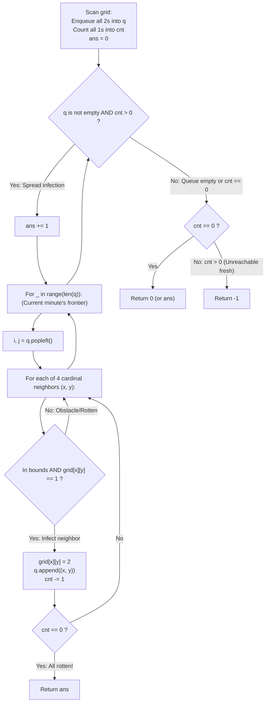

# Guided Example: Rotting Oranges

We trace the step-by-step multi-source breadth-first search (BFS) contagion propagation, prove the Simultaneous Wavefront Equivalence Theorem and the Fresh Counter Depletion Invariant, and determine the minimal minutes until complete infection across representative grid instances:

- **Representative Instance 1 (Full Contagion Across Connected Grid):**
  $$
  grid = \begin{bmatrix}
  2 & 1 & 1 \\
  1 & 1 & 0 \\
  0 & 1 & 1
  \end{bmatrix}, \quad m = 3, \; n = 3
  $$
- **Required Output:** `4`
  - Step 0 (Grid Scan & Multi-Source Queue Setup):
    - Initial rotten source: $(0, 0)$ with $grid[0][0] = 2 \implies q = \text{deque}([(0, 0)])$.
    - Initial fresh count: $cnt = 6$ (cells $(0,1), (0,2), (1,0), (1,1), (2,1), (2,2)$).
    - Initial minutes: $ans = 0$.
  - Minute 1 ($ans = 1$):
    - Batch size: $1$ (Node $(0, 0)$).
    - Neighbors of $(0, 0)$:
      - $(0, 1)$ is fresh ($1$) $\implies$ rot to $2$, enqueue $(0, 1)$, $cnt \leftarrow 5$.
      - $(1, 0)$ is fresh ($1$) $\implies$ rot to $2$, enqueue $(1, 0)$, $cnt \leftarrow 4$.
    - Queue for next minute: `[(0, 1), (1, 0)]`.
  - Minute 2 ($ans = 2$):
    - Batch size: $2$.
    - Expand $(0, 1)$:
      - $(0, 2)$ is fresh $\implies$ rot to $2$, enqueue $(0, 2)$, $cnt \leftarrow 3$.
      - $(1, 1)$ is fresh $\implies$ rot to $2$, enqueue $(1, 1)$, $cnt \leftarrow 2$.
    - Expand $(1, 0)$:
      - Neighbors $(0, 0)=2, (2, 0)=0, (1, 1)=2$ (Already visited or obstacle).
    - Queue for next minute: `[(0, 2), (1, 1)]`.
  - Minute 3 ($ans = 3$):
    - Batch size: $2$.
    - Expand $(0, 2)$: neighbors are $(0, 1)=2$ and $(1, 2)=0$. No fresh neighbors.
    - Expand $(1, 1)$:
      - $(2, 1)$ is fresh $\implies$ rot to $2$, enqueue $(2, 1)$, $cnt \leftarrow 1$.
    - Queue for next minute: `[(2, 1)]`.
  - Minute 4 ($ans = 4$):
    - Batch size: $1$.
    - Expand $(2, 1)$:
      - $(2, 2)$ is fresh $\implies$ rot to $2$, enqueue $(2, 2)$, $cnt \leftarrow 0$.
      - $cnt == 0$ reached! **All fresh oranges rotten!**
      - Immediately return $ans = \mathbf{4}$.
  - Total minutes: $\mathbf{4}$.

- **Representative Instance 2 (Isolated Unreachable Fresh Orange):**
  $$
  grid = \begin{bmatrix}
  2 & 1 & 1 \\
  0 & 1 & 1 \\
  1 & 0 & 1
  \end{bmatrix} \implies \text{fresh orange at } (2, 0) \text{ is walled off by zeros} \implies \mathbf{-1}
  $$

- **Representative Instance 3 (Zero Initial Fresh Oranges):**
  $$
  grid = \begin{bmatrix}
  0 & 2
  \end{bmatrix} \implies cnt = 0 \implies \text{loop skipped} \implies \mathbf{0}
  $$

---

## 1. Instance & Teaching Goal

Given an $m \times n$ `grid` where:
- `0` represents an empty cell,
- `1` represents a fresh orange,
- `2` represents a rotten orange.
Every minute, any fresh orange 4-directionally adjacent to a rotten orange becomes rotten.
Return the **minimum number of minutes** until no fresh orange remains, or `-1` if it is impossible.

```text
Multi-Source Wavefront Expansion:
Minute 0:          Minute 1:          Minute 2:          Minute 4:
[2]  1   1        [2] [2]  1         [2] [2] [2]        [2] [2] [2]
 1   1   0        [2]  1   0         [2] [2]  0         [2] [2]  0
 0   1   1         0   1   1          0   1   1          0  [2] [2]

All initial rotten sources expand SIMULTANEOUSLY layer-by-layer.
```

Running separate single-source BFS from each rotten orange requires storing arrival times and computing pairwise minimums, leading to redundant work and complex edge handling.

The decisive pedagogical goal is the **Simultaneous Multi-Source BFS & Fresh Counter Depletion Invariant**:
1. **Multi-Source Seeding:** All initially rotten cells ($grid[i][j] == 2$) are enqueued simultaneously at $t = 0$.
2. **Synchronized Minute Layers:** Capturing `len(q)` at the start of each while iteration processes exactly one minute's infection wavefront. Newly infected cells cannot infect their own neighbors until the subsequent minute.
3. **Exact Remaining Work Tracking:** Variable `cnt` tracks the number of uninfected fresh oranges. When $cnt$ reaches $0$, the current elapsed minutes $ans$ is returned immediately.
4. If the queue becomes empty while $cnt > 0$, unreachable fresh oranges exist, returning `-1`.

---

## 2. Conceptual Foundation & The Multi-Source Wavefront Invariant



### The Multi-Source Wavefront Equivalence Theorem

Let $G = (V, E)$ be the 4-connected grid graph where $V = \{(i, j) : grid[i][j] \ne 0\}$.
1. **Multi-Source Shortest Path Formulation:**
   Let $S_0 = \{(i, j) : grid[i][j] = 2\}$ be the set of initial infection sources.
   The time at which cell $u \in V$ becomes rotten is the shortest path distance in $G$ from $u$ to the closest source in $S_0$:
   $$
   \tau(u) = \min_{s \in S_0} \text{dist}_G(s, u)
   $$
2. **Wavefront BFS Equivalence:**
   Enqueuing all elements of $S_0$ into queue $q$ at $t = 0$ and advancing layer-by-layer using `for _ in range(len(q))` guarantees that all cells popped in iteration $k$ have $\tau(u) = k - 1$, and all newly infected neighbors enqueued have $\tau(v) = k$.
3. **Termination Condition:**
   - Case 1 ($cnt = 0$): If every fresh orange has finite distance to $S_0$, the total time to infect all oranges is $\max_{u \in \text{Fresh}} \tau(u) = ans$.
   - Case 2 ($cnt > 0$ with empty queue): If there exists a fresh orange $v$ such that $\text{dist}_G(s, v) = \infty$ for all $s \in S_0$, $v$ can never be infected. The algorithm terminates with $cnt > 0$ and correctly returns $-1$. $\blacksquare$

---

## 3. Step-by-Step Worked Execution: Representative Instance 1

$grid = [[2, 1, 1], [1, 1, 0], [0, 1, 1]]$.
Grid dimensions: $m = 3, n = 3$.
Initial scan:
- Rotten: $(0, 0) \implies q = \text{deque}([(0, 0)])$.
- Fresh count: $cnt = 6$.
- Initial time: $ans = 0$.

### Minute-by-Minute Wavefront BFS
1. **Minute 1 ($ans = 1$):**
   - Active frontier: `[(0, 0)]` ($len = 1$).
   - Pop $(0, 0)$:
     - Right $(0, 1)$ is fresh: $grid[0][1] \leftarrow 2$, append $(0, 1)$, $cnt \leftarrow 5$.
     - Down $(1, 0)$ is fresh: $grid[1][0] \leftarrow 2$, append $(1, 0)$, $cnt \leftarrow 4$.
   - Frontier for next minute: `[(0, 1), (1, 0)]`.
2. **Minute 2 ($ans = 2$):**
   - Active frontier: `[(0, 1), (1, 0)]` ($len = 2$).
   - Pop $(0, 1)$:
     - Right $(0, 2)$ is fresh: $grid[0][2] \leftarrow 2$, append $(0, 2)$, $cnt \leftarrow 3$.
     - Down $(1, 1)$ is fresh: $grid[1][1] \leftarrow 2$, append $(1, 1)$, $cnt \leftarrow 2$.
   - Pop $(1, 0)$:
     - Down $(2, 0)$ is $0$; Right $(1, 1)$ is already $2$. No new fresh neighbors.
   - Frontier for next minute: `[(0, 2), (1, 1)]`.
3. **Minute 3 ($ans = 3$):**
   - Active frontier: `[(0, 2), (1, 1)]` ($len = 2$).
   - Pop $(0, 2)$: Left $(0, 1)=2$, Down $(1, 2)=0$. No fresh neighbors.
   - Pop $(1, 1)$:
     - Down $(2, 1)$ is fresh: $grid[2][1] \leftarrow 2$, append $(2, 1)$, $cnt \leftarrow 1$.
   - Frontier for next minute: `[(2, 1)]`.
4. **Minute 4 ($ans = 4$):**
   - Active frontier: `[(2, 1)]` ($len = 1$).
   - Pop $(2, 1)$:
     - Right $(2, 2)$ is fresh: $grid[2][2] \leftarrow 2$, append $(2, 2)$, $cnt \leftarrow 0$.
     - Early check: $cnt == 0 \implies$ **All fresh oranges infected!**
     - Return $ans = \mathbf{4}$.

---

## 4. Multi-Source BFS Wavefront State Trace Table

| Minute $ans$ | Frontier Size `len(q)` | Active Rotten Coordinates Popped | Newly Infected Coordinates Enqueued | Remaining Fresh $cnt$ | Grid State Summary |
|:---:|:---:|:---|:---|:---:|:---|
| **$0$ (Init)** | — | — | $(0, 0)$ | $6$ | 1 rotten, 6 fresh, 2 empty |
| **$1$** | $1$ | $(0, 0)$ | $(0, 1), (1, 0)$ | $4$ | 3 rotten, 4 fresh |
| **$2$** | $2$ | $(0, 1), (1, 0)$ | $(0, 2), (1, 1)$ | $2$ | 5 rotten, 2 fresh |
| **$3$** | $2$ | $(0, 2), (1, 1)$ | $(2, 1)$ | $1$ | 6 rotten, 1 fresh |
| **$4$** | $1$ | $(2, 1)$ | $(2, 2)$ | $\mathbf{0}$ | **All 7 oranges rotten! Return 4** |

---

## 5. Algorithmic Correctness

### Soundness & Completeness
1. **Soundness:**
   Every newly infected orange is 4-directionally adjacent to a cell that was rotten in the immediately preceding minute. The level-by-level layer structure strictly models the passage of discrete minutes.
2. **Completeness:**
   All sources are queued simultaneously at start, exploring the shortest infection path to every connected fresh orange. The early return on $cnt == 0$ and the final fallback on $cnt > 0$ accurately distinguish solvable configurations from disconnected instances.

---

## 6. Boundary Cases & Traps

| Scenario | Input Pattern | Behavior | Trapped Risk |
|---|---|---|---|
| No Fresh Oranges Initially | `[[0, 2]]` | $cnt = 0$; while-loop skipped; returns $0$. | Returning $-1$ or $1$ when no work was needed. |
| Isolated Fresh Orange | `[[2, 0, 1]]` | Empty cell blocks spread; queue empties with $cnt = 1$; returns $-1$. | Infinite loop or returning elapsed time. |
| Multiple Rotten Sources | Several disconnected $2$s | All sources enqueued at $t = 0$; wavefronts merge naturally. | Running multiple independent BFS passes. |
| Single Rotten Cell | `[[2]]` | $cnt = 0$; returns $0$. | Division or indexing crashes on $1 \times 1$. |

---

## 7. Complexity Derivation

- **Time Complexity:** $\mathcal{O}(m \cdot n)$, where $m, n \le 10$.
  - Initial scan visits all $m \cdot n$ cells.
  - In BFS, each cell enters and leaves the queue at most once.
  - Cardinal neighbor checks perform $4$ constant-time operations per cell.
  - Total time: $< 0.001\text{ s}$ for any $10 \times 10$ grid.
- **Auxiliary Space Complexity:** $\mathcal{O}(m \cdot n)$ to store coordinates in the BFS queue `q`.
