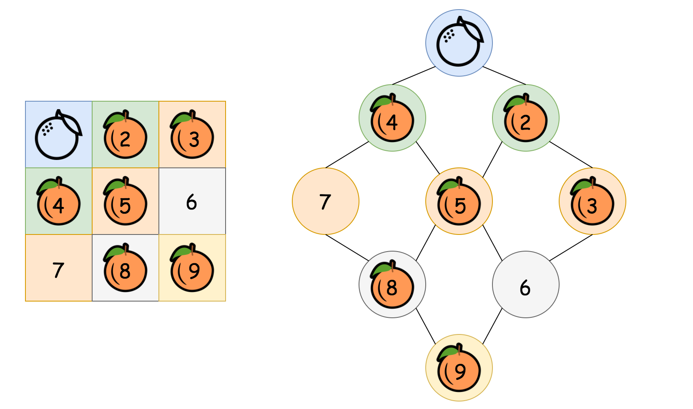
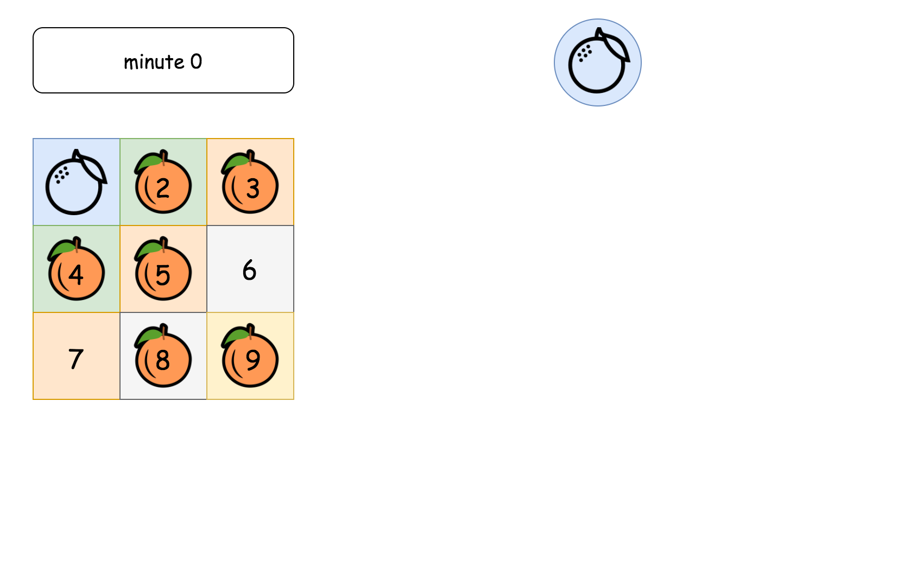
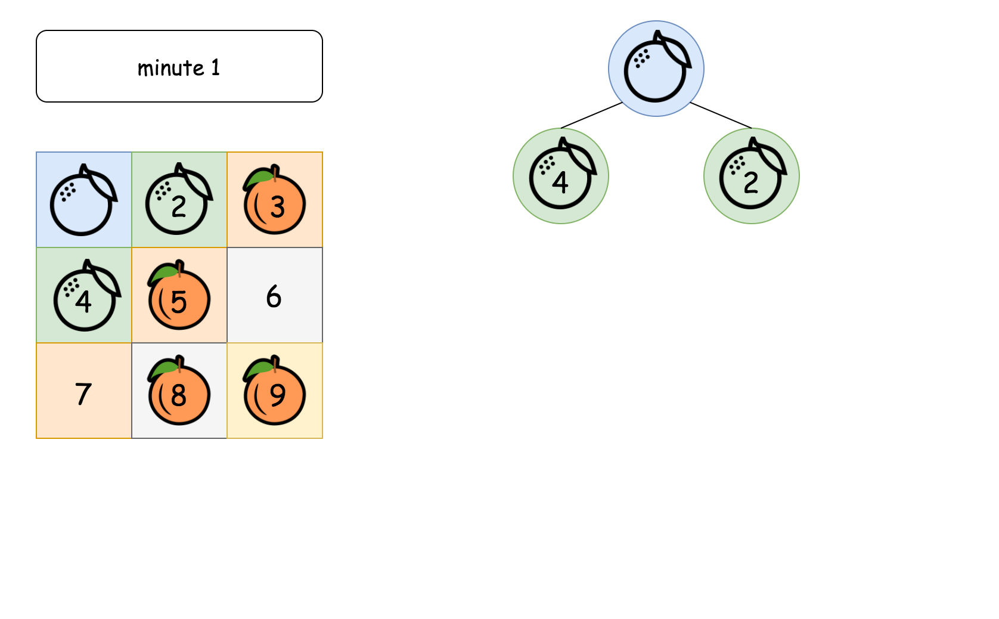
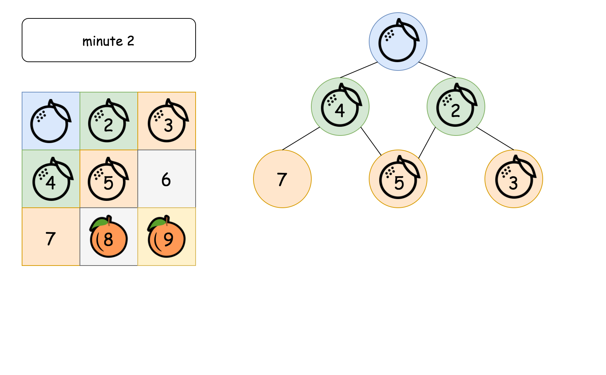
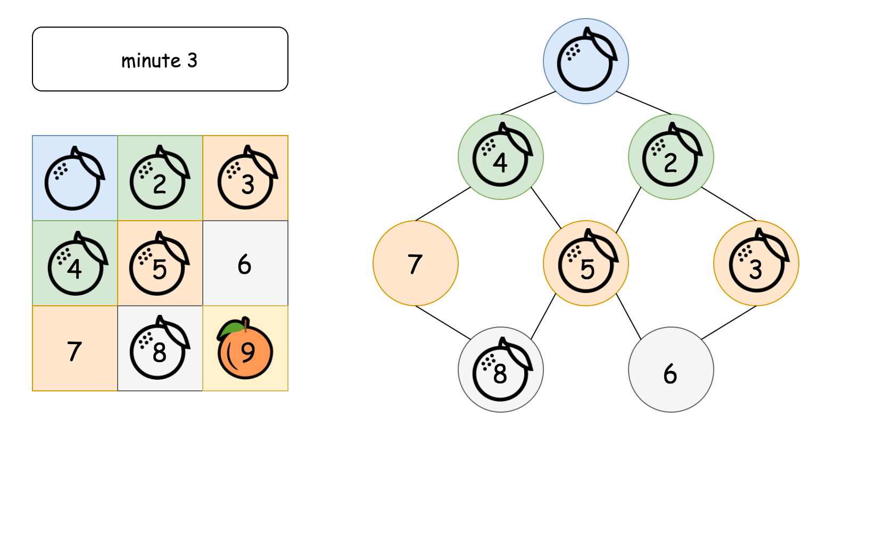
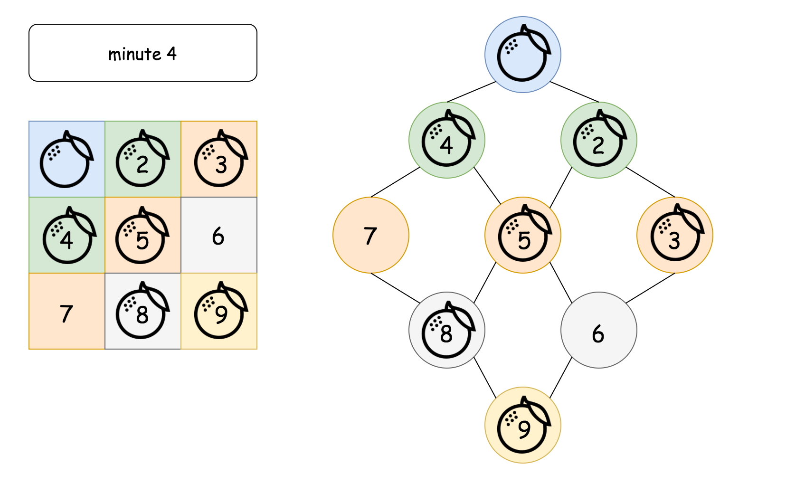
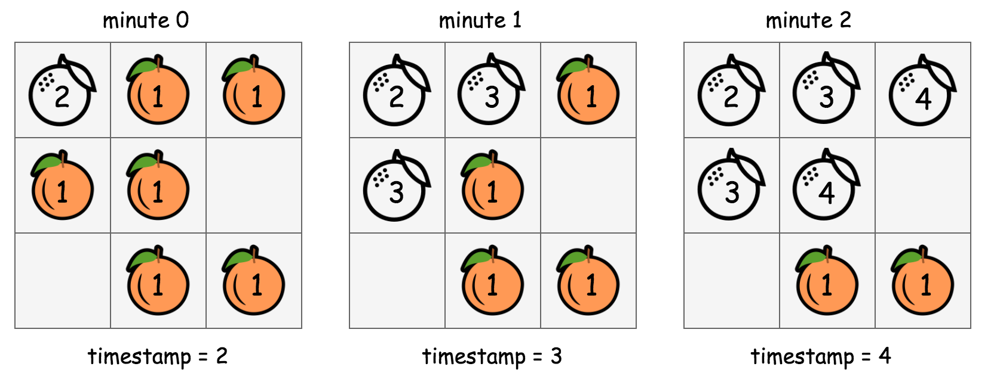
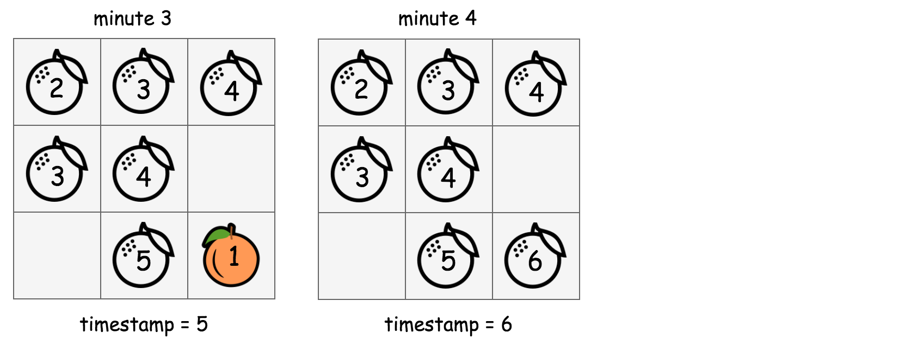
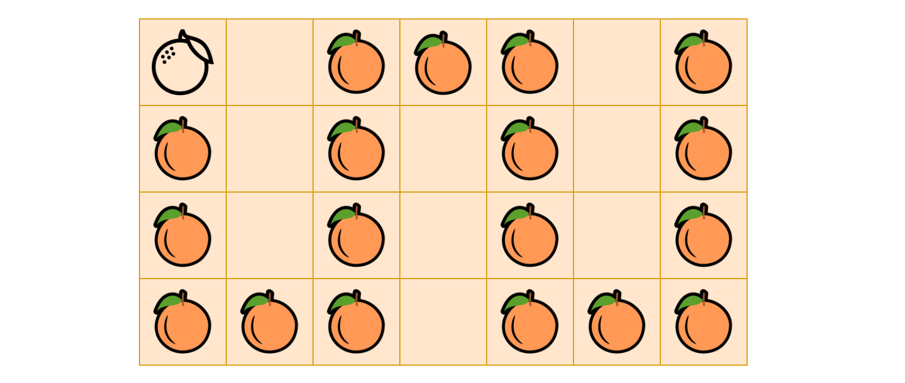

## Solution

---

### Approach 1: Breadth-First Search (BFS)

### Intuition

This is yet another 2D traversal problem. As we know, the common algorithmic strategies to deal with these problems would be **_Breadth-First Search_** (BFS) and **_Depth-First Search_** (DFS).

As suggested by its name, the BFS strategy prioritizes the **breadth** over depth, _i.e._ it goes wider before it goes deeper. On the other hand, the DFS strategy prioritizes the **depth** over breadth.

The choice of strategy depends on the nature of the problem. Though sometimes, they are both applicable for the same problem. In addition to 2D grids, these two algorithms are often applied to problems associated with _tree_ or _graph_ data structures as well.

In this problem, one can see that BFS would be a better fit.
>Because the process of rotting could be explained perfectly with the BFS procedure, _i.e._ the rotten oranges will contaminate their neighbors first, before the contamination propagates to other fresh oranges that are farther away.

If one is not familiar with the algorithm of BFS, one can refer to our [Explore card of Queue & Stack](https://leetcode.com/explore/learn/card/queue-stack/231/practical-application-queue/) which covers this subject.

However, it would be more intuitive to visualize the rotting process with a _graph_ data structure, where each node represents a cell and the edge between two nodes indicates that the given two cells are adjacent to each other.



In the above graph (pun intended), as we can see, starting from the top rotten orange, the contamination would propagate _**layer by layer**_ (or level by level), until it reaches the farthest fresh oranges. The number of minutes that are elapsed would be equivalent to the number of levels in the graph that we traverse during the propagation.











#### Algorithm

One of the most distinguished code patterns in BFS algorithms is that often we use a _**queue**_ data structure to keep track of the candidates that we need to visit during the process.

The main algorithm is built around a loop iterating through the queue. At each iteration, we _pop_ out an element from the head of the queue. Then we do some particular process with the popped element. More importantly, we then _append_ neighbors of the popped element into the queue, to keep the BFS process running.

Here are some sample implementations.

#### Implementation

```python
from collections import deque
class Solution:
    def orangesRotting(self, grid: List[List[int]]) -> int:
        queue = deque()

        # Step 1). build the initial set of rotten oranges
        fresh_oranges = 0
        ROWS, COLS = len(grid), len(grid[0])
        for r in range(ROWS):
            for c in range(COLS):
                if grid[r][c] == 2:
                    queue.append((r, c))
                elif grid[r][c] == 1:
                    fresh_oranges += 1

        # Mark the round / level, _i.e_ the ticker of timestamp
        queue.append((-1, -1))

        # Step 2). start the rotting process via BFS
        minutes_elapsed = -1
        directions = [(-1, 0), (0, 1), (1, 0), (0, -1)]
        while queue:
            row, col = queue.popleft()
            if row == -1:
                # We finish one round of processing
                minutes_elapsed += 1
                if queue:  # to avoid the endless loop
                    queue.append((-1, -1))
            else:
                # this is a rotten orange
                # then it would contaminate its neighbors
                for d in directions:
                    neighbor_row, neighbor_col = row + d[0], col + d[1]
                    if ROWS > neighbor_row >= 0 and COLS > neighbor_col >= 0:
                        if grid[neighbor_row][neighbor_col] == 1:
                            # this orange would be contaminated
                            grid[neighbor_row][neighbor_col] = 2
                            fresh_oranges -= 1
                            # this orange would then contaminate other oranges
                            queue.append((neighbor_row, neighbor_col))

        # return elapsed minutes if no fresh orange left
        return minutes_elapsed if fresh_oranges == 0 else -1
```

In the above implementations, we applied some tricks to further optimize both the time and space complexities.

- Usually in BFS algorithms, we keep a `visited` table which records the visited candidates. The `visited` table helps us to avoid repetitive visits.
<br/>

- But as one notices, rather than using the `visited` table, we _reuse_ the input grid to keep track of our visits, _i.e._ we were altering the _status_ of the input grid **in-place**.
<br/>

- This _in-place_ technique reduces the memory consumption of our algorithm. Also, it has a constant time complexity to check the current status (_i.e._ array access, $\text{grid}[row][col]$), rather than referring to the `visited` table which might be of constant time complexity as well (_e.g._ hash table) but in reality could be slower than array access.
<br/>

- We use a _**delimiter**_ (_i.e._ `(row=-1, col=-1)`) in the queue to separate cells on different levels. In this way, we only need one queue for the iteration. As an alternative, one can *create* a queue for each level and alternate between the queues, though technically the initialization and the assignment of each queue could consume some extra time.

#### Complexity Analysis

- Time Complexity: $\mathcal{O}(NM)$, where $N \times M$ is the size of the grid.

    First, we scan the grid to find the initial values for the queue, which would take $\mathcal{O}(NM)$ time.
    <br/>

    Then we run the BFS process on the queue, which in the worst case would enumerate all the cells in the grid once and only once. Therefore, it takes $\mathcal{O}(NM)$ time.
    <br/>

    Thus combining the above two steps, the overall time complexity would be $\mathcal{O}(NM) + \mathcal{O}(NM) = \mathcal{O}(NM)$

- Space Complexity: $\mathcal{O}(NM)$, where $N$ is the size of the grid.

    In the worst case, the grid is filled with rotten oranges. As a result, the queue would be initialized with all the cells in the grid.
    <br/>

    By the way, normally for BFS, the main space complexity lies in the process rather than the initialization. For instance, for a BFS traversal in a tree, at any given moment, the queue would hold no more than 2 levels of tree nodes. Therefore, the space complexity of BFS traversal in a tree would depend on the _**width**_ of the input tree.

<br/>
<br/>

---

### Approach 2: In-place BFS

#### Intuition

Although there is no doubt that the best strategy for this problem is BFS, some users in the Discussion forum have proposed different implementations of BFS with constant space complexity $\mathcal{O}(1)$. To name just a few, one can see the posts from [@manky](https://leetcode.com/problems/rotting-oranges/discuss/569248/Alternate-approach-BFS-$\mathcal{O}(N-*-Height)$-but-constant-space-easy-to-understand-and-modular-code) and [@votrubac](https://leetcode.com/problems/rotting-oranges/discuss/238579/C%2B%2BJava-with-picture-BFS).

As one might recall from the previous BFS implementation, its space complexity is mainly due to the `queue` that we were using to keep the order for the visits of cells. In order to achieve $\mathcal{O}(1)$ space complexity, we then need to eliminate the queue in the BFS.

>The secret in doing BFS traversal without a queue lies in the technique called [_in-place algorithm_](https://en.wikipedia.org/wiki/In-place_algorithm), which transforms input to solve the problem without using auxiliary data structure.

Actually, we have already had a taste of _in-place algorithm_ in the previous implementation of BFS, where we directly modified the input grid to mark the oranges that turn rotten, rather than using an additional `visited` table.

How about we apply the in-place algorithm again, but this time for the _role_ of the `queue` variable in our previous BFS implementation?

>The idea is that at each **_round_** of the BFS, we mark the cells to be visited in the input grid with a specific `timestamp`.

By _round_, we mean a snapshot in time where a group of oranges turns rotten.

#### Algorithm





In the above graph, we show how we manipulate the values in the input grid _in-place_ in order to run the BFS traversal.

- 1). Starting from the beginning (with `timestamp=2`), the cells that are marked with the value `2` contain rotten oranges. From this moment on, we adopt a **_rule_** stating as "the cells that have the value of the current timestamp (_i.e._ `2`) should be visited at this round of BFS.".
<br/>

- 2). For each of the cell that is marked with the current timestamp, we then go on to mark its neighbor cells that hold a fresh orange with the _**next**_ timestamp (_i.e._ `timestamp += 1`). This _**in-place**_ modification serves the same purpose as the `queue` variable in the previous BFS implementation, which is to select the candidates to visit for the next round.
<br/>

- 3). At this moment, we should have `timestamp=3`, and meanwhile we also have the cells to be visited at this round marked out. We then repeat the above step **(2)** until there is no more new candidates generated in the step (2) (_i.e._ the end of BFS traversal).
<br/>

To summarize, the above algorithm is still a BFS traversal in a 2D grid. But rather than using a queue data structure to keep track of the visiting order, we applied an _in-place algorithm_ to serve the same purpose as a queue in a more classic BFS implementation.

#### Implementation

```python
class Solution:
    def orangesRotting(self, grid: List[List[int]]) -> int:
        ROWS, COLS = len(grid), len(grid[0])

        # run the rotting process, by marking the rotten oranges with the timestamp
        directions = [(-1, 0), (0, 1), (1, 0), (0, -1)]

        def runRottingProcess(timestamp):
            # flag to indicate if the rotting process should be continued
            to_be_continued = False
            for row in range(ROWS):
                for col in range(COLS):
                    if grid[row][col] == timestamp:
                        # current contaminated cell
                        for d in directions:
                            n_row, n_col = row + d[0], col + d[1]
                            if ROWS > n_row >= 0 and COLS > n_col >= 0:
                                if grid[n_row][n_col] == 1:
                                    # this fresh orange would be contaminated next
                                    grid[n_row][n_col] = timestamp + 1
                                    to_be_continued = True
            return to_be_continued

        timestamp = 2
        while runRottingProcess(timestamp):
            timestamp += 1
        # end of process, to check if there are still fresh oranges left
        for row in grid:
            for cell in row:
                if cell == 1:  # still got a fresh orange left
                    return -1
        # return elapsed minutes if no fresh orange left
        return timestamp - 2
```

#### Complexity Analysis

- Time Complexity: $\mathcal{O}(N^2M^2)$ where $N \times M$ is the size of the input grid.
<br/>

    In the in-place BFS traversal, for each round of BFS, we would have to iterate through the entire grid.
    <br/>

    The contamination propagates in 4 different directions. If the orange is well adjacent to each other, the chain of propagation would continue until all the oranges turn rotten.
    <br/>

    In the worst case, the rotten and the fresh oranges might be arranged in a way that we would have to run the BFS loop over and over again, which could amount to $\frac{NM}{2}$ times which is the **_longest_** propagation chain that we might have, _i.e._ the zigzag walk in a 2D grid as shown in the following graph.
    
    <br/>

    As a result, the overall time complexity of the in-place BFS algorithm is $\mathcal{O}(NM \cdot \frac{NM}{2}) = \mathcal{O}(N^2M^2)$.

- Space Complexity: $\mathcal{O}(1)$, the memory usage is constant regardless the size of the input. This is the very point of applying in-place algorithm. Here we trade the time complexity with the space complexity, which is a common scenario in many algorithms.