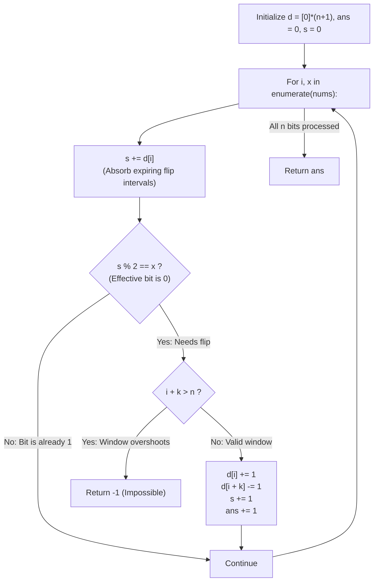

# Guided Example: Minimum Number of K Consecutive Bit Flips

We trace the step-by-step forced greedy flip choices using a difference array for parity tracking, prove the Leftmost Zero Induction Theorem and the Boundary Parity Cancellation Invariant, and determine the minimal required flips across representative binary arrays:

- **Representative Instance 1 (Individual Unit-Length Flips):**
  $$
  nums = [0, \; 1, \; 0], \quad k = 1, \quad n = 3
  $$
- **Required Output:** `2`
  - Difference array tracking:
    - Array size $n + 1 = 4$: $d = [0, 0, 0, 0]$.
    - Running flip count $s = 0$, total flips $ans = 0$.
    - Parity rule: Bit $i$ has effective value $(nums[i] + s) \bmod 2$. It requires a flip if and only if $s \bmod 2 == nums[i]$.
  - Step-by-step traversal:
    1. **Index $i = 0$ ($nums[0] = 0$):**
       - $s \leftarrow s + d[0] = 0 + 0 = 0$.
       - Check: $s \bmod 2 == nums[0]$ ($0 == 0$, True $\implies$ effective bit is $0$).
       - Feasibility: $0 + 1 \le 3$ (Valid!).
       - Flip window $[0 \dots 0]$:
         - $d[0] \leftarrow 1, \quad d[1] \leftarrow -1$.
         - $s \leftarrow 0 + 1 = 1, \quad ans \leftarrow 0 + 1 = \mathbf{1}$.
    2. **Index $i = 1$ ($nums[1] = 1$):**
       - $s \leftarrow s + d[1] = 1 + (-1) = \mathbf{0}$ (Window from index $0$ expired!).
       - Check: $s \bmod 2 == nums[1]$ ($0 == 1$, False $\implies$ effective bit is already $1$).
       - No flip needed.
    3. **Index $i = 2$ ($nums[2] = 0$):**
       - $s \leftarrow s + d[2] = 0 + 0 = 0$.
       - Check: $s \bmod 2 == nums[2]$ ($0 == 0$, True $\implies$ effective bit is $0$).
       - Feasibility: $2 + 1 \le 3$ (Valid!).
       - Flip window $[2 \dots 2]$:
         - $d[2] \leftarrow 1, \quad d[3] \leftarrow -1$.
         - $s \leftarrow 0 + 1 = 1, \quad ans \leftarrow 1 + 1 = \mathbf{2}$.
  - Total flips: $\mathbf{2}$.

- **Representative Instance 2 (Impossible Boundary Suffix Overhang):**
  $$
  nums = [1, \; 1, \; 0], \quad k = 2, \quad n = 3
  $$
  - Indices $0$ and $1$ are already $1 \implies$ no flips initiated.
  - At index $i = 2$: $nums[2] = 0$, needs a flip.
  - Feasibility check: $i + k = 2 + 2 = 4 > 3 = n$.
  - A $2$-bit flip starting at index $2$ would overshoot the array. Because no earlier window can flip index $2$ without corrupting indices $0$ or $1$, the goal is impossible $\implies \mathbf{-1}$.

- **Representative Instance 3 (Overlapping Multi-Bit Windows):**
  $$
  nums = [0, 0, 0, 1, 0, 1, 1, 0], \quad k = 3 \implies \mathbf{3} \text{ flips}
  $$

---

## 1. Instance & Teaching Goal

Given a binary array `nums` and an integer `k`, a **k-bit flip** simultaneously inverts $k$ consecutive bits ($0 \leftrightarrow 1$).
Return the **minimum number of k-bit flips** to eliminate all zeros, or `-1` if impossible.

```text
Direct Simulation: O(N * K)
  N = 100,000, K = 100,000 -> 10,000,000,000 operations (TIME LIMIT EXCEEDED!)

Difference Array Optimization: O(N)
  A flip starting at i affects [i, i + k - 1].
  Instead of flipping all k elements in a loop:
    d[i]     += 1  (Flip starts here)
    d[i + k] -= 1  (Flip effect ends after i + k - 1)
  Maintain running prefix sum s to track active flips in O(1)!
```

Simulating the inversion across $k$ elements for every flip takes $\mathcal{O}(N \cdot k)$ operations, which times out when $N, k \le 10^5$.

The decisive pedagogical goal is the **Leftmost Zero Induction Theorem & Difference Array Parity Invariant**:
1. **Uniquely Forced Flips:** Scanning left-to-right, if the bit at index $i$ is currently $0$, it **must** be flipped by a $k$-bit window starting at $i$. Any window starting earlier would alter already-corrected bits $< i$, and no window starting later covers $i$.
2. **Difference Array Parity Tracking:** Use an array $d$ of size $n + 1$ and a running accumulator $s$:
   - $s \leftarrow s + d[i]$ maintains the exact number of active flip windows covering index $i$.
   - The effective bit is $nums[i]$ inverted $s$ times: it needs a flip iff $s \bmod 2 == nums[i]$.
   - When a flip starts at $i$: record $d[i] \leftarrow d[i] + 1$, $d[i + k] \leftarrow d[i + k] - 1$, and update $s \leftarrow s + 1$.
3. Resolves each index in $\mathcal{O}(1)$ time, totaling $\mathcal{O}(N)$ time.

---

## 2. Conceptual Foundation & The Difference Parity Invariant



### The Leftmost Zero Induction Theorem

Let $A = (x_0, x_1, \dots, x_{n-1}) \in \{0, 1\}^n$.
1. **Invertibility and Commutativity:**
   Bit flips are linear over $\mathbb{F}_2$: applying a flip to window $[j, j + k - 1]$ twice cancels itself out. Each starting index $j \in [0, n - k]$ is used either $0$ or $1$ times, and the order of flips is irrelevant.
2. **Forced Prefix Induction:**
   Let $i$ be the smallest index where the effective bit is $0$.
   - Any flip starting at $j < i$ would invert $x_j$, corrupting the already-solved prefix $0 \dots i - 1$.
   - Any flip starting at $j > i$ cannot cover index $i$.
   - Therefore, the ONLY operation that can invert bit $i$ without disturbing bits $< i$ is a flip starting at precisely $j = i$.
3. **Difference Array Soundness:**
   A flip spanning $[i, i + k - 1]$ contributes $+1 \pmod 2$ to all positions $t \in [i, i + k - 1]$.
   By setting $d[i] += 1$ and $d[i + k] -= 1$, the running prefix sum:
   $$
   s_t = \sum_{m=0}^t d[m]
   $$
   equals the exact number of active windows containing $t$.
   The effective bit value is $x_t \oplus (s_t \bmod 2)$.
   $x_t \oplus (s_t \bmod 2) = 0 \iff s_t \bmod 2 == x_t$.
   This confirms that testing $s \bmod 2 == x$ precisely detects un-inverted zeros. $\blacksquare$

---

## 3. Step-by-Step Worked Execution: Representative Instance 1

$nums = [0, 1, 0], \; k = 1, \; n = 3$.
Initialize: $d = [0, 0, 0, 0], \; ans = 0, \; s = 0$.

### Step-by-Step Execution
1. **$i = 0, x = 0$:**
   - Accumulate: $s \leftarrow s + d[0] = 0 + 0 = 0$.
   - Parity check: $s \bmod 2 == x \implies 0 == 0$ (True, bit is $0$).
   - Bounds check: $i + k = 0 + 1 = 1 \le 3$ (Valid).
   - Record flip:
     $$
     d[0] \leftarrow 0 + 1 = 1, \quad d[1] \leftarrow 0 - 1 = -1
     $$
     $$
     s \leftarrow 0 + 1 = 1, \quad ans \leftarrow 0 + 1 = \mathbf{1}
     $$
2. **$i = 1, x = 1$:**
   - Accumulate: $s \leftarrow s + d[1] = 1 + (-1) = \mathbf{0}$.
   - Parity check: $s \bmod 2 == x \implies 0 == 1$ (False, effective bit is $1$).
   - No flip needed.
3. **$i = 2, x = 0$:**
   - Accumulate: $s \leftarrow s + d[2] = 0 + 0 = 0$.
   - Parity check: $s \bmod 2 == x \implies 0 == 0$ (True, bit is $0$).
   - Bounds check: $i + k = 2 + 1 = 3 \le 3$ (Valid).
   - Record flip:
     $$
     d[2] \leftarrow 0 + 1 = 1, \quad d[3] \leftarrow 0 - 1 = -1
     $$
     $$
     s \leftarrow 0 + 1 = 1, \quad ans \leftarrow 1 + 1 = \mathbf{2}
     $$

Loop terminates. Final answer: $\mathbf{2}$.

---

## 4. Difference Array & Effective Bit Trace Table

| Index $i$ | Raw $nums[i]$ | Incoming $d[i]$ | Active Flips $s$ | Condition $s \bmod 2 == x$ | Flip Action Taken | Interval Added $[i, i+k)$ | Total Flips `ans` |
|:---:|:---:|:---:|:---:|:---:|:---:|:---:|:---:|
| **$0$** | $0$ | $0$ | $0 \to 1$ | $0 == 0$ (Needs flip) | Flip window $[0]$ | $d[0] += 1, d[1] -= 1$ | **$1$** |
| **$1$** | $1$ | $-1$ | $1 - 1 = 0$ | $0 == 1$ (Already 1) | None | None | $1$ |
| **$2$** | $0$ | $0$ | $0 \to 1$ | $0 == 0$ (Needs flip) | Flip window $[2]$ | $d[2] += 1, d[3] -= 1$ | **$2$** |

---

## 5. Algorithmic Correctness

### Soundness & Completeness
1. **Soundness:**
   Every flip recorded is strictly necessary by the Leftmost Zero Induction Theorem. The difference array maintains interval start and expiration points, ensuring that each flip impacts exactly $k$ consecutive elements.
2. **Completeness:**
   If at any point an un-inverted zero cannot be covered by a full $k$-length window ($i + k > n$), no valid operation exists to invert it without breaking prefix integrity. Returning $-1$ is provably correct.

---

## 6. Boundary Cases & Traps

| Scenario | Input Pattern | Behavior | Trapped Risk |
|---|---|---|---|
| Already All Ones | `[1, 1, 1], k = 2` | Condition $s \bmod 2 == x$ never triggers; returns $0$. | Initiating redundant flips. |
| Single Impossible End Bit | `[1, 1, 0], k = 2` | $i = 2$ needs flip but $2 + 2 = 4 > 3$; returns $-1$. | Index out-of-bounds error. |
| $k = 1$ | `nums = [0, 1, 0]` | Flips each $0$ independently in $\mathcal{O}(1)$; returns $2$. | Off-by-one window calculations. |
| Full Array Flip | `nums = [0, 0], k = 2` | Flips at $i = 0$, expires at $i = 2$; returns $1$. | Handling $k == n$ boundary. |

---

## 7. Complexity Derivation

- **Time Complexity:** $\mathcal{O}(N)$, where $N = \text{len}(nums) \le 10^5$.
  - Single forward pass across $N$ elements.
  - At each element, constant-time arithmetic and bounds checks.
  - Total time: $< 0.01\text{ s}$ for $N = 10^5$.
- **Auxiliary Space Complexity:** $\mathcal{O}(N)$ to store the difference array $d$ of size $N + 1$.
