## Solution

---

### Overview

In this question, we will focus more on the applications of [bit manipulation](https://leetcode.com/explore/learn/card/bit-manipulation/), binary flipping, deque, and sliding window rather than their fundamentals. If you are not familiar with these concepts, we recommend reviewing them first.

We are given an array `nums` consisting only of 0s and 1s. We need to make sure that the `nums` array has all elements as 1s. We can perform `k`-bit flips, meaning selecting a contiguous subarray of length `k` and flipping every 0 to 1 and every 1 to 0 within that subarray.

In the end, we need to return the minimum number of `k`-bit flips needed to ensure there are no 0s in the array. If not possible, return -1.

Consider example 3 from the problem description:
```
Input: nums = [0,0,0,1,0,1,1,0], k = 3
Flip nums[0], nums[1], nums[2]: nums becomes [1,1,1,1,0,1,1,0]
Flip nums[4], nums[5], nums[6]: nums becomes [1,1,1,1,1,0,0,0]
Flip nums[5], nums[6], nums[7]: nums becomes [1,1,1,1,1,1,1,1]
Output: 3
```
> For brevity, we will represent a series of `k`-bit flip operations by the starting indices of each flip. For instance, the series of 3-bit flips on subarrays nums[0 ... 2], nums[4 ... 6], and nums[5 ... 7] can be represented as [0, 4, 5]. We will call this the flip sequence.

Before discussing the approaches, let's review a few fundamental properties of **XOR**, which are essential to understanding the mechanics of `k`-bit flips and simplifying the problem.

Property 1: Order Invariance

The order in which the flips are applied does not affect the final outcome. For instance, in the given example, whether we flip in the order [0, 4, 5] or [4, 0, 5], the final array will be the same. This means that the solution can be approached by determining the correct indices to flip, regardless of the sequence.

Property 2: Parity Invariance

The number of times an index is flipped determines its final value. If an index is flipped an odd number of times, its value will be inverted; if flipped an even number of times, it will remain unchanged.

Observation:

The problem boils down to finding the minimum flip sequence needed to convert all elements of `nums` to `1`.

To tackle this problem, we use the property of order invariance, allowing us to sort the sequence by index in ascending order. Once sorted, we minimize the sequence size using the property of parity invariance.

Due to the parity invariance property, duplicate values in the flip sequence can be removed without affecting the final result. For example, given a sequence like `[0, 1, 2, 4, 5, 6, 5, 6, 7]` (above example 3), we can simplify it to `[0, 4, 5]`, ensuring all indexes are unique and in ascending order.

Thus, every flip sequence $S$ can be simplified to a new sequence $S'$, where all indexes in $S'$ are unique and sorted in ascending order. As indexes are sorted, subsequent flips with larger indexes cannot alter the value at prior indexes.

- If $\text{nums}[0] = 0$ and 0 is NOT in the flip sequence, $\text{nums}[0]$ remains 0 in the final result.
- If $\text{nums}[0] = 1$ and 0 is in the flip sequence, $\text{nums}[0]$ becomes 0 in the final result.

For any given index `i` in `nums`, one of the following two cases must occur to ensure there are no zeros left in `nums`:

- If $\text{nums}[i] = 0$, then `i` must be present in the flip sequence, and we flip $\text{nums}[i], nums[i + 1], \ldots, nums[i + k - 1]$.
- If $\text{nums}[i] = 1$, then `i` must NOT be in the sequence, and we do not flip $\text{nums}[i], nums[i + 1], \ldots, nums[i + k - 1]$.

Let's take example 3 to elaborate on these properties in detail. If the sequence of indexes is changed to $\{0, 1, 1, 4, 4, 4, 5\}$, what will happen?

1. Flip $\text{nums}[0], \text{nums}[1], \text{nums}[2]$: $nums$ becomes `[1, 1, 1, 1, 0, 1, 1, 0]`.
2. Flip $\text{nums}[1], \text{nums}[2], \text{nums}[3]$: $nums$ becomes `[1, 0, 0, 0, 0, 1, 1, 0]`.
3. Flip $\text{nums}[1], \text{nums}[2], \text{nums}[3]$: $nums$ becomes `[1, 1, 1, 1, 0, 1, 1, 0]`.
4. Flip $\text{nums}[4], \text{nums}[5], \text{nums}[6]$: $nums$ becomes `[1, 1, 1, 1, 1, 0, 0, 0]`.
5. Flip $\text{nums}[4], \text{nums}[5], \text{nums}[6]$: $nums$ becomes `[1, 1, 1, 1, 0, 1, 1, 0]`.
6. Flip $\text{nums}[4], \text{nums}[5], \text{nums}[6]$: $nums$ becomes `[1, 1, 1, 1, 1, 0, 0, 0]`.
7. Flip $\text{nums}[5], \text{nums}[6], \text{nums}[7]$: $nums$ becomes `[1, 1, 1, 1, 1, 1, 1, 1]`.

The final result is the same as the flip sequence $\{0, 4, 5\}$.

---

### Approach 1: Using an Auxiliary Array

#### Intuition

A naive approach to solving this problem is to iterate the array from left to right and flip subarrays whenever a 0 is encountered. This ensures that each 0 is flipped as soon as it is detected, ensuring no 0s remain in the array, assuming the `k`-grouping is possible. However, due to the problem constraints, this approach is not feasible.

We can optimize the naive approach by using an auxiliary array `isFlipped` to track the indices where a `k`-bit flip is needed. The strategy involves iterating through the original array `nums` while maintaining a variable `flipped`, which indicates whether the current bit is flipped.

If `flipped` is 0 and $\text{nums}[i]$ is 0, a flip starting at index `i` is required. Similarly, if `flipped` is 1 and $\text{nums}[i]$ is 1, a flip at $\text{nums}[i]$ is needed. The logic ensures that each bit becomes 1. If the bit is 0 and not flipped, we flip it to 1. If the bit is 1 and flipped, we flip it back to 0.

Consider what happens to $\text{nums}[5]$ in the example above. Initially, we flip it from 1 to 0, then back from 0 to 1. When we reach $i = 5$ in the loop and find $\text{nums}[5] = 1$ with $flipped = 1$, we must flip $\text{nums}[5]$ again. This ensures that the final value of $\text{nums}[5]$ is 1, correcting any changes made by previous flips.

#### Algorithm

- Create a boolean array `flipped` of size `nums.size()` to keep track of flipped states.
- Initialize `validFlipsFromPastWindow` to 0, representing valid flips within the past window.
- Initialize `flipCount` to 0, representing the total number of flips needed.
- Iterate through the `nums` array from index 0 to $\text{nums.size}() - 1$:
- If the current index `i` is greater than or equal to `k`:
- If $flipped[i - k]$ is true, decrement `validFlipsFromPastWindow` (since the flip at $i - k$ is no longer part of the current window).
- Check if the current bit $\text{nums}[i]$ needs to be flipped:
- If $validFlipsFromPastWindow \% 2 = \text{nums}[i]$:
- If $i + k > \text{nums.size}()$, return -1 (flipping the window extends beyond the array length).
- Increment `validFlipsFromPastWindow`.
- Set $\text{flipped}[i]$ to true.
- Increment `flipCount`.
- Return `flipCount`.

#### Implementation

```python
class Solution:
    def minKBitFlips(self, nums: List[int], k: int) -> int:
        # Keeps track of flipped states
        flipped = [False] * len(nums)

        # Tracks valid flips within the past window
        validFlipsFromPastWindow = 0

        # Counts total flips needed
        flipCount = 0

        for i in range(len(nums)):
            if i >= k:
                # Decrease count of valid flips from the past window if needed
                if flipped[i - k]:
                    validFlipsFromPastWindow -= 1

            # Check if current bit needs to be flipped
            if validFlipsFromPastWindow % 2 == nums[i]:
                # If flipping the window extends beyond the array length,
                # return -1
                if i + k > len(nums):
                    return -1

                # Increment the count of valid flips and
                # mark current as flipped
                validFlipsFromPastWindow += 1
                flipped[i] = True
                flipCount += 1

        return flipCount
```

#### Complexity Analysis

Let $n$ be the size of the input array.

- Time Complexity: $O(n)$

    The time complexity is $O(n)$ because we iterate through the input array once, performing constant-time operations inside the loop.

- Space Complexity: $O(n)$

    The space complexity is $O(n)$ because it creates a flipped array of size $n$ to track element states.

---

### Approach 2: Using a Deque

#### Intuition

Instead of using an array of size `n` to track flipped indices, a more space-efficient approach is to use a deque (double-ended queue) to manage the state of a sliding window of size `k`.

As we progress through the array, we continuously adjust the deque by discarding indices from its front that no longer belong to the current window. This ensures that the deque only retains indices within the current window, thereby eliminating unnecessary data.

Similar to the previous approach, we determine whether a flip is necessary based on the parity of the deque's size (representing the number of flips so far) compared to the current element's value. If these do not align, a flip operation is performed.

**Proof by Contradiction:**

The key insight is that the problem has optimal substructure. This means that the optimal solution for the entire array includes optimal solutions for its subarrays.

Suppose there was a better solution that didn't flip immediately upon seeing a 0. This would mean:

1. We skip flipping at position `i` (where $\text{nums}[i] = 0$).
2. We flip at some later position `j` (where `j > i`).

But this can't be better because:

- We still need to make the same number of flips (or more).
- We might run out of array length, making the problem unsolvable.

Therefore, the greedy choice of flipping immediately is always optimal.

The Sliding Window:

The sliding window approach ensures that we only consider the relevant flips for each position. This is crucial because:

- It allows us to "forget" flips that no longer affect the current position.
- It ensures we accurately track the state of each element based on all relevant previous flips.

In essence, this greedy algorithm works because for this specific problem:

1. Making the best choice right now (flip if needed) never compromises future choices.
2. These local optimal choices accumulate to form the global optimal solution.

#### Algorithm

- Initialize `n` with `nums.size()`.
- Create a deque `flipQueue` to keep track of flips.
- Initialize `flipped` to 0, representing the current flip state.
- Initialize `result` to 0, representing the total number of flips.
- Iterate through the `nums` vector from index 0 to $n - 1$:
- If the current index `i` is greater than or equal to `k`:
- XOR `flipped` with the front element of `flipQueue`.
- Remove the front element from `flipQueue`.
- If $flipped = \text{nums}[i]$ (the current bit needs to be flipped):
- If $i + k > n$, return -1 (flipping the window extends beyond the array length).
- Push 1 to `flipQueue`.
- XOR `flipped` with 1 (toggle the flipped state).
- Increment `result`.
- Else:
- Push 0 to `flipQueue`.
- Return `result`.

The algorithm is visualized below:

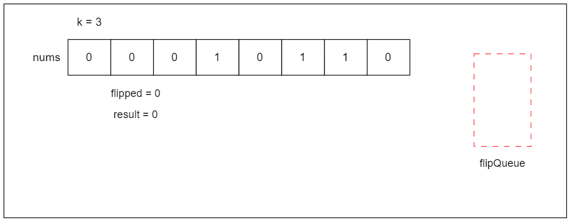

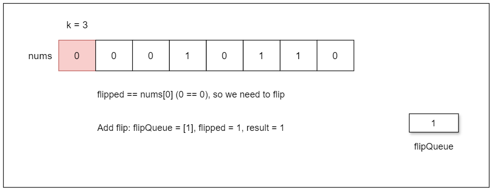

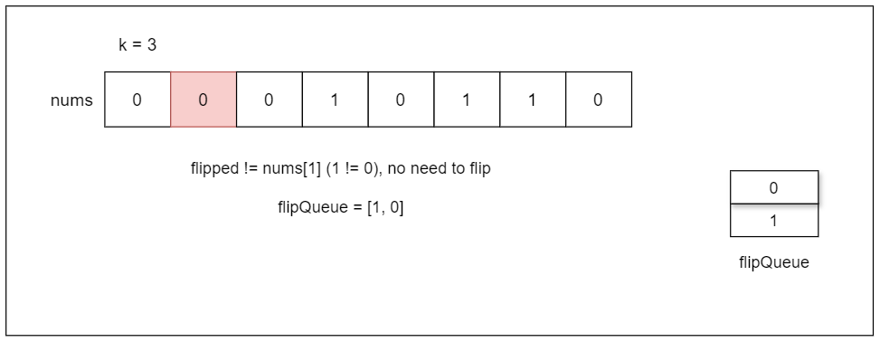

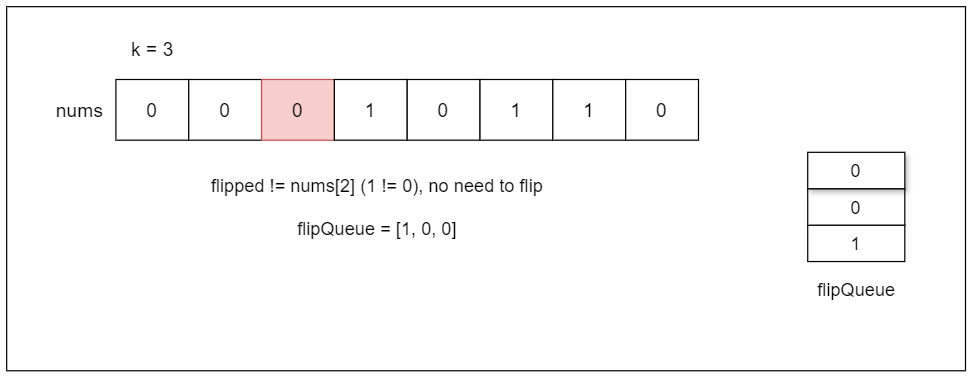

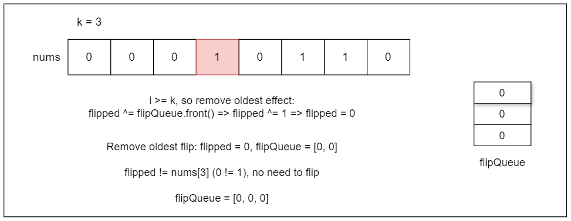

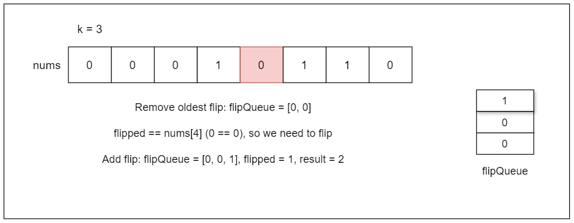

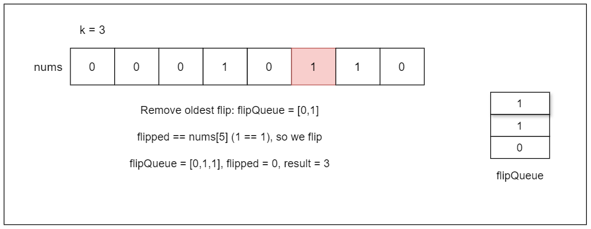

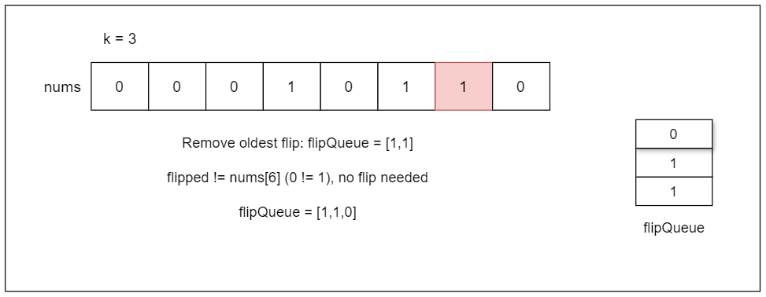

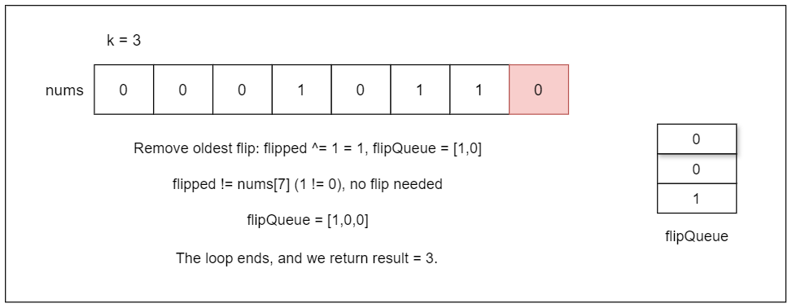

#### Implementation

```python
class Solution:
    def minKBitFlips(self, nums: List[int], k: int) -> int:
        n = len(nums)  # Length of the input list
        flip_queue = collections.deque()  # Queue to keep track of flips
        flipped = 0  # Current flip state
        result = 0  # Total number of flips

        for i, num in enumerate(nums):

            # Remove the effect of the oldest flip if it's out of the current window
            if i >= k:
                flipped ^= flip_queue[0]

            # If the current bit is 0 (i.e., it needs to be flipped)
            if flipped == nums[i]:

                # If we cannot flip a subarray starting at index i
                if i + k > n:
                    return -1

                # Add a flip at this position
                flip_queue.append(1)
                flipped ^= 1  # Toggle the flipped state
                result += 1  # Increment the flip count
            else:
                flip_queue.append(0)
            # Remove the oldest flip effect if the queue is longer than k

            if len(flip_queue) > k:
                flip_queue.popleft()
        return result
```

#### Complexity Analysis

Let $n$ be the size of the input array.

- Time complexity: $O(n)$

    The time complexity is $O(n)$ because we make a single linear pass through the input array, performing constant-time operations inside the loop.

- Space complexity: $O(k)$

    The space complexity is $O(k)$ because it uses a deque `flipQueue` to track flips within the window size `k`, resulting in maximum size `k`.

---

### Approach 3: In Constant Space

#### Intuition

This approach works as a one-pass solution without requiring any additional data structures. The main idea is to maintain a variable `currentFlips` that represents the number of flips in the current sliding window of size `k`, to decide whether we need to perform a flip or not.

If `currentFlips` is even and $\text{nums}[i]$ is 0, we need to flip the bit. Similarly, if `currentFlips` is odd and $\text{nums}[i]$ is 1, we also need to flip the bit. We use the parity of `currentFlips` (whether it's even or odd) to determine if the current bit needs flipping.

To perform a flip, we mark the current bit by setting $\text{nums}[i]$ to 2, increment `currentFlips`, and increase `totalFlips`. As the window slides, if the element at the start of the previous window ($i - k$) was flipped (i.e., it was set to 2), we decrement `currentFlips`.

If flipping the current bit would go beyond the array bounds (i.e., $i + k$ exceeds the array size), we return `-1` as it is impossible to make all elements 1.

#### Algorithm

- Initialize `currentFlips` to 0, representing the current number of flips.
- Initialize `totalFlips` to 0, representing the total number of flips.
- Iterate through the `nums` array from index 0 to $\text{nums.size}() - 1$:
- If the current index `i` is greater than or equal to `k` and $nums[i - k] = 2$ (the leftmost element is marked as flipped):
- Decrement `currentFlips`.
- Check if the current bit $\text{nums}[i]$ needs to be flipped:
- If $(currentFlips \% 2) = \text{nums}[i]$:
- If $i + k > \text{nums.size}()$, return -1 (flipping the window extends beyond the array length).
- Set $\text{nums}[i]$ to 2 (mark the current bit as flipped).
- Increment `currentFlips`.
- Increment `totalFlips`.
- Return `totalFlips`.

The algorithm is visualized below:

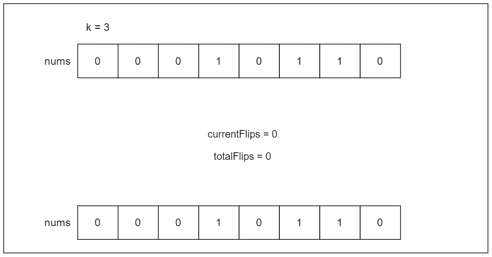

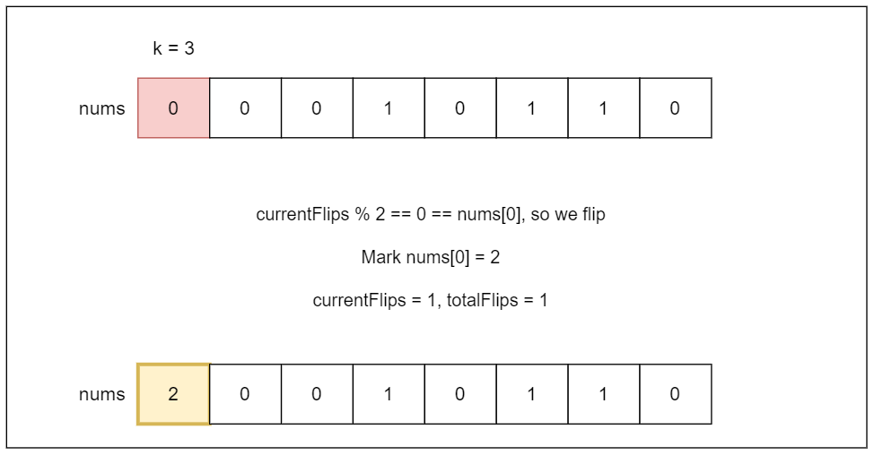

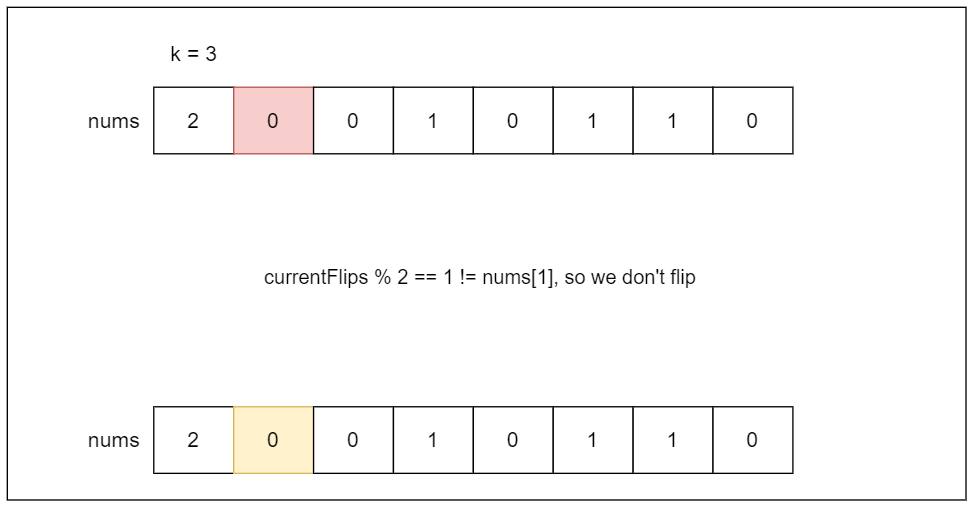

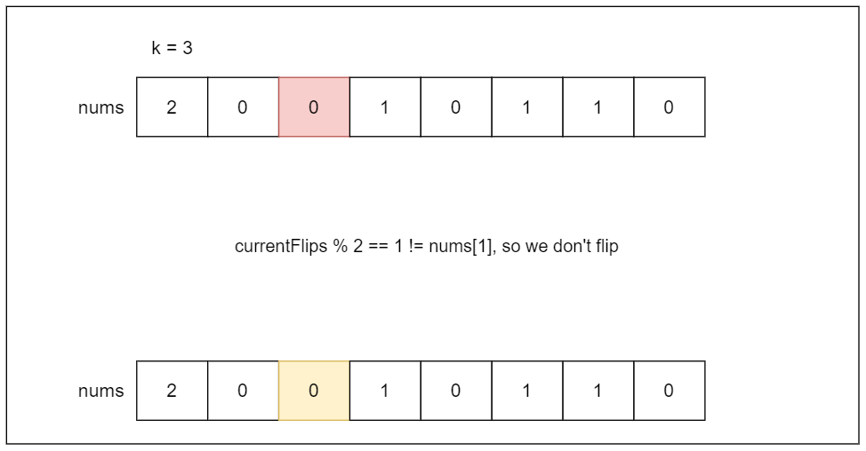

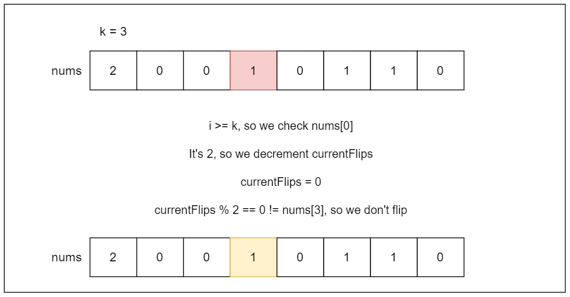

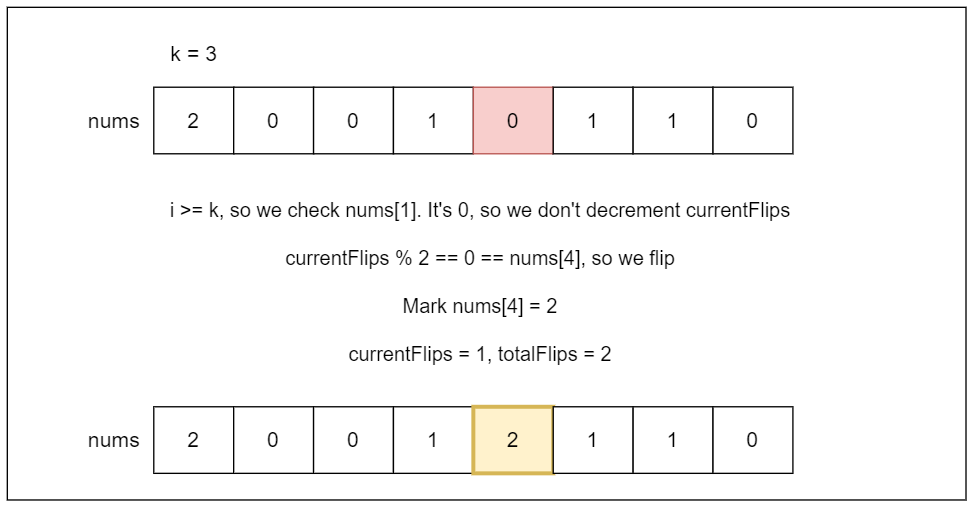

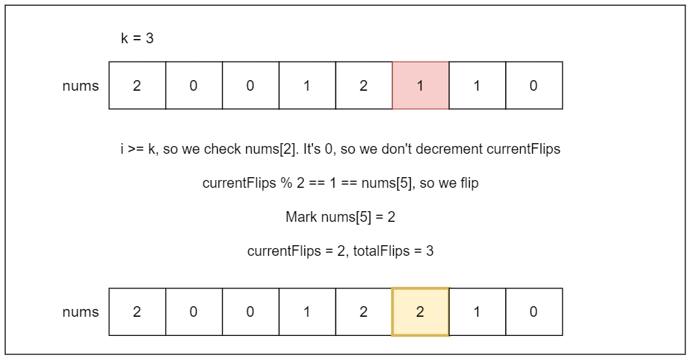

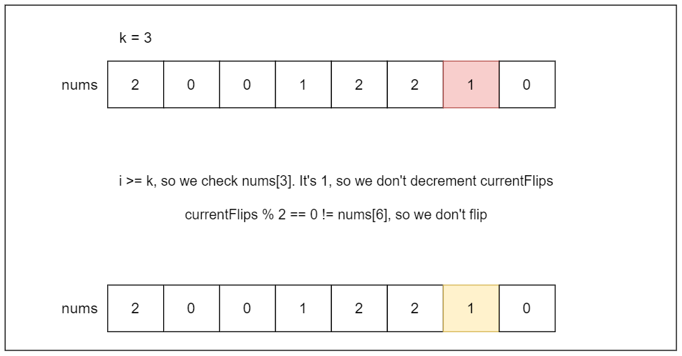

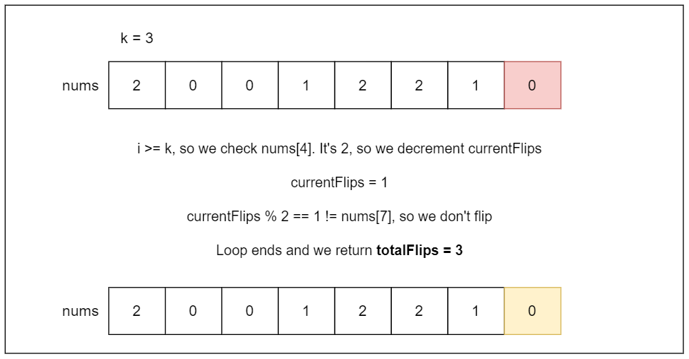

> Note: We have modified the `nums` array, but sometimes there are restrictions against changing the input. In such cases, you can restore the original value of $nums[i - k]$ by subtracting 2 ($nums[i - k] -= 2;$) below the line where we decrement `currentFlips--`. This way, it will restore its original state before marking it as 2. This technique is a clever way to maintain the original array, but we haven't included it in the following implementation for easier visual understanding.

#### Implementation

```python
class Solution:
    def minKBitFlips(self, nums: List[int], k: int) -> int:
        current_flips = 0  # Tracks the current number of flips
        total_flips = 0  # Tracks the total number of flips

        for i in range(len(nums)):
            # If the window slides out of the range and the leftmost element is
            #  marked as flipped (2), decrement current_flips
            if i >= k and nums[i - k] == 2:
                current_flips -= 1

            # Check if the current bit needs to be flipped
            if (current_flips % 2) == nums[i]:
                # If flipping would exceed array bounds, return -1
                if i + k > len(nums):
                    return -1
                # Mark the current bit as flipped
                nums[i] = 2
                current_flips += 1
                total_flips += 1

        return total_flips
```

#### Complexity Analysis

Let $n$ be the size of input array.

- Time complexity: $O(n)$

    The algorithm iterates through the input array once with constant time operations inside the loop (comparisons, increments/decrements, and array access). This results in a linear time complexity.

- Space complexity: $O(1)$

    The algorithm uses constant additional space for variables like `currentFlips` and `totalFlips`. It doesn't create any data structures that scale with the input size (`n` or `k`). Therefore, the space complexity is constant.

---