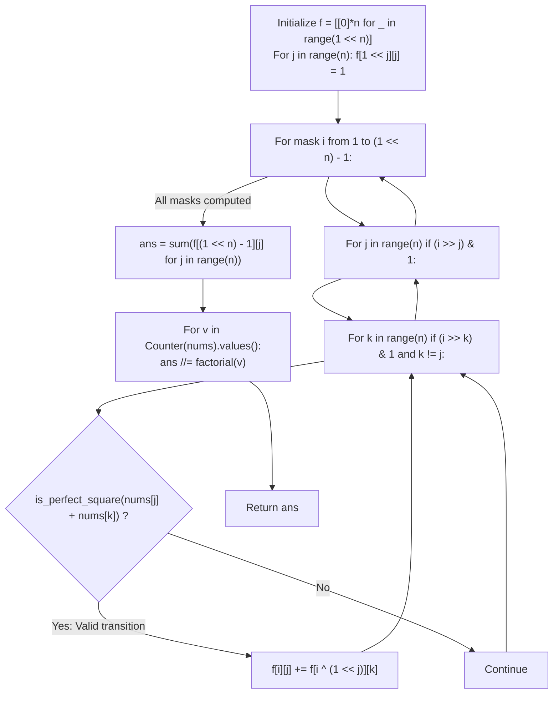

# Guided Example: Number of Squareful Arrays

We trace the step-by-step bitmask dynamic programming over Hamiltonian paths on a compatibility graph, prove the Perfect Square Edge Condition and the Multiset Automorphism Factorial Quotient Invariant, and determine the exact count of unique squareful permutations across representative arrays:

- **Representative Instance 1 (Two Compatible Symmetric Orderings):**
  $$
  nums = [1, \; 17, \; 8], \quad n = 3
  $$
- **Required Output:** `2`
  - Perfect square pairwise compatibility tests ($nums[j] + nums[k] = t^2$):
    - Pair $(1, 8)$: $1 + 8 = 9 = 3^2$ (Valid edge!).
    - Pair $(17, 8)$: $17 + 8 = 25 = 5^2$ (Valid edge!).
    - Pair $(1, 17)$: $1 + 17 = 18 \ne t^2$ (Incompatible).
  - Graph representation: Node $8$ connects to both $1$ and $17$, forming path graph $1 - 8 - 17$.
  - Bitmask DP formulation:
    - Let $f[i][j]$ be the number of paths visiting index subset $i \subseteq \{0, 1, 2\}$ ending at index $j$.
    - Indices: $0 \leftrightarrow 1, \; 1 \leftrightarrow 17, \; 2 \leftrightarrow 8$.
    - Base singletons (mask $1 \ll j$):
      - $f[001_2][0] = 1, \quad f[010_2][1] = 1, \quad f[100_2][2] = 1$.
    - Mask size 2 transitions:
      - Mask $101_2$ (Nodes $\{0, 2\} = \{1, 8\}$): $f[101_2][0] = 1, \; f[101_2][2] = 1$.
      - Mask $110_2$ (Nodes $\{1, 2\} = \{17, 8\}$): $f[110_2][1] = 1, \; f[110_2][2] = 1$.
      - Mask $011_2$ (Nodes $\{0, 1\} = \{1, 17\}$): No edge $\implies f[011_2][0] = 0, \; f[011_2][1] = 0$.
    - Mask size 3 (Full mask $111_2 = 7$):
      - End at node $0$ ($val = 1$): incoming from node $2$ in mask $111_2 \oplus 001_2 = 110_2 \implies f[111_2][0] = f[110_2][2] = \mathbf{1}$ (Path $17 \to 8 \to 1$).
      - End at node $1$ ($val = 17$): incoming from node $2$ in mask $101_2 \implies f[111_2][1] = f[101_2][2] = \mathbf{1}$ (Path $1 \to 8 \to 17$).
      - End at node $2$ ($val = 8$): incoming from $0$ or $1$ in mask $011_2$, but both are $0 \implies f[111_2][2] = 0$.
    - Total index Hamiltonian paths: $P_{\text{index}} = 1 + 1 + 0 = \mathbf{2}$.
  - Automorphism quotient:
    - All elements are distinct ($\{1: 1, 17: 1, 8: 1\}$).
    - Multiplicity divisor: $1! \times 1! \times 1! = 1$.
    - Distinct squareful permutations: $2 / 1 = \mathbf{2}$ (namely $[1, 8, 17]$ and $[17, 8, 1]$).

- **Representative Instance 2 (All Identical Elements with High Multiplicity):**
  $$
  nums = [2, \; 2, \; 2], \quad n = 3
  $$
  - Every pair satisfies $2 + 2 = 4 = 2^2$ (Complete graph $K_3$).
  - Total index Hamiltonian paths: $3! = 6$.
  - Value frequencies: three $2$s $\implies$ divisor is $3! = 6$.
  - Unique permutations: $6 / 6 = \mathbf{1}$ (only $[2, 2, 2]$).

- **Representative Instance 3 (Single Element Array):**
  $$
  nums = [7] \implies n = 1 \implies \text{vacuously squareful} \implies \mathbf{1}
  $$

---

## 1. Instance & Teaching Goal

An integer array is **squareful** if the sum of every adjacent pair is a perfect square ($nums[i] + nums[i+1] = t^2$).
Return the number of **unique permutations** of `nums` that are squareful.

```text
Permutation Search:
  n <= 12
  Brute force permutations: 12! = 479,001,600 (Too slow!)

Bitmask DP over Index Graph:
  State: (visited_bitmask, last_visited_index)
  Number of states: 2^12 * 12 = 4,096 * 12 = 49,152 states!
  Total transitions: 49,152 * 12 = ~5.8 * 10^5 operations (Very fast! < 0.05s)

Deduplication:
  Identical values produce duplicate index paths.
  Divide by product of factorials: Total / (count(v)! ...)
```

Backtracking over permutations without memoization can get trapped in repetitive isomorphic search trees when duplicate values exist.

The decisive pedagogical goal is the **Hamiltonian Bitmask DP & Automorphism Factorial Quotient Invariant**:
1. **Compatibility Graph Formulation:** Construct an edge between indices $j$ and $k$ iff $nums[j] + nums[k]$ is a perfect square. A squareful arrangement is an index Hamiltonian path on this graph.
2. **Bitmask Subproblem Formulation:** $f[i][j]$ stores the number of valid paths visiting the subset of indices represented by bitmask $i$ and terminating at index $j$.
   $$
   f[i][j] = \sum_{k \in i \setminus \{j\}, \; (j, k) \in E} f[i \oplus (1 \ll j)][k]
   $$
3. **Multiset Quotient Normalization:** Because the DP treats array indices as distinct, identical values generate isomorphic index permutations. Dividing the total index paths by $\prod_v (\text{count}(v)!)$ recovers the exact count of unique permutations.

---

## 2. Conceptual Foundation & The Bitmask Recurrence Invariant



### The Multiset Automorphism Factorial Quotient Theorem

Let $nums$ be a multiset of size $n$, with distinct values $u_1, u_2, \dots, u_m$ having multiplicities $c_1, c_2, \dots, c_m$ where $\sum_{r=1}^m c_r = n$.
1. **Index Path Definition:**
   An index sequence $\pi = (\pi_0, \pi_1, \dots, \pi_{n-1})$ is a valid index permutation iff:
   $$
   nums[\pi_r] + nums[\pi_{r+1}] \in \{t^2 : t \in \mathbb{Z}_{\ge 0}\} \quad \forall r \in [0, n-2]
   $$
   Let $\mathcal{P}_{\text{index}}$ be the set of all such valid index permutations.
2. **Action of the Automorphism Group:**
   Define the stabilizer group $G = S_{c_1} \times S_{c_2} \times \dots \times S_{c_m}$ of permutations that permute indices sharing identical values:
   $$
   g(\pi) = (\sigma(\pi_0), \dots, \sigma(\pi_{n-1})) \quad \text{where } nums[\sigma(k)] = nums[k]
   $$
   The order of this group is $|G| = \prod_{r=1}^m (c_r!)$.
3. **Free Orbit Action:**
   Because $g \in G$ preserves the sequence of values $nums[\pi_r]$, $g(\pi)$ remains a valid index permutation in $\mathcal{P}_{\text{index}}$.
   Furthermore, two index permutations produce the exact same sequence of values if and only if they belong to the same orbit under $G$.
4. **Orbit Counting Formula:**
   By Burnside's Lemma / Orbit-Stabilizer Theorem:
   $$
   |\text{Unique Squareful Permutations}| = \frac{|\mathcal{P}_{\text{index}}|}{|G|} = \frac{\sum_{j=0}^{n-1} f[2^n - 1][j]}{\prod_{r=1}^m (c_r!)} \quad \blacksquare
   $$

---

## 3. Step-by-Step Worked Execution: Representative Instance 1

$nums = [1, 17, 8]$.
Indices: $0 \to 1, \; 1 \to 17, \; 2 \to 8$.
Adjacency: $(0, 2)$ valid ($1+8=9$), $(1, 2)$ valid ($17+8=25$), $(0, 1)$ invalid ($1+17=18$).

### Bitmask Dynamic Programming
1. **Size 1 Subsets (Base Cases):**
   - $f[001_2][0] = 1, \quad f[010_2][1] = 1, \quad f[100_2][2] = 1$.
2. **Size 2 Subsets:**
   - Mask $011_2$ ($\{0, 1\}$): $(0, 1)$ has no edge $\implies f[011_2][0] = 0, \; f[011_2][1] = 0$.
   - Mask $101_2$ ($\{0, 2\}$): $(0, 2)$ has an edge:
     - $f[101_2][0] = f[100_2][2] = 1$.
     - $f[101_2][2] = f[001_2][0] = 1$.
   - Mask $110_2$ ($\{1, 2\}$): $(1, 2)$ has an edge:
     - $f[110_2][1] = f[100_2][2] = 1$.
     - $f[110_2][2] = f[010_2][1] = 1$.
3. **Size 3 Subsets (Full Mask $111_2 = 7$):**
   - End at node $0$:
     - $k = 2$ ($k \in \{1, 2\}$): edge $(0, 2)$ valid $\implies f[111_2][0] += f[110_2][2] = 1$.
     - $f[111_2][0] = 1$ (Represents path $1 \to 2 \to 0$, values $17 \to 8 \to 1$).
   - End at node $1$:
     - $k = 2$: edge $(1, 2)$ valid $\implies f[111_2][1] += f[101_2][2] = 1$.
     - $f[111_2][1] = 1$ (Represents path $0 \to 2 \to 1$, values $1 \to 8 \to 17$).
   - End at node $2$:
     - $k = 0$: $f[011_2][0] = 0$.
     - $k = 1$: $f[011_2][1] = 0$.
     - $f[111_2][2] = 0$.

### Total and Factorial Quotient
$$
\text{Total Index Paths} = f[7][0] + f[7][1] + f[7][2] = 1 + 1 + 0 = 2
$$
Frequencies: all distinct $\implies ans = 2 / 1! = \mathbf{2}$.

---

## 4. Bitmask Hamiltonian Subproblem Trace Table

| Mask Binary $i$ | Visited Subset of Elements | End Node $j$ | Compatible Predecessors $k$ | Prior Subproblem State Used | Path Count $f[i][j]$ |
|:---:|:---:|:---:|:---:|:---:|:---:|
| **$001_2$ ($1$)** | $\{1\}$ | $0$ ($1$) | None | Base singleton | $1$ |
| **$010_2$ ($2$)** | $\{17\}$ | $1$ ($17$) | None | Base singleton | $1$ |
| **$100_2$ ($4$)** | $\{8\}$ | $2$ ($8$) | None | Base singleton | $1$ |
| **$101_2$ ($5$)** | $\{1, 8\}$ | $0$ ($1$) | $k = 2$ | $f[100_2][2] = 1$ | $1$ |
| **$101_2$ ($5$)** | $\{1, 8\}$ | $2$ ($8$) | $k = 0$ | $f[001_2][0] = 1$ | $1$ |
| **$110_2$ ($6$)** | $\{17, 8\}$ | $1$ ($17$) | $k = 2$ | $f[100_2][2] = 1$ | $1$ |
| **$110_2$ ($6$)** | $\{17, 8\}$ | $2$ ($8$) | $k = 1$ | $f[010_2][1] = 1$ | $1$ |
| **$111_2$ ($7$)** | $\{1, 17, 8\}$ | $0$ ($1$) | $k = 2$ | $f[110_2][2] = 1$ | **$1$** |
| **$111_2$ ($7$)** | $\{1, 17, 8\}$ | $1$ ($17$) | $k = 2$ | $f[101_2][2] = 1$ | **$1$** |
| **$111_2$ ($7$)** | $\{1, 17, 8\}$ | $2$ ($8$) | $k \in \{0, 1\}$ | $f[011_2][0] = 0, f[011_2][1] = 0$ | **$0$** |

---

## 5. Algorithmic Correctness

### Soundness & Completeness
1. **Soundness:**
   Every transition verifies $nums[j] + nums[k] == t^2$, guaranteeing that any path formed has adjacent elements summing to perfect squares.
2. **Completeness:**
   Iterating through all $2^n$ subsets in numerical order evaluates subproblems in topological order of path length. The factorial divisor mathematically neutralizes index permutations of identical numbers without double-counting.

---

## 6. Boundary Cases & Traps

| Scenario | Input Pattern | Behavior | Trapped Risk |
|---|---|---|---|
| All Duplicate Elements | `[2, 2, 2]` | Calculates $3! = 6$ index paths; divides by $3! = 6 \implies 1$. | Overcounting duplicate permutations. |
| Single Element | `[7]` | Base case initializes $f[1][0] = 1$; returns $1$. | Graph edges undefined for $n=1$. |
| Incompatible Duplicate | `[1, 1]` | $1 + 1 = 2 \ne t^2$; no edges $\implies$ returns $0$. | Returning $1$ without checking self-sum. |
| Zero Included | `[0, 0, 1]` | $0 + 0 = 0 = 0^2, 0 + 1 = 1^2$; all edges valid; returns $3$. | Treating $0$ as a non-square. |

---

## 7. Complexity Derivation

- **Time Complexity:** $\mathcal{O}(2^n \cdot n^2)$, where $n = \text{len}(nums) \le 12$.
  - State space: $2^n$ bitmasks $\times n$ end nodes $\le 4{,}096 \times 12 = 49{,}152$ states.
  - From each state, $n$ transitions are evaluated $\implies 49{,}152 \times 12 \approx 5.8 \times 10^5$ operations.
  - Total time: $< 0.03\text{ s}$.
- **Auxiliary Space Complexity:** $\mathcal{O}(2^n \cdot n)$ to store the DP table $f$ of size $4{,}096 \times 12$.