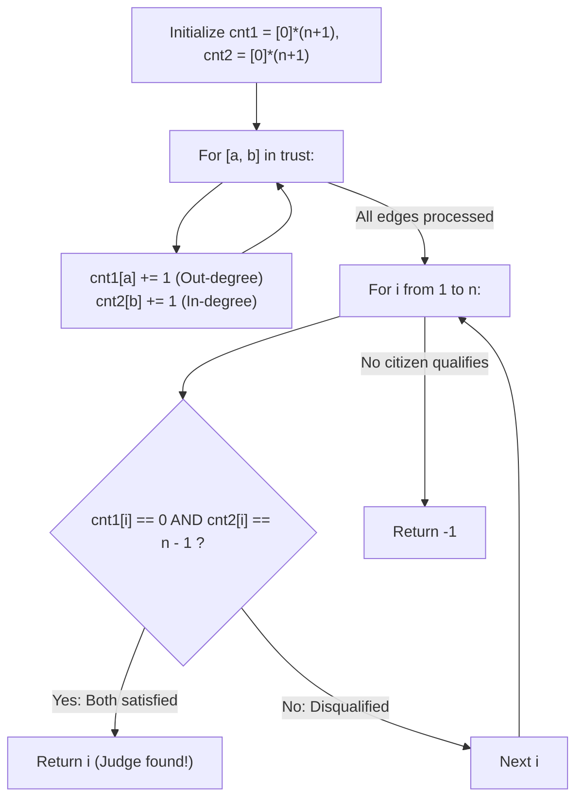

# Guided Example: Find the Town Judge

We trace the step-by-step directed graph degree computation, prove the Universal Sink Uniqueness Lemma and the In-Degree / Out-Degree Dual Condition Invariant, and identify the town judge across representative trust graphs:

- **Representative Instance 1 (Two-Person Town with Clear Hierarchy):**
  $$
  n = 2, \quad trust = [[1, \; 2]]
  $$
- **Required Output:** `2`
  - Person labeling: $1 \dots n$.
  - Dual degree arrays (size $n + 1 = 3$):
    - $cnt_1$ (Out-degree / People trusted): $[0, 0, 0]$.
    - $cnt_2$ (In-degree / People trusting this person): $[0, 0, 0]$.
  - Process trust edge $[1, 2]$:
    - Person $1$ trusts person $2$:
      $$
      cnt_1[1] \leftarrow cnt_1[1] + 1 = 1, \quad cnt_2[2] \leftarrow cnt_2[2] + 1 = 1
      $$
  - Evaluate judge criteria for $i \in \{1, 2\}$ ($n - 1 = 2 - 1 = 1$):
    - Person $1$: $cnt_1[1] = 1 \ne 0$ (Trusts someone, disqualified!).
    - Person $2$:
      - Out-degree: $cnt_1[2] = 0$ (Trusts nobody, satisfied!).
      - In-degree: $cnt_2[2] = 1 == n - 1$ (Trusted by all other $n - 1$ citizens, satisfied!).
  - Result: Person $2$ satisfies both conditions $\implies \mathbf{2}$.

- **Representative Instance 2 (Candidate Disqualified by Outgoing Edge):**
  $$
  n = 3, \quad trust = [[1, 3], \; [2, 3], \; [3, 1]]
  $$
  - In-degrees: $cnt_2 = [0, 1, 0, 2]$. Person $3$ has $cnt_2[3] = 2 == n - 1$.
  - Out-degrees: Person $3$ trusts person $1 \implies cnt_1[3] = 1 \ne 0$.
  - Disqualified! No other person has in-degree $2 \implies \mathbf{-1}$.

- **Representative Instance 3 (Single-Person Town):**
  $$
  n = 1, \quad trust = []
  $$
  - Target in-degree: $n - 1 = 1 - 1 = 0$.
  - Person $1$: $cnt_1[1] = 0$ and $cnt_2[1] = 0 == 0 \implies \mathbf{1}$.

---

## 1. Instance & Teaching Goal

In a town of `n` people labeled `1` to `n`, the **town judge** satisfies three properties:
1. The town judge trusts nobody ($\text{deg}_{\text{out}} = 0$).
2. Everybody else trusts the town judge ($\text{deg}_{\text{in}} = n - 1$).
3. There is at most one person satisfying both properties.
Given the list `trust` of directed edges $[a, b]$ where $a$ trusts $b$, return the label of the town judge or `-1` if no judge exists.

```text
Graph Model:
  Vertices: {1, 2, ..., n}
  Directed edge a -> b means "a trusts b"

Judge Definition:
  The town judge is a UNIVERSAL SINK:
    - Out-degree = 0 (Trusts nobody)
    - In-degree = n - 1 (Trusted by all other citizens)
```

Constructing full adjacency lists or performing reachability traversals stores unnecessary neighbor collections.

The decisive pedagogical goal is the **Directed Degree Dual Predicate & Universal Sink Invariant**:
- Maintain two frequency arrays of length $n + 1$:
  - $cnt_1[p]$: outgoing trust relationships for person $p$.
  - $cnt_2[p]$: incoming trust relationships for person $p$.
- For each edge $[a, b]$, increment $cnt_1[a]$ and $cnt_2[b]$ in $\mathcal{O}(1)$ time.
- Scan $i \in [1, n]$:
  - If $cnt_1[i] == 0 \land cnt_2[i] == n - 1$, return $i$.
- Evaluates in linear $\mathcal{O}(n + |trust|)$ time and $\mathcal{O}(n)$ auxiliary space.

---

## 2. Conceptual Foundation & The Universal Sink Invariant



### The Universal Sink Uniqueness Theorem

Let $G = (V, E)$ be a directed graph on $n = |V|$ vertices without self-loops.
1. **Universal Sink Definition:**
   A vertex $u \in V$ is a universal sink if and only if:
   $$
   \text{deg}_{\text{out}}(u) = 0 \quad \text{and} \quad \text{deg}_{\text{in}}(u) = n - 1
   $$
2. **Uniqueness Lemma:**
   A directed graph can contain at most one universal sink.
   *Proof:*
   Suppose for contradiction that $u$ and $v$ are distinct universal sinks ($u \ne v$).
   Because $\text{deg}_{\text{in}}(u) = n - 1$, every vertex in $V \setminus \{u\}$ must have a directed edge to $u$.
   In particular, $(v, u) \in E$.
   This implies $\text{deg}_{\text{out}}(v) \ge 1$.
   However, $v$ being a universal sink requires $\text{deg}_{\text{out}}(v) = 0$, a direct contradiction!
   Therefore, at most one universal sink can exist.
3. **Equivalence of the Dual Predicate:**
   Testing $\text{deg}_{\text{out}}(i) == 0 \land \text{deg}_{\text{in}}(i) == n - 1$ across all $i \in [1, n]$ is both necessary and sufficient to identify the unique judge or certify non-existence. $\blacksquare$

---

## 3. Step-by-Step Worked Execution: Representative Instance 1

$n = 2, \; trust = [[1, 2]]$.
Initialize: $cnt_1 = [0, 0, 0], \; cnt_2 = [0, 0, 0]$.

### Step 1: Accumulate Edge Degrees
- Edge $[1, 2]$:
  - $a = 1, b = 2$.
  - $cnt_1[1] \leftarrow 0 + 1 = 1$.
  - $cnt_2[2] \leftarrow 0 + 1 = 1$.

State of degree counters:
- $cnt_1 = [0, 1, 0]$ (Out-degrees)
- $cnt_2 = [0, 0, 1]$ (In-degrees)

---

### Step 2: Evaluate Citizens $i \in \{1, 2\}$ against $n - 1 = 1$
1. **Person $i = 1$:**
   - Out-degree $cnt_1[1] = 1 \ne 0 \implies$ Disqualified.
2. **Person $i = 2$:**
   - Out-degree $cnt_1[2] = 0 == 0$ (Pass).
   - In-degree $cnt_2[2] = 1 == n - 1$ (Pass).
   - Both satisfied! Immediately return $2$.

Final result: $\mathbf{2}$.

---

## 4. Citizens Degree Verification Trace Table

| Citizen $i$ | Out-Degree $cnt_1[i]$ | In-Degree $cnt_2[i]$ | $cnt_1[i] == 0$ Check | $cnt_2[i] == n - 1$ Check | Qualification Verdict |
|:---:|:---:|:---:|:---:|:---:|:---|
| **$1$** | $1$ | $0$ | False ($1 \ne 0$) | False ($0 \ne 1$) | Disqualified (Trusts person 2) |
| **$2$** | $0$ | $1$ | **True ($0 == 0$)** | **True ($1 == 1$)** | **Qualified (Town Judge!)** |

---

## 5. Algorithmic Correctness

### Soundness & Completeness
1. **Soundness:**
   A citizen is accepted only when they trust exactly 0 people and are trusted by exactly $n - 1$ people. Because self-loops are forbidden and edges are unique, $cnt_2[i] == n - 1$ ensures every other citizen in the town has an edge pointing to $i$.
2. **Completeness:**
   All edges in `trust` are incorporated, and all vertices $1 \dots n$ are inspected. By the Universal Sink Uniqueness Theorem, no competing judge can exist, guaranteeing that returning the first matching candidate is globally correct.

---

## 6. Boundary Cases & Traps

| Scenario | Input Pattern | Behavior | Trapped Risk |
|---|---|---|---|
| Single Person Town | $n = 1, trust = []$ | $cnt_1[1] = 0, cnt_2[1] = 0 == 1 - 1$; returns $1$. | Requiring at least one incoming trust edge. |
| Empty Trust List with $n > 1$ | $n = 2, trust = []$ | $cnt_2$ is $0 \ne 1$; returns $-1$. | Assuming person 1 is judge when no trust exists. |
| Circular Trust Loop | $[[1, 2], [2, 3], [3, 1]]$ | All citizens have $cnt_1 = 1$; returns $-1$. | Accepting candidates in cyclic graphs. |
| Universal Trust with Rogue Outgoing Edge | In-degree is $n - 1$ but out-degree is $1$ | Disqualified by $cnt_1[i] == 0$; returns $-1$. | Checking only in-degree without out-degree. |

---

## 7. Complexity Derivation

- **Time Complexity:** $\mathcal{O}(n + |trust|)$, where $n \le 1{,}000$ and $|trust| \le 10^4$.
  - Iterating over `trust` takes $\mathcal{O}(|trust|)$ operations.
  - Linear scan of $1 \dots n$ takes $\mathcal{O}(n)$ operations.
  - Total time: $< 0.001\text{ s}$.
- **Auxiliary Space Complexity:** $\mathcal{O}(n)$ auxiliary memory for degree arrays $cnt_1$ and $cnt_2$ of size $n + 1$.
