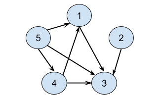
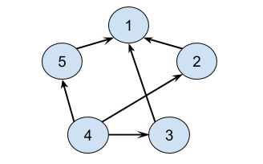
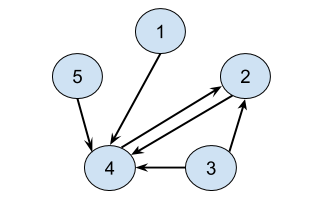

[TOC]

## Solution

---

### Approach 1: Two Arrays

**Intuition**

The `trust` relationships form a graph. Each `trust` pair, `[a, b]` represents a **directed edge** going from `a` to `b`.

For example, with $N = 5$ and $trust = [[1,3],[2,3],[4,3],[4,1],[5,3],[5,1],[5,4]]$, we get the following graph. Who is the town judge?



What about this example, with $trust = [[2,1],[3,1],[4,2],[4,3],[4,5],[5,1]]$?



And what about this example, with $trust = [[1,4],[2,4],[3,2],[3,4],[4,2],[5,4]]$?



For the first example, the town judge is `3`, because they are trusted by all four *other* people; `1`, `2`, `4`, and `5`, but they don't trust anybody themselves.

For the second example, there is no town judge. Nobody is trusted by everybody else.

For the third example, there is also no town judge. While `4` is trusted by everybody, `4` themselves trusts `2`. Therefore, `4` can't be the town judge.

Some people would be tempted to launch straight into converting the input into a standard graph format, for example an adjacency list (or worse, a complicated linked structure), as soon as they make the observation that this has something to do with graphs. Then, they'll go back to trying to solve the actual problem. But as we'll see, it's better to start by looking really closely at the problem, as there's a way we can solve it without making a graph.

In graph theory, we say the **outdegree** of a vertex (person) is the number of directed edges going out of it. For this graph, the outdegree of the vertex represents the number of other people that person `trust`s.

Likewise, we say that the **indegree** of a vertex (person) is the number of directed edges going *into* it. So here, it represents the number of people *that trust* that person.

We can define the town judge in terms of **indegree** and **outdegree**.

> The town judge has an outdegree of `0` and an indegree of $N - 1$ because they trust nobody, and everybody trusts them (except themselves).

Therefore, this problem simplifies to calculating the **indegree** and **outdegree** for each person and then checking whether or not any of them meet the criteria of the town judge.

We can calculate the indegrees and outdegrees for everybody, using a single loop over the input `trust` array. We'll write the results into two arrays.

```java
int[] indegrees = new int[N + 1];
int[] outdegrees = new int[N + 1];

for (int[] relation : trust) {
    outdegrees[relation[0]]++;
    indegrees[relation[1]]++;
}
```

Then, we can simply loop over the people (numbered from `1` to `N`) and check whether or not they meet the town judge criteria.

```java
for (int i = 1; i <= N; i++) {
    if (indegrees[i] == N - 1 && outdegrees[i] == 0) {
        return i;
    }
}
return -1;
```

One optimization we can make is to observe that it is *impossible* for there to be a town judge if there are not at least $N - 1$ edges in the `trust` array. This is because a town judge must have $N - 1$ in-going edges, and so if there aren't *at least* $N - 1$ edges in total, then it is impossible to meet this requirement. This observation will also be very useful when we're reasoning about the time complexity.

> If $\text{trust.length} < N - 1$, then we can immediately return `-1`.

**Algorithm**

```python
def findJudge(self, N: int, trust: List[List[int]]) -> int:

    if len(trust) < N - 1:
        return -1

    indegree = [0] * (N + 1)
    outdegree = [0] * (N + 1)

    for a, b in trust:
        outdegree[a] += 1
        indegree[b] += 1

    for i in range(1, N + 1):
        if indegree[i] == N - 1 and outdegree[i] == 0:
            return i
    return -1
```

**Complexity Analysis**

Let $N$ be the *number of people*, and $E$ be the *number of edges* (trust relationships).

- Time Complexity : $O(E)$.

    We loop over the `trust` list once. The cost of doing this is $O(E)$.

    We then loop over the people. The cost of doing this is $O(N)$.

    Going by this, it now looks this is one those many graph problems where the cost is $O(\max(N, E) = O(N + E)$. After all, we don't know whether $E$ or $N$ is the bigger one, right?

*However*, remember how we terminate early if $E < N - 1$? This means that in the best case, the time complexity is $O(1)$. And in the worst case, we know that $E ≥ N - 1$. For the purpose of big-oh notation, we ignore the constant of $1$. Therefore, in the worst case, $E$ has to be bigger, and so we can simply drop the $N$, leaving $O(E)$.

- Space Complexity : $O(N)$.

    We allocated 2 arrays; one for the indegrees and the other for the outdegrees. Each was of length $N + 1$. Because in big-oh notation we drop constants, this leaves us with $O(N)$.

***This last note is provided more for interest than for interview preparation.*** A variant of the approach is to use a `HashMap`s instead of Arrays. That way, you'll only need to store indegrees and outdegrees that are non-zero. This will have no impact on the time complexity, because we still need to look at the entire input `Array`. It also has no impact on the *worst case* space complexity, because when a town judge exists, all the other $N - 1$ people have an outdegree of at least `1` (from their trust of the town judge). In some cases where $E ≥ N - 1$ but there is no town judge, some memory might be saved, with a best case of $O(\sqrt{E}\,)$. This represents the situation of the number of unique people present in the `trust` Array being minimized (beyond an easy-level question interview, don't panic!). With the overhead of a `HashMap`, there's probably no gain of using one over an `Array` for this problem.

</br>

---

### Approach 2: One Array

**Intuition**

Just to be clear, there's nothing wrong with Approach 1. If you got it, you're doing great! Approach 2 is a little more subtle. Coming up with these kinds of approaches is something you'll learn to do with experience.

We don't need separate arrays for indegree and outdegree. We can instead build a single Array with the result of $indegree - outdegree$ for each person. In other words, we'll `+1` to their "score" for each person they are trusted by, and `-1` from their "score" for each person they trust. Therefore, for a person to maximize their "score", they should be trusted by as many people as possible, and trust as few people as possible.

The maximum indegree is $N - 1$. This represents everybody trusting the person (except for themselves, they cannot trust themselves). The minimum indegree is `0`. This represents not trusting anybody. Therefore, the maximum value for $indegree - outdegree$ is  $(N - 1) - 0 = N - 1$. These values also happen to be the definition of the town judge!

> The town judge is the only person who could possibly have $indegree - outdegree$ equal to $N - 1$.

**Algorithm**

Each person gains `1` "point" for each person they are trusted by, and loses `1` "point" for each person they trust. Then at the end, the town judge, if they exist, must be the person with $N - 1$ "points".

```python
def findJudge(self, N: int, trust: List[List[int]]) -> int:

    if len(trust) < N - 1:
        return -1

    trust_scores = [0] * (N + 1)

    for a, b in trust:
        trust_scores[a] -= 1
        trust_scores[b] += 1

    for i, score in enumerate(trust_scores[1:], 1):
        if score == N - 1:
            return i
    return -1
```

**Complexity Analysis**

Recall that $N$ is the *number of people*, and $E$ is the *number of edges* (trust relationships).

- Time Complexity : $O(E)$.

    Same as above. We still need to loop through the $E$ edges in `trust`, and the argument about the relationship between $N$ and $E$ still applies.

- Space Complexity : $O(N)$.

    Same as above. We're still allocating an array of length $N$.

</br>

---

### Bonus

**Can There Be More Than One Town Judge?**

In the problem description, we're told that *iff* there is a town judge, there'll only be *one* town judge.

It's likely that not all interviewers would tell you directly that there can only be one town judge. If you asked them whether or not there could be more than one town judge, they might ask *you* if there could be. And the answer is... it's *impossible*!

If there were two town judges, then they would have to trust each other, otherwise we'd have a town judge not trusted by everybody. But this doesn't work, because town judges aren't supposed to trust anybody. Therefore, we know there can be at most one town judge.

**A Related Question**

Secondly, for *premium members*, there is a similar question on Leetcode, called [Find the Celebrity](https://leetcode.com/articles/find-the-celebrity/). You need to do the same thing—find a person who has an indegree of $N - 1$ and an outdegree of `0`. However, the input format is a bit different.

It's well worth a look at. A seemingly small difference (the input format) completely changes what the optimal algorithm to solve it is. Interestingly though, the optimal algorithm for that problem can also be used here. The only difference is that there, it has a cost of $O(N)$, but here it has a cost of $O(E)$. Try and figure out why once you've solved both problems. It's a really nice example of cost analysis with graphs.

</br>