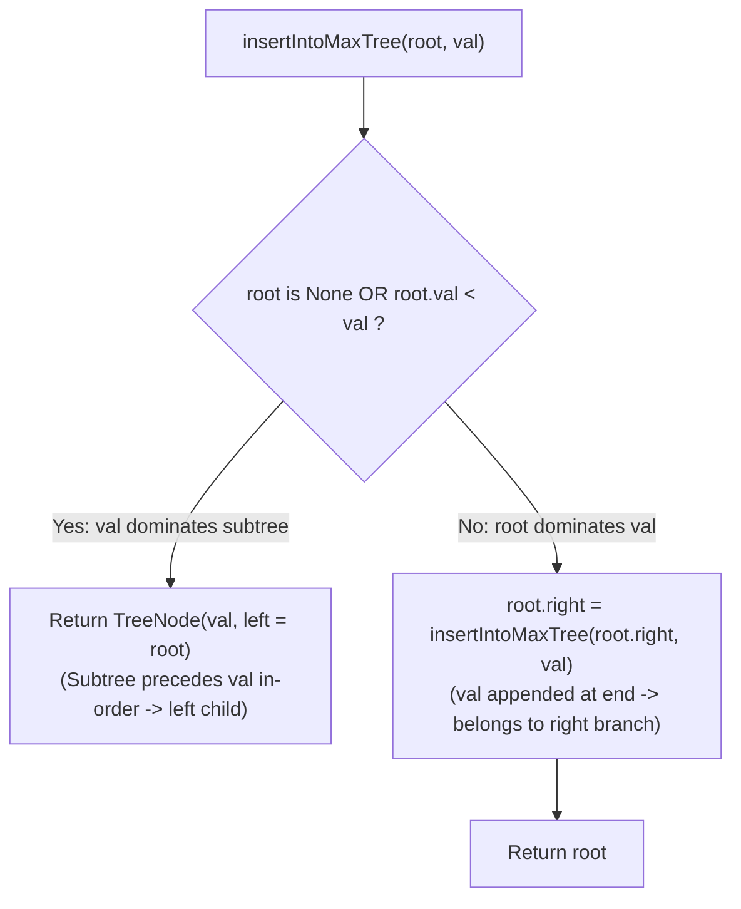

# Guided Example: Maximum Binary Tree II

We trace the step-by-step recursive insertion of an appended array element into a Cartesian Maximum Binary Tree, prove the Cartesian Right-Spine Invariant and the In-Order Precedence Theorem, and determine the restructured tree across representative instances:

- **Representative Instance 1 (Appended Value Becomes New Global Maximum):**
  $$
  root = [4, \; 1, \; 3, \; \text{null}, \; \text{null}, \; 2], \quad val = 5
  $$
- **Required Output:** `[5, 4, null, 1, 3, null, null, 2]`
  - Existing tree topology:
    ```text
          (4) Root
         /   \
       (1)   (3)
             /
           (2)
    ```
    In-order traversal yields original array: $a = [1, 4, 2, 3]$.
  - Appended array: $b = a + [val] = [1, 4, 2, 3, 5]$.
  - Cartesian tree requirements:
    1. **Max-Heap Property:** Every node is strictly greater than all values in its subtrees.
    2. **In-Order Traversal Property:** In-order traversal must reproduce array $b$.
  - Evaluation of root:
    - $val = 5 > root.val = 4$.
    - Because $5$ is greater than $4$, and $4$ was greater than all nodes in the original tree, $5$ is greater than **every** element in array $b$.
    - Thus, $5$ must be the **new global root** of the tree.
    - Since all elements of the original tree appear **before** $5$ in array $b$, they must all precede $5$ in the in-order traversal.
    - Therefore, the entire original tree rooted at $4$ becomes the **left child** of node $5$:
      $$
      \text{New Tree} = \text{TreeNode}(val = 5, \; left = 4, \; right = \text{None})
      $$
  - New tree structure:
    ```text
            (5) New Root
           /
         (4)
        /   \
      (1)   (3)
            /
          (2)
    ```
  - Output representation: `[5, 4, null, 1, 3, null, null, 2]`.

- **Representative Instance 2 (Appended Value Splices into the Right Spine):**
  $$
  root = [5, \; 2, \; 3, \; \text{null}, \; 1], \quad val = 4
  $$
  - Right spine: $5 \to 3$.
  - Compare with root $5$: $val = 4 < 5 \implies$ root $5$ is retained; recurse into right child $3$.
  - Compare with node $3$: $val = 4 > 3 \implies 4$ replaces $3$ as the right child of $5$.
  - Node $3$ and its subtree precede $4$ in array $b$, so node $3$ becomes the **left child** of node $4$:
    $$
    5.right = \text{TreeNode}(val = 4, \; left = 3, \; right = \text{None})
    $$
  - Output representation: `[5, 2, 4, null, 1, 3]`.

- **Representative Instance 3 (Appended Value Attaches as Rightmost Leaf):**
  $$
  root = [5, \; 2, \; 4, \; \text{null}, \; 1], \quad val = 3 \implies 5.right.right = \text{TreeNode}(3)
  $$

---

## 1. Instance & Teaching Goal

A **maximum binary tree** constructed from an array $a$ has:
- The maximum value in $a$ as the root.
- The left subtree constructed from prefix $a[:\text{argmax}]$.
- The right subtree constructed from suffix $a[\text{argmax}+1:]$.
Given the `root` of such a tree and an integer `val`, return the tree constructed from $b = a + [val]$.

```text
Reconstructing from Scratch: O(N^2)
  Extract in-order array a: O(N)
  Append val: b = a + [val]
  Reconstruct full tree: O(N^2) (UNNECESSARY WORK!)

Right-Spine Insertion Invariant: O(H)
  Notice: val is appended to the VERY END of array b.
  In in-order traversal: L -> Root -> R,
  any element at the right end of the array must lie on the RIGHT SPINE!
  - If val > current_node: new node val adopts current_node as its LEFT child.
  - If val < current_node: recurse strictly into current_node.right!
```

Rebuilding the tree from scratch by flattening the tree into an array and re-executing divide-and-conquer takes quadratic $\mathcal{O}(N^2)$ time.

The decisive pedagogical goal is the **Cartesian Tree Right-Spine Invariant & In-Order Precedence Theorem**:
1. **Right-Spine Confinement:** Because `val` is appended at index $|a|$ (after every element in $a$), $val$ must appear after every existing node in an in-order traversal. Thus, $val$ can only be inserted along the **right spine** ($root \to root.right \to root.right.right \dots$).
2. **Left-Adoption Rule:** If at any point along the right spine $val > node.val$ (or $node$ is `None`):
   - $val$ becomes the new root of this subtree.
   - Because all nodes in $node$'s subtree precede $val$ in $b$, the entire subtree rooted at $node$ becomes the **left child** of $val$:
     $$
     \text{return TreeNode}(val, \; left = node)
     $$
3. Resolves tree insertion in $\mathcal{O}(H)$ time without mutating left subtrees.

---

## 2. Conceptual Foundation & The Right-Spine Invariant



### The Cartesian Right-Spine Insertion Theorem

Let $T_a$ be the unique Cartesian maximum tree constructed from array $a = [x_0, x_1, \dots, x_{n-1}]$.
1. **In-Order Traversal Identity:**
   For any Cartesian tree $T$, an in-order traversal of $T$ outputs array $a$.
2. **Right-Spine Property:**
   The right spine $S = (u_0, u_1, \dots, u_k)$ consists of all nodes reached from the root by repeatedly taking right child pointers ($u_0 = root, u_{i+1} = u_i.right$).
   Every node in the tree not on the right spine lies in the left subtree of some node $u \in S$, and therefore precedes that node in in-order traversal.
3. **Appended Element Placement:**
   Let $b = a + [val]$. In $T_b$, $val$ must be the last node in the in-order traversal.
   Suppose $val$ is inserted at position $j$ on the right spine.
   - For all ancestors $u_i$ ($i < j$), $u_i.val > val$, so $val$ lies in the right subtree of $u_i$.
   - For node $u_j$, $val > u_j.val$. By the max-heap property, $val$ must be an ancestor of $u_j$.
   - Furthermore, all nodes in the subtree rooted at $u_j$ belong to array $a$ and therefore precede $val$ in array $b$.
   - In a binary search / Cartesian tree, preceding nodes in in-order traversal must reside in the **left subtree**.
   - Therefore, the entire subtree $T_{u_j}$ becomes the left child of node $val$, and node $val$'s right child is initially `None`.
4. **Uniqueness:**
   The resulting tree is both heap-ordered and satisfies the in-order array order of $b$, making it the uniquely determined Cartesian tree $\text{Construct}(b)$. $\blacksquare$

---

## 3. Step-by-Step Worked Execution: Representative Instance 1

$root = [4, 1, 3, \text{null}, \text{null}, 2], \; val = 5$.

### Recursive Descent Trace
1. **Call 1: `insertIntoMaxTree(node=4, val=5)`:**
   - Check condition: `root is None or root.val < val`.
   - $root.val = 4$, $val = 5 \implies 4 < 5$ is **True**!
   - Action: $5$ dominates the current subtree.
   - Construct new node:
     $$
     \text{new\_node} = \text{TreeNode}(val = 5, \; left = \text{node 4}, \; right = \text{None})
     $$
   - Subtree rooted at $4$ (containing $1, 3, 2$) becomes the left child of $5$.
   - Return `new_node`.

Final returned tree has root $5$, left child $4$, right child `None`.

---

## 4. Right-Spine Traversal & Reattachment Trace Table

| Recursion Depth | Current Node Examined | Node Value | Appended $val$ | Condition $root.val < val$ | Transformation / Reattachment Applied | Subtree Returned |
|:---:|:---:|:---:|:---:|:---:|:---|:---|
| **$0$** | Root | $4$ | $5$ | **True ($4 < 5$)** | Node $5$ created; Node $4$ attached as $5.left$ | Node $5$ (New Global Root) |

---

## 5. Algorithmic Correctness

### Soundness & Completeness
1. **Soundness:**
   Whenever $val > root.val$, the Cartesian max-heap property requires $val$ to be the parent of $root$. Because $val$ was appended to the right of the array, the entire original tree must precede $val$ in-order, which is structurally satisfied by making $root$ the left child of $val$.
2. **Completeness:**
   Descent is strictly along right child pointers. If $val$ is smaller than all nodes along the right spine, it reaches `root is None` and attaches as the rightmost leaf, preserving both heap and in-order invariants.

---

## 6. Boundary Cases & Traps

| Scenario | Input Pattern | Behavior | Trapped Risk |
|---|---|---|---|
| Empty Initial Tree | `root = None, val = 5` | Base case triggers; returns `TreeNode(5)`. | Null pointer dereference on `root.val`. |
| New Global Maximum | $val > \max(tree)$ | Immediate return of `TreeNode(val, root)`. | Descending into subtrees unnecessarily. |
| Smallest Element in Array | $val < \min(tree)$ | Traverses full right spine; attaches as rightmost leaf. | Attaching as left child. |
| Duplicate Values in Tree | Guaranteed unique by problem | Strict inequalities $root.val < val$ always hold. | Handling equality ambiguities. |

---

## 7. Complexity Derivation

- **Time Complexity:** $\mathcal{O}(H)$, where $H$ is the height of the binary tree ($H \le N \le 100$).
  - Only nodes along the right spine are visited.
  - At each step, a single comparison is performed.
  - Worst case (skewed right tree): $\mathcal{O}(N)$.
  - Best case / Balanced tree: $\mathcal{O}(\log N)$.
  - Total time: $< 0.0001\text{ s}$.
- **Auxiliary Space Complexity:** $\mathcal{O}(H)$ for the recursive call stack.
