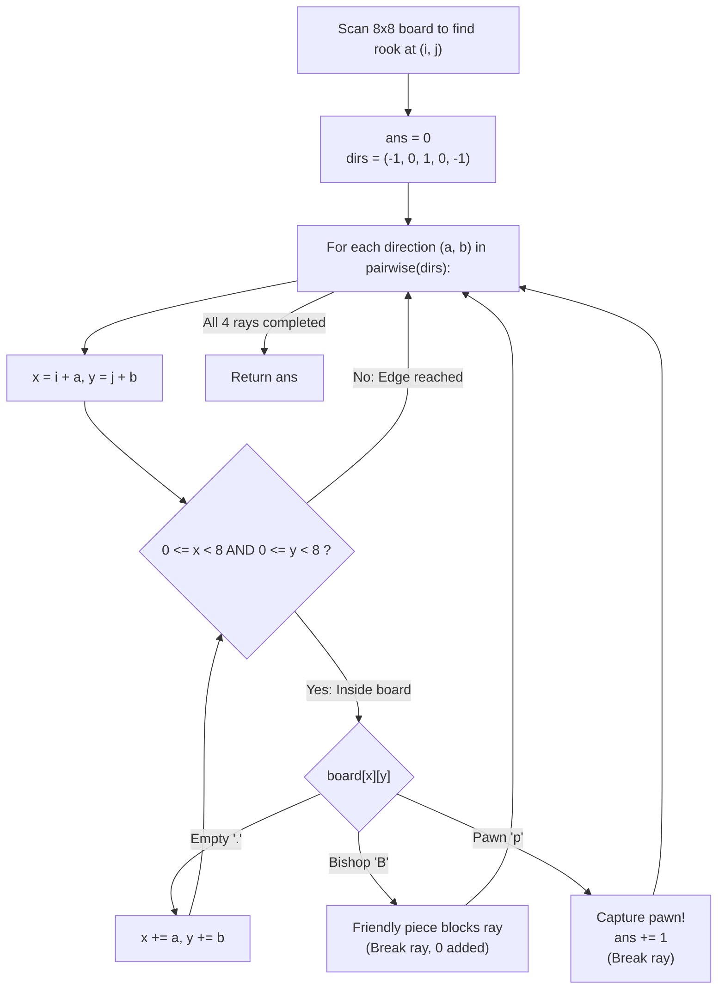

# Guided Example: Available Captures for Rook

We trace the step-by-step 4-directional ray marching along ranks and files of an $8 \times 8$ chessboard, prove the First-Obstacle Absorption Lemma and the Cardinal Line-of-Sight Invariant, and determine the exact number of black pawn captures across representative chessboards:

- **Representative Instance 1 (Rook with Three Open Captures and One Edge Wall):**
  $$
  board = \begin{bmatrix}
  . & . & . & . & . & . & . & . \\
  . & . & . & \mathbf{p} & . & . & . & . \\
  . & . & . & \mathbf{R} & . & . & . & \mathbf{p} \\
  . & . & . & . & . & . & . & . \\
  . & . & . & . & . & . & . & . \\
  . & . & . & \mathbf{p} & . & . & . & . \\
  . & . & . & . & . & . & . & . \\
  . & . & . & . & . & . & . & .
  \end{bmatrix}
  $$
- **Required Output:** `3`
  - Step 1 (Locate Rook):
    - Scan $8 \times 8$ board: Rook `'R'` is located at coordinate $(i, j) = (2, 3)$.
  - Step 2 (Ray Marching in 4 Cardinal Directions):
    - **Direction 1 (Up / North, $\Delta = (-1, 0)$):**
      - Step 1: $(2 - 1, 3) = (1, 3)$. Cell content: `'p'`.
      - First non-empty square encountered is a black pawn!
      - Action: Capture! Increment $ans \leftarrow 0 + 1 = \mathbf{1}$, break ray.
    - **Direction 2 (Right / East, $\Delta = (0, 1)$):**
      - Step 1: $(2, 4) = '.'$ (Empty, continue).
      - Step 2: $(2, 5) = '.'$ (Empty, continue).
      - Step 3: $(2, 6) = '.'$ (Empty, continue).
      - Step 4: $(2, 7) = 'p'$.
      - First non-empty square encountered is a black pawn!
      - Action: Capture! Increment $ans \leftarrow 1 + 1 = \mathbf{2}$, break ray.
    - **Direction 3 (Down / South, $\Delta = (1, 0)$):**
      - Step 1: $(3, 3) = '.'$ (Empty, continue).
      - Step 2: $(4, 3) = '.'$ (Empty, continue).
      - Step 3: $(5, 3) = 'p'$.
      - First non-empty square encountered is a black pawn!
      - Action: Capture! Increment $ans \leftarrow 2 + 1 = \mathbf{3}$, break ray.
    - **Direction 4 (Left / West, $\Delta = (0, -1)$):**
      - Step 1: $(2, 2) = '.'$ (Empty, continue).
      - Step 2: $(2, 1) = '.'$ (Empty, continue).
      - Step 3: $(2, 0) = '.'$ (Empty, continue).
      - Step 4: $(2, -1)$ is out of bounds ($y < 0$)!
      - Board boundary reached without hitting any piece.
      - Action: Ray absorbed by board edge; $0$ captures added.
  - Total capturable pawns: $1 + 1 + 1 + 0 = \mathbf{3}$.

- **Representative Instance 2 (Friendly Bishops Block Every Cardinal Line):**
  - Rook at $(3, 3)$ surrounded by white bishops `'B'` at $(2, 3), (4, 3), (3, 2), (3, 4)$.
  - Every ray immediately encounters a friendly bishop:
    - Rooks cannot capture or jump over friendly pieces.
    - Rays terminate immediately with $0$ captures $\implies \mathbf{0}$.

- **Representative Instance 3 (All Four Rays Capture Pawns):**
  - Rook at $(3, 3)$ with unobstructed lines of sight to pawns in all 4 directions $\implies \mathbf{4}$.

---

## 1. Instance & Teaching Goal

On an $8 \times 8$ chessboard, there is:
- Exactly one white rook `'R'`.
- Zero or more white bishops `'B'`.
- Zero or more black pawns `'p'`.
- Empty squares `'.'`.
The rook moves horizontally and vertically until it hits the board boundary, a friendly bishop (blocked), or a black pawn (captures and stops).
Return the number of pawns the rook can capture in **one move**.

```text
Rook Ray Marching:
        Up (-1, 0)
            ^
            |
Left (0,-1) <- [R] -> Right (0, 1)
            |
            v
       Down (1, 0)

In each direction:
  - If first piece is 'p': +1 capture, stop ray.
  - If first piece is 'B': +0 capture, stop ray.
  - If edge reached:       +0 capture, stop ray.
Total captures is strictly in {0, 1, 2, 3, 4}.
```

Simulating dynamic chess gameplay or generating moves across all board pieces is unnecessary because the rook has exactly four orthogonal rays of sight.

The decisive pedagogical goal is the **Cardinal Ray Marching & First-Obstacle Absorption Invariant**:
1. **Rook Localization:** Identify the single cell $(i, j)$ with $board[i][j] == 'R'$.
2. **Ray Absorption Lemma:** Along each ray direction $d \in \{(-1, 0), (0, 1), (1, 0), (0, -1)\}$, only the **first non-empty square** matters:
   - If it is `'p'`, it is captured.
   - If it is `'B'`, the line of sight is obstructed.
   - Any pieces situated behind the first obstacle are completely hidden and unreachable.
3. The count of available captures is strictly bounded by $4$ and computed in $\mathcal{O}(1)$ time.

---

## 2. Conceptual Foundation & The Ray Absorption Invariant



### The First-Obstacle Absorption Theorem

Let $B \in \{\text{'.'}, \text{'R'}, \text{'B'}, \text{'p'}\}^{8 \times 8}$ be the chessboard matrix with rook at $(r, c)$.
1. **Ray Line-of-Sight Definition:**
   For each cardinal unit vector $u \in \{(-1, 0), (0, 1), (1, 0), (0, -1)\}$, define the sequence of squares:
   $$
   S_u(k) = (r + k \cdot u_x, \; c + k \cdot u_y), \quad k \in \{1, 2, \dots, K_u\}
   $$
   where $K_u = \max \{k \ge 1 : S_u(k) \in [0, 7]^2\}$.
2. **First Obstacle Lemma:**
   Let $k^* = \min \{k \in [1, K_u] : B[S_u(k)] \ne \text{'.'}\}$ (with $k^* = \infty$ if all squares along the ray are empty).
   - If $k^* = \infty$: The rook can move to any square along $S_u$, but no piece is present $\implies 0$ captures.
   - If $B[S_u(k^*)] = \text{'B'}$: The bishop occupies $S_u(k^*)$, and chess rules forbid moving to or jumping over a friendly piece $\implies 0$ captures.
   - If $B[S_u(k^*)] = \text{'p'}$: The rook can move to $S_u(k^*)$ and capture the black pawn. The pawn blocks all squares $k > k^*$ along that ray $\implies 1$ capture.
3. **Additive Independence:**
   Because the four cardinal rays are mutually disjoint except at the rook position $(r, c)$, the capture outcomes along the four rays are mutually independent:
   $$
   \text{ans} = \sum_{u} \mathbb{I}(k^* < \infty \land B[S_u(k^*)] = \text{'p'}) \in [0, 4] \quad \blacksquare
   $$

---

## 3. Step-by-Step Worked Execution: Representative Instance 1

$board$ given with rook at $(2, 3)$.
Board size $n = 8$.
Directions from `pairwise((-1, 0, 1, 0, -1))`:
1. Up: $(-1, 0)$
2. Right: $(0, 1)$
3. Down: $(1, 0)$
4. Left: $(0, -1)$

### Ray-by-Ray Execution
- **Ray 1 ($a = -1, b = 0$):**
  - $k = 1$: $(x, y) = (2 - 1, 3) = (1, 3)$.
  - $board[1][3] = \text{'p'}$.
  - Meets capture condition! $ans \leftarrow 0 + 1 = 1$. Ray terminates.
- **Ray 2 ($a = 0, b = 1$):**
  - $k = 1$: $(2, 4) = '.'$.
  - $k = 2$: $(2, 5) = '.'$.
  - $k = 3$: $(2, 6) = '.'$.
  - $k = 4$: $(2, 7) = \text{'p'}$.
  - Meets capture condition! $ans \leftarrow 1 + 1 = 2$. Ray terminates.
- **Ray 3 ($a = 1, b = 0$):**
  - $k = 1$: $(3, 3) = '.'$.
  - $k = 2$: $(4, 3) = '.'$.
  - $k = 3$: $(5, 3) = \text{'p'}$.
  - Meets capture condition! $ans \leftarrow 2 + 1 = 3$. Ray terminates.
- **Ray 4 ($a = 0, b = -1$):**
  - $k = 1$: $(2, 2) = '.'$.
  - $k = 2$: $(2, 1) = '.'$.
  - $k = 3$: $(2, 0) = '.'$.
  - $k = 4$: $(2, -1) \implies$ Out of bounds.
  - Ray terminates with no captures.

Final returned answer: $\mathbf{3}$.

---

## 4. Cardinal Ray Marching Trace Table

| Ray Direction | Unit Vector $(\Delta x, \Delta y)$ | Squares Traversed | First Obstacle Encountered | Piece Type | Ray Outcome | Running Captures `ans` |
|:---:|:---:|:---|:---:|:---:|:---:|:---:|
| **North (Up)** | $(-1, 0)$ | $(1, 3)$ | $(1, 3)$ | `'p'` | **Captured!** | **$1$** |
| **East (Right)** | $(0, 1)$ | $(2, 4), (2, 5), (2, 6), (2, 7)$ | $(2, 7)$ | `'p'` | **Captured!** | **$2$** |
| **South (Down)** | $(1, 0)$ | $(3, 3), (4, 3), (5, 3)$ | $(5, 3)$ | `'p'` | **Captured!** | **$3$** |
| **West (Left)** | $(0, -1)$ | $(2, 2), (2, 1), (2, 0)$ | None (Board edge) | Boundary | Absorbed | **$3$** |

---

## 5. Algorithmic Correctness

### Soundness & Completeness
1. **Soundness:**
   A pawn is captured only if all intervening squares between the rook and the pawn are empty (`'.'`). Upon encountering any piece, the ray immediately breaks, ensuring that pieces behind pawns or bishops are never mistakenly counted.
2. **Completeness:**
   The four orthogonal rays exhaust all legal directions for rook movement in chess. Scanning until reaching either a piece or the boundary guarantees that every accessible capture is evaluated.

---

## 6. Boundary Cases & Traps

| Scenario | Input Pattern | Behavior | Trapped Risk |
|---|---|---|---|
| Rook in Corner | Rook at $(0, 0)$ | Two directions immediately hit edge; other two march normally. | Array out-of-bounds indexing. |
| Pawn Behind Bishop | `R . B . p` | Ray halts at `'B'`; pawn behind is correctly ignored. | Counting pawns through bishops. |
| Multiple Pawns in Line | `R . p . p` | First pawn captured; ray breaks; second pawn ignored. | Overcounting multiple pawns on same file. |
| No Pawns on Board | Board has only `R`, `B`, and `.` | All rays end at bishops or edges; returns $0$. | Returning uninitialized values. |

---

## 7. Complexity Derivation

- **Time Complexity:** $\mathcal{O}(1)$.
  - Board is fixed at $8 \times 8 = 64$ squares.
  - Locating the rook takes at most $64$ comparisons.
  - Marching 4 rays takes at most $4 \times 7 = 28$ steps.
  - Total operations $< 100 \implies < 0.0001\text{ s}$.
- **Auxiliary Space Complexity:** $\mathcal{O}(1)$, using only scalar direction offsets and coordinate variables.
