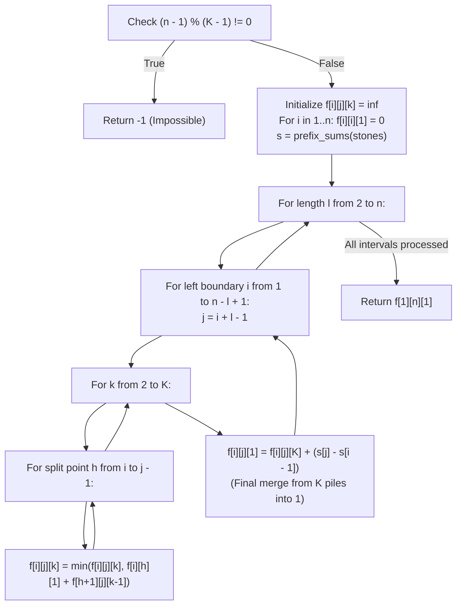

# Guided Example: Minimum Cost to Merge Stones

We trace the step-by-step 3D interval dynamic programming across subsegment lengths and target pile counts, prove the Pile Reduction Modulo Lemma and the Convolutional Interval Decomposition Invariant, and determine the minimal merge cost across representative stone rows:

- **Representative Instance 1 (Classic Pairwise Adjacent Merging):**
  $$
  stones = [3, \; 2, \; 4, \; 1], \quad K = 2, \quad n = 4
  $$
- **Required Output:** `20`
  - Step 0 (Feasibility Modulo Verification):
    - Each move merges $K = 2$ piles into $1$, removing $K - 1 = 1$ pile.
    - Total reduction needed: $n - 1 = 4 - 1 = 3$ piles.
    - Check: $(n - 1) \bmod (K - 1) = 3 \bmod 1 = 0$ (Feasible!).
  - Prefix sum array $s$ (size $n + 1 = 5$):
    $$
    s = [0, \; 3, \; 5, \; 9, \; 10]
    $$
    Sum of stones in range $[i \dots j]$ is $s[j] - s[i - 1]$.
  - 3D DP formulation:
    - Let $f[i][j][k]$ be the minimum cost to merge subarray $[i \dots j]$ into $k$ piles ($1 \le k \le K$).
    - Base singletons: $f[i][i][1] = 0$ for all $i \in [1, 4]$. All other cells initialized to $\infty$.
  - Execution by interval length $l \in [2, 4]$:
    1. **Length $l = 2$:**
       - Range $[1 \dots 2]$ ($stones = [3, 2]$):
         - Into $k = 2$ piles: $f[1][1][1] + f[2][2][1] = 0 + 0 = 0$.
         - Into $k = 1$ pile: $f[1][2][2] + (s[2] - s[0]) = 0 + 5 = \mathbf{5}$.
       - Range $[2 \dots 3]$ ($stones = [2, 4]$):
         - Into $k = 2$ piles: $0$.
         - Into $k = 1$ pile: $0 + (s[3] - s[1]) = 0 + 6 = \mathbf{6}$.
       - Range $[3 \dots 4]$ ($stones = [4, 1]$):
         - Into $k = 2$ piles: $0$.
         - Into $k = 1$ pile: $0 + (s[4] - s[2]) = 0 + 5 = \mathbf{5}$.
    2. **Length $l = 3$:**
       - Range $[1 \dots 3]$ ($stones = [3, 2, 4]$):
         - $k = 2$: $\min(f[1][1][1] + f[2][3][1], \; f[1][2][1] + f[3][3][1]) = \min(0 + 6, \; 5 + 0) = \mathbf{5}$.
         - $k = 1$: $f[1][3][2] + (s[3] - s[0]) = 5 + 9 = \mathbf{14}$.
       - Range $[2 \dots 4]$ ($stones = [2, 4, 1]$):
         - $k = 2$: $\min(f[2][2][1] + f[3][4][1], \; f[2][3][1] + f[4][4][1]) = \min(0 + 5, \; 6 + 0) = \mathbf{5}$.
         - $k = 1$: $f[2][4][2] + (s[4] - s[1]) = 5 + 7 = \mathbf{12}$.
    3. **Length $l = 4$ (Full array $[1 \dots 4]$):**
       - Into $k = 2$ piles:
         - Split $h = 1$: $f[1][1][1] + f[2][4][1] = 0 + 12 = 12$.
         - Split $h = 2$: $f[1][2][1] + f[3][4][1] = 5 + 5 = \mathbf{10}$ (Optimal!).
         - Split $h = 3$: $f[1][3][1] + f[4][4][1] = 14 + 0 = 14$.
         - Minimum $f[1][4][2] = \mathbf{10}$.
       - Into $k = 1$ pile:
         $$
         f[1][4][1] = f[1][4][2] + (s[4] - s[0]) = 10 + 10 = \mathbf{20}
         $$
  - Total optimal cost: $\mathbf{20}$.
  - Merge order verification:
    - Step 1: Merge $[3, 2] \to 5$ (cost 5). Piles: `[5, 4, 1]`.
    - Step 2: Merge $[4, 1] \to 5$ (cost 5). Piles: `[5, 5]`.
    - Step 3: Merge $[5, 5] \to 10$ (cost 10). Piles: `[10]`.
    - Total cost: $5 + 5 + 10 = 20$.

- **Representative Instance 2 (Impossible Pile Count by Parity):**
  $$
  stones = [3, \; 2, \; 4, \; 1], \quad K = 3
  $$
  - Reduction per move: $K - 1 = 3 - 1 = 2$.
  - Feasibility check: $(n - 1) \bmod (K - 1) = (4 - 1) \bmod 2 = 3 \bmod 2 = 1 \ne 0$.
  - Parity mismatch: 4 piles merge into $4 - 2 = 2$ piles, but 2 piles cannot be merged into 1 because 3 piles are required.
  - Return $\mathbf{-1}$.

- **Representative Instance 3 (Two Consecutive Three-Way Merges):**
  $$
  stones = [3, 5, 1, 2, 6], \quad K = 3 \implies (5 - 1) \bmod 2 = 0 \implies \mathbf{25}
  $$

---

## 1. Instance & Teaching Goal

There are `n` piles of stones in a row. In one move, you can merge **exactly $K$ consecutive piles** into one pile at a cost equal to the sum of stones in those $K$ piles.
Return the **minimum cost** to merge all piles into one pile, or `-1` if impossible.

```text
The Modulo Invariant:
  Initial piles: n
  Each operation replaces K piles with 1 pile: Net change = -(K - 1) piles.
  After m operations: Piles remaining = n - m * (K - 1) = 1
  Rearranging: (n - 1) = m * (K - 1)
  Necessity: (n - 1) % (K - 1) == 0. If nonzero, IMPOSSIBLE -> return -1!

3D Interval DP:
  f[i][j][k] = Min cost to merge subsegment stones[i ... j] into k piles.
  - To form k piles (k > 1): Split at h into 1 pile + (k - 1) piles.
  - To form 1 pile: Merge into K piles first, then add sum(stones[i ... j])!
```

Greedy adjacent merging fails on general arrays because early local merges alter future sum weights.

The decisive pedagogical goal is the **Pile Reduction Modulo Lemma & 3D Interval DP Invariant**:
1. **Feasibility Gate:** Each merge permanently decreases the pile count by $K - 1$. Reaching $1$ pile requires $(n - 1) \equiv 0 \pmod{K - 1}$.
2. **Convolutional Subsegment Decomposition:**
   For $k \in [2, K]$, merging $[i \dots j]$ into $k$ piles decomposes into merging $[i \dots h]$ into $1$ pile and $[h + 1 \dots j]$ into $k - 1$ piles:
   $$
   f[i][j][k] = \min_{i \le h < j} \{ f[i][h][1] + f[h + 1][j][k - 1] \}
   $$
3. **The Final Consolidation Step:**
   Merging $[i \dots j]$ into $1$ pile requires first reducing it to $K$ piles, followed by the final merge whose cost is the range sum $\sum_{m=i}^j stones[m]$:
   $$
   f[i][j][1] = f[i][j][K] + (s[j] - s[i - 1])
   $$
4. Computes the globally optimal cost $f[1][n][1]$ in $\mathcal{O}(n^3 \cdot K)$ polynomial time.

---

## 2. Conceptual Foundation & The 3D Interval Recurrence Invariant



### The Pile Reduction Modulo Theorem

Let $n$ be the initial number of piles, and let $K \ge 2$ be the fixed merge size.
1. **Invariant Pile Reduction:**
   Let $P_t$ be the number of piles remaining after $t$ merge operations ($P_0 = n$).
   In each operation, $K$ contiguous piles are replaced by $1$ pile:
   $$
   P_{t+1} = P_t - K + 1 = P_t - (K - 1)
   $$
   By induction:
   $$
   P_t = n - t(K - 1) \equiv n \pmod{K - 1}
   $$
2. **Terminal Reachability Criterion:**
   The process terminates successfully if and only if there exists an integer $m \ge 0$ such that $P_m = 1$:
   $$
   1 = n - m(K - 1) \implies n - 1 = m(K - 1) \implies (n - 1) \equiv 0 \pmod{K - 1}
   $$
   If $(n - 1) \bmod (K - 1) \ne 0$, no sequence of moves can ever reduce the array to a single pile.
3. **Subproblem Optimal Substructure:**
   Every valid tree of merges is planar and contiguous. To form $k$ piles from $[i \dots j]$, the leftmost pile must be the result of fully merging some prefix $[i \dots h]$ into $1$ pile, while the remaining $k - 1$ piles come from $[h + 1 \dots j]$.
   The independence of these subproblems satisfies the Principle of Optimality. $\blacksquare$

---

## 3. Step-by-Step Worked Execution: Representative Instance 1

$stones = [3, 2, 4, 1], \; K = 2, \; n = 4$.
Prefix sums: $s = [0, 3, 5, 9, 10]$.
Initial base cases: $f[i][i][1] = 0$ for $i \in [1, 4]$.

### Detailed Interval Computations
1. **Length $l = 2$:**
   - $[1 \dots 2]$: $f[1][2][2] = f[1][1][1] + f[2][2][1] = 0$. $f[1][2][1] = 0 + (s[2] - s[0]) = 5$.
   - $[2 \dots 3]$: $f[2][3][2] = f[2][2][1] + f[3][3][1] = 0$. $f[2][3][1] = 0 + (s[3] - s[1]) = 6$.
   - $[3 \dots 4]$: $f[3][4][2] = f[3][3][1] + f[4][4][1] = 0$. $f[3][4][1] = 0 + (s[4] - s[2]) = 5$.
2. **Length $l = 3$:**
   - $[1 \dots 3]$:
     - $k = 2$:
       - $h = 1$: $f[1][1][1] + f[2][3][1] = 0 + 6 = 6$.
       - $h = 2$: $f[1][2][1] + f[3][3][1] = 5 + 0 = 5$.
       - $f[1][3][2] = 5$.
     - $k = 1$: $f[1][3][2] + (s[3] - s[0]) = 5 + 9 = 14$.
   - $[2 \dots 4]$:
     - $k = 2$:
       - $h = 2$: $f[2][2][1] + f[3][4][1] = 0 + 5 = 5$.
       - $h = 3$: $f[2][3][1] + f[4][4][1] = 6 + 0 = 6$.
       - $f[2][4][2] = 5$.
     - $k = 1$: $f[2][4][2] + (s[4] - s[1]) = 5 + 7 = 12$.
3. **Length $l = 4$ ($[1 \dots 4]$):**
   - $k = 2$:
     - $h = 1$: $f[1][1][1] + f[2][4][1] = 0 + 12 = 12$.
     - $h = 2$: $f[1][2][1] + f[3][4][1] = 5 + 5 = \mathbf{10}$.
     - $h = 3$: $f[1][3][1] + f[4][4][1] = 14 + 0 = 14$.
     - $f[1][4][2] = \mathbf{10}$.
   - $k = 1$:
     $$
     f[1][4][1] = f[1][4][2] + (s[4] - s[0]) = 10 + 10 = \mathbf{20}
     $$

Final optimal cost: $f[1][4][1] = \mathbf{20}$.

---

## 4. Interval DP Subproblem State Trace Table

| Length $l$ | Interval $[i \dots j]$ | Piles $k$ | Optimal Split Point $h$ | Subproblem Transitions Evaluated | Range Sum Added | Optimal Cost $f[i][j][k]$ |
|:---:|:---:|:---:|:---:|:---|:---:|:---:|
| **$2$** | $[1 \dots 2]$ | $2$ | $1$ | $f[1][1][1] + f[2][2][1] = 0 + 0$ | — | $0$ |
| **$2$** | $[1 \dots 2]$ | $1$ | — | $f[1][2][2] + \text{sum}[1 \dots 2]$ | $5$ | **$5$** |
| **$2$** | $[2 \dots 3]$ | $1$ | — | $f[2][3][2] + \text{sum}[2 \dots 3]$ | $6$ | **$6$** |
| **$2$** | $[3 \dots 4]$ | $1$ | — | $f[3][4][2] + \text{sum}[3 \dots 4]$ | $5$ | **$5$** |
| **$3$** | $[1 \dots 3]$ | $2$ | $2$ | $f[1][2][1] + f[3][3][1] = 5 + 0$ | — | $5$ |
| **$3$** | $[1 \dots 3]$ | $1$ | — | $f[1][3][2] + \text{sum}[1 \dots 3]$ | $9$ | **$14$** |
| **$3$** | $[2 \dots 4]$ | $2$ | $2$ | $f[2][2][1] + f[3][4][1] = 0 + 5$ | — | $5$ |
| **$3$** | $[2 \dots 4]$ | $1$ | — | $f[2][4][2] + \text{sum}[2 \dots 4]$ | $7$ | **$12$** |
| **$4$** | $[1 \dots 4]$ | $2$ | **$2$** | $f[1][2][1] + f[3][4][1] = 5 + 5$ | — | **$10$** |
| **$4$** | $[1 \dots 4]$ | $1$ | — | $f[1][4][2] + \text{sum}[1 \dots 4]$ | $10$ | **$20$** |

---

## 5. Algorithmic Correctness

### Soundness & Completeness
1. **Soundness:**
   Every transition corresponds to a valid contiguous partitioning of stones. The final merge to 1 pile is executed only after the interval has been validly reduced to exactly $K$ piles, adding the exact sum of elements in that interval.
2. **Completeness:**
   Iterating over all interval lengths $l$ and all potential partition points $h \in [i, j-1]$ guarantees that no viable sequence of merges is omitted.

---

## 6. Boundary Cases & Traps

| Scenario | Input Pattern | Behavior | Trapped Risk |
|---|---|---|---|
| Single Initial Pile | `stones = [7], K = 2` | $n = 1 \implies (0 \bmod 1 == 0)$; $f[1][1][1] = 0$; returns $0$. | Attempting to merge a 1-element array. |
| Incompatible Parity | `stones = [3, 2, 4, 1], K = 3` | $(4 - 1) \bmod (3 - 1) = 1 \ne 0$; returns $-1$. | Running DP on impossible dimensions. |
| Merge Entire Row at Once | `stones = [1, 2, 3, 4], K = 4` | Length $4$ directly merges $4$ piles into $1$; returns $10$. | Incorrect base bounds for $K == n$. |
| Large Values | Elements up to $100$ | Prefix sum arithmetic stays within standard integers. | Overflow during cumulative sums. |

---

## 7. Complexity Derivation

- **Time Complexity:** $\mathcal{O}(n^3 \cdot K)$, where $n = \text{len}(stones) \le 30$ and $K \le 30$.
  - Interval length $l \in [2, n]$ ($n$ values).
  - Left start $i \in [1, n]$ ($n$ values).
  - Target piles $k \in [2, K]$ ($K$ values).
  - Partition split $h \in [i, j-1]$ ($n$ values).
  - Total operations: $\le 30 \times 30 \times 30 \times 30 \approx 8.1 \times 10^5$, running in $< 0.03\text{ s}$.
- **Auxiliary Space Complexity:** $\mathcal{O}(n^2 \cdot K)$ to store the 3D table $f$ of size $31 \times 31 \times 31$.
