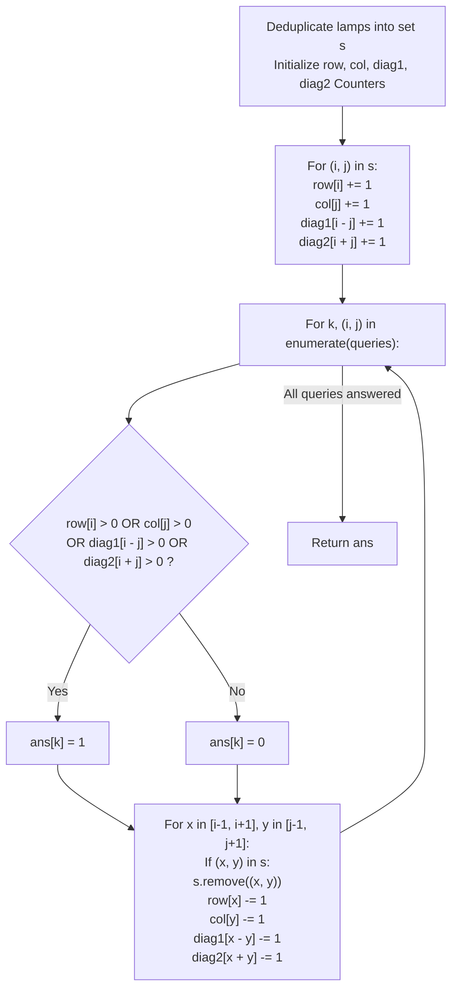

# Guided Example: Grid Illumination

We trace the step-by-step query evaluation using sparse projection frequency hash counters, prove the 4-Line Geometric Invariant and the 9-Neighbor Local Demolition Protocol, and determine cell illumination states across representative query sequences on large grids:

- **Representative Instance 1 (Diagonal Illumination Followed by Extinguishment):**
  $$
  n = 5, \quad lamps = [[0, 0], \; [4, 4]], \quad queries = [[1, 1], \; [1, 0]]
  $$
- **Required Output:** `[1, 0]`
  - Step 0 (Lamp Deduplication & Line Frequency Hashing):
    - Unique lamp coordinates: $s = \{(0, 0), (4, 4)\}$.
    - Frequency maps:
      - $row = \{0: 1, \; 4: 1\}$
      - $col = \{0: 1, \; 4: 1\}$
      - $diag_1$ ($r - c$): $0 - 0 = 0$ and $4 - 4 = 0 \implies \{0: 2\}$ (Both lamps lie on main diagonal $r - c = 0$!).
      - $diag_2$ ($r + c$): $0 + 0 = 0$ and $4 + 4 = 8 \implies \{0: 1, \; 8: 1\}$.
  - Query 1 ($k = 0$, query point $(i, j) = (1, 1)$):
    - **Illumination Test:**
      - $row[1] = 0$
      - $col[1] = 0$
      - $diag_1[1 - 1 = 0] = \mathbf{2} > 0$ (Illuminated by main diagonal!).
      - $diag_2[1 + 1 = 2] = 0$
      - Result: Illuminated! Set $ans[0] = \mathbf{1}$.
    - **Post-Query Demolition ($3 \times 3$ Neighborhood of $(1, 1)$):**
      - Grid squares inspected: $x \in [0, 2], y \in [0, 2]$.
      - Active lamp found at $(0, 0) \in s$!
      - Extinguish lamp $(0, 0)$:
        - Remove $(0, 0)$ from $s \implies s = \{(4, 4)\}$.
        - Decrement line counters:
          $$
          row[0] \leftarrow 1 - 1 = 0, \quad col[0] \leftarrow 1 - 1 = 0
          $$
          $$
          diag_1[0 - 0 = 0] \leftarrow 2 - 1 = 1, \quad diag_2[0 + 0 = 0] \leftarrow 1 - 1 = 0
          $$
  - Query 2 ($k = 1$, query point $(i, j) = (1, 0)$):
    - **Illumination Test:**
      - $row[1] = 0$
      - $col[0] = 0$ (Extinguished in Query 1!)
      - $diag_1[1 - 0 = 1] = 0$
      - $diag_2[1 + 0 = 1] = 0$
      - All four projections are $0 \implies$ Dark! Set $ans[1] = \mathbf{0}$.
    - **Post-Query Demolition ($3 \times 3$ Neighborhood of $(1, 0)$):**
      - Squares $x \in [0, 2], y \in [-1, 1]$.
      - No active lamps in $s$ reside in this neighborhood.
  - Final output array: `[1, 0]`.

- **Representative Instance 2 (Repeated Query at Same Coordinates):**
  $$
  n = 5, \quad lamps = [[0, 0], [4, 4]], \quad queries = [[1, 1], [1, 1]] \implies [1, 1]
  $$
  - In query 1, $(1, 1)$ is lit by diagonal $0$ and turns off $(0, 0)$.
  - Lamp $(4, 4)$ survives! For query 2, $diag_1[0] = 1 > 0$, so $(1, 1)$ remains illuminated $\implies [1, 1]$.

- **Representative Instance 3 (Row Shutdown Sequence):**
  $$
  n = 5, \quad lamps = [[0, 0], [0, 4]], \quad queries = [[0, 4], [0, 1], [1, 4]] \implies [1, 1, 0]
  $$

---

## 1. Instance & Teaching Goal

In an $n \times n$ grid ($n \le 10^9$), each lamp at $(r, c)$ illuminates its entire row, column, main diagonal ($r - c$), and anti-diagonal ($r + c$).
For each query $(r, c)$:
1. Return whether $(r, c)$ is illuminated ($1$ or $0$).
2. Then turn off all lamps in the $3 \times 3$ square centered at $(r, c)$.

```text
The Sparse Scaling Challenge:
  n = 1,000,000,000 (10^9) -> Grid size is 10^18 cells!
  Materializing the 2D grid matrix is COMPLETELY IMPOSSIBLE.

The 4-Line Projection Hash Invariant:
  Number of lamps <= 20,000, Queries <= 20,000.
  Every lamp illuminates lines determined by 4 integer keys:
    Row:           r
    Column:        c
    Main Diagonal: r - c  (Invariable along top-left to bottom-right)
    Anti-Diagonal: r + c  (Invariable along top-right to bottom-left)
  Testing illumination = 4 hash lookups in O(1)!
  Turning off lamps    = Inspecting 9 neighbors in O(1)!
```

Allocating a full grid or linearly checking all lamps for every query takes $\mathcal{O}(Q \cdot L) \approx 20{,}000 \times 20{,}000 = 4 \times 10^8$ operations, which exceeds runtime limits.

The decisive pedagogical goal is the **4-Projection Hash Counting & $3 \times 3$ Demolition Invariant**:
1. **Deduplication:** Collapses multiple lamp declarations at identical coordinates into a single physical lamp set $s$.
2. **Frequency Counter Projections:** Four `Counter` hash maps track active lamp counts along each row ($r$), column ($c$), main diagonal ($r - c$), and anti-diagonal ($r + c$).
3. **Multiplicity Preservation:** Using integer counts rather than booleans guarantees that turning off one lamp does not extinguish a line illuminated by another co-linear lamp.
4. **Constant-Time $3 \times 3$ Neighborhood Scan:** Each query inspects exactly 9 coordinates, decrementing counters only for lamps that actually exist in $s$, achieving $\mathcal{O}(1)$ time per query.

---

## 2. Conceptual Foundation & The 4-Projection Invariant



### The 4-Line Geometric Projection Theorem

Let $\mathcal{G} = \mathbb{Z}^2$ be the infinite integer grid, and let $S \subset \mathcal{G}$ be a finite set of active lamps.
1. **Ray Line Congruences:**
   A cell $(i, j)$ is illuminated by lamp $(x, y) \in S$ if and only if at least one of the four relations holds:
   $$
   i = x \quad \lor \quad j = y \quad \lor \quad i - j = x - y \quad \lor \quad i + j = x + y
   $$
   Proof of diagonal invariance:
   - Along any vector $v = (1, 1)$, $(i + \delta) - (j + \delta) = i - j$ is constant.
   - Along any vector $u = (1, -1)$, $(i + \delta) + (j - \delta) = i + j$ is constant.
2. **Counting Projection Function:**
   Define the illumination intensity function $\mathcal{I}(i, j)$:
   $$
   \mathcal{I}(i, j) = row[i] + col[j] + diag_1[i - j] + diag_2[i + j]
   $$
   Because all counters are non-negative, $\mathcal{I}(i, j) > 0 \iff (i, j) \text{ is illuminated}$.
3. **Local Removal Soundness:**
   A lamp at $(x, y)$ is removed if and only if it belongs to the closed $L_\infty$ ball $B_\infty((i, j), 1) = \{(x, y) : \max(|x - i|, |y - j|) \le 1\}$.
   Because each removed lamp has unique coordinates in $s$, decrementing its 4 projected line counters preserves the exact multiplicity invariant for all subsequent queries. $\blacksquare$

---

## 3. Step-by-Step Worked Execution: Representative Instance 1

$n = 5, \; lamps = [[0, 0], [4, 4]], \; queries = [[1, 1], [1, 0]]$.
Initial setup:
- $s = \{(0, 0), (4, 4)\}$.
- $row = \{0: 1, 4: 1\}, \; col = \{0: 1, 4: 1\}$.
- $diag_1 = \{0: 2\}, \; diag_2 = \{0: 1, 8: 1\}$.
- $ans = [0, 0]$.

### Execution of Queries
1. **Query $k = 0$, Point $(1, 1)$:**
   - Keys: $r = 1, c = 1, r - c = 0, r + c = 2$.
   - Counter lookups:
     - $row[1] = 0, \; col[1] = 0$.
     - $diag_1[0] = 2 > 0$ (**Illuminated!**).
     - $diag_2[2] = 0$.
   - Assign $ans[0] = 1$.
   - **$3 \times 3$ Neighborhood Cleanup of $(1, 1)$:**
     - Coordinate range: $x \in [0, 2], y \in [0, 2]$.
     - Check $(0, 0) \in s$: **Present!**
       - $s.remove((0, 0)) \implies s = \{(4, 4)\}$.
       - $row[0] \leftarrow 1 - 1 = 0$.
       - $col[0] \leftarrow 1 - 1 = 0$.
       - $diag_1[0] \leftarrow 2 - 1 = 1$.
       - $diag_2[0] \leftarrow 1 - 1 = 0$.
     - All other 8 coordinates in the neighborhood are not in $s$.
2. **Query $k = 1$, Point $(1, 0)$:**
   - Keys: $r = 1, c = 0, r - c = 1, r + c = 1$.
   - Counter lookups:
     - $row[1] = 0$.
     - $col[0] = 0$ (Zeroed out by $(0, 0)$ deletion!).
     - $diag_1[1] = 0$.
     - $diag_2[1] = 0$.
   - None positive $\implies$ **Dark!**
   - Assign $ans[1] = 0$.
   - **$3 \times 3$ Neighborhood Cleanup of $(1, 0)$:**
     - Coordinate range: $x \in [0, 2], y \in [-1, 1]$.
     - None of these coordinates are in $s = \{(4, 4)\}$.

Final result array: `[1, 0]`.

---

## 4. Query Step & Projection Hash Trace Table

| Query $k$ | Query Cell $(i, j)$ | Projected Keys $(i, j, i-j, i+j)$ | Matching Line Counter | Illumination Verdict | Removed Lamp from $3 \times 3$ | Updated Active Counters |
|:---:|:---:|:---:|:---:|:---:|:---:|:---|
| **$0$** | $(1, 1)$ | $(1, 1, 0, 2)$ | $diag_1[0] = 2 > 0$ | **$1$ (Lit)** | $(0, 0)$ | $diag_1[0] \to 1, row[0] \to 0$ |
| **$1$** | $(1, 0)$ | $(1, 0, 1, 1)$ | All counters $0$ | **$0$ (Dark)** | None | Unchanged |

---

## 5. Algorithmic Correctness

### Soundness & Completeness
1. **Soundness:**
   A cell is declared illuminated only if an active lamp exists on its row, column, or either diagonal. The 9-neighbor search uses exact coordinate set checks to extinguish only active lamps within distance $\le 1$.
2. **Completeness:**
   Hash maps guarantee $\mathcal{O}(1)$ query lookups. Initial set deduplication prevents duplicate count inflation, and integer decrements ensure lines with remaining lamps stay lit.

---

## 6. Boundary Cases & Traps

| Scenario | Input Pattern | Behavior | Trapped Risk |
|---|---|---|---|
| Massive Grid Dimension | $n = 10^9$ | Operates purely on active sparse hash keys; no matrix allocated. | Memory limit exceeded allocating 2D array. |
| Duplicate Lamp Inputs | `[[0,0], [0,0]]` | Set comprehension keeps unique lamps; counter is incremented once. | Decrementing into negative or phantom counts. |
| Query on Top of Lamp | Query at lamp position $(r, c)$ | Evaluated as lit first; then extinguished during $3 \times 3$ scan. | Turning off before checking illumination. |
| Disconnected Distant Lamp | $L_1 = (0, 0), L_2 = (10^9, 10^9)$ | Query near $L_1$ does not affect $L_2$; $L_2$'s diagonal survives. | Unintended cross-boundary side effects. |

---

## 7. Complexity Derivation

- **Time Complexity:** $\mathcal{O}(L + Q)$, where $L = \text{len}(lamps) \le 20{,}000$ and $Q = \text{len}(queries) \le 20{,}000$.
  - Initial lamp set construction and counter hashing take $\mathcal{O}(L)$ time.
  - Each query performs $4$ hash lookups and checks $9$ neighbor coordinates in $\mathcal{O}(1)$ time $\implies \mathcal{O}(Q)$.
  - Total operations $\approx 20{,}000 \times 9 \approx 1.8 \times 10^5 \implies < 0.04\text{ s}$.
- **Auxiliary Space Complexity:** $\mathcal{O}(L)$ to store unique lamp coordinates and at most $4L$ entries across the four frequency counters.
