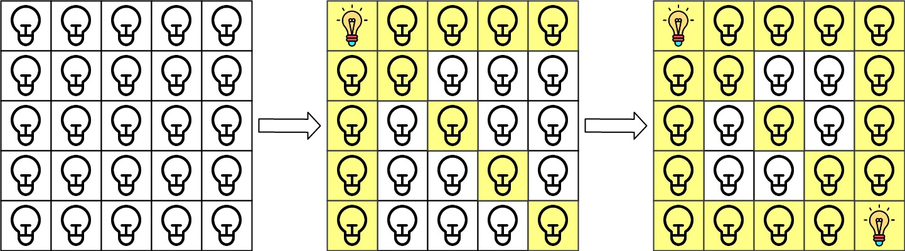
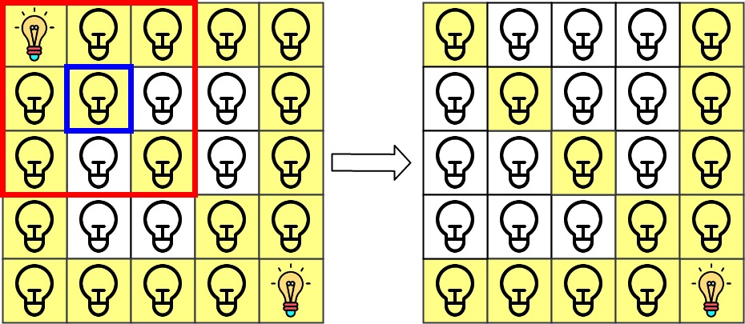
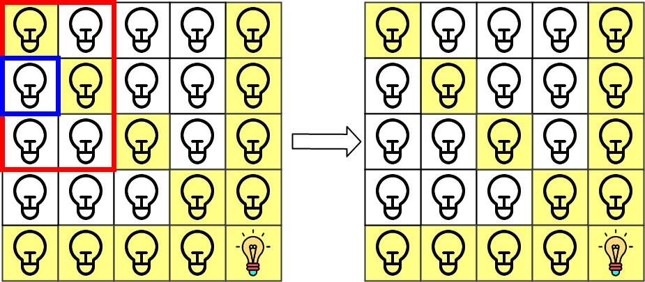

### 1. Description

There is a 2D `grid` of size `n x n` where each cell of this grid has a lamp that is initially **turned off**.

You are given a 2D array of lamp positions `lamps`, where $\text{lamps}[i] = [\text{row}_{i}, \text{col}_{i}]$ indicates that the lamp at $grid[\text{row}_{i}][\text{col}_{i}]$ is **turned on**. Even if the same lamp is listed more than once, it is turned on.

When a lamp is turned on, it **illuminates its cell** and **all other cells** in the same **row, column, or diagonal**.

You are also given another 2D array `queries`, where $\text{queries}[j] = [\text{row}_{j}, \text{col}_{j}]$. For the $j^{\text{th}}$ query, determine whether $grid[\text{row}_{j}][\text{col}_{j}]$ is illuminated or not. After answering the $j^{\text{th}}$ query, **turn off** the lamp at $grid[\text{row}_{j}][\text{col}_{j}]$ and its **8 adjacent lamps** if they exist. A lamp is adjacent if its cell shares either a side or corner with $grid[\text{row}_{j}][\text{col}_{j}]$.

Return *an array of integers *`ans`*,** where *$\text{ans}[j]$* should be *`1`* if the cell in the *$j^{\text{th}}$* query was illuminated, or *`0`* if the lamp was not.*

### 2. Function Contract

**Inputs**

- `n`: Input parameter (`int`).
- `lamps`: Input parameter (`List[List[int]]`).
- `queries`: Input parameter (`List[List[int]]`).

**Return value**

- Returns `List[int]`.

### 3. Examples

#### Example 1

- **Input:** $n = 5, lamps = [[0,0],[4,4]], queries = [[1,1],[1,0]]$
- **Output:** `[1,0]`
- **Explanation:** We have the initial grid with all lamps turned off. In the above picture we see the grid after turning on the lamp at grid[0][0] then turning on the lamp at grid[4][4].
The 0^th query asks if the lamp at grid[1][1] is illuminated or not (the blue square). It is illuminated, so set ans[0] = 1. Then, we turn off all lamps in the red square.

The 1^st query asks if the lamp at grid[1][0] is illuminated or not (the blue square). It is not illuminated, so set ans[1] = 0. Then, we turn off all lamps in the red rectangle.

#### Example 2

- **Input:** $n = 5, lamps = [[0,0],[4,4]], queries = [[1,1],[1,1]]$
- **Output:** `[1,1]`

#### Example 3

- **Input:** $n = 5, lamps = [[0,0],[0,4]], queries = [[0,4],[0,1],[1,4]]$
- **Output:** `[1,1,0]`

### 4. Constraints

- $1 \le n \le 10^{9}$

- $0 \le \text{lamps.length} \le 20000$

- $0 \le \text{queries.length} \le 20000$

- $\text{lamps}[i].length = 2$

- $0 \le \text{row}_{i}, \text{col}_{i} < n$

- $\text{queries}[j].length = 2$

- $0 \le \text{row}_{j}, \text{col}_{j} < n$
