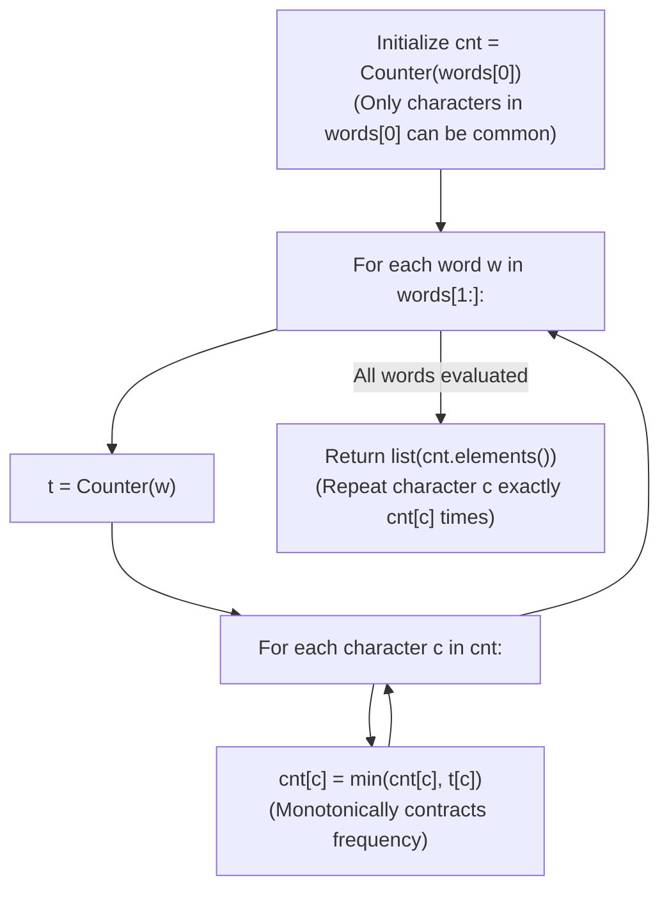

# Guided Example: Find Common Characters

We trace the step-by-step multiset intersection through running minimum frequency contraction, prove the Character Cardinality Intersection Theorem and the Monotonic Frequency Contraction Invariant, and determine common characters across representative word arrays:

- **Representative Instance 1 (Repeated Multiplicities with Disjoint Surplus Characters):**
  $$
  words = [\text{"bella"}, \; \text{"label"}, \; \text{"roller"}]
  $$
- **Required Output:** `["e", "l", "l"]`
  - Multiset frequency model:
    - Standard set intersection only retains unique characters (`{'e', 'l'}`).
    - The problem demands **multiset intersection**: if a character appears multiple times in every string, all common duplicates must be returned.
    - Mathematical formula:
      $$
      \text{count}_{\cap}(c) = \min_{w \in words} \text{count}_w(c)
      $$
  - Execution trace:
    1. **Initialization from First Word ($w_0 = \text{"bella"}$):**
       - $cnt = \text{Counter}(\text{"bella"}) = \{'b': 1, \; 'e': 1, \; 'l': 2, \; 'a': 1\}$.
       - This anchors the candidate set: no character can appear in the intersection more times than it appears in the first word.
    2. **Process Second Word ($w_1 = \text{"label"}$):**
       - $t = \text{Counter}(\text{"label"}) = \{'l': 2, \; 'a': 1, \; 'b': 1, \; 'e': 1\}$.
       - Update running minimum for each $c \in cnt$:
         - $'b': \min(1, 1) = 1$
         - $'e': \min(1, 1) = 1$
         - $'l': \min(2, 2) = 2$
         - $'a': \min(1, 1) = 1$
       - Updated $cnt = \{'b': 1, \; 'e': 1, \; 'l': 2, \; 'a': 1\}$.
    3. **Process Third Word ($w_2 = \text{"roller"}$):**
       - $t = \text{Counter}(\text{"roller"}) = \{'r': 2, \; 'o': 1, \; 'l': 2, \; 'e': 1\}$.
       - Update running minimum for each $c \in cnt$:
         - $'b': \min(1, t['b'] = 0) = \mathbf{0}$ (Extinguished!).
         - $'e': \min(1, t['e'] = 1) = \mathbf{1}$.
         - $'l': \min(2, t['l'] = 2) = \mathbf{2}$.
         - $'a': \min(1, t['a'] = 0) = \mathbf{0}$ (Extinguished!).
       - Final $cnt = \{'b': 0, \; 'e': 1, \; 'l': 2, \; 'a': 0\}$.
    4. **Emit Multiset Elements:**
       - Character $'e'$ emitted $1$ time: `["e"]`.
       - Character $'l'$ emitted $2$ times: `["l", "l"]`.
       - Combined result: `["e", "l", "l"]`.
  - Final output: `["e", "l", "l"]` (any order).

- **Representative Instance 2 (Common Characters with Redundant Candidates):**
  $$
  words = [\text{"cool"}, \; \text{"lock"}, \; \text{"cook"}] \implies [c: 1, o: 1] \implies \text{["c", "o"]}
  $$

- **Representative Instance 3 (Multiplicity Bounded by Shortest Repetition):**
  $$
  words = [\text{"aaa"}, \; \text{"aa"}, \; \text{"aaaa"}] \implies \min(3, 2, 4) = 2 \implies \text{["a", "a"]}
  $$

---

## 1. Instance & Teaching Goal

Given an array of strings `words`, return an array of all characters that show up in **all strings** within `words` (including duplicates).

```text
Set Intersection vs Multiset Intersection:
  Set:      {'b', 'e', 'l', 'a'} & {'l', 'a', 'b', 'e'} & {'r', 'o', 'l', 'e'} = {'e', 'l'} (LOSES DUPLICATE 'l'!)
  Multiset: min(count in each word):
    'e': min(1, 1, 1) = 1
    'l': min(2, 2, 2) = 2  <-- Accurately preserves second copy!
    'b': min(1, 1, 0) = 0
    'a': min(1, 1, 0) = 0
```

Brute-force nested searches with character deletions in strings can degrade to $\mathcal{O}(N \cdot L^2)$ time.

The decisive pedagogical goal is the **Multiset Intersection & Monotonic Minimum Frequency Contraction Invariant**:
1. **Candidate Anchor:** Initializing $cnt = \text{Counter}(words[0])$ restricts the tracking universe strictly to characters present in the first string. Any character absent from $words[0]$ has minimum frequency $0$ and need never be tracked.
2. **Monotonic Contraction:** As each subsequent word $w$ is processed, update each tracked character count via:
   $$
   cnt[c] \leftarrow \min(cnt[c], \; t[c])
   $$
   Because $\min(a, b) \le a$, frequencies are monotonically non-increasing. Once a character drops to $0$, it is permanently excluded.
3. Linear scan over all characters in the input strings in $\mathcal{O}(\sum |w|)$ time and $\mathcal{O}(1)$ auxiliary space.

---

## 2. Conceptual Foundation & The Multiset Contraction Invariant



### The Multiset Cardinality Intersection Theorem

Let $\Sigma = \{'a', \dots, 'z'\}$ be the lowercase alphabet, and let $W = (w_1, w_2, \dots, w_m)$ be an array of strings.
1. **Multiset Representation:**
   Each string $w_k$ defines a multiset $M_k: \Sigma \to \mathbb{Z}_{\ge 0}$ where $M_k(c)$ is the count of character $c$ in $w_k$.
2. **Intersection Cardinality:**
   The multiset intersection $M_{\cap} = \bigcap_{k=1}^m M_k$ is defined by:
   $$
   M_{\cap}(c) = \min_{k=1}^m M_k(c) \quad \forall c \in \Sigma
   $$
3. **Prefix Contraction Invariant:**
   Let $C_k(c) = \min_{j=1}^k M_j(c)$.
   - Base case: $C_1(c) = M_1(c)$.
   - Step: $C_k(c) = \min(C_{k-1}(c), M_k(c))$.
   Because the minimum operation is associative, commutative, and monotonically non-increasing, $C_m(c) = M_{\cap}(c)$ holds upon completing the loop over all $m$ words.
4. **Finite Domain Reduction:**
   If $c \notin w_1$, then $M_1(c) = 0$, which implies $C_k(c) = 0$ for all $k \ge 1$.
   Therefore, the algorithm needs to iterate only over the keys of $M_1$, ensuring that at most $26$ characters are updated at each step. $\blacksquare$

---

## 3. Step-by-Step Worked Execution: Representative Instance 1

$words = [\text{"bella"}, \text{"label"}, \text{"roller"}]$.

### Step-by-Step Multiset Contraction
1. **Word 0: $w_0 = \text{"bella"}$ (Anchor):**
   - $cnt = \{'b': 1, 'e': 1, 'l': 2, 'a': 1\}$.
2. **Word 1: $w_1 = \text{"label"}$:**
   - $t = \{'l': 2, 'a': 1, 'b': 1, 'e': 1\}$.
   - Updates:
     - $cnt['b'] = \min(1, 1) = 1$.
     - $cnt['e'] = \min(1, 1) = 1$.
     - $cnt['l'] = \min(2, 2) = 2$.
     - $cnt['a'] = \min(1, 1) = 1$.
   - $cnt = \{'b': 1, 'e': 1, 'l': 2, 'a': 1\}$.
3. **Word 2: $w_2 = \text{"roller"}$:**
   - $t = \{'r': 2, 'o': 1, 'l': 2, 'e': 1\}$.
   - Updates:
     - $cnt['b'] = \min(1, 0) = \mathbf{0}$.
     - $cnt['e'] = \min(1, 1) = \mathbf{1}$.
     - $cnt['l'] = \min(2, 2) = \mathbf{2}$.
     - $cnt['a'] = \min(1, 0) = \mathbf{0}$.
   - Final $cnt = \{'b': 0, 'e': 1, 'l': 2, 'a': 0\}$.
4. **Reconstruction via `elements()`:**
   - $'e'$ has count $1 \implies ['e']$.
   - $'l'$ has count $2 \implies ['l', 'l']$.
   - Characters with count $0$ are skipped.

Final returned list: `["e", "l", "l"]`.

---

## 4. Character Frequency Contraction Trace Table

| Word Evaluated $w_k$ | Current Word Frequencies $t$ | $'b'$ Count | $'e'$ Count | $'l'$ Count | $'a'$ Count | Active Common Multiset |
|:---:|:---|:---:|:---:|:---:|:---:|:---|
| **$w_0$: `"bella"`** | $\{b:1, e:1, l:2, a:1\}$ | $1$ | $1$ | $2$ | $1$ | $\{b:1, e:1, l:2, a:1\}$ |
| **$w_1$: `"label"`** | $\{l:2, a:1, b:1, e:1\}$ | $1$ | $1$ | $2$ | $1$ | $\{b:1, e:1, l:2, a:1\}$ |
| **$w_2$: `"roller"`**| $\{r:2, o:1, l:2, e:1\}$ | **$0$** | **$1$** | **$2$** | **$0$** | **$\{e:1, l:2\}$** |

---

## 5. Algorithmic Correctness

### Soundness & Completeness
1. **Soundness:**
   A character $c$ is returned with multiplicity $k$ if and only if every word in `words` contains at least $k$ copies of $c$. Taking the running minimum across all word frequency histograms guarantees this condition.
2. **Completeness:**
   Starting with the multiset of $words[0]$ guarantees that all potential common characters are considered. No valid character can be lost because minimum operations only contract when an observed word possesses fewer copies.

---

## 6. Boundary Cases & Traps

| Scenario | Input Pattern | Behavior | Trapped Risk |
|---|---|---|---|
| Single Word | `words = ["abc"]` | No loop iterations; returns `["a", "b", "c"]`. | Out-of-bounds error on word iteration. |
| Completely Disjoint Words | `words = ["ab", "cd"]` | All counts fall to $0$; returns `[]`. | Emitting characters with count 0. |
| Unequal Duplicate Frequencies | `["aaa", "aa", "aaaa"]` | Minimum is $2$; correctly emits two `'a'`s. | Truncating duplicates to 1 copy via set. |
| Long Words, Small Alphabet | Words up to length $100$ | Memory bounded by $\lvert \Sigma \rvert = 26$; runs in $< 0.001\text{ s}$. | Memory overhead from string duplications. |

---

## 7. Complexity Derivation

- **Time Complexity:** $\mathcal{O}(\sum |w|)$, where $\sum |w|$ is the total number of characters across all words in `words` ($\sum |w| \le 10{,}000$).
  - Counting characters in each word $w$ takes $\mathcal{O}(|w|)$ time.
  - Intersecting frequencies takes at most $26$ operations per word.
  - Final list construction takes $\mathcal{O}(\text{output length}) \le \mathcal{O}(|words[0]|)$.
  - Total runtime: $< 0.001\text{ s}$.
- **Auxiliary Space Complexity:** $\mathcal{O}(1)$ auxiliary space beyond the output list, since frequency tables contain at most $26$ entries for lowercase English letters.
