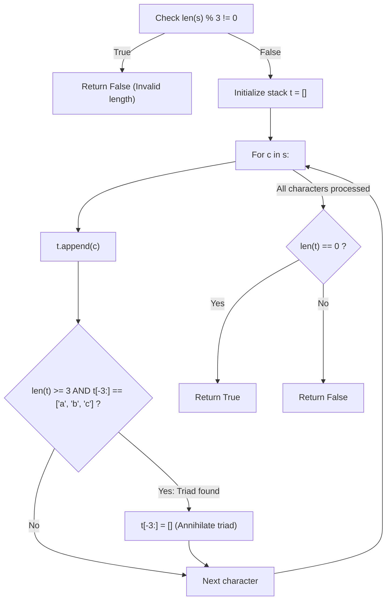

# Guided Example: Check If Word Is Valid After Substitutions

We trace the step-by-step stack-based prefix reduction over confluent context-free substrings, prove the Modulo-3 Divisibility Invariant and the Inner-Triad Annihilation Theorem, and determine string validity across representative input sequences:

- **Representative Instance 1 (Nested Insertion Exposing Outer Triad):**
  $$
  s = \text{"aabcbc"}, \quad |s| = 6
  $$
- **Required Output:** `true`
  - Step 0 (Divisibility Verification):
    - Each substitution inserts the 3-character block `"abc"`.
    - Initial length must be a multiple of 3: $|s| \bmod 3 = 6 \bmod 3 = 0$ (Passes pre-check!).
  - Stack Annihilation Trace (stack $t = []$):
    1. **Character 0 ($s[0] = \text{'a'}$):**
       - Push `'a'` $\implies t = [\text{'a'}]$.
       - Suffix check: $|t| = 1 < 3$.
    2. **Character 1 ($s[1] = \text{'a'}$):**
       - Push `'a'` $\implies t = [\text{'a'}, \text{'a'}]$.
       - Suffix check: $|t| = 2 < 3$.
    3. **Character 2 ($s[2] = \text{'b'}$):**
       - Push `'b'` $\implies t = [\text{'a'}, \text{'a'}, \text{'b'}]$.
       - Suffix check: Top 3 are `['a', 'a', 'b']` $\ne \text{"abc"}$.
    4. **Character 3 ($s[3] = \text{'c'}$):**
       - Push `'c'` $\implies t = [\text{'a'}, \text{'a'}, \text{'b'}, \text{'c'}]$.
       - Suffix check: Top 3 are `['a', 'b', 'c']` (Matches `"abc"`!).
       - **Annihilation Action:** Pop top 3 elements:
         $$
         t[-3:] \leftarrow [] \implies t = [\text{'a'}]
         $$
       - The inner `"abc"` is eliminated, exposing the prefix `'a'`.
    5. **Character 4 ($s[4] = \text{'b'}$):**
       - Push `'b'` $\implies t = [\text{'a'}, \text{'b'}]$.
       - Suffix check: $|t| = 2 < 3$.
    6. **Character 5 ($s[5] = \text{'c'}$):**
       - Push `'c'` $\implies t = [\text{'a'}, \text{'b'}, \text{'c'}]$.
       - Suffix check: Top 3 are `['a', 'b', 'c']` (Matches `"abc"`!).
       - **Annihilation Action:** Pop top 3 elements:
         $$
         t[-3:] \leftarrow [] \implies t = []
         $$
  - Traversal complete: Stack $t$ is completely empty ($|t| == 0$).
  - Final verdict: $\mathbf{true}$.
  - Derivation verification:
    $$
    "" \xrightarrow{+\text{"abc"}} \text{"abc"} \xrightarrow{\text{insert at index 1}} \text{"a"} + \text{"abc"} + \text{"bc"} = \text{"aabcbc"}
    $$

- **Representative Instance 2 (Repeated Nested and Adjacent Blocks):**
  $$
  s = \text{"abcabcababcc"} \implies \mathbf{true}
  $$

- **Representative Instance 3 (Symmetric Inverted Order Failure):**
  $$
  s = \text{"abccba"}, \quad |s| = 6
  $$
  - Characters `'a', 'b', 'c'` reduce to `[]`.
  - Remaining characters are `'c', 'b', 'a'`.
  - Stack ends with `['c', 'b', 'a']` $\ne [] \implies \mathbf{false}$.

---

## 1. Instance & Teaching Goal

A string $s$ is valid if it can be constructed from an empty string by repeatedly inserting `"abc"` at any position.
Return `true` if $s$ is valid, otherwise return `false`.

```text
Iterative String Replacement: O(N^2)
  s = "aabcbc"
  s.replace("abc", "") -> "abc"
  s.replace("abc", "") -> ""
  Takes quadratic time due to repeated memory allocations and scans!

Stack Annihilation: O(N)
  Push characters one by one.
  Whenever top 3 characters form ['a', 'b', 'c']:
    Pop all 3 immediately!
  If stack is empty at the end, string is valid.
```

Repeatedly performing `s.replace("abc", "")` creates intermediate string copies and quadratic scanning time.

The decisive pedagogical goal is the **Confluent Context-Free Grammar & Stack Annihilation Invariant**:
1. **Confluent Dyck Reduction:** In the derivation of any valid string, the last `"abc"` inserted was never split by subsequent insertions and must appear contiguously in the final string. Deleting any contiguous `"abc"` preserves membership in the language.
2. **Modulo-3 Filter:** Because each step introduces exactly 3 characters, $|s| \bmod 3 == 0$ is a strict requirement.
3. **Stack Reduction Lemma:** Processing characters left-to-right on a stack and popping the top 3 whenever they equal `['a', 'b', 'c']` reduces every valid nested derivation in linear $\mathcal{O}(N)$ time.
4. If and only if the stack is empty after the full pass, the string is valid.

---

## 2. Conceptual Foundation & The Stack Annihilation Invariant



### The Inner-Triad Annihilation Theorem

Let $\mathcal{L}$ be the formal language over alphabet $\Sigma = \{a, b, c\}$ generated by the grammar:
$$
S \to \varepsilon \mid u \text{ "abc" } v \quad \text{where } uv \in \mathcal{L}
$$
1. **Existence of Intact Triad:**
   Every non-empty string $s \in \mathcal{L}$ contains at least one contiguous substring `"abc"`.
   *Proof:*
   Consider the derivation tree of $s$. The leaf-level `"abc"` inserted in the final derivation step cannot have been partitioned by any subsequent insertion, and therefore exists as a contiguous block in $s$.
2. **Confluence of Deletion:**
   The string rewrite system $R: x \text{"abc"} y \to xy$ is strongly confluent and terminating.
   Deleting any contiguous `"abc"` from $s$ yields a string $s' \in \mathcal{L}$ if and only if $s \in \mathcal{L}$.
3. **Stack Simulation Equivalence:**
   Pushing characters onto a stack and greedily popping `"abc"` whenever the top 3 elements match `['a', 'b', 'c']` correctly performs the innermost reduction of the derivation tree.
   Upon encountering the final character of an intact `"abc"`, its prefix `'a', 'b'` already resides at the top of the stack.
   Deleting them immediately exposes the preceding characters, allowing outer triads to coalesce naturally.
4. **Emptiness Equivalence:**
   $s \in \mathcal{L} \iff \text{final stack } t = []$. $\blacksquare$

---

## 3. Step-by-Step Worked Execution: Representative Instance 1

$s = \text{"aabcbc"}$.
Length check: $|s| = 6 \implies 6 \bmod 3 = 0$ (Valid).
Initialize: $t = []$.

### Step-by-Step Stack Processing
1. **$i = 0, c = \text{'a'}$:**
   - Append `'a'` $\implies t = [\text{'a'}]$.
   - Length $1 < 3 \implies$ no pop.
2. **$i = 1, c = \text{'a'}$:**
   - Append `'a'` $\implies t = [\text{'a'}, \text{'a'}]$.
   - Length $2 < 3 \implies$ no pop.
3. **$i = 2, c = \text{'b'}$:**
   - Append `'b'` $\implies t = [\text{'a'}, \text{'a'}, \text{'b'}]$.
   - Suffix $t[-3:] = \text{"aab"} \ne \text{"abc"} \implies$ no pop.
4. **$i = 3, c = \text{'c'}$:**
   - Append `'c'` $\implies t = [\text{'a'}, \text{'a'}, \text{'b'}, \text{'c'}]$.
   - Suffix $t[-3:] = \text{"abc"} == \text{"abc"}$!
   - Annihilate: $t[-3:] = [] \implies t = [\text{'a'}]$.
5. **$i = 4, c = \text{'b'}$:**
   - Append `'b'` $\implies t = [\text{'a'}, \text{'b'}]$.
   - Length $2 < 3 \implies$ no pop.
6. **$i = 5, c = \text{'c'}$:**
   - Append `'c'` $\implies t = [\text{'a'}, \text{'b'}, \text{'c'}]$.
   - Suffix $t[-3:] = \text{"abc"} == \text{"abc"}$!
   - Annihilate: $t[-3:] = [] \implies t = []$.

Final stack: $t = []$ (Empty!).
Result: `true`.

---

## 4. Stack Reduction State Trace Table

| Step $i$ | Incoming Char $c$ | Stack Before Check | Suffix Inspected $t[-3:]$ | Action Taken | Stack After Action | Stack Length $|t|$ |
|:---:|:---:|:---|:---:|:---:|:---|:---:|
| **$0$** | `'a'` | `['a']` | — | None | `['a']` | $1$ |
| **$1$** | `'a'` | `['a', 'a']` | — | None | `['a', 'a']` | $2$ |
| **$2$** | `'b'` | `['a', 'a', 'b']` | `"aab"` | None | `['a', 'a', 'b']` | $3$ |
| **$3$** | `'c'` | `['a', 'a', 'b', 'c']` | **`"abc"`** | **Pop 3** | `['a']` | $1$ |
| **$4$** | `'b'` | `['a', 'b']` | — | None | `['a', 'b']` | $2$ |
| **$5$** | `'c'` | `['a', 'b', 'c']` | **`"abc"`** | **Pop 3** | **`[]`** | **$0$** |

---

## 5. Algorithmic Correctness

### Soundness & Completeness
1. **Soundness:**
   Every pop removes an exact contiguous `"abc"` block, corresponding to undoing a valid substitution. If the stack ends empty, the entire string has been successfully decomposed into legal `"abc"` insertions.
2. **Completeness:**
   Because `"abc"` reductions are confluent, reducing any complete triad as soon as it appears never eliminates the opportunity to reduce other valid triads. A valid string will always reduce to an empty stack.

---

## 6. Boundary Cases & Traps

| Scenario | Input Pattern | Behavior | Trapped Risk |
|---|---|---|---|
| Incomplete Length | $s = \text{"ab"}$ | $2 \bmod 3 \ne 0$; immediately returns `False`. | Performing unnecessary stack operations. |
| Inverted Ordering | $s = \text{"cba"}$ | Suffix never matches `"abc"`; stack retains characters; returns `False`. | Matching anagrams instead of exact `"abc"`. |
| Minimal Valid String | $s = \text{"abc"}$ | Pushes 3 characters; pops all 3; stack empty; returns `True`. | Suffix bounds check underflow. |
| Repeated Wrong Char | $s = \text{"aaa"}$ | Length is 3 but stack is `['a', 'a', 'a']`; returns `False`. | Accepting equal character counts blindly. |

---

## 7. Complexity Derivation

- **Time Complexity:** $\mathcal{O}(N)$, where $N = \text{len}(s) \le 20{,}000$.
  - Length check takes $\mathcal{O}(1)$.
  - Each character in $s$ is pushed onto the stack exactly once and popped at most once.
  - Suffix checks take $\mathcal{O}(1)$ time.
  - Total time: $< 0.005\text{ s}$.
- **Auxiliary Space Complexity:** $\mathcal{O}(N)$ for stack $t$, which stores at most $N$ characters in the worst case.
