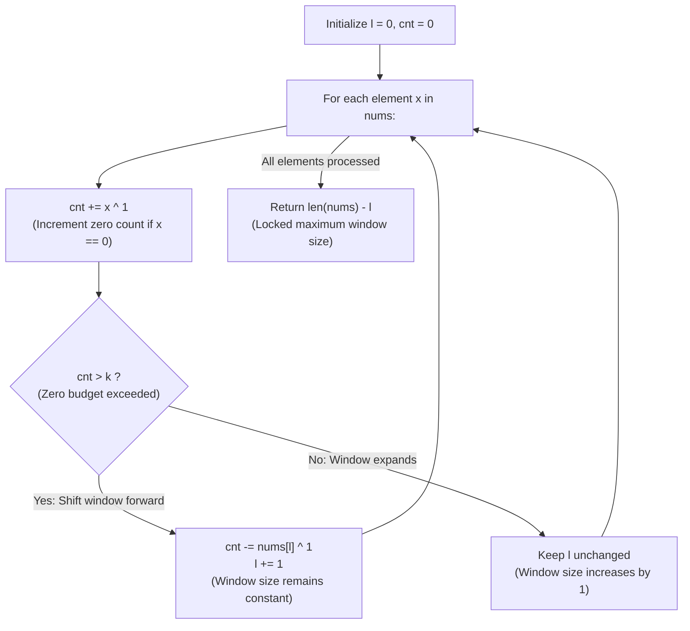

# Guided Example: Max Consecutive Ones III

We trace the step-by-step non-shrinking sliding window progression over zero-flip allocations, prove the Maximum Subarray Zero-Budget Theorem and the Non-Shrinking Window Invariant, and determine the maximal consecutive ones across representative binary arrays:

- **Representative Instance 1 (Bridging Disjoint Runs Across Permitted Flips):**
  $$
  nums = [1, \; 1, \; 1, \; 0, \; 0, \; 0, \; 1, \; 1, \; 1, \; 1, \; 0], \quad k = 2, \quad n = 11
  $$
- **Required Output:** `6`
  - Equivalent mathematical formulation:
    - Flipping at most $k = 2$ zeroes to ones is identical to finding the **longest contiguous subarray containing at most $k = 2$ zeroes**.
  - Non-shrinking window state parameters:
    - Left boundary: $l = 0$.
    - Zero count in window: $cnt = 0$.
    - Current element added: $x = nums[r]$.
    - Zero detection: $x \oplus 1$ equals $1$ if $x = 0$, and $0$ if $x = 1$.
  - Step-by-step traversal ($r \in [0, 10]$):
    1. **$r = 0$ ($nums[0] = 1$):** $cnt \leftarrow 0 + 0 = 0 \le 2$. $l$ stays $0$. (Window size $1$).
    2. **$r = 1$ ($nums[1] = 1$):** $cnt \leftarrow 0 + 0 = 0 \le 2$. $l$ stays $0$. (Window size $2$).
    3. **$r = 2$ ($nums[2] = 1$):** $cnt \leftarrow 0 + 0 = 0 \le 2$. $l$ stays $0$. (Window size $3$).
    4. **$r = 3$ ($nums[3] = 0$):** $cnt \leftarrow 0 + 1 = 1 \le 2$. $l$ stays $0$. (Window size $4$).
    5. **$r = 4$ ($nums[4] = 0$):** $cnt \leftarrow 1 + 1 = 2 \le 2$. $l$ stays $0$. (Window size $5$).
    6. **$r = 5$ ($nums[5] = 0$):**
       - $cnt \leftarrow 2 + 1 = 3 > 2$ (Budget exceeded!).
       - Shift window forward without shrinking size:
         - Discard $nums[l] = nums[0] = 1$: $cnt \leftarrow 3 - (1 \oplus 1) = 3 - 0 = 3$.
         - Advance $l \leftarrow 0 + 1 = 1$.
       - (Window length remains $r - l + 1 = 5 - 1 + 1 = 5$).
    7. **$r = 6$ ($nums[6] = 1$):**
       - $cnt \leftarrow 3 + 0 = 3 > 2$.
       - Discard $nums[1] = 1$: $cnt \leftarrow 3 - 0 = 3$.
       - Advance $l \leftarrow 1 + 1 = 2$.
    8. **$r = 7$ ($nums[7] = 1$):**
       - $cnt \leftarrow 3 + 0 = 3 > 2$.
       - Discard $nums[2] = 1$: $cnt \leftarrow 3 - 0 = 3$.
       - Advance $l \leftarrow 2 + 1 = 3$.
    9. **$r = 8$ ($nums[8] = 1$):**
       - $cnt \leftarrow 3 + 0 = 3 > 2$.
       - Discard $nums[3] = 0$: $cnt \leftarrow 3 - 1 = \mathbf{2}$!
       - Advance $l \leftarrow 3 + 1 = 4$.
    10. **$r = 9$ ($nums[9] = 1$):**
        - $cnt \leftarrow 2 + 0 = 2 \le 2$ (Budget valid!).
        - $l$ does NOT advance ($l$ stays $4$).
        - Window expands! Window size $= 9 - 4 + 1 = \mathbf{6}$ (Subarray $[0, 0, 1, 1, 1, 1]$).
    11. **$r = 10$ ($nums[10] = 0$):**
        - $cnt \leftarrow 2 + 1 = 3 > 2$.
        - Discard $nums[4] = 0$: $cnt \leftarrow 3 - 1 = 2$.
        - Advance $l \leftarrow 4 + 1 = 5$.
  - End of loop: Total elements $n = 11$, left pointer $l = 5$.
  - Maximum window length achieved:
    $$
    n - l = 11 - 5 = \mathbf{6}
    $$
  - Subarray verification: Subarray $nums[5 \dots 10] = [0, 1, 1, 1, 1, 0]$ has 2 zeroes and length 6. Flipping both zeroes yields 6 consecutive ones: $[1, 1, 1, 1, 1, 1]$.

- **Representative Instance 2 (Larger Budget Across Dispersed Zeroes):**
  $$
  nums = [0, 0, 1, 1, 0, 0, 1, 1, 1, 0, 1, 1, 0, 0, 0, 1, 1, 1, 1], \quad k = 3 \implies \mathbf{10}
  $$

- **Representative Instance 3 (Zero Budget / No Flips Allowed):**
  $$
  nums = [1, \; 1, \; 1], \quad k = 0 \implies \mathbf{3}
  $$

---

## 1. Instance & Teaching Goal

Given a binary array `nums` and an integer `k`, return the **maximum number of consecutive 1's** in the array if you can flip at most `k` 0's.

```text
Standard Sliding Window: O(N) with variable shrinking
  When zeroes > k:
    while zeroes > k:
      shrink left pointer l
    max_len = max(max_len, r - l + 1)

Non-Shrinking Window Invariant: O(N) branch-free
  Notice: We only care about the MAXIMUM window size achieved!
  - If window has <= k zeroes: allow window to GROW (do not increment l).
  - If window has > k zeroes: SLIDE window forward by 1 (increment both r and l).
  The window size NEVER DECREASES!
  Final answer is simply: len(nums) - l.
```

The standard shrinking window uses an inner while loop to restore feasibility.

The decisive pedagogical goal is the **Non-Shrinking Sliding Window Invariant**:
1. **Mathematical Equivalence:** The problem asks for the maximum length of a subarray containing at most $k$ zeroes.
2. **Monotonic Window Growth:**
   - When $cnt \le k$: $l$ stays constant while $r$ advances, expanding window length $r - l + 1$ by 1.
   - When $cnt > k$: $l$ increments by 1 as $r$ increments by 1, preserving the maximum window length established so far.
3. **Locked Maximum:** Because the window size never contracts, at the end of the scan ($r = n - 1$), the window length is strictly the global maximum:
   $$
   \text{Max Length} = (n - 1) - l + 1 = n - l
   $$
4. Eliminates the inner while loop, running in a single forward pass with $\mathcal{O}(1)$ auxiliary space.

---

## 2. Conceptual Foundation & The Non-Shrinking Window Invariant



### The Non-Shrinking Window Length Theorem

Let $A = (x_0, x_1, \dots, x_{n-1}) \in \{0, 1\}^n$, and let $Z(i, j) = \sum_{m=i}^j (x_m \oplus 1)$ denote the number of zeroes in subarray $A[i \dots j]$.
1. **Feasible Interval Property:**
   Subarray $A[i \dots j]$ can be converted into all ones using $\le k$ flips iff $Z(i, j) \le k$.
2. **Non-Decreasing Window Length Invariant:**
   Let $W_r = r - l_r + 1$ denote the window size after processing index $r$ ($0 \le r < n$).
   - If $cnt \le k$: $l_r = l_{r-1}$. Then $W_r = r - l_{r-1} + 1 = W_{r-1} + 1$.
   - If $cnt > k$: $l_r = l_{r-1} + 1$. Then $W_r = r - (l_{r-1} + 1) + 1 = W_{r-1}$.
   Therefore, $W_r \ge W_{r-1}$ for all $r$.
3. **Global Maximum Identity:**
   Let $M = \max \{j - i + 1 : 0 \le i \le j < n, \; Z(i, j) \le k\}$.
   - Every time a valid window of length $W > W_{\text{prev}}$ is encountered, the algorithm expands $W$ by 1 without advancing $l$.
   - The window size is prevented from increasing beyond $M$ because every subarray of length $> M$ has $> k$ zeroes, triggering the $l \leftarrow l + 1$ shift.
   - Hence, upon reaching the terminal index $r = n - 1$, the final window length is:
     $$
     W_{n-1} = (n - 1) - l + 1 = n - l = M \quad \blacksquare
     $$

---

## 3. Step-by-Step Worked Execution: Representative Instance 1

$nums = [1, 1, 1, 0, 0, 0, 1, 1, 1, 1, 0], \; k = 2, \; n = 11$.
Initialize: $l = 0, \; cnt = 0$.

### Step-by-Step Window Evolution
- $r = 0, x = 1$: $cnt = 0 \le 2 \implies l = 0$. ($W = 1$).
- $r = 1, x = 1$: $cnt = 0 \le 2 \implies l = 0$. ($W = 2$).
- $r = 2, x = 1$: $cnt = 0 \le 2 \implies l = 0$. ($W = 3$).
- $r = 3, x = 0$: $cnt = 1 \le 2 \implies l = 0$. ($W = 4$).
- $r = 4, x = 0$: $cnt = 2 \le 2 \implies l = 0$. ($W = 5$).
- $r = 5, x = 0$: $cnt = 3 > 2 \implies cnt \leftarrow 3 - (1 \oplus 1) = 3, \; l \leftarrow 1$. ($W = 5$).
- $r = 6, x = 1$: $cnt = 3 > 2 \implies cnt \leftarrow 3 - 0 = 3, \; l \leftarrow 2$. ($W = 5$).
- $r = 7, x = 1$: $cnt = 3 > 2 \implies cnt \leftarrow 3 - 0 = 3, \; l \leftarrow 3$. ($W = 5$).
- $r = 8, x = 1$: $cnt = 3 > 2 \implies cnt \leftarrow 3 - 1 = 2, \; l \leftarrow 4$. ($W = 5$).
- $r = 9, x = 1$: $cnt = 2 \le 2 \implies l = 4$ stays! ($W = 10 - 4 = \mathbf{6}$).
- $r = 10, x = 0$: $cnt = 3 > 2 \implies cnt \leftarrow 3 - 1 = 2, \; l \leftarrow 5$. ($W = 6$).

Loop completes.
Final result: $n - l = 11 - 5 = \mathbf{6}$.

---

## 4. Non-Shrinking Window State Trace Table

| Right Index $r$ | Value $nums[r]$ | Incoming Zeroes $cnt$ | Condition $cnt > k$ | Action on Left $l$ | Outgoing Value $nums[l-1]$ | Effective Window Length $r - l + 1$ |
|:---:|:---:|:---:|:---:|:---:|:---:|:---:|
| **$0$** | $1$ | $0$ | False | $l = 0$ | — | $1$ |
| **$1$** | $1$ | $0$ | False | $l = 0$ | — | $2$ |
| **$2$** | $1$ | $0$ | False | $l = 0$ | — | $3$ |
| **$3$** | $0$ | $1$ | False | $l = 0$ | — | $4$ |
| **$4$** | $0$ | $2$ | False | $l = 0$ | — | $5$ |
| **$5$** | $0$ | $3$ | **True** | $l \to 1$ | $1$ | $5$ |
| **$6$** | $1$ | $3$ | **True** | $l \to 2$ | $1$ | $5$ |
| **$7$** | $1$ | $3$ | **True** | $l \to 3$ | $1$ | $5$ |
| **$8$** | $1$ | $3$ | **True** | $l \to 4$ | $0$ | $5$ |
| **$9$** | $1$ | $2$ | **False (Grows!)** | $l = 4$ | — | **$6$** |
| **$10$** | $0$ | $3$ | **True** | $l \to 5$ | $0$ | **$6$** |

---

## 5. Algorithmic Correctness

### Soundness & Completeness
1. **Soundness:**
   A window of length $W$ is maintained only if there existed some contiguous subarray of length $W$ with at most $k$ zeroes. Shifting both pointers when $cnt > k$ prevents the window from falsely recording lengths that violate the zero allowance.
2. **Completeness:**
   Whenever a valid subarray of length $W + 1$ is encountered, $cnt \le k$ holds and $l$ does not advance, naturally expanding the recorded maximum. Thus, no maximal valid window can be missed.

---

## 6. Boundary Cases & Traps

| Scenario | Input Pattern | Behavior | Trapped Risk |
|---|---|---|---|
| Zero Allowance ($k = 0$) | `nums = [1, 1, 0, 1], k = 0` | $l$ advances on every $0$; returns max run of pure $1$s. | Negative budget or off-by-one errors. |
| All Zeroes with Budget | `nums = [0, 0, 0], k = 2` | Expands to size $2$, then slides; returns $2$. | Overcounting beyond $k$. |
| Allowance Exceeds Array | `len(nums) = 5, k = 10` | $cnt$ never exceeds $k$; $l$ remains $0$; returns $5$. | Out-of-bounds left pointer. |
| Single Zero, $k = 0$ | `nums = [0], k = 0` | $r = 0$: $cnt = 1 > 0 \implies l = 1$; returns $1 - 1 = 0$. | Returning $1$ for single $0$. |

---

## 7. Complexity Derivation

- **Time Complexity:** $\mathcal{O}(N)$, where $N = \text{len}(nums) \le 10^5$.
  - Exactly one iteration per array element.
  - Zero inner loops; pointer $l$ advances at most once per iteration.
  - Constant-time bitwise operations: `x ^ 1`.
  - Total runtime: $< 0.005\text{ s}$ for $10^5$ elements.
- **Auxiliary Space Complexity:** $\mathcal{O}(1)$ auxiliary memory; operates purely on scalar variables $l$ and $cnt$.