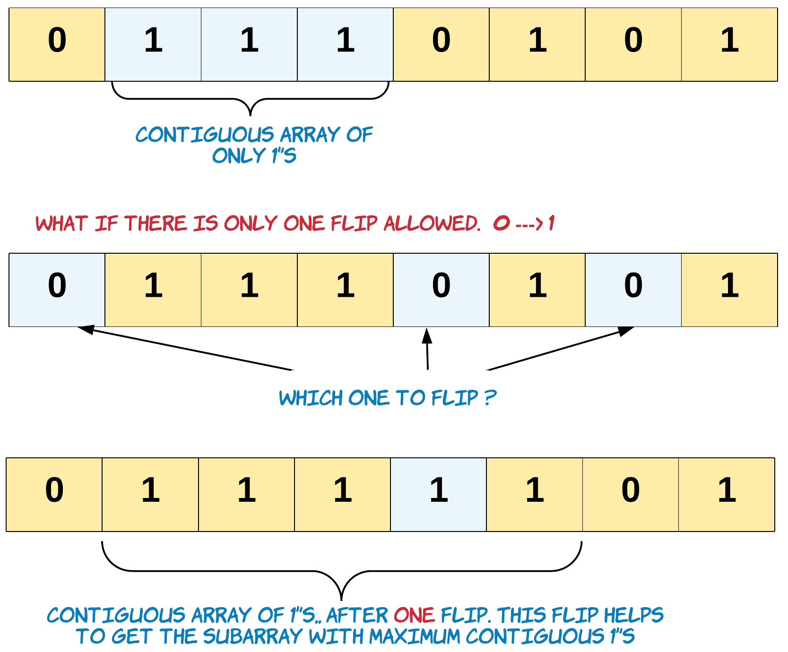
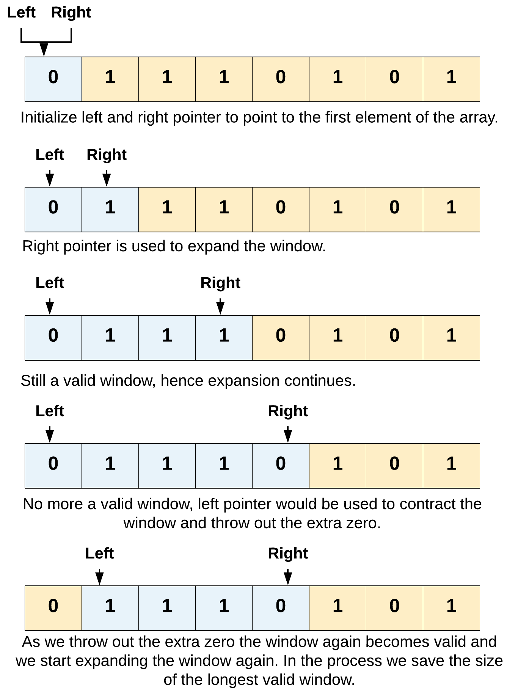

[TOC]

## Solution

The problem is asking for the longest contiguous subarray that contains only 1s. What makes this problem a little trickier is that `k` flips are allowed from `0` --> `1`. This means a valid subarray might not just contain `1`'s but also may contain some `0`'s. The number of `0`'s allowed in a given subarray is given by `k`.

  <center>
  
  </center>
  <br>
The above diagram shows the `flip` which helped us to get the longest contiguous subarray if only one flip was allowed.

### Approach: Sliding Window

**Intuition**

This problem is equivalent to finding the longest subarray with at most `k` zeroes.

We can use a simple sliding window approach to solve this problem.

In any sliding window based problem we have two pointers. One right pointer whose job is to expand the current window and then we have the left pointer whose job is to contract a given window. At any point in time only one of these pointers move and the other one remains fixed.

The solution is pretty intuitive. We keep expanding the window by moving the right pointer. When the window has reached the limit of `0`'s allowed, we contract (if possible) and save the longest window till now.

The answer is the longest desirable window.

**Algorithm**

1. Initialize two pointers. The two pointers help us to mark the left and right end of the window/subarray with contiguous `1`'s. Also initialize `curr` to keep track of how many zeroes are in the window.

    > left = 0, right = 0, curr = 0

2. We use the `right` pointer to expand the window until the window/subarray is desirable. i.e. number of `0`'s in the window are in the allowed range of [0, k].

3. Once we have a window which has more than the allowed number of `0`'s, we can move the left pointer ahead until the window is valid again.

<center>

</center>
<br>

```python
class Solution:
    def longestOnes(self, nums: List[int], k: int) -> int:
        left = 0
        curr = 0
        ans = 0
        for right in range(len(nums)):
            if nums[right] == 0:
                curr += 1

            while curr > k:
                if nums[left] == 0:
                    curr -= 1
                left += 1

            ans = max(ans, right - left + 1)

        return ans
```

**Complexity Analysis**

* Time Complexity: $O(N)$, where $N$ is the number of elements in the array. In worst case we might end up visiting every element of array twice, once by left pointer and once by right pointer.

* Space Complexity: $O(1)$. We do not use any extra space.
<br/>
<br/>