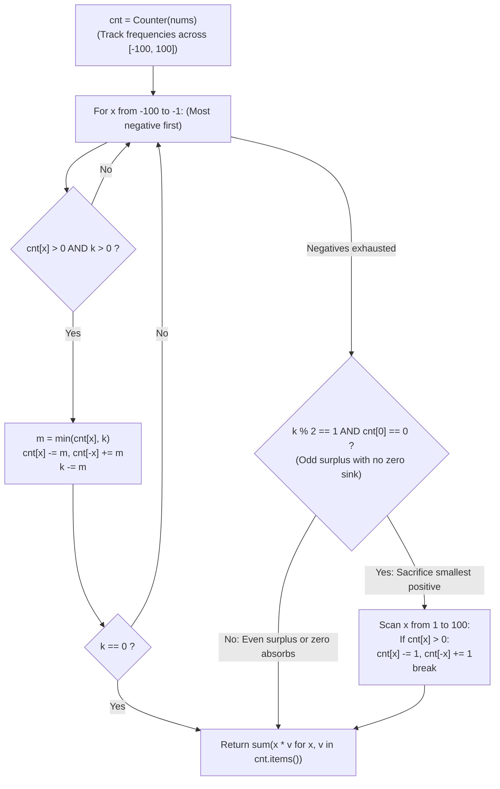

# Guided Example: Maximize Sum Of Array After K Negations

We trace the step-by-step greedy negation schedule using frequency histograms over bounded values, prove the Marginal Gain Inversion Theorem and the Residual Parity Conservation Invariant, and determine the maximal achievable array sum across representative instances:

- **Representative Instance 1 (All Positive Values with Odd Parity Operation):**
  $$
  nums = [4, \; 2, \; 3], \quad k = 1
  $$
- **Required Output:** `5`
  - Marginal gain principle:
    - Negating value $x \mapsto -x$ shifts total sum by $\Delta(x) = (-x) - x = -2x$.
    - If $x > 0$, $\Delta(x) = -2x < 0$ (Inevitably decreases total sum).
    - To maximize the final sum under a forced positive negation, we must choose the value that minimizes $|-2x|$, which is the **smallest positive element**.
  - Execution trace:
    1. **Frequency Histogram Setup:**
       - Value range $[-100, 100]$.
       - $cnt = \{4: 1, \; 2: 1, \; 3: 1\}$.
       - Negative scan $x \in [-100, -1]$: No negative numbers present. $k$ remains $1$.
    2. **Residual Parity Check ($k = 1$, odd):**
       - Check if $0$ is present ($cnt[0] == 0$, False). Zero cannot absorb the negation.
       - Scan positive range $x \in [1, 100]$ to find minimal positive element:
         - $x = 1$: $cnt[1] = 0$.
         - $x = 2$: $cnt[2] = 1 > 0$! Found minimal element $x = 2$.
       - Negate one copy of $2$:
         $$
         cnt[2] \leftarrow 1 - 1 = 0, \quad cnt[-2] \leftarrow 0 + 1 = 1
         $$
    3. **Compute Final Sum:**
       $$
       \text{Total Sum} = (4 \times 1) + (-2 \times 1) + (3 \times 1) = 4 - 2 + 3 = \mathbf{5}
       $$
  - Final array: $[4, -2, 3]$ with sum $\mathbf{5}$.

- **Representative Instance 2 (Zero Absorbs Surplus Odd Parity):**
  $$
  nums = [3, \; -1, \; 0, \; 2], \quad k = 3
  $$
  - Phase 1 (Negatives): Flip $-1 \to 1$ ($k \leftarrow 3 - 1 = 2$).
  - Phase 2 (Surplus $k = 2$):
    - Even remainder or absorbed by $0$: toggling $0 \to -0 = 0$ costs nothing.
    - Sum: $3 + 1 + 0 + 2 = \mathbf{6}$.

- **Representative Instance 3 (Exhausting Operations on Largest Magnitude Negatives):**
  $$
  nums = [2, \; -3, \; -1, \; 5, \; -4], \quad k = 2
  $$
  - Ascending scan of negatives:
    - $x = -4$: Flip $-4 \to 4$, $k \leftarrow 2 - 1 = 1$.
    - $x = -3$: Flip $-3 \to 3$, $k \leftarrow 1 - 1 = 0$ (Done!).
    - Element $-1$ remains negative.
  - Final multiset: $[2, 4, 3, -1, 5]$.
  - Sum: $2 + 4 + 3 - 1 + 5 = \mathbf{13}$.

---

## 1. Instance & Teaching Goal

Given an integer array `nums` and an integer `k`, modify the array by choosing an index and negating $nums[i] \leftarrow -nums[i]$ exactly `k` times (re-selecting indices is permitted).
Return the **maximum possible sum** of the array.

```text
Marginal Gain Analysis:
  x < 0:  Negating x changes sum by +2|x| > 0  (HUGE BENEFIT: prioritize most negative!)
  x = 0:  Negating 0 changes sum by 0          (FREE SINK: absorbs operations!)
  x > 0:  Negating x changes sum by -2x < 0    (PENALTY: minimize with smallest x!)

Parity Involution:
  Negating the same index twice: x -> -x -> x (Net change = 0).
  Any even remaining k can be absorbed with ZERO loss!
```

Sorting the array repeatedly or utilizing a heap for $k$ iterations can take $\mathcal{O}((N + k) \log N)$ time.

The decisive pedagogical goal is the **Greedy Marginal Gain & Parity Conservation Invariant**:
1. **Marginal Gain Hierarchy:** Negative numbers produce positive gains $\Delta(x) = 2|x|$, with larger magnitudes yielding larger gains. Hence, greedy order strictly flips negatives from $-100$ up to $-1$.
2. **Parity Involution Theorem:** Two negations on the same element cancel out completely. Once all negative numbers are flipped, any even remaining $k$ requires zero net change.
3. **Odd Parity Sacrificial Element:** If $k$ is odd and no $0$ exists in the array, exactly one positive element must be flipped to negative. The penalty $2x$ is minimized by selecting the smallest positive element present.
4. Operates in $\mathcal{O}(N + C)$ linear time where $C = 201$ is the value domain size, bypassing sorting entirely.

---

## 2. Conceptual Foundation & The Marginal Gain Invariant



### The Marginal Gain Inversion Theorem

Let $A = (x_1, \dots, x_n)$ be an array of integers.
1. **Linear Marginal Shift:**
   Let $S = \sum_{i=1}^n x_i$. Negating element $x_j \leftarrow -x_j$ updates the total sum to:
   $$
   S' = S - x_j + (-x_j) = S - 2x_j
   $$
   The marginal gain is $\Delta(x_j) = -2x_j$.
2. **Greedy Dominance for Negatives:**
   For any two negative numbers $x_a < x_b < 0$:
   $$
   \Delta(x_a) = 2|x_a| > 2|x_b| = \Delta(x_b) > 0
   $$
   Every negation applied to a negative element strictly increases $S$. To maximize the total increase within budget $k$, operations must be greedily allocated in order of strictly decreasing magnitude (increasing value from $-100$ to $-1$).
3. **Involution of Paired Negations:**
   For any index $i$, applying two consecutive negations leaves $x_i$ unchanged:
   $$
   -(-x_i) = x_i \implies \Delta_2(x_i) = 0
   $$
   Therefore, if $k$ remaining operations exist and all negative numbers have been converted to positive, any even budget $2m$ can be applied to the same element with net sum alteration $0$.
4. **Minimal Odd Penalty:**
   If the remaining budget is odd ($k \equiv 1 \pmod 2$):
   - If $0 \in A$: $\Delta(0) = -2(0) = 0$. Applying the remaining negation to $0$ costs $0$.
   - If $0 \notin A$: Exactly one positive element $x > 0$ must be negated.
     The penalty is $-2x$. Maximizing $S - 2x$ is strictly equivalent to minimizing $x \in A_{> 0}$. $\blacksquare$

---

## 3. Step-by-Step Worked Execution: Representative Instance 1

$nums = [4, 2, 3], \; k = 1$.
Initial histogram: $cnt[4] = 1, cnt[2] = 1, cnt[3] = 1$. All other counts $0$.

### Step 1: Phase 1 (Negative Numbers Scan)
- Scan range $x \in [-100, -1]$:
  - All $cnt[x] == 0$.
  - No negative numbers to invert. $k$ remains $1$.

---

### Step 2: Phase 2 (Residual Parity Resolution)
- Check condition: `k & 1 and cnt[0] == 0`.
  - $k = 1$ is odd ($1 \ \& \ 1 == 1$, True).
  - $cnt[0] = 0$ (True, no zero present to absorb).
- Scan positive numbers $x \in [1, 100]$:
  - $x = 1$: $cnt[1] = 0$.
  - $x = 2$: $cnt[2] = 1 > 0$ (**Minimal positive found!**).
  - Action: Negate one copy of $2$:
    $$
    cnt[2] \leftarrow 1 - 1 = 0, \quad cnt[-2] \leftarrow 0 + 1 = 1
    $$
  - Break loop.

---

### Step 3: Compute Final Sum
$$
\begin{aligned}
\text{Total} &= \sum x \cdot cnt[x] \\
&= (-2 \times 1) + (3 \times 1) + (4 \times 1) \\
&= -2 + 3 + 4 = \mathbf{5}
\end{aligned}
$$

Final result: $\mathbf{5}$.

---

## 4. Value Frequency & Negation Trace Table

| Value $x$ | Initial Frequency | Flipped in Phase 1 (Negatives) | Flipped in Phase 2 (Parity) | Final Frequency | Contribution to Sum $x \cdot cnt[x]$ |
|:---:|:---:|:---:|:---:|:---:|:---:|
| **$-2$** | $0$ | — | $+1$ (Sacrificed) | $1$ | $-2 \times 1 = -2$ |
| **$2$** | $1$ | — | $-1$ | $0$ | $0$ |
| **$3$** | $1$ | — | — | $1$ | $3 \times 1 = 3$ |
| **$4$** | $1$ | — | — | $1$ | $4 \times 1 = 4$ |
| **Total** | — | — | — | — | **$-2 + 3 + 4 = 5$** |

---

## 5. Algorithmic Correctness

### Soundness & Completeness
1. **Soundness:**
   Every operation performed either inverts a negative number (increasing sum) or minimizes the inescapable penalty under odd parity. The total number of negations assigned is exactly $k$, respecting problem constraints.
2. **Completeness:**
   Scanning frequencies from $-100$ to $-1$ guarantees optimal greediness. Accounting for zero as a free operation sink and identifying the minimal positive element exhaustively resolves all parity cases.

---

## 6. Boundary Cases & Traps

| Scenario | Input Pattern | Behavior | Trapped Risk |
|---|---|---|---|
| Zero Present with Large Odd $k$ | `nums = [3, 0, 2], k = 99` | $k$ becomes odd; $cnt[0] > 0$; zero absorbs odd flip; returns $5$. | Negating positive number when zero exists. |
| All Negatives with Insufficient $k$ | `nums = [-8, -3, -5], k = 2` | Flips $-8 \to 8, -5 \to 5$; returns $8 + 5 - 3 = 10$. | Flipping $-3$ before $-8$. |
| Even Surplus $k$ | `nums = [1, 2, 3], k = 4` | $k \ \& \ 1 == 0$; zero adjustments made; returns $6$. | Negating numbers needlessly on even $k$. |
| $k$ Exceeds Array Length | `len = 2, k = 10000` | $k$ absorbed by parity cancelation; runs in constant time. | Simulating 10,000 steps one-by-one. |

---

## 7. Complexity Derivation

- **Time Complexity:** $\mathcal{O}(N + C)$, where $N = \text{len}(nums) \le 10^4$ and value domain size $C = 201$ ($[-100, 100]$).
  - Frequency counting takes $\mathcal{O}(N)$.
  - Negative scan loops $100$ times.
  - Positive scan loops at most $100$ times.
  - Final sum evaluation loops at most $201$ times.
  - Total time: $< 0.001\text{ s}$.
- **Auxiliary Space Complexity:** $\mathcal{O}(C) = \mathcal{O}(1)$ to store frequencies for the $201$ possible integers in $[-100, 100]$.
