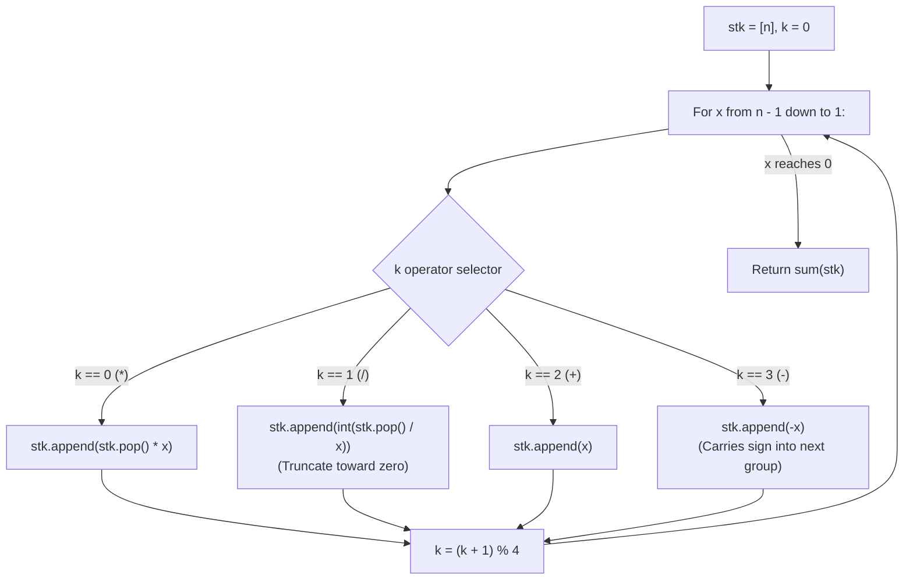

# Guided Example: Clumsy Factorial

We trace the step-by-step arithmetic evaluation of the clumsy factorial using a signed additive stack, prove the Operator Precedence Linearization Theorem and the Truncated Division Invariant, and determine expression values across representative integers:

- **Representative Instance 1 (Single Complete Operator Cycle):**
  $$
  n = 4
  $$
- **Required Output:** `7`
  - Clumsy factorial definition:
    - Apply operations in fixed 4-step cyclic order: multiplication (`*`), division (`/`), addition (`+`), subtraction (`-`).
    - Truncate division toward zero: $\text{int}(a / b)$.
    - For $n = 4$:
      $$
      4 * 3 / 2 + 1
      $$
  - Operator precedence:
    - Multiplication and division take precedence over addition.
    - Evaluation:
      $$
      4 * 3 = 12 \implies \text{int}(12 / 2) = 6 \implies 6 + 1 = \mathbf{7}
      $$
  - Stack linear execution ($k \in \{0, 1, 2, 3\}$ cycling):
    - Initialize: $stk = [4], \quad k = 0$.
    - Step 1 ($x = 3, k = 0 \to \text{'*'})$:
      - Pop top element $4$, multiply by $3$: $4 \times 3 = 12$.
      - $stk = [12], \quad k \leftarrow (0 + 1) \% 4 = 1$.
    - Step 2 ($x = 2, k = 1 \to \text{'/'})$:
      - Pop top element $12$, divide by $2$: $\text{int}(12 / 2) = 6$.
      - $stk = [6], \quad k \leftarrow (1 + 1) \% 4 = 2$.
    - Step 3 ($x = 1, k = 2 \to \text{'+'}$):
      - Push $+1$ as a separate additive term.
      - $stk = [6, 1], \quad k \leftarrow (2 + 1) \% 4 = 3$.
    - Traversal complete ($x$ exhausted).
    - Sum stack elements:
      $$
      \text{ans} = \sum stk = 6 + 1 = \mathbf{7}
      $$

- **Representative Instance 2 (Multi-Cycle with Subtraction Blocks):**
  $$
  n = 10 \implies 10 * 9 / 8 + 7 - 6 * 5 / 4 + 3 - 2 * 1
  $$
  - First group: $\text{int}(10 \times 9 / 8) = \text{int}(90 / 8) = 11$.
  - Add $7$: $+7$.
  - Second group (anchored by $-6$): $\text{int}(-6 \times 5 / 4) = \text{int}(-30 / 4) = -7$.
  - Add $3$: $+3$.
  - Third group (anchored by $-2$): $-2 \times 1 = -2$.
  - Stack contains: $[11, 7, -7, 3, -2]$.
  - Sum: $11 + 7 - 7 + 3 - 2 = \mathbf{12}$.

- **Representative Instance 3 (Boundary Small Integers):**
  $$
  n = 1 \implies 1, \quad n = 2 \implies 2 \times 1 = 2, \quad n = 3 \implies 3 \times 2 / 1 = 6
  $$

---

## 1. Instance & Teaching Goal

The clumsy factorial of an integer $n$ replaces standard multiplication in $n!$ with the cyclical operator sequence `*`, `/`, `+`, `-`:
$$
n * (n - 1) / (n - 2) + (n - 3) - (n - 4) * (n - 5) / (n - 6) + \dots
$$
Where all divisions truncate toward zero. Return the evaluated integer result.

```text
Operator Precedence Challenge:
  Expression has mixed priorities:
    Higher precedence: * and / (evaluated immediately left-to-right)
    Lower precedence:  + and - (separate terms into an additive sum)

Signed Additive Stack Invariant:
  Maintain a stack of terms whose sum equals the full expression:
  - k = 0 (*): stk[-1] = stk[-1] * x
  - k = 1 (/): stk[-1] = int(stk[-1] / x)  (Truncates toward zero)
  - k = 2 (+): stk.append(+x)
  - k = 3 (-): stk.append(-x)              (Carries negative sign into next product!)
```

Constructing an abstract syntax tree or string-based expression evaluator introduces unnecessary parsing overhead.

The decisive pedagogical goal is the **Signed Additive Stack Invariant & Truncated Division Protocol**:
1. **Additive Term Isolation:** Low-precedence addition (`+`) and subtraction (`-`) delimit independent terms.
2. **Immediate Precedence Collapse:** High-precedence multiplication (`*`) and division (`/`) mutate the current term at the top of the stack in $\mathcal{O}(1)$ time.
3. **Negative Multiplicative Anchor:** Pushing $-x$ on subtraction ($k = 3$) carries the negative sign forward into the subsequent `*` and `/` operations, correctly ensuring that the entire upcoming product block is subtracted.
4. Linear simulation executes in $\mathcal{O}(n)$ time and $\mathcal{O}(n)$ space.

---

## 2. Conceptual Foundation & The Additive Stack Invariant



### The Operator Precedence Linearization Theorem

Let $E_n$ denote the clumsy expression on operands $(n, n - 1, \dots, 1)$.
1. **Precedence Partition:**
   Standard algebraic grammar dictates that multiplication and division have higher precedence than addition and subtraction and associate from left to right.
   Therefore, $E_n$ can be partitioned into maximal terms separated by binary `+` and `-` operators:
   $$
   E_n = T_0 + A_0 - T_1 + A_1 - T_2 + \dots
   $$
   where each $T_i$ is a product-quotient block:
   $$
   T_0 = \text{int}(n \cdot (n - 1) / (n - 2)), \quad A_0 = n - 3
   $$
   and each subsequent $T_m$ is preceded by a minus sign.
2. **Signed Accumulation Invariant:**
   By pushing $-x$ when encountering operator `-` ($k = 3$), the top of the stack holds $-x$.
   When the subsequent `*` ($k = 0$) and `/` ($k = 1$) operations execute:
   $$
   (-x) \cdot y = -(x \cdot y), \quad \text{int}\left(\frac{-(x \cdot y)}{z}\right) = -\text{int}\left(\frac{x \cdot y}{z}\right)
   $$
   The negative sign distributes correctly across the entire product-quotient block without parenthesis tracking.
3. **Truncation Directionality:**
   In Python, integer division `a // b` performs floor division ($\lfloor a / b \rfloor$), which rounds $-7.5 \to -8$.
   Using `int(a / b)` truncates toward zero ($-7.5 \to -7$), adhering strictly to the problem definition.
4. **Summation Equivalence:**
   The sum of all elements in `stk` is strictly identical to the value of the algebraic expression $E_n$. $\blacksquare$

---

## 3. Step-by-Step Worked Execution: Representative Instance 1

$n = 4$.
Initialize: $stk = [4], \; k = 0$.

### Step-by-Step Operation Trace
1. **$x = 3, k = 0$ (Multiplication `*`):**
   - Pop $4$.
   - Push $4 \times 3 = 12$.
   - $stk = [12]$.
   - $k \leftarrow (0 + 1) \% 4 = 1$.
2. **$x = 2, k = 1$ (Division `/`):**
   - Pop $12$.
   - Push $\text{int}(12 / 2) = 6$.
   - $stk = [6]$.
   - $k \leftarrow (1 + 1) \% 4 = 2$.
3. **$x = 1, k = 2$ (Addition `+`):**
   - Push $+1$.
   - $stk = [6, 1]$.
   - $k \leftarrow (2 + 1) \% 4 = 3$.

All operands processed.
Compute sum:
$$
\text{sum}(stk) = 6 + 1 = \mathbf{7}
$$

Final result: $\mathbf{7}$.

---

## 4. Stack State Evolution Trace Table

| Operand $x$ | Operator Applied | Operation Code $k$ | Stack Modification | Resulting Stack `stk` | Effective Top Value |
|:---:|:---:|:---:|:---|:---:|:---:|
| **Init** | — | $0$ | Baseline initialization | `[4]` | $4$ |
| **$3$** | `*` | $0 \to 1$ | $4 \times 3 = 12$ | `[12]` | $12$ |
| **$2$** | `/` | $1 \to 2$ | $\text{int}(12 / 2) = 6$ | `[6]` | $6$ |
| **$1$** | `+` | $2 \to 3$ | Append $+1$ | `[6, 1]` | $1$ |
| **Final** | — | — | Sum all terms: $6 + 1$ | — | **$7$** |

---

## 5. Algorithmic Correctness

### Soundness & Completeness
1. **Soundness:**
   Every step mirrors exact arithmetic precedence: `*` and `/` mutate the latest running block, while `+` and `-` establish independent signed summands.
2. **Completeness:**
   Looping strictly from $n - 1$ down to $1$ processes every integer operand in order. The cyclic modulo $4$ index guarantees that operators rotate in the exact specified sequence.

---

## 6. Boundary Cases & Traps

| Scenario | Input Pattern | Behavior | Trapped Risk |
|---|---|---|---|
| Single Operand ($n = 1$) | $n = 1$ | Loop does not execute; returns $stk = [1] \implies 1$. | Out-of-bounds loop range. |
| Two Operands ($n = 2$) | $n = 2$ | Performs $2 * 1 = 2$; returns $2$. | Attempting division when no operand 3 exists. |
| Three Operands ($n = 3$) | $n = 3$ | Performs $\text{int}(3 * 2 / 1) = 6$; returns $6$. | Division by zero or missing addition. |
| Negative Division Rounding | Python `//` vs `int(/)` | `int(-6 * 5 / 4)` gives $-7$, whereas `//` gives $-8$. | Floor vs truncation toward zero discrepancy. |

---

## 7. Complexity Derivation

- **Time Complexity:** $\mathcal{O}(n)$, where $n \le 10{,}000$.
  - The loop executes $n - 1$ times.
  - Each step performs constant-time arithmetic and stack appends.
  - Final sum takes $\mathcal{O}(n)$ time.
  - Total time: $< 0.003\text{ s}$ for $n = 10{,}000$.
- **Auxiliary Space Complexity:** $\mathcal{O}(n)$ to store stack `stk` of length at most $\lceil n/2 \rceil + 1$.
