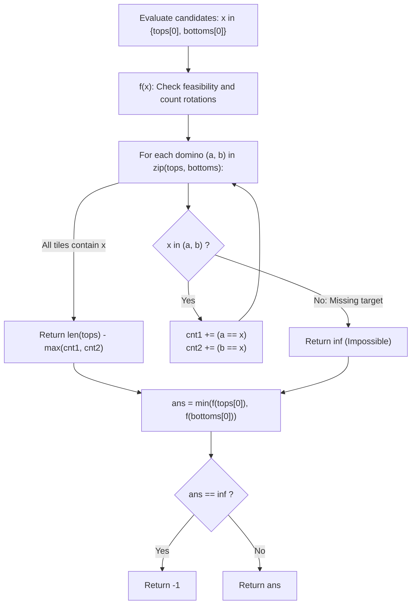

# Guided Example: Minimum Domino Rotations For Equal Row

We trace the step-by-step evaluation of the two-candidate domino pivot, prove the Candidate Dichotomy Lemma and the Symmetric Complement Rotation Invariant, and determine the minimal required tile rotations across representative domino sequences:

- **Representative Instance 1 (Shared Candidate on Every Tile):**
  $$
  tops = [2, \; 1, \; 2, \; 4, \; 2, \; 2], \quad bottoms = [5, \; 2, \; 6, \; 2, \; 3, \; 2], \quad n = 6
  $$
- **Required Output:** `2`
  - Candidate Dichotomy Principle:
    - If a row can be made uniform with value $x$, then the first domino (index 0) must display $x$ after any rotation.
    - Since domino 0 can only show $tops[0] = 2$ or $bottoms[0] = 5$, the candidate target value $x$ is strictly restricted to:
      $$
      x \in \{2, \; 5\}
      $$
    - Testing these two candidates exhaustively determines the answer.
  - Evaluation of Candidate 1 ($x = tops[0] = 2$):
    - Domino-by-domino validation ($a = tops[i], b = bottoms[i]$):
      - $i = 0$: $(2, 5) \implies a = 2$ (top). $cnt_1 \leftarrow 1, cnt_2 \leftarrow 0$.
      - $i = 1$: $(1, 2) \implies b = 2$ (bottom). $cnt_1 \leftarrow 1, cnt_2 \leftarrow 1$.
      - $i = 2$: $(2, 6) \implies a = 2$ (top). $cnt_1 \leftarrow 2, cnt_2 \leftarrow 1$.
      - $i = 3$: $(4, 2) \implies b = 2$ (bottom). $cnt_1 \leftarrow 2, cnt_2 \leftarrow 2$.
      - $i = 4$: $(2, 3) \implies a = 2$ (top). $cnt_1 \leftarrow 3, cnt_2 \leftarrow 2$.
      - $i = 5$: $(2, 2) \implies a = 2$ and $b = 2$ (both!). $cnt_1 \leftarrow 4, cnt_2 \leftarrow 3$.
    - Total tiles where $tops[i] == 2$: $cnt_1 = 4$.
      - Rotations needed to make `tops` uniform: $n - cnt_1 = 6 - 4 = \mathbf{2}$ (Rotate dominoes 1 and 3).
    - Total tiles where $bottoms[i] == 2$: $cnt_2 = 3$.
      - Rotations needed to make `bottoms` uniform: $n - cnt_2 = 6 - 3 = 3$ (Rotate dominoes 0, 2, 4).
    - Minimal rotations for candidate $2$:
      $$
      f(2) = \min(6 - cnt_1, \; 6 - cnt_2) = 6 - \max(4, 3) = 6 - 4 = \mathbf{2}
      $$
  - Evaluation of Candidate 2 ($x = bottoms[0] = 5$):
    - Domino 0: $(2, 5)$ contains 5.
    - Domino 1: $(1, 2)$ does NOT contain 5!
    - Neither rotation can place 5 at index 1 $\implies f(5) = \infty$.
  - Global optimal selection:
    $$
    ans = \min(f(2), \; f(5)) = \min(2, \; \infty) = \mathbf{2}
    $$

- **Representative Instance 2 (No Common Candidate Across Tiles):**
  $$
  tops = [3, 5, 1, 2, 3], \quad bottoms = [3, 6, 3, 3, 4]
  $$
  - Candidate $tops[0] = 3$: Domino 1 is $(5, 6)$, lacks 3 $\implies \infty$.
  - Candidate $bottoms[0] = 3$: Same failure at Domino 1 $\implies \infty$.
  - Output: $\mathbf{-1}$.

- **Representative Instance 3 (Row Already Uniform):**
  $$
  tops = [1, 1, 1], \quad bottoms = [2, 3, 4] \implies cnt_1 = 3 \implies 3 - 3 = \mathbf{0}
  $$

---

## 1. Instance & Teaching Goal

In a row of dominoes, `tops[i]` and `bottoms[i]` represent the top and bottom values. We can rotate any domino (swapping its top and bottom).
Return the **minimum number of rotations** so that all elements in `tops` are identical, or all elements in `bottoms` are identical. If impossible, return `-1`.

```text
The Search Space Illusion:
  Testing all 6 domino faces (1 to 6) is O(6N) = O(N).
  Can we do even better?

The Two-Candidate Dichotomy Invariant:
  In the target configuration, the first domino (index 0) MUST display the target value!
  Since domino 0 only has two faces: tops[0] and bottoms[0],
  the target value x CAN ONLY BE tops[0] OR bottoms[0]!
  Any other value is immediately disqualified without scanning!
```

Checking arbitrary frequency histograms without confirming that every single domino contains the target value leads to incorrect conclusions.

The decisive pedagogical goal is the **Two-Candidate Dichotomy Lemma & Complement Rotation Invariant**:
1. **Candidate Anchor:** If a uniform row can be created with value $x$, then domino 0 must display $x$. Thus, $x \in \{tops[0], bottoms[0]\}$ are the **only two possible targets**.
2. **Universal Tile Feasibility:** If any domino $i$ has $x \notin \{tops[i], bottoms[i]\}$, target $x$ is mathematically impossible ($\text{cost} = \infty$).
3. **Complement Counting:** If every domino contains $x$:
   - Dominos already having $x$ on top: $cnt_1$. Rotations to make `tops` uniform: $n - cnt_1$.
   - Dominos already having $x$ on bottom: $cnt_2$. Rotations to make `bottoms` uniform: $n - cnt_2$.
   - Optimal cost for $x$ is $n - \max(cnt_1, cnt_2)$.
4. Evaluates at most two linear passes in $\mathcal{O}(N)$ time and $\mathcal{O}(1)$ auxiliary space.

---

## 2. Conceptual Foundation & The Candidate Dichotomy Invariant



### The Candidate Dichotomy Theorem

Let $(T, B) = ((t_0, \dots, t_{n-1}), (b_0, \dots, b_{n-1}))$ be a sequence of $n$ dominoes.
1. **Uniform State Condition:**
   A sequence of rotations transforms $(T, B)$ into a configuration where either $T = (x, \dots, x)$ or $B = (x, \dots, x)$ for some integer $x \in \{1, \dots, 6\}$.
2. **The First-Tile Pigeonhole Lemma:**
   Suppose such a rotation sequence exists for target value $x$.
   At index $0$, domino 0 is rotated or left unrotated, leaving either $t_0 = x$ or $b_0 = x$.
   Therefore, $x \in \{t_0, b_0\}$.
   No other value $y \notin \{t_0, b_0\}$ can ever satisfy the condition because domino 0 can never display $y$.
3. **Tile-Level Universal Covering Lemma:**
   For a fixed candidate $x \in \{t_0, b_0\}$, a uniform row can be formed if and only if:
   $$
   x \in \{t_i, b_i\} \quad \forall i \in [0, n - 1]
   $$
   If this holds, let $cnt_1 = \sum_{i=0}^{n-1} \mathbb{I}(t_i = x)$ and $cnt_2 = \sum_{i=0}^{n-1} \mathbb{I}(b_i = x)$.
   To make $T$ uniform, we must rotate all tiles where $t_i \ne x$.
   Because $x \in \{t_i, b_i\}$, whenever $t_i \ne x$, it follows that $b_i = x$.
   Hence, rotating these tiles leaves $x$ on top, taking exactly $n - cnt_1$ rotations.
   Symmetrically, making $B$ uniform requires $n - cnt_2$ rotations.
4. **Optimality:**
   The minimal rotations for candidate $x$ is:
   $$
   \min(n - cnt_1, \; n - cnt_2) = n - \max(cnt_1, cnt_2) \quad \blacksquare
   $$

---

## 3. Step-by-Step Worked Execution: Representative Instance 1

$tops = [2, 1, 2, 4, 2, 2], \; bottoms = [5, 2, 6, 2, 3, 2], \; n = 6$.

### Candidate 1: $x = tops[0] = 2$
- $i = 0$: $(2, 5) \implies 2 \in \{2, 5\}$. $cnt_1 = 1, cnt_2 = 0$.
- $i = 1$: $(1, 2) \implies 2 \in \{1, 2\}$. $cnt_1 = 1, cnt_2 = 1$.
- $i = 2$: $(2, 6) \implies 2 \in \{2, 6\}$. $cnt_1 = 2, cnt_2 = 1$.
- $i = 3$: $(4, 2) \implies 2 \in \{4, 2\}$. $cnt_1 = 2, cnt_2 = 2$.
- $i = 4$: $(2, 3) \implies 2 \in \{2, 3\}$. $cnt_1 = 3, cnt_2 = 2$.
- $i = 5$: $(2, 2) \implies 2 \in \{2, 2\}$. $cnt_1 = 4, cnt_2 = 3$.
- All tiles contain $2$!
- Rotation counts:
  - Tops uniform: $6 - cnt_1 = 6 - 4 = 2$.
  - Bottoms uniform: $6 - cnt_2 = 6 - 3 = 3$.
  - $f(2) = 6 - \max(4, 3) = \mathbf{2}$.

### Candidate 2: $x = bottoms[0] = 5$
- $i = 0$: $(2, 5) \implies 5 \in \{2, 5\}$.
- $i = 1$: $(1, 2) \implies 5 \notin \{1, 2\}$.
- Fails immediately! $f(5) = \infty$.

### Global Selection
$$
ans = \min(f(2), \; f(5)) = \min(2, \; \infty) = \mathbf{2}
$$

---

## 4. Candidate Validation Trace Table

| Tile Index $i$ | Pair $(tops[i], bottoms[i])$ | $2$ Present? | Top Match $a == 2$ | Bottom Match $b == 2$ | $5$ Present? |
|:---:|:---:|:---:|:---:|:---:|:---:|
| **$0$** | $(2, 5)$ | Yes | True ($cnt_1 = 1$) | False ($cnt_2 = 0$) | Yes |
| **$1$** | $(1, 2)$ | Yes | False ($cnt_1 = 1$) | True ($cnt_2 = 1$) | **No (Fails!)** |
| **$2$** | $(2, 6)$ | Yes | True ($cnt_1 = 2$) | False ($cnt_2 = 1$) | — |
| **$3$** | $(4, 2)$ | Yes | False ($cnt_1 = 2$) | True ($cnt_2 = 2$) | — |
| **$4$** | $(2, 3)$ | Yes | True ($cnt_1 = 3$) | False ($cnt_2 = 2$) | — |
| **$5$** | $(2, 2)$ | Yes | True ($cnt_1 = 4$) | True ($cnt_2 = 3$) | — |
| **Metric**| — | **All Valid** | $n - cnt_1 = 2$ | $n - cnt_2 = 3$ | **$\infty$** |

---

## 5. Algorithmic Correctness

### Soundness & Completeness
1. **Soundness:**
   A rotation count is accepted only if every single domino contains the target value. The count $n - \max(cnt_1, cnt_2)$ directly reflects the minimal number of flips required to align the target value on the row where it is already most prevalent.
2. **Completeness:**
   By the First-Tile Pigeonhole Lemma, any valid target must appear on the first domino. Testing both $tops[0]$ and $bottoms[0]$ guarantees that no viable target value is missed.

---

## 6. Boundary Cases & Traps

| Scenario | Input Pattern | Behavior | Trapped Risk |
|---|---|---|---|
| Dominos with Equal Halves | `(6, 6), (6, 6)` | Increments both $cnt_1$ and $cnt_2$; requires $0$ rotations. | Double counting or false rotation triggers. |
| Both First Faces Identical | $tops[0] == bottoms[0]$ | Evaluates same candidate twice; returns correct minimum. | Redundant branch divergence. |
| Late Failure Tile | Valid until last domino | Returns $\infty$ as soon as missing tile is reached. | Accepting partial rows. |
| Single Domino | `tops = [2], bottoms = [5]` | Already uniform (length 1); returns $0$ rotations. | Off-by-one length errors. |

---

## 7. Complexity Derivation

- **Time Complexity:** $\mathcal{O}(N)$, where $N = \text{len}(tops) = \text{len}(bottoms) \le 20{,}000$.
  - Helper $f(x)$ performs a single pass over $N$ dominoes.
  - At most $2$ candidate calls are made ($f(tops[0])$ and $f(bottoms[0])$).
  - Total operations: at most $2N \le 40{,}000 \implies < 0.005\text{ s}$.
- **Auxiliary Space Complexity:** $\mathcal{O}(1)$ auxiliary memory; operates purely on scalar counters `cnt1` and `cnt2`.
