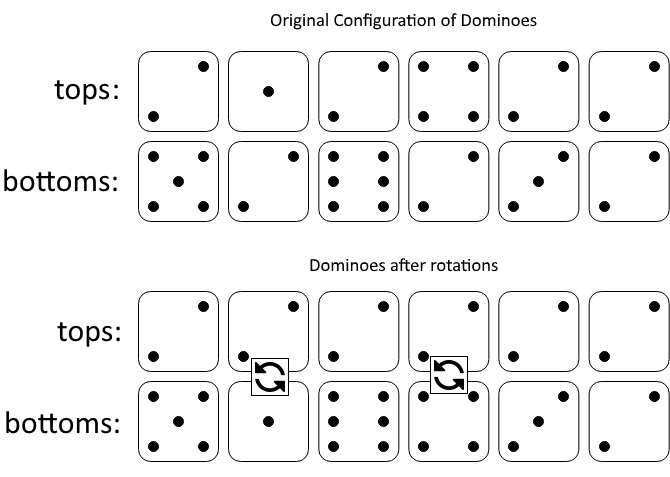

### 1. Description

In a row of dominoes, $\text{tops}[i]$ and $\text{bottoms}[i]$ represent the top and bottom halves of the $$i^{\text{th}}$$ domino. (A domino is a tile with two numbers from 1 to 6 - one on each half of the tile.)

We may rotate the $$i^{\text{th}}$$ domino, so that $\text{tops}[i]$ and $\text{bottoms}[i]$ swap values.

Return the minimum number of rotations so that all the values in `tops` are the same, or all the values in `bottoms` are the same.

If it cannot be done, return `-1`.

### 2. Function Contract

**Inputs**

- `tops`: Input parameter (`List[int]`).
- `bottoms`: Input parameter (`List[int]`).

**Return value**

- Returns `int`.

### 3. Examples

#### Example 1

- **Input:** $tops = [2,1,2,4,2,2], bottoms = [5,2,6,2,3,2]$
- **Output:** `2`
- **Explanation:** The first figure represents the dominoes as given by tops and bottoms: before we do any rotations.
If we rotate the second and fourth dominoes, we can make every value in the top row equal to 2, as indicated by the second figure.

#### Example 2

- **Input:** $tops = [3,5,1,2,3], bottoms = [3,6,3,3,4]$
- **Output:** `-1`
- **Explanation:** In this case, it is not possible to rotate the dominoes to make one row of values equal.

### 4. Constraints

- $2 \le \text{tops.length} \le 2 * 10^{4}$

- $\text{bottoms.length} = \text{tops.length}$

- $1 \le \text{tops}[i], \text{bottoms}[i] \le 6$
