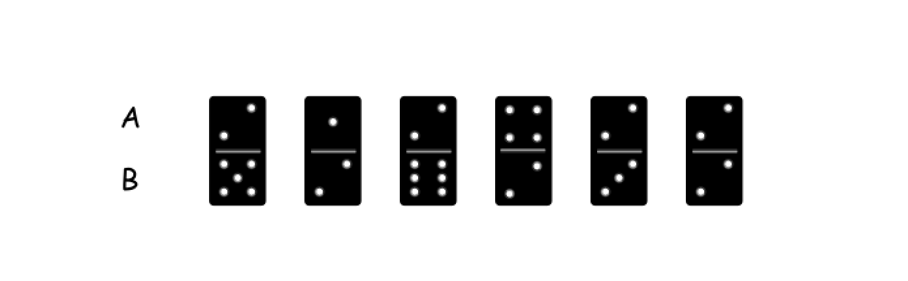
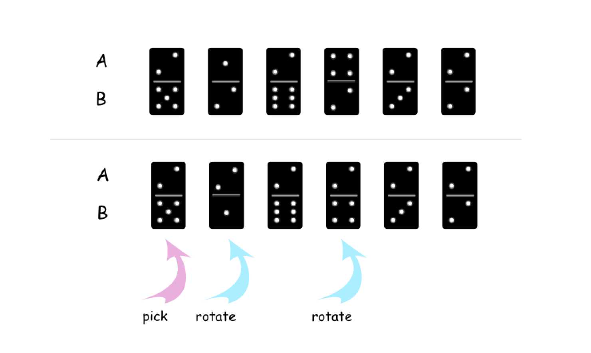
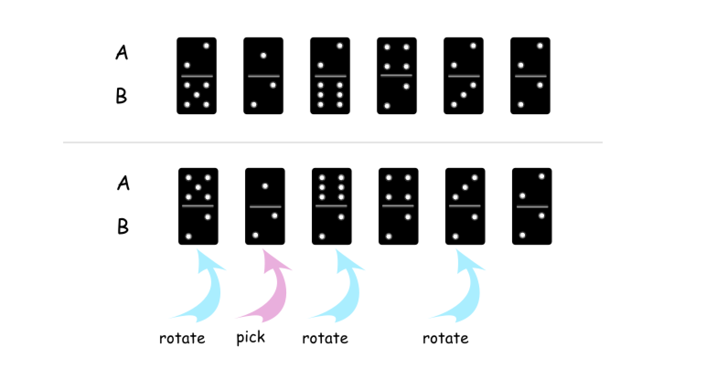
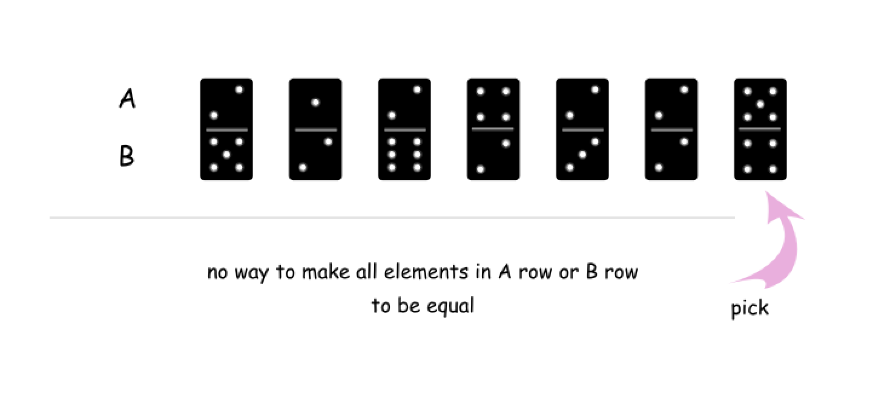

[TOC]

## Solution

---

### Approach 1: Greedy.

**Intuition**

Let's pick up an arbitrary `i`th domino element in the configuration. The element has two sides, $A[i]$ is an upper side, and $B[i]$ is a lower side.



There could be three possible situations here

1. One could make all elements of `A` row or `B` row to be the same and equal to $A[i]$ value. For example, if one picks up the `0`th element, it's possible to make all elements of `A` row to be equal to `2`.



2. One could make all elements of `A` row or `B` row to be the same and equal to $B[i]$ value. For example, if one picks up the `1`th element, it's possible to make all elements of `B` row to be equal to `2`.



3. It's impossible to make all elements of `A` row or `B` row to have the same $A[i]$ or $B[i]$ value.



> The third situation means that it's impossible to make all elements in `A` row or `B` row to be equal.

Yes, only one domino element was checked here, and still it's enough because the rotation is the only allowed operation here.

**Algorithm**

- Pick up the first element. It has two sides: $A[0]$ and $B[0]$.

- Check if one could make all elements in `A` row or `B` row to be equal to $A[0]$. If yes, return the minimum number of rotations needed.

- Check if one could make all elements in `A` row or `B` row to be equal to $B[0]$. If yes, return the minimum number of rotations needed.

- Otherwise return `-1`.

**Implementation**

```python
class Solution:
    def minDominoRotations(self, A: List[int], B: List[int]) -> int:
        def check(x):
            """
            Return min number of swaps
            if one could make all elements in A or B equal to x.
            Else return -1.
            """
            # how many rotations should be done
            # to have all elements in A equal to x
            # and to have all elements in B equal to x
            rotations_a = rotations_b = 0
            for i in range(n):
                # rotations couldn't be done
                if A[i] != x and B[i] != x:
                    return -1
                # A[i] != x and B[i] == x
                elif A[i] != x:
                    rotations_a += 1
                # A[i] == x and B[i] != x
                elif B[i] != x:
                    rotations_b += 1
            # min number of rotations to have all
            # elements equal to x in A or B
            return min(rotations_a, rotations_b)

        n = len(A)
        rotations = check(A[0])
        # If one could make all elements in A or B equal to A[0]
        if rotations != -1 or A[0] == B[0]:
            return rotations
        # If one could make all elements in A or B equal to B[0]
        else:
            return check(B[0])
```

**Complexity Analysis**

* Time complexity: $\mathcal{O}(N)$ since here one iterates over the
arrays not more than two times.

* Space complexity: $\mathcal{O}(1)$ since it's a constant
space solution.