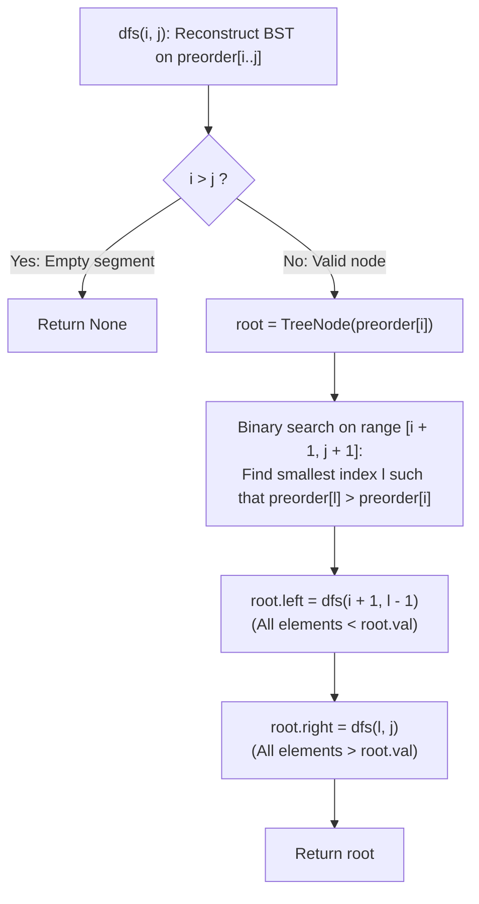

# Guided Example: Construct Binary Search Tree from Preorder Traversal

We trace the step-by-step recursive divide-and-conquer partition of a preorder traversal into left and right subtrees via binary search, prove the Preorder Monotone Bisection Theorem and the BST Structural Invariant, and reconstruct the binary search tree across representative instances:

- **Representative Instance 1 (Balanced Subtrees Across Both Branches):**
  $$
  preorder = [8, \; 5, \; 1, \; 7, \; 10, \; 12], \quad n = 6
  $$
- **Required Output:** `[8, 5, 10, 1, 7, null, 12]`
  - Preorder and BST structural principles:
    1. **Preorder Traversal Order:** Root $\to$ Left Subtree $\to$ Right Subtree.
    2. **BST Ordering Property:** All values in the left subtree are strictly less than the root, and all values in the right subtree are strictly greater than the root.
    3. **Contiguous Partition Lemma:** In any valid preorder segment $[i \dots j]$:
       - Subtree root is $preorder[i]$.
       - Suffix $[i + 1 \dots j]$ splits into two contiguous subsegments:
         - Left subtree: $[i + 1 \dots l - 1]$, where all values $< preorder[i]$.
         - Right subtree: $[l \dots j]$, where all values $> preorder[i]$.
       - Finding partition boundary $l$ via binary search isolates both subproblems.
  - Step-by-step execution trace:
    1. **Top-Level Root ($i = 0, j = 5$):**
       - Root value: $preorder[0] = \mathbf{8}$.
       - Binary search for first element $> 8$ in $[1 \dots 5]$:
         - $preorder[1] = 5 < 8$.
         - $preorder[2] = 1 < 8$.
         - $preorder[3] = 7 < 8$.
         - $preorder[4] = 10 > 8$!
         - Boundary: $l = 4$.
       - Left subtree interval: $[i + 1 \dots l - 1] = [1 \dots 3]$ (Values $[5, 1, 7]$).
       - Right subtree interval: $[l \dots j] = [4 \dots 5]$ (Values $[10, 12]$).
    2. **Construct Left Subtree (`dfs(1, 3)`):**
       - Subtree root: $preorder[1] = \mathbf{5}$.
       - Binary search for first element $> 5$ in $[2 \dots 3]$:
         - $preorder[2] = 1 < 5$.
         - $preorder[3] = 7 > 5$!
         - Boundary: $l = 3$.
       - Sub-left child: $[2 \dots 2] \implies \text{Node}(\mathbf{1})$.
       - Sub-right child: $[3 \dots 3] \implies \text{Node}(\mathbf{7})$.
       - Node $5$ adopts left child $1$ and right child $7$.
    3. **Construct Right Subtree (`dfs(4, 5)`):**
       - Subtree root: $preorder[4] = \mathbf{10}$.
       - Binary search for first element $> 10$ in $[5 \dots 5]$:
         - $preorder[5] = 12 > 10$!
         - Boundary: $l = 5$.
       - Sub-left child: $[5 \dots 4] \implies \text{Empty} \implies \text{None}$.
       - Sub-right child: $[5 \dots 5] \implies \text{Node}(\mathbf{12})$.
       - Node $10$ adopts left child `None` and right child $12$.
    4. **Final Assembly:**
       - Root $8$ links left child $5$ and right child $10$.
  - Resulting tree level-order: `[8, 5, 10, 1, 7, null, 12]`.

- **Representative Instance 2 (Right Child Only / Unilateral Branch):**
  $$
  preorder = [1, \; 3]
  $$
  - Root: $1$. All remaining elements $> 1 \implies l = 1$.
  - Left child: $[1 \dots 0] \implies \text{None}$.
  - Right child: $[1 \dots 1] \implies \text{Node}(3)$.
  - Output: `[1, null, 3]`.

- **Representative Instance 3 (Left Child Only):**
  $$
  preorder = [4, \; 2] \implies [4, 2]
  $$

---

## 1. Instance & Teaching Goal

Given an integer array `preorder` representing the preorder traversal of a Binary Search Tree (BST), reconstruct the tree and return its `root`.

```text
The Structural Preorder Dilemma:
  Preorder visits: [Root | Left Subtree | Right Subtree]
  BST invariant:   Left Subtree < Root < Right Subtree

The Monotone Boundary Bisection:
  In preorder[i + 1 ... j]:
    All elements in the left subtree are < preorder[i].
    All elements in the right subtree are > preorder[i].
  Therefore, the condition (preorder[m] > preorder[i]) is MONOTONIC:
    [False, False, False, True, True]
  Binary search finds the boundary index l in O(log(length)) time!
```

Rebuilding the BST through $N$ individual standard tree insertions can take $\mathcal{O}(N^2)$ on skewed arrays.

The decisive pedagogical goal is the **Preorder Monotone Bisection Theorem & Divide-and-Conquer Invariant**:
1. **Contiguous Partition Invariant:** In preorder traversal, all descendants of the left subtree are processed before any descendant of the right subtree. The values strictly split into values $< root$ followed by values $> root$.
2. **Monotone Bisection:** Because the values form two contiguous blocks, the first index $l$ where $preorder[l] > root$ is efficiently found using binary search in $\mathcal{O}(\log N)$ time.
3. **Subproblem Independence:**
   - Left subtree recursive call: $root.left = dfs(i + 1, \; l - 1)$.
   - Right subtree recursive call: $root.right = dfs(l, \; j)$.
4. Operates in $\mathcal{O}(N \log N)$ average time and $\mathcal{O}(H)$ stack space.

---

## 2. Conceptual Foundation & The Monotone Bisection Invariant



### The Preorder Monotone Bisection Theorem

Let $T$ be a binary search tree with unique node values, and let $A = (x_0, x_1, \dots, x_{n-1})$ be its preorder traversal.
1. **Topological Preorder Partition:**
   For any subtree $T_u$ whose traversal occupies contiguous segment $A[i \dots j]$:
   - The subtree root is $u = x_i$.
   - By definition of BST, every descendant in $T_{u.\text{left}}$ has value $< u$, and every descendant in $T_{u.\text{right}}$ has value $> u$.
   - In preorder traversal, all nodes in $T_{u.\text{left}}$ are visited before any node in $T_{u.\text{right}}$.
   - Therefore, there exists an index $l \in [i + 1, j + 1]$ such that:
     $$
     \forall k \in [i + 1, l - 1], \quad x_k < x_i
     $$
     $$
     \forall k \in [l, j], \quad x_k > x_i
     $$
2. **Monotonicity of the Right-Boundary Predicate:**
   Define the predicate $P(k): [i + 1, j] \to \{\text{False}, \text{True}\}$ by $P(k) \iff x_k > x_i$.
   $P(k)$ is monotonically non-decreasing: it evaluates to `False` on $[i + 1, l - 1]$ and `True` on $[l, j]$.
3. **Bisection Soundness:**
   A standard binary search using range `[i + 1, j + 1]` finds the minimal index $l$ satisfying $P(l) = \text{True}$ in $\mathcal{O}(\log(j - i))$ steps.
   - If no elements $> x_i$ exist, $l = j + 1$; the right subtree call receives $[j + 1 \dots j]$ (empty, returns `None`).
   - If all elements $> x_i$, $l = i + 1$; the left subtree call receives $[i + 1 \dots i]$ (empty, returns `None`).
4. **Inductive Correctness:**
   Both $T_{u.\text{left}}$ and $T_{u.\text{right}}$ satisfy BST ordering and preorder properties on their respective subsegments, guaranteeing an exact reconstruction. $\blacksquare$

---

## 3. Step-by-Step Worked Execution: Representative Instance 1

$preorder = [8, 5, 1, 7, 10, 12], \; n = 6$.

### Recursion Tree Trace
1. **Call `dfs(0, 5)`:**
   - $root = \text{TreeNode}(preorder[0] = 8)$.
   - Binary search in $[1 \dots 6]$ for first element $> 8$:
     - $preorder[1]=5, preorder[2]=1, preorder[3]=7 \le 8$.
     - $preorder[4]=10 > 8 \implies l = 4$.
   - Split: Left $[1 \dots 3]$, Right $[4 \dots 5]$.
   - $root.left = dfs(1, 3)$.
   - $root.right = dfs(4, 5)$.
2. **Sub-call `dfs(1, 3)` (Root $5$):**
   - $root = \text{TreeNode}(5)$.
   - Binary search in $[2 \dots 4]$ for first element $> 5$:
     - $preorder[2]=1 \le 5$.
     - $preorder[3]=7 > 5 \implies l = 3$.
   - Split: Left $[2 \dots 2]$, Right $[3 \dots 3]$.
   - $root.left = dfs(2, 2) \implies \text{Node}(1)$.
   - $root.right = dfs(3, 3) \implies \text{Node}(7)$.
3. **Sub-call `dfs(4, 5)` (Root $10$):**
   - $root = \text{TreeNode}(10)$.
   - Binary search in $[5 \dots 6]$ for first element $> 10$:
     - $preorder[5]=12 > 10 \implies l = 5$.
   - Split: Left $[5 \dots 4]$ (empty $\implies \text{None}$), Right $[5 \dots 5] \implies \text{Node}(12)$.
   - $root.left = \text{None}, \; root.right = \text{Node}(12)$.

Result: Complete tree assembled.

---

## 4. Recursive Divide-and-Conquer Interval Trace Table

| Call Stack Depth | Preorder Subarray $[i \dots j]$ | Root Value $preorder[i]$ | Partition Boundary $l$ | Left Interval $[i+1 \dots l-1]$ | Right Interval $[l \dots j]$ | Subtree Formed |
|:---:|:---:|:---:|:---:|:---:|:---:|:---|
| **$0$** | $[0 \dots 5]$ | $8$ | $4$ | $[1 \dots 3]$ ($[5, 1, 7]$) | $[4 \dots 5]$ ($[10, 12]$) | $\text{Node}(8)$ (Global Root) |
| **$1$** | $[1 \dots 3]$ | $5$ | $3$ | $[2 \dots 2]$ ($[1]$) | $[3 \dots 3]$ ($[7]$) | $\text{Node}(5)$ |
| **$2$** | $[2 \dots 2]$ | $1$ | $3$ | $[3 \dots 2]$ (Empty) | $[3 \dots 2]$ (Empty) | $\text{Node}(1)$ (Leaf) |
| **$2$** | $[3 \dots 3]$ | $7$ | $4$ | $[4 \dots 3]$ (Empty) | $[4 \dots 3]$ (Empty) | $\text{Node}(7)$ (Leaf) |
| **$1$** | $[4 \dots 5]$ | $10$ | $5$ | $[5 \dots 4]$ (Empty) | $[5 \dots 5]$ ($[12]$) | $\text{Node}(10)$ |
| **$2$** | $[5 \dots 5]$ | $12$ | $6$ | $[6 \dots 5]$ (Empty) | $[6 \dots 5]$ (Empty) | $\text{Node}(12)$ (Leaf) |

---

## 5. Algorithmic Correctness

### Soundness & Completeness
1. **Soundness:**
   Every node's left child strictly receives values smaller than itself, and its right child receives values greater than itself. Binary search on the monotonic predicate guarantees that no elements cross boundary lines.
2. **Completeness:**
   Every element from $0$ to $n - 1$ is assigned to a unique node in the tree. Because the input is guaranteed to be a valid preorder traversal of a BST, the contiguous partition invariant holds at every recursion depth.

---

## 6. Boundary Cases & Traps

| Scenario | Input Pattern | Behavior | Trapped Risk |
|---|---|---|---|
| Right-Skewed Chain | `[1, 2, 3, 4]` | $l = i + 1$; left interval empty; right child populated recursively. | Stack overflow or infinite loop on empty left. |
| Left-Skewed Chain | `[4, 3, 2, 1]` | $l = j + 1$; right interval empty; left child populated recursively. | Index out-of-bounds on $j + 1$. |
| Single Node | `[7]` | $i = 0, j = 0 \implies l = 1$; both child intervals empty; returns leaf. | Off-by-one base cases. |
| Boundary $j + 1$ Search Range | Right bound of search is $j + 1$ | Permits $l$ to land on $j + 1$ when no elements exceed root. | Restricting binary search range to $j$. |

---

## 7. Complexity Derivation

- **Time Complexity:**
  - Average / Balanced BST: $\mathcal{O}(N \log N)$, where each level takes $\mathcal{O}(\log N)$ binary search across $\mathcal{O}(\log N)$ tree height.
  - Worst case (Skewed tree): $\mathcal{O}(N^2)$ if tree degenerates into a linear linked list.
  - For $N \le 100$, total operations $< 1{,}000 \implies < 0.0001\text{ s}$.
- **Auxiliary Space Complexity:** $\mathcal{O}(H)$, where $H$ is the tree height ($H \le N \le 100$), for the recursion call stack.
