## Solution

---

### Approach 1: Construct binary tree from preorder and inorder traversal

**Intuition**

This approach is not the optimal one because of $\mathcal{O}(N \log N)$ time complexity, but very straightforward.

Let's use here two facts:

- [Binary tree could be constructed from preorder and inorder traversal](https://leetcode.com/problems/construct-binary-tree-from-preorder-and-inorder-traversal/).

- [Inorder traversal of BST is an array sorted in the ascending order](https://leetcode.com/articles/delete-node-in-a-bst/).

**Algorithm**

- Construct inorder traversal by sorting the preorder array.

- [Construct binary tree from preorder and inorder traversal](https://leetcode.com/problems/construct-binary-tree-from-preorder-and-inorder-traversal/):
the idea is to peek at the elements one by one from the preorder array and try to put them as a left or as a right child if it's possible. If it's impossible - just put `null` as a child and proceed further. The possibility to use an element as a child is checked by an inorder array: if it contains no elements for this subtree, then the element couldn't be used here, and one should use `null` as a child instead.

**Implementation**

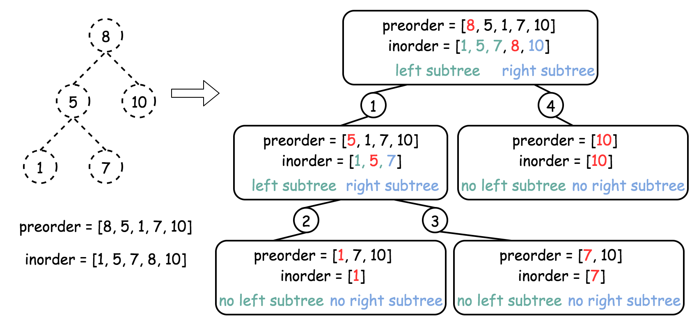

```python
class Solution:
    def bstFromPreorder(self, preorder: List[int]) -> TreeNode:
        def helper(in_left = 0, in_right = len(preorder)):
            nonlocal pre_idx
            # If there is no elements to construct subtrees
            if in_left == in_right:
                return None

            # pick up pre_idx element as a root
            root_val = preorder[pre_idx]
            root = TreeNode(root_val)

            # root splits inorder list
            # into left and right subtrees
            index = idx_map[root_val]

            # recursion
            pre_idx += 1
            # build the left subtree
            root.left = helper(in_left, index)
            # build the right subtree
            root.right = helper(index + 1, in_right)
            return root

        inorder = sorted(preorder)
        # start from the first preorder element
        pre_idx = 0
        # build a hashmap value -> its index
        idx_map = {val:idx for idx, val in enumerate(inorder)}
        return helper()
```

**Complexity Analysis**

* Time complexity : $\mathcal{O}(N \log N)$. $\mathcal{O}(N \log N)$ to sort preorder array
and $\mathcal{O}(N)$ to construct the binary tree.
* Space complexity : $\mathcal{O}(N)$ the inorder traversal and the tree.

<br />
<br />

---
### Approach 2: Recursion

**Intuition**

It's quite obvious that the best possible time complexity for this problem
is $\mathcal{O}(N)$ and hence approach 1 is not the best one.

Basically, the inorder traversal above was used only to check if the element
could be placed in this subtree.
Since one deals with a BST here, this could be verified with the help of lower and
upper limits for each element as for the [validate BST problem](https://leetcode.com/articles/validate-binary-search-tree/).
This way there is no need for inorder traversal and the time
complexity is $\mathcal{O}(N)$.

**Algorithm**

- Initiate the lower and upper limits as negative and positive infinity because
one could always place the root.

- Start from the first element in the preorder array $idx = 0$.

- Return `helper(lower, upper)`:

- If the preorder array is used up $idx = n$ then the tree is constructed, return null.

- If the current value $val = \text{preorder}[idx]$ is smaller than the lower limit, or larger than the upper limit, return null.

- If the current value is in the limits, place it here `root =
    TreeNode(val)`
    and proceed to construct recursively left and right subtrees:
    $\text{root.left} = helper(lower, val)$ and $\text{root.right} = helper(val, upper)$.

- Return `root`.

**Implementation**

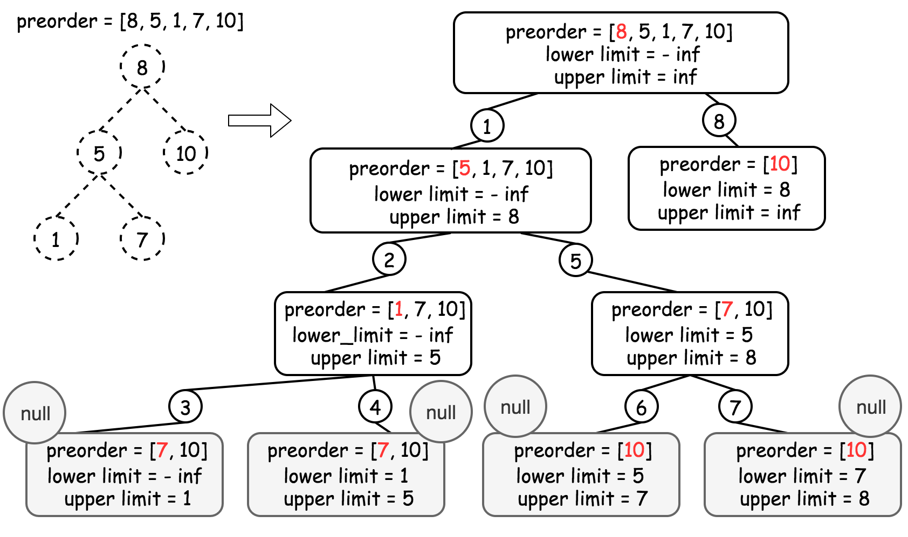

```python
class Solution:
    def bstFromPreorder(self, preorder: List[int]) -> TreeNode:
        def helper(lower = float('-inf'), upper = float('inf')):
            nonlocal idx
            # If all elements from preorder are used
            # Then the tree is constructed
            if idx == n:
                return None

            val = preorder[idx]
            # If the current element
            # couldn't be placed here to meet BST requirements
            if val < lower or val > upper:
                return None

            # place the current element
            # and recursively construct subtrees
            idx += 1
            root = TreeNode(val)
            root.left = helper(lower, val)
            root.right = helper(val, upper)
            return root

        idx = 0
        n = len(preorder)
        return helper()
```

**Complexity Analysis**

* Time complexity : $\mathcal{O}(N)$ since we visit each node exactly once.
* Space complexity : $\mathcal{O}(N)$ to keep the entire tree.
<br />
<br />

---
### Approach 3: Iteration

**Algorithm**

The recursion above could be converted into the iteration, with the help of stack.

- Pick the first preorder element as a root $root = new TreeNode(\text{preorder}[0])$ and push it into stack.

- Use `for` loop to iterate along the elements of a preorder array :

- Pick the last element of the stack as a parent node, and the current element of preorder as a child node.

- Adjust the parent node: pop out of stack all elements with a value smaller than the child value. Change the parent node at each pop $node = \text{stack.pop}()$.

- If `node.val < child.val` - put the child as a right child of the node: $\text{node.right} = child$.

- Else - as a left child : $\text{node.left} = child$.

- Push the child node into the stack.

- Return `root`.

**Implementation**

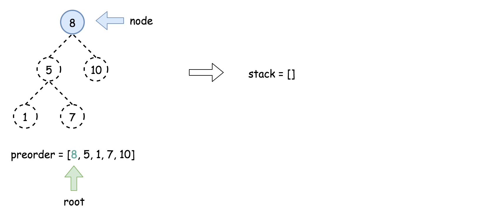

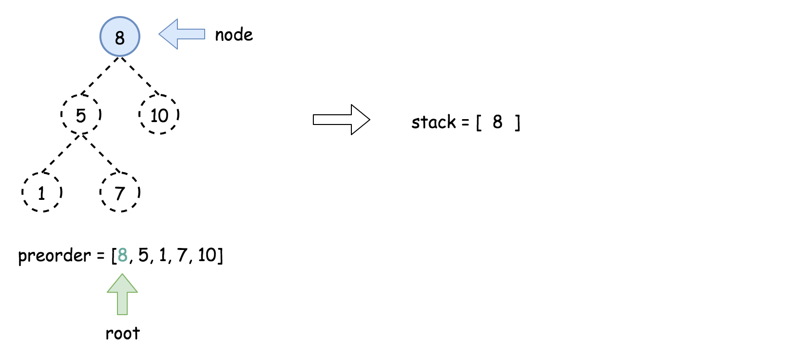

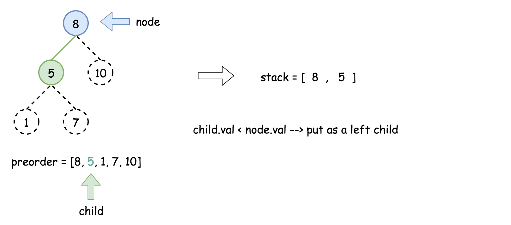

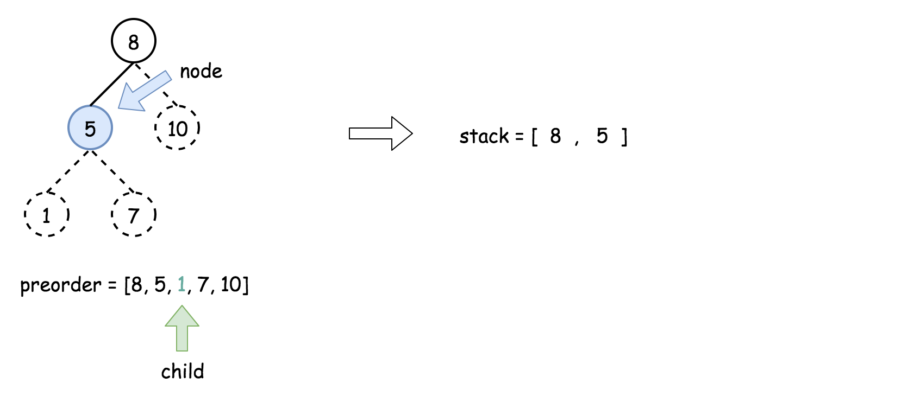

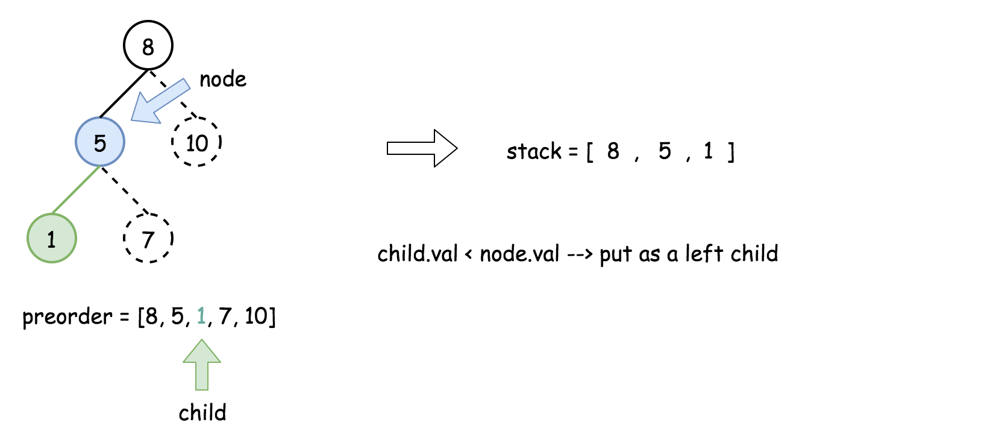

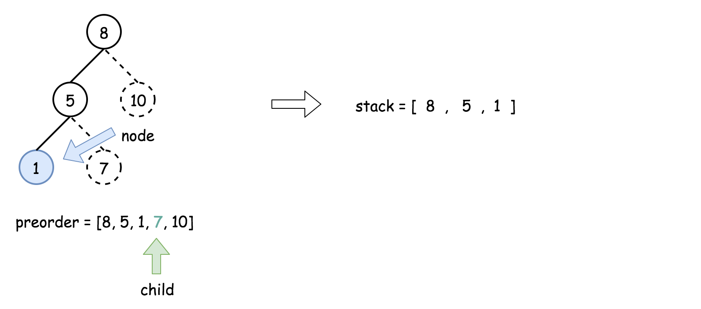

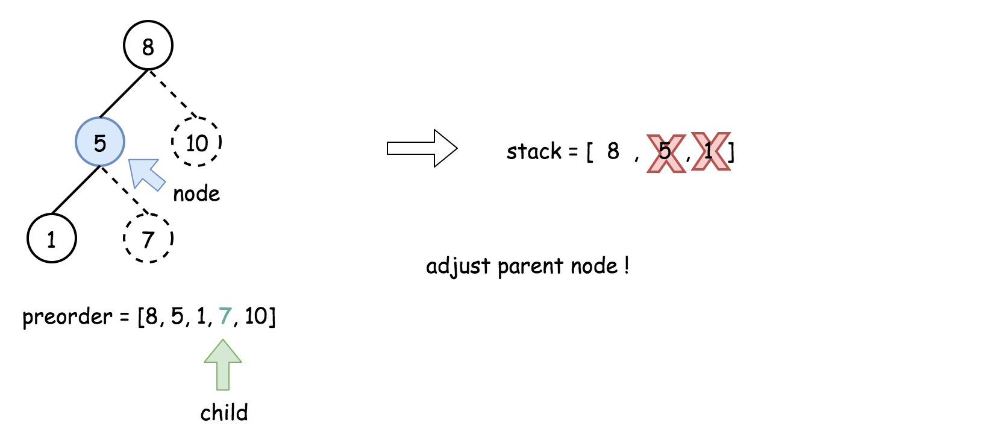

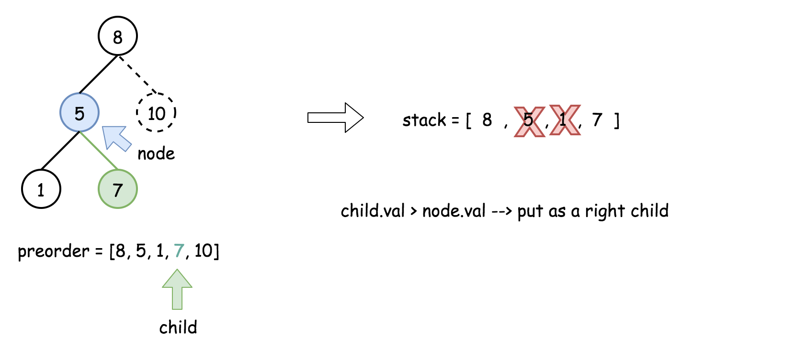

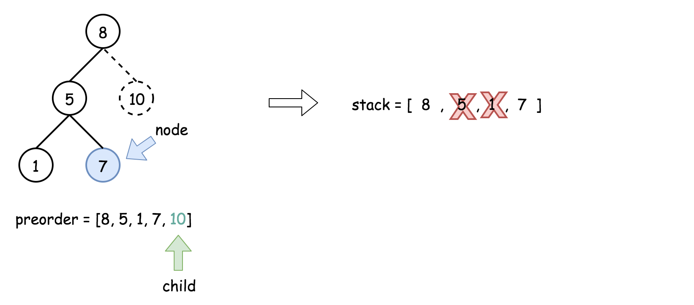

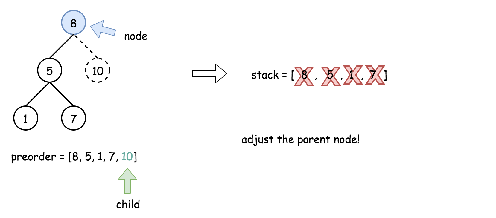

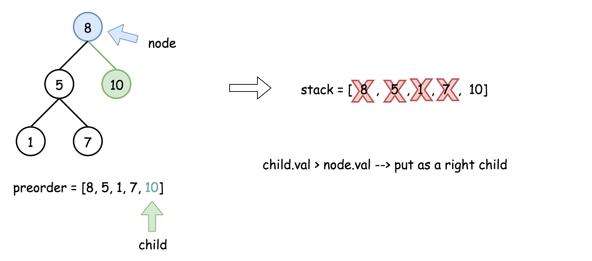

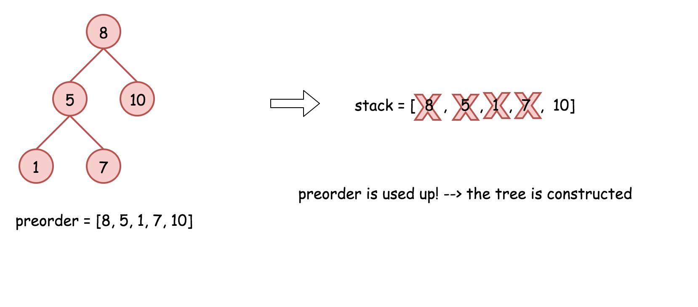

```python
class Solution:
    def bstFromPreorder(self, preorder: List[int]) -> TreeNode:
        n = len(preorder)
        if not n:
            return None

        root = TreeNode(preorder[0])
        stack = [root, ]

        for i in range(1, n):
            # take the last element of the stack as a parent
            # and create a child from the next preorder element
            node, child = stack[-1], TreeNode(preorder[i])
            # adjust the parent
            while stack and stack[-1].val < child.val:
                node = stack.pop()

            # follow BST logic to create a parent-child link
            if node.val < child.val:
                node.right = child
            else:
                node.left = child
            # add the child into stack
            stack.append(child)

        return root
```

**Complexity Analysis**

* Time complexity : $\mathcal{O}(N)$ since we visit each node exactly once.

* Space complexity : $\mathcal{O}(N)$ to keep the stack and the tree.