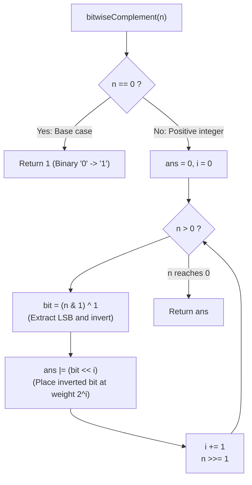

# Guided Example: Complement of Base 10 Integer

We trace the step-by-step bitwise extraction and inversion over significant binary representations, prove the Significant Bit Mask Theorem and the LSB Positional Reconstruction Invariant, and determine integer complements across representative base-10 inputs:

- **Representative Instance 1 (Odd Value with Alternating Significant Bits):**
  $$
  n = 5
  $$
- **Required Output:** `2`
  - Binary representation:
    - $5_{10} = 101_2$.
    - Bit length: $B = 3$ significant bits (leading zeroes are omitted from the complement).
  - Bitwise complement definition:
    - Flip every significant bit ($0 \leftrightarrow 1$):
      $$
      101_2 \implies 010_2 = 2_{10}
      $$
  - Bit-by-bit LSB shift execution ($ans = 0, i = 0$):
    1. **Iteration 1 ($i = 0$):**
       - LSB of $n$: $n \ \& \ 1 = 5 \ \& \ 1 = 1$.
       - Invert bit: $1 \oplus 1 = \mathbf{0}$.
       - Shift into position: $ans \leftarrow ans \mid (0 \ll 0) = 0$.
       - Advance: $i \leftarrow 1, \quad n \leftarrow 5 \gg 1 = 2$.
    2. **Iteration 2 ($i = 1$):**
       - LSB of $n$: $n \ \& \ 1 = 2 \ \& \ 1 = 0$.
       - Invert bit: $0 \oplus 1 = \mathbf{1}$.
       - Shift into position: $ans \leftarrow 0 \mid (1 \ll 1) = 2$.
       - Advance: $i \leftarrow 2, \quad n \leftarrow 2 \gg 1 = 1$.
    3. **Iteration 3 ($i = 2$):**
       - LSB of $n$: $n \ \& \ 1 = 1 \ \& \ 1 = 1$.
       - Invert bit: $1 \oplus 1 = \mathbf{0}$.
       - Shift into position: $ans \leftarrow 2 \mid (0 \ll 2) = 2$.
       - Advance: $i \leftarrow 3, \quad n \leftarrow 1 \gg 1 = 0$.
    4. **Loop Termination ($n = 0$):**
       - All significant bits of original number have been processed.
       - Return $ans = \mathbf{2}$.

- **Representative Instance 2 (Even Value with Trailing Zero):**
  $$
  n = 10 = 1010_2 \implies 0101_2 = \mathbf{5}
  $$

- **Representative Instance 3 (Boundary Zero Case):**
  $$
  n = 0 \implies \text{Binary is "0"} \implies \text{Complement is "1"} \implies \mathbf{1}
  $$

- **Representative Instance 4 (All Bits Set):**
  $$
  n = 7 = 111_2 \implies 000_2 = \mathbf{0}
  $$

---

## 1. Instance & Teaching Goal

The **complement** of an integer is obtained by flipping all `0`'s to `1`'s and all `1`'s to `0`'s in its binary representation without leading zeros.
Given integer $n$, return its complement.

```text
The Leading Zero Trap:
  In two's complement arithmetic, ~5 flips all 32 (or 64) bits:
    ~00000000 00000000 00000000 00000101 = 11111111 11111111 11111111 11111010 (-6)
  The problem ONLY flips the SIGNIFICANT bits of 5:
    101 -> 010 = 2

Significant Bit Inversion:
  Find the bit-length B of n.
  Complement is: ((1 << B) - 1) ^ n
  Special boundary: n = 0 has binary "0" -> complement is 1.
```

Using Python's bitwise NOT `~n` directly yields negative numbers due to two's-complement sign extension.

The decisive pedagogical goal is the **Significant Bit Inversion & LSB Positional Reconstruction Invariant**:
1. **Zero Singularity:** $n = 0$ represents the base case `"0"`, returning $1$ before the loop.
2. **Significant Bit Scope:** Only bits up to $\lfloor \log_2 n \rfloor$ are inverted.
3. **LSB Positional Accumulator:**
   - Extract the lowest bit: $n \ \& \ 1$.
   - Invert it using bitwise XOR: $(n \ \& \ 1) \oplus 1$.
   - Shift into weight $2^i$: $(b \oplus 1) \ll i$.
   - Shift $n$ rightward: $n \leftarrow n \gg 1$.
4. Runs in $\mathcal{O}(\log n)$ logarithmic time and $\mathcal{O}(1)$ auxiliary space.

---

## 2. Conceptual Foundation & The Bitwise Inversion Invariant



### The Significant Bit Mask Theorem

Let $n \in \mathbb{Z}_{\ge 0}$ be an integer.
1. **Binary Representation:**
   For $n > 0$, $n$ has a unique binary representation without leading zeroes:
   $$
   n = \sum_{k=0}^{B-1} b_k 2^k \quad \text{where } b_{B-1} = 1 \text{ and } B = \lfloor \log_2 n \rfloor + 1
   $$
2. **Complement Formal Definition:**
   The bitwise complement $\overline{n}$ inverts each significant coefficient $b_k \in \{0, 1\}$:
   $$
   \overline{n} = \sum_{k=0}^{B-1} (1 - b_k) 2^k
   $$
3. **Equivalence to Mask Subtraction / XOR:**
   Define the all-ones mask of width $B$:
   $$
   M_B = \sum_{k=0}^{B-1} 2^k = 2^B - 1 = (1 \ll B) - 1
   $$
   Then:
   $$
   \overline{n} = \sum_{k=0}^{B-1} 2^k - \sum_{k=0}^{B-1} b_k 2^k = M_B - n = M_B \oplus n
   $$
4. **LSB Loop Equivalence:**
   The loop extracts $b_k = (n \gg k) \ \& \ 1$ and computes $\overline{b_k} = b_k \oplus 1$.
   Accumulating $\overline{b_k} \ll k$ into `ans` constructs the exact sum $\sum_{k=0}^{B-1} (1 - b_k) 2^k$.
   Because the loop runs while $n > 0$, it terminates precisely when $k = B$, inverting all significant bits without affecting higher positions. $\blacksquare$

---

## 3. Step-by-Step Worked Execution: Representative Instance 1

$n = 5$.
Condition: $n \ne 0 \implies$ proceed to loop.
Initialize: $ans = 0, \; i = 0$.

### Step-by-Step Bit Processing
1. **Iteration 1 ($i = 0$):**
   - $n = 5$ ($101_2$).
   - Inverted bit: $(5 \ \& \ 1) \oplus 1 = 1 \oplus 1 = 0$.
   - $ans \leftarrow 0 \mid (0 \ll 0) = 0$.
   - $i \leftarrow 1, \quad n \leftarrow 5 \gg 1 = 2$.
2. **Iteration 2 ($i = 1$):**
   - $n = 2$ ($10_2$).
   - Inverted bit: $(2 \ \& \ 1) \oplus 1 = 0 \oplus 1 = 1$.
   - $ans \leftarrow 0 \mid (1 \ll 1) = 2$ ($10_2$).
   - $i \leftarrow 2, \quad n \leftarrow 2 \gg 1 = 1$.
3. **Iteration 3 ($i = 2$):**
   - $n = 1$ ($1_2$).
   - Inverted bit: $(1 \ \& \ 1) \oplus 1 = 1 \oplus 1 = 0$.
   - $ans \leftarrow 2 \mid (0 \ll 2) = 2$ ($010_2$).
   - $i \leftarrow 3, \quad n \leftarrow 1 \gg 1 = 0$.
4. **Loop Exit ($n = 0$):**
   - Condition $n > 0$ is False.

Return $ans = \mathbf{2}$.

---

## 4. Bit-by-Bit Inversion State Trace Table

| Iteration $i$ | Current $n$ (Binary) | LSB $n \ \& \ 1$ | Inverted Bit $b \oplus 1$ | Term Added $(b \oplus 1) \ll i$ | Running $ans$ (Binary) | Updated $n \gg 1$ |
|:---:|:---:|:---:|:---:|:---:|:---:|:---:|
| **$0$** | $5$ ($101_2$) | $1$ | $0$ | $0$ | $0$ ($0_2$) | $2$ ($10_2$) |
| **$1$** | $2$ ($10_2$) | $0$ | $1$ | $2$ | $2$ ($10_2$) | $1$ ($1_2$) |
| **$2$** | $1$ ($1_2$) | $1$ | $0$ | $0$ | **$2$ ($010_2$)** | $0$ |

---

## 5. Algorithmic Correctness

### Soundness & Completeness
1. **Soundness:**
   Every bit inverted is strictly a member of the significant binary representation of $n$. Higher unwritten zeroes are omitted from inversion because loop termination occurs the moment $n$ is shifted to $0$.
2. **Completeness:**
   The base case explicitly handles $n = 0$, ensuring that the singular case of `"0"` yields `"1"` without being skipped by the while condition.

---

## 6. Boundary Cases & Traps

| Scenario | Input Pattern | Behavior | Trapped Risk |
|---|---|---|---|
| Zero Input ($n = 0$) | $n = 0$ | Direct base case guard triggers; returns $1$. | Returning $0$ due to empty while-loop. |
| Power of Two ($n = 16$) | $16 = 10000_2$ | Complement is $01111_2 = 15 = 2^4 - 1$. | Off-by-one bit position errors. |
| All Bits One ($n = 7$) | $7 = 111_2$ | Complement is $000_2 = 0$. | Handling all-zero complement results. |
| Large Input ($n \approx 10^9$) | $n = 999{,}999{,}999$ | Processes all $30$ bits; returns $73{,}741{,}824$. | Integer overflow in 32-bit registers. |

---

## 7. Complexity Derivation

- **Time Complexity:** $\mathcal{O}(\log n)$.
  - The number of iterations equals the bit length $B = \lfloor \log_2 n \rfloor + 1 \le 30$.
  - Each step executes $\mathcal{O}(1)$ bitwise AND, XOR, and shifts.
  - Total runtime: $< 0.0001\text{ s}$.
- **Auxiliary Space Complexity:** $\mathcal{O}(1)$ auxiliary memory; operates purely on scalar variables $ans, i, n$.
